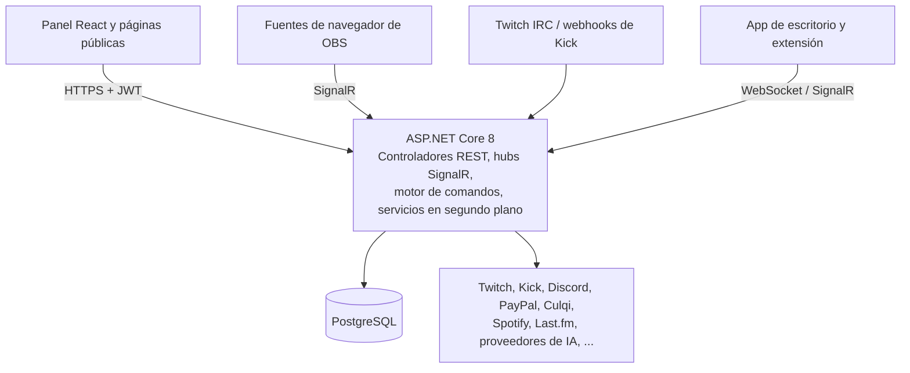

<div align="center">

# Decatron


**Un bot y conjunto de herramientas multi-tenant para Twitch y Kick, con overlays de OBS en tiempo real, IA, peticiones de canciones, ruedas y sorteos, torneos, traducción en vivo y una API pública OAuth2.**

[English](README.md) | [Funciones](#funciones) | [Tecnologías](#tecnologías) | [Primeros pasos](#primeros-pasos) | [Documentación](#documentación)

</div>

---

## Acerca de

Decatron es una plataforma auto-alojada y multi-tenant para streamers. Un único panel en React, protegido con permisos por canal, controla un bot de chat con comandos personalizados y un lenguaje de scripting, overlays para OBS como fuentes de navegador, alertas de eventos, donaciones, chat con IA, moderación del chat, peticiones de canciones, ruedas y sorteos, torneos, un bot de Discord y más. Todo está disponible en español e inglés.

Lo usan tres tipos de personas:

- **Streamers y sus moderadores** usan el panel y el bot.
- **Espectadores** usan comandos de chat, páginas públicas (cola de canciones, torneos, emotes, páginas de donación) y una extensión de navegador.
- **Desarrolladores** crean sobre la API pública OAuth2.

---

## Funciones

### Bot y chat

| Función | Descripción |
|---------|-------------|
| Comandos por defecto | `!title`, `!game`, `!so`, `!followage`, `!ia` y más, con respuestas en español e inglés |
| Comandos personalizados | Comandos de respuesta de texto creados desde el panel o desde el chat con `!crear` |
| Motor de scripting | Un lenguaje pequeño con variables, condicionales (`when...then...end`) y funciones (`roll`, `pick`, `count`) |
| Microcomandos | Atajos de categoría de juego (por ejemplo `!lol` cambia la categoría a "League of Legends") |
| Moderación del chat | Palabras prohibidas con comodines, filtros de enlaces, spam y raids, strikes, permisos temporales, modo pánico e historial de acciones, en Twitch y Kick |
| Chat con IA (`!ia`) | Google Gemini y OpenRouter con respaldo, configuración por canal y tiempos de espera |
| Chat privado con IA | Conversaciones con IA dentro del panel, con auditoría de administración |
| Speak chat | Mensajes del chat y canjes de puntos del canal leídos en voz alta con texto a voz |
| Ruleta (`!ruleta`) | Minijuego de chat: probabilidad configurable de un timeout aleatorio, con listas de protegidos y bloqueados |
| Lista de bots | Catálogo global de bots conocidos con cambios por canal, usado para reconocer bots en el chat |

### Comunidad y juegos

| Función | Descripción |
|---------|-------------|
| Song Request | Los espectadores piden canciones con `!sr` usando enlaces de YouTube, SoundCloud, Spotify, Deezer o Apple Music, o el nombre de la canción. Cola en vivo, modos de petición, filtros, listas negras, playlists colaborativas y una página pública en `/sr/{canal}` |
| Rueda y sorteo | Ruedas de premios (giros obtenidos con bits, subs regaladas, donaciones, puntos del canal o DeCa coins) y ruedas de sorteo (tickets, requisitos, pesos, sorteo), con billeteras de créditos, topes anti-farmeo, entregas e historial |
| Sorteos | Sorteos ponderados con controles anti-trampa y un overlay en vivo |
| Torneos | Ediciones con llaves, inscripción, equipos, premios, patrocinadores, reglas y condiciones de victoria; formatos basados en Riot y en Fortnite; páginas públicas, un ranking incrustable y un overlay para el stream |
| Traducción en vivo | Reconocimiento de voz, traducción y texto a voz en tiempo real de un stream, impulsada por la app Decatron Desktop y consumida por una extensión de navegador |
| Fortnite Spirits | Vinculación de cuentas de Fortnite mediante Epic, colecciones de spirits, notificaciones y una galería pública |
| Gacha y cartas | Tiradas coleccionables y cartas coleccionables para los espectadores |
| Mascotas | Una mascota en el overlay del canal que reacciona a alertas, chat y comandos |
| Emotes | Emotes del canal y emotes globales de la plataforma, con páginas públicas |

### Overlays

Los overlays se agregan a OBS como fuentes de navegador y se actualizan en tiempo real mediante SignalR.

| Overlay | Descripción |
|---------|-------------|
| Timer extensible | Timer estilo subathon con tiempo agregado por bits, subs, raids y propinas, además de happy hours, horarios y alertas con TTS |
| Alertas de eventos | Alertas visuales y de audio para follows, bits, subs, subs regaladas, raids, resubs y hype trains, con un editor de arrastrar y soltar |
| Alertas de sonido | Alertas de recompensas de puntos del canal con carga de medios y configuración por recompensa |
| Now playing | Canción actual desde Spotify o Last.fm |
| Propinas | Alertas de donación con TTS e integración con el timer |
| Shoutout | Shoutout con un clip de Twitch (descargado con yt-dlp) y un diseño personalizable |
| Sorteo, Rueda, Song Request, Chat, Mascotas, Juegos y partida en vivo | Un overlay por módulo, configurado desde su página del panel |

### Integraciones

| Integración | Descripción |
|-------------|-------------|
| Twitch | Inicio de sesión, API Helix, chat IRC y EventSub (conduit con shards WebSocket, webhook como respaldo) |
| Kick | Inicio de sesión, webhooks, acceso a la API y envío de mensajes al chat |
| Discord | Comandos slash (`/live`, `/level`, `/top`, `/shop`, `/torneo` y más), niveles de XP y tarjetas de rango, imágenes de bienvenida y alertas de directo |
| Spotify y Last.fm | Now playing |
| PayPal y Culqi | Donaciones y compras de tier (PayPal); paquetes de créditos (Culqi) |
| Amazon Polly, Deepgram, FishAudio | Texto a voz y reconocimiento de voz |
| Riot y Epic Games | Vinculación de cuentas y datos de partidas para torneos y overlays de juegos |

### Panel y plataforma

| Función | Descripción |
|---------|-------------|
| Analíticas | KPIs generales, eventos del timer, registros de moderación, historial de streams y actividad del chat |
| Gestor de seguidores | Sincronización con Twitch, detección de unfollows, acciones masivas e historial |
| Supporters y créditos | Niveles de suscripción, créditos unificados para funciones de pago, comprobantes y perfiles de facturación |
| Cambio de canal | Administrar otro canal como moderador o editor |
| Permisos | Tres niveles (`commands` < `moderation` < `control_total`) sobre 14 secciones del panel |
| API pública OAuth2 | Flujo Authorization Code con PKCE, 25 scopes, gestión de aplicaciones y revocación de tokens |
| Compañero de escritorio | [decatron-desktop](https://github.com/decatrondev/decatron-desktop), conectado mediante un único WebSocket |
| Extensión de navegador | [decatron-extension](https://github.com/decatrondev/decatron-extension), subtítulos de traducción en vivo para espectadores |
| Administración de la plataforma | Páginas solo para administradores (usuarios, finanzas, correo, costos de IA, editor de diseño). Ver [ARCHITECTURE.md](docs/es/ARCHITECTURE.md); no forman parte de la documentación de usuario |

---

## Arquitectura



El backend se divide en proyectos .NET (`Decatron.Core`, `Decatron.Data`, `Decatron.Controllers`, `Decatron.Services`, `Decatron.Default`, `Decatron.Custom`, `Decatron.Scripting`, `Decatron.Discord`) alojados por el proyecto web `Decatron`; el frontend está en `ClientApp/`. Consulta [docs/es/ARCHITECTURE.md](docs/es/ARCHITECTURE.md) para ver el panorama completo.

---

## Tecnologías

| Capa | Tecnología |
|------|------------|
| Backend | .NET 8, ASP.NET Core, Entity Framework Core (Npgsql), SignalR, TwitchLib, Serilog |
| Frontend | React 19, TypeScript, Vite 7, Tailwind CSS 3, react-router 7, i18next |
| Base de datos | PostgreSQL 16 |
| Infraestructura | Nginx (proxy inverso y archivos estáticos), yt-dlp, Let's Encrypt |

---

## Primeros pasos

### Requisitos previos

| Requisito | Versión |
|-----------|---------|
| .NET SDK | 8.0 |
| Node.js | una versión LTS actual |
| PostgreSQL | 14 o superior (16 en producción) |
| yt-dlp | la más reciente (descarga de clips y Song Request) |

Las integraciones opcionales necesitan sus propias cuentas y claves (AWS Polly, Spotify, PayPal, Google AI, OpenRouter, Kick, Discord, etc.). Cada una está listada en [docs/es/CONFIGURATION.md](docs/es/CONFIGURATION.md).

### Instalación

```bash
git clone https://github.com/decatrondev/decatron.git
cd decatron

dotnet restore

cd ClientApp
npm install
cd ..
```

### Configuración

```bash
cp appsettings.Secrets.json.example appsettings.Secrets.json
```

Completa como mínimo la cadena de conexión a la base de datos, `JwtSettings` y `TwitchSettings`. `appsettings.json` ya contiene los valores por defecto que no son secretos. La lista completa de ajustes está en [docs/es/CONFIGURATION.md](docs/es/CONFIGURATION.md) y [docs/es/ENV_VARIABLES.md](docs/es/ENV_VARIABLES.md).

### Crear la base de datos

```bash
sudo -u postgres psql -c "CREATE USER decatron_user WITH PASSWORD 'tu_contraseña';"
sudo -u postgres psql -c "CREATE DATABASE decatron OWNER decatron_user;"
psql -U decatron_user -d decatron -f Decatron.Data/Schema/baseline.sql
```

El backend **no** crea ni migra tablas al iniciar. `Decatron.Data/Schema/baseline.sql` es una copia del esquema solo con estructura (2026-10-10); los cambios posteriores son los scripts SQL de `Decatron.Data/Migrations/`, que se aplican a mano.

### Ejecución

```bash
# Terminal 1: backend
dotnet run

# Terminal 2: frontend
cd ClientApp
npm run dev
```

En desarrollo el backend escucha en `https://localhost:7264` y el frontend en `http://localhost:5173` (Vite redirige `/api` al backend).

---

## URLs de overlays

Cada overlay es una página del frontend que se carga como fuente de navegador de OBS. La página de cada módulo en el panel muestra la URL exacta para copiar (algunas incluyen una clave privada). Las más comunes:

| Overlay | URL |
|---------|-----|
| Timer | `/overlay/timer?channel={nombre}` |
| Alertas de eventos | `/overlay/event-alerts?channel={nombre}` |
| Alertas de sonido | `/overlay/soundalerts?channel={nombre}` |
| Now playing | `/overlay/now-playing?channel={nombre}` |
| Shoutout | `/overlay/shoutout?channel={nombre}` |
| Propinas | `/overlay/tips?channel={nombre}` |
| Sorteo | `/overlay/giveaway?channel={nombre}` |
| Song Request | `/overlay/songrequest?channel={nombre}` (agrega `&key={claveDelReproductor}` para el reproductor) |
| Rueda | `/overlay/rueda?channel={nombre}&wheel={slug}` |

Consulta [docs/es/OVERLAYS.md](docs/es/OVERLAYS.md) para tamaños, opciones y el resto de los overlays.

---

## Documentación

| Documento | Descripción |
|-----------|-------------|
| [ARCHITECTURE.md](docs/es/ARCHITECTURE.md) | Arquitectura del sistema, estructura del proyecto, comunicación en tiempo real, mapa de módulos |
| [CONFIGURATION.md](docs/es/CONFIGURATION.md) | Ajustes de la aplicación, secretos por módulo, configuración de Twitch, base de datos, registros |
| [ENV_VARIABLES.md](docs/es/ENV_VARIABLES.md) | Referencia de variables de entorno |
| [DEPLOYMENT.md](docs/es/DEPLOYMENT.md) | Guía de despliegue en producción |
| [API.md](docs/es/API.md) | Referencia de la API |
| [COMMANDS.md](docs/es/COMMANDS.md) | Referencia de comandos del bot |
| [OVERLAYS.md](docs/es/OVERLAYS.md) | Configuración de overlays e integración con OBS |
| [DESIGN_SYSTEM.md](docs/es/DESIGN_SYSTEM.md) | Tokens de diseño, librería de componentes, editor de tema en vivo |
| [TROUBLESHOOTING.md](docs/es/TROUBLESHOOTING.md) | Problemas comunes y soluciones |

Las versiones en inglés están en [docs/](docs/). La documentación de usuario vive en la propia aplicación, en `/docs` (pública) y `/dashboard/docs` (con sesión iniciada).

---

## Contribuir

Consulta [CONTRIBUTING.md](CONTRIBUTING.md).

## Soporte

Abre un issue en [GitHub Issues](https://github.com/decatrondev/decatron/issues).

## Licencia

Decatron está bajo la [Licencia Pública General Affero de GNU v3.0](LICENSE). Puedes usarlo, modificarlo y auto-alojarlo; si ofreces una versión modificada como servicio en red, debes publicar tus cambios bajo la misma licencia.

Copyright (c) 2024-2026 Decatron.

---

<div align="center">

Creado por **[AnthonyDeca](https://twitch.tv/anthonydeca)** | [decatron.net](https://decatron.net)

</div>
