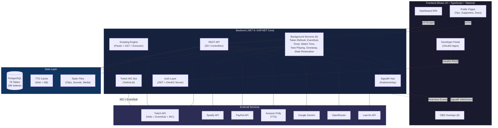
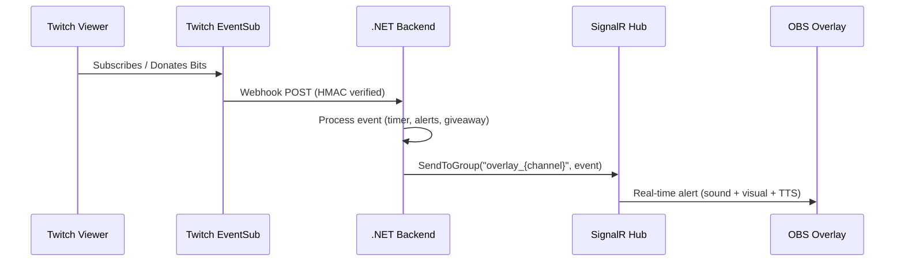

<div align="center">

# Decatron v2


**A professional, full-featured Twitch Bot Platform with real-time overlays, AI integration, donation system, and extensible timer engine.**

*Plataforma profesional y completa de Bot para Twitch con overlays en tiempo real, integracion de IA, sistema de donaciones y motor de timer extensible.*

[Features](#features) | [Architecture](#architecture) | [Tech Stack](#tech-stack) | [Getting Started](#getting-started) | [API](#api-overview)

---

</div>

## About / Acerca de

**Decatron** is a self-hosted, multi-tenant Twitch bot platform that gives streamers a complete suite of tools: chat bot with custom commands and a proprietary scripting language, 8 real-time OBS overlays, AI-powered chat assistant, donation processing via PayPal, Spotify Now Playing integration, weighted giveaways, stream goals, and a full analytics dashboard -- all managed through a modern React SPA with per-channel permissions and multi-language support (EN/ES).

*Decatron es una plataforma de bot de Twitch auto-alojada y multi-tenant que ofrece a los streamers un conjunto completo de herramientas: bot de chat con comandos personalizados y un lenguaje de scripting propietario, 8 overlays en tiempo real para OBS, asistente de chat con IA, procesamiento de donaciones via PayPal, integracion con Spotify Now Playing, sorteos ponderados, metas de stream y un dashboard de analiticas completo -- todo gestionado a traves de un SPA React moderno con permisos por canal y soporte multi-idioma (EN/ES).*

---

## Features

### Bot and Chat / Bot y Chat

| Feature | Description / Descripcion |
|---------|--------------------------|
| Built-in Commands | `!title`, `!game`, `!so`, `!followage`, `!ia` and more with i18n responses (EN/ES) |
| Custom Commands | Create text-response commands from the dashboard or chat with `!crear` |
| Scripting Engine | Proprietary DSL with variables, conditionals (`when...then...end`), functions (`roll`, `pick`, `count`) |
| Micro Commands | Quick game-category shortcuts (e.g., `!lol` to set "League of Legends") |
| Chat Moderation | Banned words with wildcards, 5-level strike escalation, VIP/sub immunity, whitelist |
| AI Chat (`!ia`) | Multi-provider AI (Google Gemini + OpenRouter) with fallback, per-channel config, cooldowns |
| Private AI Chat | Dashboard-embedded AI conversations with configurable providers and admin audit |

### Overlays / Overlays para OBS

All overlays connect via SignalR for real-time updates and are added as OBS Browser Sources.

*Todos los overlays se conectan via SignalR para actualizaciones en tiempo real y se agregan como Browser Source en OBS.*

| Overlay | Description / Descripcion |
|---------|--------------------------|
| :alarm_clock: Extension Timer | Subathon-style extensible timer with event-driven time additions (bits, subs, raids, tips), happy hours, schedules, panic mode, lives system, TTS alerts |
| :bell: Event Alerts | Visual/audio alerts for follows, bits, subs, gift subs, raids, resubs, hype train with tier system, variants, drag-and-drop editor |
| :speaker: Sound Alerts | Channel Points redemption alerts with media upload, drag-and-drop layout, per-reward configuration |
| :musical_note: Now Playing | Spotify and Last.fm integration showing current track with progress bar, marquee, custom styling |
| :moneybag: Tips | Donation alerts with tier-based media, TTS, and timer integration |
| :dart: Goals | Multi-goal progress bars (subs, bits, follows, combined) with milestones and overlay editor |
| :mega: Shoutout | Visual shoutout with Twitch clip download (via yt-dlp), profile display, customizable layout |
| :gift: Giveaway | Live giveaway overlay with participant counter |

### Integrations / Integraciones

| Integration | Description / Descripcion |
|-------------|--------------------------|
| Twitch EventSub | Real-time webhooks for 10+ event types (chat, follows, bits, subs, raids, hype train, stream status) |
| Twitch Helix API | User lookup, stream info, channel management, clip download, chatters list, moderation actions |
| Spotify OAuth2 | Direct Spotify connection with slot-based access control and background polling |
| Last.fm | Scrobbling-based now playing via Last.fm API |
| PayPal | OAuth2 connection for direct payments (tips) and order processing (supporters) |
| Amazon Polly | Text-to-Speech generation with SHA-256 caching |
| Google Gemini | AI provider for chat commands and private conversations |
| OpenRouter | Alternative AI provider (OpenAI-compatible) with automatic fallback |

### Dashboard / Panel de Control

| Feature | Description / Descripcion |
|---------|--------------------------|
| Analytics | 6-tab dashboard: overview KPIs, timer events, moderation logs, stream history, activity, chat messages |
| Followers Manager | Sync from Twitch API, unfollow detection, bulk block/unblock, history, auto-sync |
| Supporters System | Subscription tiers (Supporter/Premium/Founder), PayPal integration, discount codes, public page |
| Channel Switching | Multi-channel management for moderators and editors |
| OAuth2 Developer Portal | Full OAuth2 server with PKCE, 20 scopes, app management, token revocation |
| Permission System | 3-level hierarchy (commands < moderation < control_total) with 12 dashboard sections |
| Bilingual UI | Spanish and English with i18next, backend language preference persistence |

---

## Architecture



### SignalR Event Flow / Flujo de Eventos SignalR



---

## Tech Stack

### Backend

| Technology | Version | Purpose / Proposito |
|------------|---------|---------------------|
| .NET | 8.0 | Application framework |
| ASP.NET Core | 8.0 | Web API + SignalR + Middleware |
| Entity Framework Core | 8.x | ORM (PostgreSQL via Npgsql) |
| SignalR | 8.x | Real-time WebSocket communication |
| TwitchLib | Latest | Twitch IRC client |
| Serilog | Latest | Structured logging (console + file) |
| Amazon Polly SDK | Latest | Text-to-Speech generation |
| Newtonsoft.Json + System.Text.Json | Latest | JSON serialization (dual) |

### Frontend

| Technology | Version | Purpose / Proposito |
|------------|---------|---------------------|
| React | 19 | UI framework |
| TypeScript | 5.x | Type safety |
| Tailwind CSS | 3.x | Utility-first styling |
| Vite | Latest | Build tool and dev server |
| Axios | Latest | HTTP client with interceptors |
| @microsoft/signalr | Latest | Real-time overlay communication |
| react-i18next | Latest | Internationalization (EN/ES) |
| Lucide React | Latest | Icon library |
| Prism.js | Latest | Syntax highlighting (scripting editor) |

### Infrastructure

| Technology | Purpose / Proposito |
|------------|---------------------|
| PostgreSQL 16 | Primary database (78 tables, 296 indexes) |
| Nginx | Reverse proxy and static file serving |
| yt-dlp | Twitch clip downloading |
| Let's Encrypt | TLS certificates |

---

## Project Structure

```
decatron/
├── Program.cs                      # Application entry point and DI composition (430+ lines)
├── appsettings.json                # Public configuration (Serilog, Twitch scopes)
├── appsettings.Secrets.json        # Secret configuration (not in repo)
│
├── Decatron.Core/                  # Shared core layer
│   ├── Interfaces/                 # 13 service contracts (IAuthService, IBotService, etc.)
│   ├── Models/                     # 70+ EF Core entities (Users, Timers, Giveaways, OAuth, AI...)
│   ├── Services/                   # ModerationService, FollowersService
│   ├── Settings/                   # Configuration POCOs (JWT, Twitch, Gacha, AWS Polly)
│   ├── Scripting/                  # Parser, Validator, Executor for custom DSL
│   ├── Functions/                  # Built-in scripting functions (roll, pick, count)
│   ├── Resolvers/                  # Variable resolver for command templates
│   ├── Helpers/                    # Utility classes
│   └── Exceptions/                 # Script-specific exceptions
│
├── Decatron.Controllers/           # Primary API controllers
│   ├── AuthController.cs           # Twitch OAuth login/callback
│   ├── OAuthController.cs          # OAuth2 server (authorize, token, revoke)
│   ├── TwitchWebhookController.cs  # EventSub webhook receiver (1600+ lines)
│   ├── TimerExtensionController.cs # Extensible timer API (1600+ lines)
│   ├── EventAlertsController.cs    # Event alerts configuration and testing
│   ├── TipsController.cs           # Donation system with PayPal
│   ├── GoalsController.cs          # Stream goals API
│   ├── GiveawayController.cs       # Giveaway management
│   ├── AnalyticsController.cs      # Analytics dashboard data
│   ├── SettingsController.cs       # Bot and channel configuration
│   └── ...                         # 15+ more controllers
│
├── Decatron.Default/               # Default (built-in) feature implementations
│   ├── Controllers/                # SoundAlerts, Shoutout, Followers, Timer, MicroCommands
│   └── Commands/                   # Bot commands (Hola, Title, Game, Shoutout, AI, Timer...)
│
├── Decatron.Custom/                # Custom/user-created features
│   ├── Controllers/                # CustomCommandsController
│   └── Commands/                   # CreateCommand (in-chat command creation)
│
├── Decatron.Services/              # Business logic services
│   ├── TwitchBotService.cs         # IRC bot connection and message handling
│   ├── CommandService.cs           # Command dispatch and moderation engine
│   ├── EventSubService.cs          # EventSub subscription management
│   ├── TimerEventService.cs        # Timer event processing (1600+ lines)
│   ├── EventAlertsService.cs       # Alert triggering and variant selection
│   ├── TipsService.cs              # Donation processing and alerts
│   ├── GiveawayService.cs          # Weighted giveaway logic
│   ├── NowPlayingService.cs        # Spotify/Last.fm track fetching
│   ├── AIProviderService.cs        # Multi-provider AI orchestration
│   ├── OverlayNotificationService.cs # SignalR notification dispatcher
│   └── ...                         # 20+ background and feature services
│
├── Decatron.Scripting/             # Scripting engine module
│   └── Controllers/                # ScriptsController (CRUD + validate + preview)
│
├── Decatron.Data/                  # Data access layer
│   ├── DecatronDbContext.cs         # EF Core context (1389 lines, 78 DbSets)
│   ├── BotTokenRepository.cs       # Bot token CRUD
│   └── UserRepository.cs           # User CRUD
│
├── Decatron.OAuth/                 # OAuth2 server implementation
│   ├── Handlers/                   # OAuthBearerHandler (token validation)
│   ├── Attributes/                 # RequireScope, RequireAnyScope
│   └── Scopes/                     # 20 scopes in 3 categories (read, write, action)
│
├── Decatron.Attributes/            # Custom authorization attributes
│   └── RequirePermissionAttribute.cs
│
├── Decatron.Middleware/            # HTTP middleware
│   └── ChannelAccessMiddleware.cs  # Injects ChannelOwnerId claim for multi-channel
│
├── Hubs/                          # SignalR hub
│   └── OverlayHub.cs              # Real-time overlay communication
│
├── Migrations/                    # SQL migration scripts (manual)
│
└── ClientApp/                     # React frontend (Vite + TypeScript)
    └── src/
        ├── App.tsx                # Router with 80+ routes
        ├── main.tsx               # Entry point
        ├── services/              # API client (Axios + JWT interceptors)
        ├── contexts/              # PermissionsContext, LanguageContext
        ├── hooks/                 # usePermissions, useTokenMonitor
        ├── utils/                 # JWT decode, debounce, token events
        ├── components/            # Shared UI (Layout, Toast, MediaGallery, OverlayEditor...)
        ├── i18n/                  # i18next configuration
        └── pages/
            ├── features/          # Feature config pages (timer, alerts, tips, goals, etc.)
            │   ├── timer-extension/       # Timer config (23 tab components, 4 hooks)
            │   ├── event-alerts-extension/ # Event alerts config (12 tabs)
            │   ├── goals-extension/       # Goals config (10 tabs)
            │   ├── giveaway-extension/    # Giveaway config (8 tabs)
            │   ├── tips-extension/        # Tips config components
            │   └── moderation/            # Moderation config
            ├── commands/          # Command management (default, custom, scripting, micro)
            ├── analytics/         # Analytics dashboard (6 tabs)
            ├── admin/             # Admin panels (AI, Chat, Supporters)
            ├── developer/         # OAuth2 Developer Portal
            ├── docs/              # Public and private documentation
            ├── gacha/             # GachaVerse integration
            ├── oauth/             # OAuth authorization page
            └── *.tsx              # Overlay pages, public pages, login
```

---

## Getting Started

### Prerequisites / Requisitos Previos

| Requirement | Version |
|-------------|---------|
| .NET SDK | 8.0+ |
| Node.js | 20+ |
| PostgreSQL | 16+ |
| yt-dlp | Latest (for clip downloads) |

Optional: AWS account (for Amazon Polly TTS), Spotify Developer App, PayPal Developer App, Google AI API key, OpenRouter API key.

### Installation / Instalacion

```bash
# Clone the repository / Clonar el repositorio
git clone https://github.com/your-org/decatron.git
cd decatron

# Install frontend dependencies / Instalar dependencias del frontend
cd ClientApp
npm install
cd ..

# Restore .NET dependencies / Restaurar dependencias de .NET
dotnet restore
```

### Configuration / Configuracion

Create `appsettings.Secrets.json` from the example:

```bash
cp appsettings.Secrets.json.example appsettings.Secrets.json
```

Configure the required settings:

```jsonc
{
  "ConnectionStrings": {
    "DefaultConnection": "Host=localhost;Database=decatron;Username=decatron_user;Password=YOUR_PASSWORD"
  },
  "JwtSettings": {
    "SecretKey": "your-256-bit-secret-key-minimum-32-chars",
    "ExpiryMinutes": 60,
    "RefreshTokenExpiryDays": 7
  },
  "TwitchSettings": {
    "ClientId": "your-twitch-client-id",
    "ClientSecret": "your-twitch-client-secret",
    "BotToken": "your-bot-oauth-token",
    "BotUsername": "your-bot-username",
    "ChannelId": "your-channel-id",
    "RedirectUri": "https://your-domain/api/auth/callback",
    "FrontendUrl": "http://localhost:5173",
    "EventSubWebhookSecret": "your-webhook-secret",
    "EventSubWebhookUrl": "https://your-domain/api/twitch/webhook"
  },
  // Optional integrations
  "AwsPolly": {
    "AccessKeyId": "...",
    "SecretAccessKey": "...",
    "Region": "us-east-1"
  },
  "GeminiSettings": { "ApiKey": "..." },
  "OpenRouterSettings": { "ApiKey": "..." },
  "SpotifySettings": {
    "ClientId": "...",
    "ClientSecret": "..."
  }
}
```

### Database Setup / Configuracion de Base de Datos

```bash
# Create the database / Crear la base de datos
createdb -U postgres decatron

# Create the application user / Crear el usuario de la aplicacion
psql -U postgres -c "CREATE USER decatron_user WITH PASSWORD 'your_password';"
psql -U postgres -c "GRANT ALL PRIVILEGES ON DATABASE decatron TO decatron_user;"
```

> **Note:** No manual migrations needed. EF Core auto-creates all tables on first run.
>
> *No se necesitan migraciones manuales. EF Core crea todas las tablas automaticamente en la primera ejecucion.*

### Running / Ejecucion

```bash
# Development mode / Modo desarrollo

# Terminal 1: Backend
dotnet run

# Terminal 2: Frontend
cd ClientApp
npm run dev
```

The backend runs on `https://localhost:7264` and the frontend on `http://localhost:5173`.

*El backend corre en `https://localhost:7264` y el frontend en `http://localhost:5173`.*

---

## API Overview

The API exposes **100+ endpoints** across 30+ controllers, organized by feature module. All authenticated endpoints use JWT Bearer tokens. The platform also provides a full **OAuth2 server** for third-party integrations with 20 granular scopes.

*La API expone 100+ endpoints en 30+ controladores, organizados por modulo funcional. Todos los endpoints autenticados usan tokens JWT Bearer. La plataforma tambien provee un servidor OAuth2 completo para integraciones de terceros con 20 scopes granulares.*

### Core Endpoints / Endpoints Principales

| Module | Base Path | Auth | Description |
|--------|-----------|------|-------------|
| Auth | `/api/auth` | Public | Twitch OAuth login and callback |
| OAuth2 | `/api/oauth` | Mixed | Authorization server (authorize, token, revoke, userinfo) |
| Developer | `/api/developer` | JWT | OAuth2 app management |
| Settings | `/api/settings` | JWT | Bot configuration, user access management |
| Language | `/api/language` | JWT | Language preference CRUD |

### Bot and Commands / Bot y Comandos

| Module | Base Path | Auth | Description |
|--------|-----------|------|-------------|
| Custom Commands | `/api/CustomCommands` | JWT | CRUD for custom text commands |
| Scripts | `/api/scripts` | JWT | Scripting engine CRUD, validate, preview |
| Micro Commands | `/api/commands/microcommands` | JWT | Game category shortcuts |
| Game | `/api/commands/game` | JWT | Stream category management |
| Chat (AI) | `/api/chat` | JWT | Private AI chat conversations |
| Moderation | `/api/moderation` | JWT | Banned words, config, testing |

### Overlays / Overlays

| Module | Base Path | Auth | Description |
|--------|-----------|------|-------------|
| Timer Extension | `/api/timer` | Mixed | Timer control, config, sessions, templates, schedules, media |
| Event Alerts | `/api/eventalerts` | Mixed | Alert config, testing, overlay data |
| Sound Alerts | `/api/soundalerts` | Mixed | Channel points alerts, file management |
| Now Playing | `/api/nowplaying` | Mixed | Spotify/Last.fm config, track data |
| Shoutout | `/api/shoutout` | Mixed | Shoutout config, testing, history |
| Tips | `/api/tips` | Mixed | Donation config, PayPal integration, history |
| Goals | `/api/goals` | Mixed | Goal config, progress, history |
| Giveaway | `/api/giveaway` | JWT | Giveaway lifecycle, participants, history |
| Raffles | `/api/raffles` | JWT | Simple raffle CRUD, draw, import |

### Analytics and Admin / Analiticas y Administracion

| Module | Base Path | Auth | Description |
|--------|-----------|------|-------------|
| Analytics | `/api/analytics` | JWT | Dashboard data, CSV export |
| Followers | `/api/followers` | JWT | Follower sync, history, stats |
| Supporters | `/api/supporters` | Mixed | Subscription tiers, PayPal, discount codes |
| AI Admin | `/api/admin/decatron-ai` | Owner | Global AI configuration |
| Chat Admin | `/api/admin/chat` | Owner | Chat AI config, permissions, audit |

### Example Requests / Ejemplos de Peticiones

```bash
# Get bot status / Obtener estado del bot
curl -H "Authorization: Bearer $JWT" \
  https://decatron.net/api/settings/bot/status

# Create a custom command / Crear un comando personalizado
curl -X POST -H "Authorization: Bearer $JWT" \
  -H "Content-Type: application/json" \
  -d '{"command":"!hello","response":"Hello {user}!","restriction":"all"}' \
  https://decatron.net/api/CustomCommands

# Start a giveaway / Iniciar un sorteo
curl -X POST -H "Authorization: Bearer $JWT" \
  -H "Content-Type: application/json" \
  -d '{"name":"Weekly Giveaway","prizeName":"Gift Card","command":"!join","duration":300}' \
  https://decatron.net/api/giveaway/start

# Get overlay config (public, for OBS) / Obtener config del overlay
curl https://decatron.net/api/timer/config/overlay/yourchannel
```

### OAuth2 Scopes

The OAuth2 server provides 20 scopes organized in three categories:

| Category | Scopes |
|----------|--------|
| **Read** | `read:profile`, `read:commands`, `read:timers`, `read:alerts`, `read:goals`, `read:giveaways`, `read:followers`, `read:analytics` |
| **Write** | `write:commands`, `write:timers`, `write:alerts`, `write:goals`, `write:giveaways`, `write:settings` |
| **Action** | `action:bot`, `action:timer`, `action:alerts`, `action:giveaway`, `action:shoutout`, `action:moderation` |

---

## Overlay URLs / URLs de Overlays

All overlays are accessed as OBS Browser Sources with the format:

*Todos los overlays se acceden como Browser Source de OBS con el formato:*

| Overlay | URL | Recommended Size |
|---------|-----|-----------------|
| Timer | `/overlay/timer?channel={name}` | 800x200 |
| Event Alerts | `/overlay/event-alerts?channel={name}` | 1920x1080 |
| Sound Alerts | `/overlay/soundalerts?channel={name}` | 400x450 |
| Now Playing | `/overlay/now-playing?channel={name}` | 400x150 |
| Shoutout | `/overlay/shoutout?channel={name}` | 1000x300 |
| Tips | `/overlay/tips?channel={name}` | 1920x1080 |
| Goals | `/overlay/goals?channel={name}` | 1920x1080 |
| Giveaway | `/overlay/giveaway?channel={name}` | 800x600 |

---

## Background Services / Servicios en Segundo Plano

Decatron runs **9 background services** that start with the application:

| Service | Interval | Purpose / Proposito |
|---------|----------|---------------------|
| BotTokenRefreshBackgroundService | 30 min | Proactive bot token refresh |
| UserTokenRefreshBackgroundService | 30 min | Proactive user token refresh |
| EventSubBackgroundService | Startup | Registers 10 EventSub subscriptions per active user |
| TimerBackgroundService | 1 sec | Timer ticks, auto-pause schedules, message timers, auto-backups |
| TimerStateRestorationService | Startup | Restores active timers after server restart |
| NowPlayingBackgroundService | 3 sec | Polls Spotify/Last.fm for active channels |
| GiveawayBackgroundService | 5 sec | Auto-end timers, winner timeouts, backup promotions |
| WatchTimeBackgroundService | 60 sec | Updates viewer watch time, marks inactive users |
| GameCacheUpdateService | Periodic | Refreshes Twitch game category cache |

---

## Database Schema / Esquema de Base de Datos

The PostgreSQL database contains **78 tables** with **296 indexes** and **43 foreign keys**.

*La base de datos PostgreSQL contiene 78 tablas con 296 indices y 43 claves foraneas.*

Key table groups:

| Group | Tables | Description |
|-------|--------|-------------|
| Users & Auth | `users`, `bot_tokens`, `system_admins`, `user_channel_permissions`, `user_access` | User management, tokens, permissions |
| OAuth2 | `oauth_applications`, `oauth_authorization_codes`, `oauth_access_tokens`, `oauth_refresh_tokens` | Full OAuth2 server |
| Commands | `custom_commands`, `scripted_commands`, `micro_game_commands`, `command_settings`, `command_counters` | Bot command system |
| Timer | `timer_configs`, `timer_states`, `timer_sessions`, `timer_event_logs`, `timer_schedules`, `timer_happyhour`, `timer_templates`, `timer_media_files` | Extension timer engine |
| Overlays | `event_alerts_configs`, `sound_alert_configs`, `shoutout_configs`, `now_playing_configs`, `goals_configs`, `tips_configs` | Overlay configurations |
| Giveaways | `giveaway_configs`, `giveaway_sessions`, `giveaway_participants`, `giveaway_winners`, `raffles`, `raffle_participants`, `raffle_winners` | Giveaway and raffle system |
| Moderation | `moderation_configs`, `banned_words`, `user_strikes`, `moderation_logs` | Chat moderation |
| AI | `decatron_ai_global_config`, `decatron_ai_channel_config`, `decatron_ai_usage`, `decatron_chat_*` | AI configuration and audit |
| Monetization | `tips_configs`, `tips_history`, `supporters_page_config`, `supporter_payments`, `discount_codes` | Donations and subscriptions |
| Analytics | `stream_watch_times`, `stream_chat_activities`, `follower_history`, `channel_followers` | Viewer tracking and analytics |

---

## Contributing / Contribuir

Contributions are welcome. Please follow these guidelines:

*Las contribuciones son bienvenidas. Por favor siga estas pautas:*

1. **Fork** the repository and create a feature branch from `main`.
2. Follow the existing code patterns: controllers delegate to services, services use `DecatronDbContext`.
3. Use **structured logging** (`_logger.LogInformation("Message {Param}", value)`) -- avoid string interpolation in log calls.
4. Add `[RequirePermission]` attributes to new authenticated endpoints.
5. Frontend components should use the shared `api` service (`services/api.ts`), not raw `fetch` or `axios`.
6. All overlay pages must connect via SignalR to `/hubs/overlay` and implement reconnection logic.
7. Keep overlay endpoints `[AllowAnonymous]` (they are loaded as OBS Browser Sources without auth).
8. Test your changes with both English and Spanish language settings.

### Commit Convention / Convencion de Commits

```
feat: add new feature
fix: fix a bug
refactor: code refactoring without behavior change
docs: documentation changes
style: formatting, missing semicolons, etc.
test: adding or modifying tests
chore: maintenance tasks
```

---

## Documentation / Documentacion

Full documentation is available in the [`docs/`](docs/) directory:

| Document | Description |
|----------|-------------|
| [ARCHITECTURE.md](docs/ARCHITECTURE.md) | System architecture, project structure, data flow |
| [API.md](docs/API.md) | Complete API reference (100+ endpoints) |
| [COMMANDS.md](docs/COMMANDS.md) | Bot commands reference (default, custom, scripting, micro) |
| [CONFIGURATION.md](docs/CONFIGURATION.md) | Environment variables, app settings, service configuration |
| [OVERLAYS.md](docs/OVERLAYS.md) | Overlay setup, customization, and OBS integration |
| [DEPLOYMENT.md](docs/DEPLOYMENT.md) | Production deployment guide |
| [ENV_VARIABLES.md](docs/ENV_VARIABLES.md) | Complete environment variables reference |
| [TROUBLESHOOTING.md](docs/TROUBLESHOOTING.md) | Common issues and solutions |

---

## Contributing / Contribuir

See [CONTRIBUTING.md](CONTRIBUTING.md) for guidelines.

---

## License / Licencia

This project is proprietary software. See [LICENSE](LICENSE) for details.

*Este proyecto es software propietario. Ver [LICENSE](LICENSE) para detalles.*

Copyright (c) 2024-2026 Decatron. All rights reserved.

---

<div align="center">

**Decatron v2** -- Built for streamers, by streamers.

*Construido para streamers, por streamers.*

Created by **[AnthonyDeca](https://twitch.tv/anthonydeca)** | [twitch.decatron.net](https://twitch.decatron.net)

</div>
