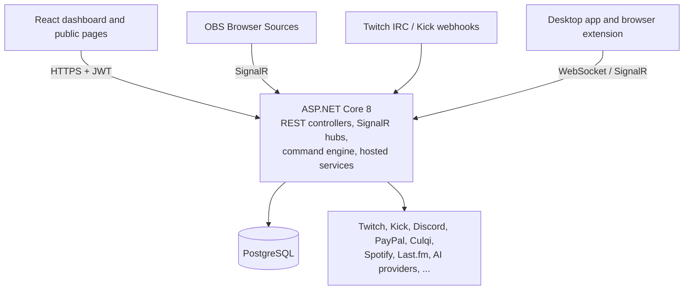

<div align="center">

# Decatron


**A multi-tenant bot and streaming toolkit for Twitch and Kick, with real-time OBS overlays, AI, song requests, wheels and raffles, tournaments, live translation and a public OAuth2 API.**

[Español](README.es.md) | [Features](#features) | [Tech stack](#tech-stack) | [Getting started](#getting-started) | [Documentation](#documentation)

</div>

---

## About

Decatron is a self-hosted, multi-tenant platform for streamers. A single React dashboard, protected by per-channel permissions, controls a chat bot with custom commands and a scripting language, browser-source overlays for OBS, event alerts, donations, AI chat, chat moderation, song requests, wheels and raffles, tournaments, a Discord bot and more. Everything is available in Spanish and English.

Three kinds of people use it:

- **Streamers and their moderators** use the dashboard and the bot.
- **Viewers** use chat commands, public pages (song queue, tournaments, emotes, donation pages) and a browser extension.
- **Developers** build on the public OAuth2 API.

---

## Features

### Bot and chat

| Feature | Description |
|---------|-------------|
| Built-in commands | `!title`, `!game`, `!so`, `!followage`, `!ia` and more, with Spanish and English responses |
| Custom commands | Text-response commands created from the dashboard or from chat with `!crear` |
| Scripting engine | A small language with variables, conditionals (`when...then...end`) and functions (`roll`, `pick`, `count`) |
| Micro commands | Game-category shortcuts (for example `!lol` sets the category to "League of Legends") |
| Chat moderation | Banned words with wildcards, link, spam and raid filters, strikes, permits, panic mode and action history, on Twitch and Kick |
| AI chat (`!ia`) | Google Gemini and OpenRouter with fallback, per-channel configuration and cooldowns |
| Private AI chat | AI conversations inside the dashboard, with admin audit |
| Speak chat | Chat messages and channel point redemptions read aloud with text-to-speech |
| Roulette (`!ruleta`) | Chat mini-game: a configurable chance of a random timeout, with protected and blocked lists |
| Bot list | Global catalog of known bots with per-channel changes, used to recognise bots in chat |

### Community and games

| Feature | Description |
|---------|-------------|
| Song Request | Viewers request songs with `!sr` using YouTube, SoundCloud, Spotify, Deezer or Apple Music links, or a song name. Live queue, request modes, filters, blacklists, collaborative playlists and a public page at `/sr/{channel}` |
| Wheel and raffle | Prize wheels (spins earned from bits, gifted subs, donations, channel points or DeCa coins) and raffle wheels (tickets, requirements, weights, draw), with credit wallets, anti-farming caps, deliveries and history |
| Giveaways | Weighted giveaways with anti-cheat checks and a live overlay |
| Tournaments | Editions with brackets, registration, teams, prizes, sponsors, rules and win conditions; Riot-based and Fortnite-based formats; public pages, an embeddable ranking and a stream overlay |
| Live translation | Real-time speech-to-text, translation and text-to-speech of a stream, driven by the Decatron Desktop app and consumed by a browser extension |
| Fortnite Spirits | Fortnite account linking through Epic, spirit collections, notifications and a public gallery |
| Gacha and trading cards | Collectible pulls and trading cards for viewers |
| Pets | A pet on the channel overlay that reacts to alerts, chat and commands |
| Emotes | Channel emotes and platform-wide global emotes, with public pages |

### Overlays

Overlays are added to OBS as Browser Sources and update in real time through SignalR.

| Overlay | Description |
|---------|-------------|
| Extension timer | Subathon-style timer with time added by bits, subs, raids and tips, plus happy hours, schedules and TTS alerts |
| Event alerts | Visual and audio alerts for follows, bits, subs, gift subs, raids, resubs and hype trains, with a drag-and-drop editor |
| Sound alerts | Channel point reward alerts with media upload and per-reward configuration |
| Now playing | Current track from Spotify or Last.fm |
| Tips | Donation alerts with TTS and timer integration |
| Shoutout | Shoutout with a Twitch clip (downloaded with yt-dlp) and a customizable layout |
| Giveaway, Wheel, Song Request, Chat, Pets, Games and live match | One overlay per module, configured from its dashboard page |

### Integrations

| Integration | Description |
|-------------|-------------|
| Twitch | Login, Helix API, IRC chat and EventSub (conduit with WebSocket shards, webhook as fallback) |
| Kick | Login, webhooks, API access and chat sending |
| Discord | Slash commands (`/decatron`, `/torneo`), XP levels and rank cards, welcome images and live alerts |
| Spotify and Last.fm | Now playing |
| PayPal and Culqi | Donations and tier purchases (PayPal); credit packages (Culqi) |
| Amazon Polly, Deepgram, FishAudio | Text-to-speech and speech-to-text |
| Riot and Epic Games | Account linking and match data for tournaments and game overlays |

### Dashboard and platform

| Feature | Description |
|---------|-------------|
| Analytics | Overview KPIs, timer events, moderation logs, stream history and chat activity |
| Followers manager | Sync from Twitch, unfollow detection, bulk actions and history |
| Supporters and credits | Subscription tiers, unified credits for paid features, invoices and billing profiles |
| Channel switching | Manage another channel as a moderator or editor |
| Permissions | Three levels (`commands` < `moderation` < `control_total`) over 13 dashboard sections |
| Public OAuth2 API | Authorization Code flow with PKCE, 25 scopes, app management and token revocation |
| Desktop companion | [decatron-desktop](https://github.com/decatrondev/decatron-desktop), connected through a single WebSocket |
| Browser extension | [decatron-extension](https://github.com/decatrondev/decatron-extension), live translation subtitles for viewers |
| Platform administration | Admin-only pages (users, finance, e-mail, AI costs, design editor). See [ARCHITECTURE.md](docs/ARCHITECTURE.md); they are not part of the user documentation |

---

## Architecture


```mermaid
graph TD
    OBS["OBS Browser Sources"]
    SPA["React dashboard and public pages"]
    Chat["Twitch IRC / Kick webhooks"]
    Ext["Desktop app and browser extension"]
    API["ASP.NET Core 8<br/>REST controllers, SignalR hubs,<br/>command engine, hosted services"]
    DB[("PostgreSQL")]
    Ext2["Twitch, Kick, Discord, PayPal, Culqi,<br/>Spotify, Last.fm, AI providers, ..."]

    SPA -->|HTTPS + JWT| API
    OBS -->|SignalR| API
    Chat --> API
    Ext -->|WebSocket / SignalR| API
    API --> DB
    API --> Ext2
```

The backend is split into .NET projects (`Decatron.Core`, `Decatron.Data`, `Decatron.Controllers`, `Decatron.Services`, `Decatron.Default`, `Decatron.Custom`, `Decatron.Scripting`, `Decatron.Discord`) hosted by the `Decatron` web project; the frontend lives in `ClientApp/`. See [docs/ARCHITECTURE.md](docs/ARCHITECTURE.md) for the full picture.

---

## Tech stack

| Layer | Technology |
|-------|------------|
| Backend | .NET 8, ASP.NET Core, Entity Framework Core (Npgsql), SignalR, TwitchLib, Serilog |
| Frontend | React 19, TypeScript, Vite 7, Tailwind CSS 3, react-router 7, i18next |
| Database | PostgreSQL 16 |
| Infrastructure | Nginx (reverse proxy and static files), yt-dlp, Let's Encrypt |

---

## Getting started

### Prerequisites

| Requirement | Version |
|-------------|---------|
| .NET SDK | 8.0 |
| Node.js | a current LTS release |
| PostgreSQL | 14 or newer (16 in production) |
| yt-dlp | latest (clip downloads and Song Request) |

Optional integrations need their own accounts and keys (AWS Polly, Spotify, PayPal, Google AI, OpenRouter, Kick, Discord, and so on). Each one is listed in [docs/CONFIGURATION.md](docs/CONFIGURATION.md).

### Install

```bash
git clone https://github.com/decatrondev/decatron.git
cd decatron

dotnet restore

cd ClientApp
npm install
cd ..
```

### Configure

```bash
cp appsettings.Secrets.json.example appsettings.Secrets.json
```

Fill in at least the database connection string, `JwtSettings` and `TwitchSettings`. `appsettings.json` already holds the non-secret defaults. The full list of settings is in [docs/CONFIGURATION.md](docs/CONFIGURATION.md) and [docs/ENV_VARIABLES.md](docs/ENV_VARIABLES.md).

### Create the database

```bash
sudo -u postgres psql -c "CREATE USER decatron_user WITH PASSWORD 'your_password';"
sudo -u postgres psql -c "CREATE DATABASE decatron OWNER decatron_user;"
psql -U decatron_user -d decatron -f Decatron.Data/Schema/baseline.sql
```

The backend does **not** create or migrate tables at startup. `Decatron.Data/Schema/baseline.sql` is a structure-only snapshot of the schema (2026-10-10); later changes are the SQL scripts in `Decatron.Data/Migrations/`, applied by hand.

### Run

```bash
# Terminal 1: backend
dotnet run

# Terminal 2: frontend
cd ClientApp
npm run dev
```

In development the backend listens on `https://localhost:7264` and the frontend on `http://localhost:5173` (Vite proxies `/api` to the backend).

---

## Overlay URLs

Each overlay is a page of the frontend, loaded as an OBS Browser Source. The dashboard page of every module shows the exact URL to copy (some include a private key). Common ones:

| Overlay | URL |
|---------|-----|
| Timer | `/overlay/timer?channel={name}` |
| Event alerts | `/overlay/event-alerts?channel={name}` |
| Sound alerts | `/overlay/soundalerts?channel={name}` |
| Now playing | `/overlay/now-playing?channel={name}` |
| Shoutout | `/overlay/shoutout?channel={name}` |
| Tips | `/overlay/tips?channel={name}` |
| Giveaway | `/overlay/giveaway?channel={name}` |
| Song Request | `/overlay/songrequest?channel={name}` (add `&key={playerKey}` for the player) |
| Wheel | `/overlay/rueda?channel={name}&wheel={slug}` |

See [docs/OVERLAYS.md](docs/OVERLAYS.md) for sizes, options and the rest of the overlays.

---

## Documentation

| Document | Description |
|----------|-------------|
| [ARCHITECTURE.md](docs/ARCHITECTURE.md) | System architecture, project structure, real-time communication, module map |
| [CONFIGURATION.md](docs/CONFIGURATION.md) | App settings, secrets by module, Twitch setup, database, logging |
| [ENV_VARIABLES.md](docs/ENV_VARIABLES.md) | Environment variables reference |
| [DEPLOYMENT.md](docs/DEPLOYMENT.md) | Production deployment guide |
| [API.md](docs/API.md) | API reference |
| [COMMANDS.md](docs/COMMANDS.md) | Bot commands reference |
| [OVERLAYS.md](docs/OVERLAYS.md) | Overlay setup and OBS integration |
| [DESIGN_SYSTEM.md](docs/DESIGN_SYSTEM.md) | Design tokens, component library, runtime theme editor |
| [TROUBLESHOOTING.md](docs/TROUBLESHOOTING.md) | Common problems and solutions |

Spanish versions are in [docs/es/](docs/es/). The user documentation lives in the app itself, under `/docs` (public) and `/dashboard/docs` (signed in).

---

## Contributing

See [CONTRIBUTING.md](CONTRIBUTING.md).

## Support

Open an issue on [GitHub Issues](https://github.com/decatrondev/decatron/issues).

## License

Decatron is licensed under the [GNU Affero General Public License v3.0](LICENSE). You can use, modify and self-host it; if you run a modified version as a network service, you must publish your changes under the same license.

Copyright (c) 2024-2026 Decatron.

---

<div align="center">

Created by **[AnthonyDeca](https://twitch.tv/anthonydeca)** | [decatron.net](https://decatron.net)

</div>
