# Decatron v2 -- Technical Architecture

> **Version:** 2.0
> **Stack:** ASP.NET Core 8 / React 18 / PostgreSQL / SignalR / TwitchLib
> **Last updated:** 2026-03-27

---

## Table of Contents

1. [System Overview](#1-system-overview)
2. [Backend Architecture](#2-backend-architecture)
3. [Frontend Architecture](#3-frontend-architecture)
4. [Real-time Communication](#4-real-time-communication)
5. [Authentication Flow](#5-authentication-flow)
6. [Database Schema](#6-database-schema)
7. [Module Map](#7-module-map)
8. [External Integrations](#8-external-integrations)
9. [Background Services](#9-background-services)

---

## 1. System Overview

Decatron is a multi-tenant Twitch bot and streaming toolkit. It provides chat commands, overlay widgets for OBS, event-driven alerts, a donation/tipping system, AI chat, moderation tools, and a full OAuth2 API for third-party developers. The platform serves three audiences: **streamers** (dashboard + bot), **viewers** (chat commands + donation pages), and **developers** (public OAuth2 API).

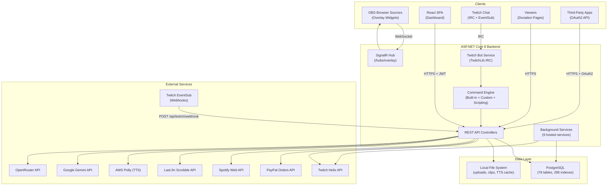

---

## 2. Backend Architecture

### 2.1 Project Structure

The backend follows a layered architecture split across multiple .NET projects within a single solution:

```
Decatron/
+-- Program.cs                          # Composition root (431 lines)
+-- Decatron.Core/                      # Domain layer (zero external deps)
|   +-- Interfaces/                     # 13 service contracts (IAuthService, IBotService, etc.)
|   +-- Models/                         # 70+ EF Core entities
|   +-- Models/OAuth/                   # OAuth2 entities (App, Code, Token, Refresh)
|   +-- Settings/                       # POCOs: JwtSettings, TwitchSettings, GachaSettings, AwsPollySettings
|   +-- Services/                       # Domain services (ModerationService, FollowersService)
|   +-- Scripting/                      # ScriptParser, ScriptValidator, ScriptExecutor, AST models
|   +-- Functions/                      # BuiltinFunctions (roll, pick, count)
|   +-- Resolvers/                      # VariableResolver (template variables)
|   +-- Converters/                     # JsonStringConverter for JSONB columns
|   +-- Helpers/                        # Utils, GameUtils, UtilsCrear
|   +-- Exceptions/                     # ScriptParseException, ScriptExecutionException
+-- Decatron.Data/                      # Persistence layer
|   +-- DecatronDbContext.cs            # 1389 lines, 78 DbSets, Fluent API config
|   +-- BotTokenRepository.cs           # IBotTokenRepository implementation
|   +-- UserRepository.cs               # IUserRepository implementation
+-- Decatron.Controllers/               # Primary API controllers
|   +-- AuthController.cs               # Twitch OAuth login + JWT issuance
|   +-- OAuthController.cs              # Public OAuth2 flows (authorize, token, revoke)
|   +-- DeveloperController.cs          # OAuth app CRUD
|   +-- TwitchWebhookController.cs      # EventSub webhook receiver (1663 lines)
|   +-- TimerExtensionController.cs     # Timer extension CRUD + control (1617 lines)
|   +-- EventAlertsController.cs        # Event alerts config + test (1323 lines)
|   +-- TipsController.cs               # Donation system + PayPal integration
|   +-- GoalsController.cs              # Stream goals
|   +-- ModerationController.cs         # Banned words + strikes
|   +-- SettingsController.cs           # Bot settings + user management
|   +-- AnalyticsController.cs          # Analytics dashboard data
|   +-- SupportersController.cs         # Subscription tiers + PayPal
|   +-- GiveawayController.cs           # Giveaway sessions
|   +-- RaffleController.cs             # Raffle system
|   +-- NowPlayingController.cs         # Now Playing / Last.fm
|   +-- SpotifyController.cs            # Spotify OAuth + status
|   +-- ChannelSwitchController.cs      # Multi-channel context switching
|   +-- GachaAuthController.cs          # GachaVerse account linking
|   +-- LanguageController.cs           # i18n preferences
|   +-- TtsController.cs                # TTS generation endpoint
|   +-- UserPermissionsController.cs    # User permission queries
|   +-- TimerBackupController.cs        # Timer backup/restore
|   +-- TimersController.cs             # Message timers (auto-post)
+-- Decatron.Default/                   # Default module (built-in commands + controllers)
|   +-- Controllers/
|   |   +-- ChatController.cs           # AI chat conversations
|   |   +-- ChatAdminController.cs      # AI chat admin panel
|   |   +-- FollowersController.cs      # Follower sync + management
|   |   +-- ShoutoutController.cs       # Shoutout config + overlay
|   |   +-- SoundAlertsController.cs    # Sound alerts config + upload
|   |   +-- FollowAlertController.cs    # Legacy follow alerts
|   |   +-- DecatronAIController.cs     # AI config per channel
|   |   +-- DecatronAIAdminController.cs # AI global admin
|   |   +-- TimerMediaController.cs     # Timer media upload
|   |   +-- MicroCommandsController.cs  # Micro commands (game shortcuts)
|   |   +-- GameController.cs           # Game/category management
|   +-- Commands/                       # Built-in chat commands
|       +-- HolaCommand, TitleCommand, TCommand, GameCommand, GCommand
|       +-- ShoutoutCommand, DecatronAICommand, FollowageCommand
|       +-- DStartCommand, DPauseCommand, DPlayCommand, DResetCommand,
|           DStopCommand, DTimerCommand, DtiempoCommand, DcuandoCommand,
|           DstatsCommand, DrecordCommand, DtopCommand
+-- Decatron.Custom/                    # Custom module
|   +-- Controllers/CustomCommandsController.cs
|   +-- Commands/CreateCommand.cs       # !crear command
+-- Decatron.Scripting/
|   +-- Controllers/ScriptsController.cs
|   +-- Services/ScriptingService.cs
+-- Decatron.Services/                  # Application services (50+ classes)
|   +-- AuthService.cs, OAuthService.cs, PermissionService.cs
|   +-- TwitchBotService.cs, TwitchApiService.cs, EventSubService.cs
|   +-- CommandService.cs, CommandMessagesService.cs, CommandTranslationService.cs
|   +-- MessageSenderService.cs
|   +-- TimerEventService.cs, TimerService.cs, TimerAutoEventService.cs
|   +-- EventAlertsService.cs, TipsService.cs, GoalsService.cs
|   +-- GiveawayService.cs, RaffleService.cs
|   +-- NowPlayingService.cs, StreamStatusService.cs
|   +-- SupportersService.cs
|   +-- ClipDownloadService.cs, GameSearchService.cs
|   +-- GeminiService.cs, OpenRouterService.cs, AIProviderService.cs
|   +-- OverlayNotificationService.cs
|   +-- TtsService.cs, LanguageService.cs, SettingsService.cs
|   +-- ChatActivityService.cs, WatchTimeTrackingService.cs
|   +-- *BackgroundService.cs (9 background services)
+-- Decatron.OAuth/
|   +-- Handlers/OAuthBearerHandler.cs  # Custom auth handler
|   +-- Attributes/RequireScopeAttribute.cs
|   +-- Scopes/DecatronScopes.cs        # 20 OAuth2 scopes
+-- Decatron.Attributes/
|   +-- RequirePermissionAttribute.cs   # Channel permission filter
+-- Decatron.Middleware/
|   +-- ChannelAccessMiddleware.cs      # Injects ChannelOwnerId claim
+-- Hubs/
|   +-- OverlayHub.cs                   # SignalR hub for overlays
+-- Migrations/                         # Manual SQL migration scripts
+-- ClientApp/                          # React SPA (see Frontend section)
```

### 2.2 Dependency Injection Flow

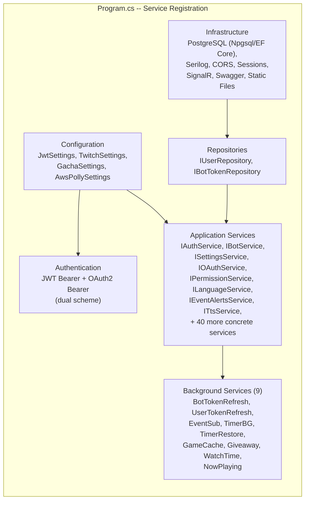

### 2.3 Request Pipeline

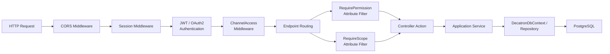

**Key pipeline details:**
- **Dual authentication**: JWT Bearer for dashboard sessions; custom `OAuthBearerHandler` for public API tokens
- **ChannelAccessMiddleware**: Injects `ChannelOwnerId` claim from session or defaults to the authenticated user's own channel
- **RequirePermission**: Three-level hierarchy -- `commands` (1) < `moderation` (2) < `control_total` (3) -- with 12 mapped sections
- **RequireScope / RequireAnyScope**: Validates OAuth2 scopes (20 scopes across read/write/action categories)

---

## 3. Frontend Architecture

### 3.1 Technology Stack

| Layer | Technology |
|-------|-----------|
| Framework | React 18 with TypeScript |
| Routing | react-router-dom v6 (BrowserRouter) |
| State Management | React Context (Permissions, Language, Toast) -- no Redux/Zustand |
| HTTP Client | Axios with JWT interceptors (`services/api.ts`) |
| Real-time | @microsoft/signalr |
| Styling | Tailwind CSS |
| Icons | lucide-react |
| i18n | react-i18next + backend persistence |
| UI Components | @headlessui/react |

### 3.2 Component Hierarchy

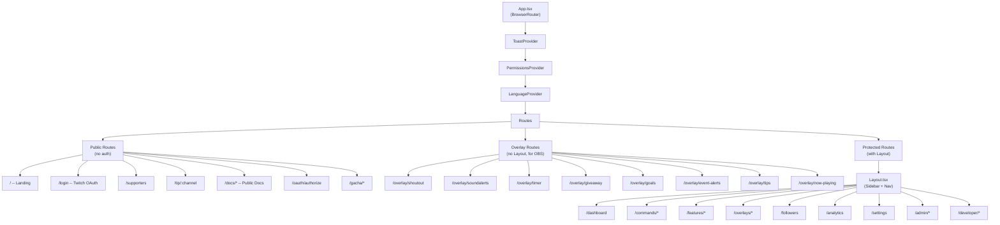

### 3.3 Routing Structure

All routes defined in `App.tsx`:

| Route | Component | Auth | Permission |
|-------|-----------|------|-----------|
| `/` | Index | No | -- |
| `/login` | Login | No | -- |
| `/supporters` | SupportersPublic | No | -- |
| `/tip/:channelName` | TipsDonate | No | -- |
| `/donate/:channelName` | TipsDonate | No | -- |
| `/gacha/login` | GachaLogin | No | -- |
| `/oauth/authorize` | OAuthAuthorizePage | No | -- |
| `/docs/*` | DocsLayout | No | -- |
| `/overlay/shoutout` | ShoutoutOverlay | No | -- |
| `/overlay/soundalerts` | SoundAlertsOverlay | No | -- |
| `/overlay/timer` | TimerOverlay | No | -- |
| `/overlay/giveaway` | GiveawayOverlay | No | -- |
| `/overlay/goals` | GoalsOverlay | No | -- |
| `/overlay/event-alerts` | EventAlertsOverlay | No | -- |
| `/overlay/tips` | TipsOverlay | No | -- |
| `/overlay/now-playing` | NowPlayingOverlay | No | -- |
| `/dashboard` | Dashboard | JWT | any |
| `/commands/custom` | CustomCommands | JWT | commands |
| `/commands/default` | DefaultCommands | JWT | commands |
| `/commands/scripting` | ScriptingList | JWT | commands |
| `/commands/scripting/edit/:id` | ScriptingEditor | JWT | commands |
| `/commands/microcommands` | MicroCommands | JWT | commands |
| `/followers` | Followers | JWT | commands |
| `/features/moderation` | BannedWords | JWT | moderation |
| `/features/giveaway` | GiveawayConfig | JWT | moderation |
| `/features/tips` | TipsConfig | JWT | moderation |
| `/features/decatron-ai` | DecatronAIConfig | JWT | control_total |
| `/overlays/shoutout` | ShoutoutConfig | JWT | moderation |
| `/overlays/soundalerts` | SoundAlerts | JWT | moderation |
| `/overlays/timer` | TimerConfig | JWT | moderation |
| `/overlays/event-alerts` | EventAlertsConfig | JWT | moderation |
| `/overlays/goals` | GoalsConfig | JWT | moderation |
| `/overlays/now-playing` | NowPlayingConfig | JWT | moderation |
| `/analytics` | Analytics | JWT | moderation |
| `/settings` | Settings | JWT | control_total |
| `/admin/decatron-ai` | DecatronAIAdmin | JWT | system owner |
| `/admin/supporters` | SupportersConfig | JWT | system owner |
| `/admin/chat` | ChatAdminController | JWT | system owner |
| `/developer/*` | DeveloperPortal | JWT | any |

### 3.4 State Management Approach

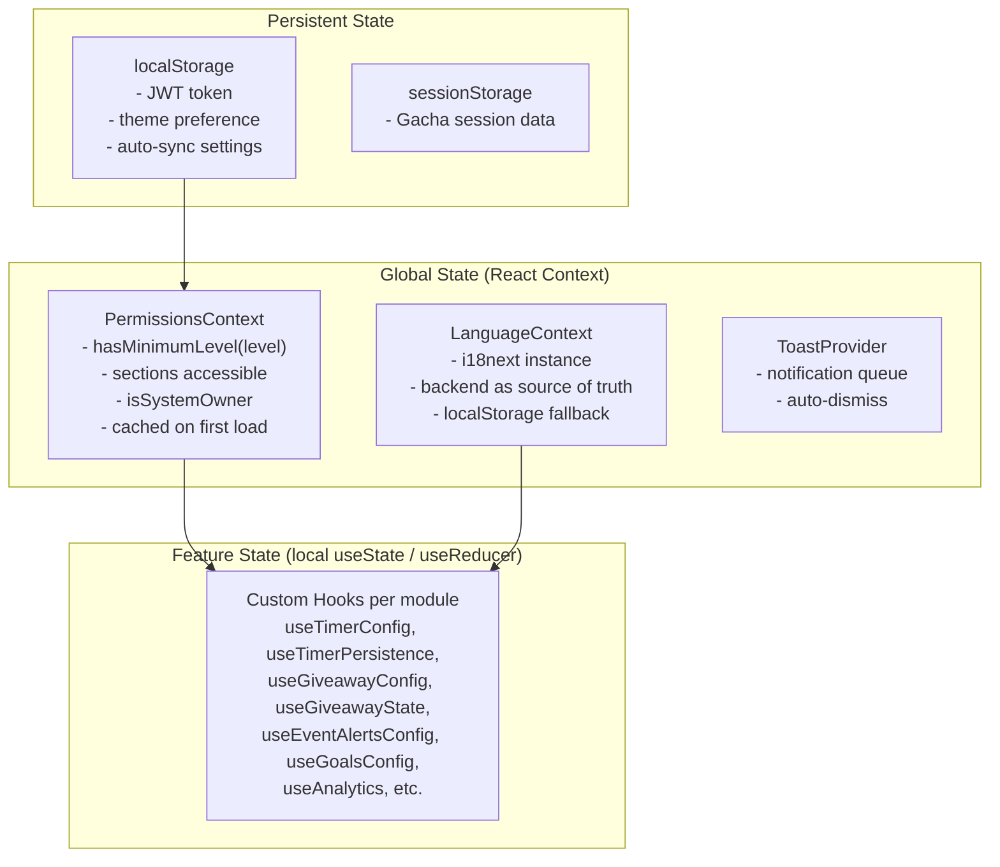

---

## 4. Real-time Communication

All real-time communication flows through a single SignalR hub at `/hubs/overlay`.

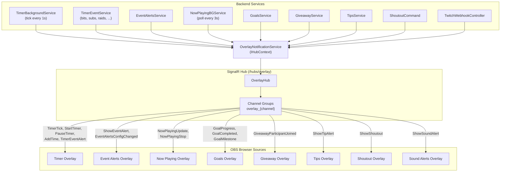

**SignalR Events (Server to Client):**

| Event | Source | Payload |
|-------|--------|---------|
| `TimerTick` | TimerBackgroundService | remaining seconds, state |
| `StartTimer` / `PauseTimer` / `ResumeTimer` / `ResetTimer` / `StopTimer` | OverlayNotificationService | timer state |
| `AddTime` | TimerEventService | seconds added, reason |
| `TimerEventAlert` | TimerEventService | event type, username, amount, media |
| `ShowEventAlert` | EventAlertsService | event type, tier, media, TTS URLs |
| `EventAlertsConfigChanged` | EventAlertsController | -- |
| `ShowShoutout` | ShoutoutCommand | user data, clip URL, config |
| `ShowSoundAlert` | TwitchWebhookController | reward data, media file, config |
| `ShowTipAlert` | TipsService | donor, amount, message, media |
| `NowPlayingUpdate` / `NowPlayingStop` | NowPlayingBGService | track info, album art, progress |
| `GoalProgress` / `GoalCompleted` / `GoalMilestone` | GoalsService | goal ID, current value |
| `GiveawayParticipantJoined` | GiveawayService | participant info |
| `ConfigurationChanged` | multiple controllers | -- |

---

## 5. Authentication Flow

### 5.1 Twitch OAuth Login (User Sessions)

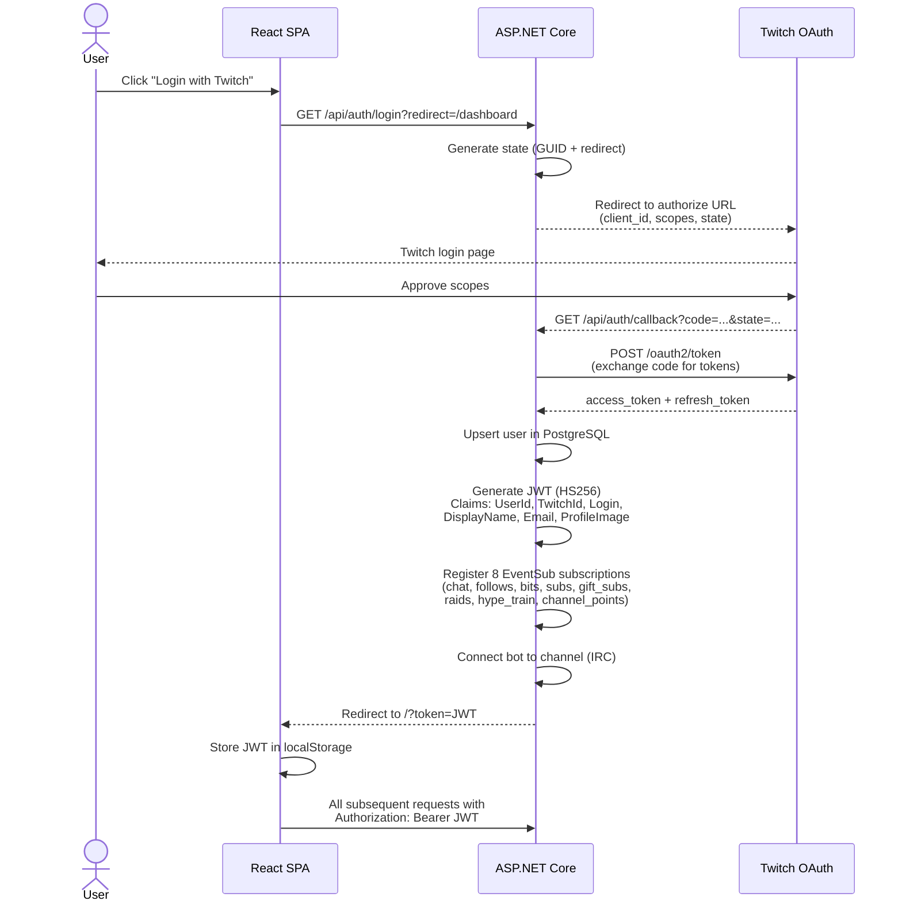

### 5.2 Public OAuth2 API (Third-Party Apps)

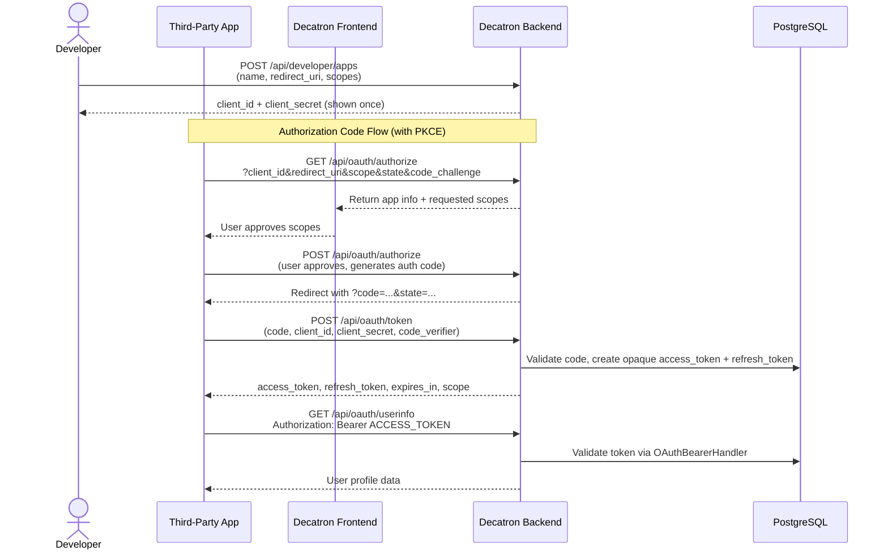

**OAuth2 Scopes (20 total in 3 categories):**

| Category | Scopes |
|----------|--------|
| Read | `read:profile`, `read:commands`, `read:timers`, `read:followers`, `read:moderation`, `read:overlays`, `read:settings` |
| Write | `write:commands`, `write:timers`, `write:moderation`, `write:overlays`, `write:settings` |
| Action | `action:bot`, `action:shoutout`, `action:timer`, `action:giveaway`, `action:tts` |

### 5.3 Permission Hierarchy

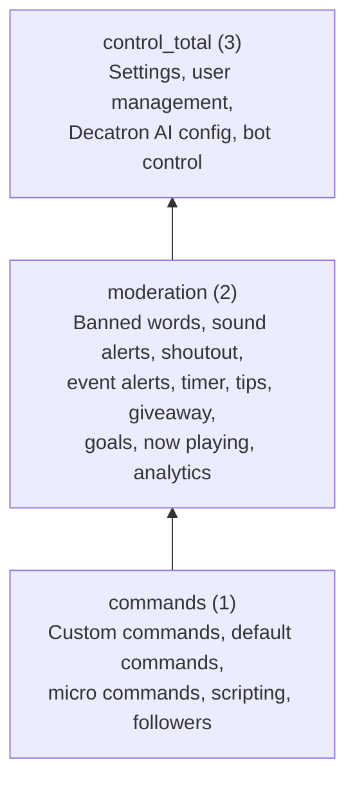

---

## 6. Database Schema

PostgreSQL with 78 tables, 296 indexes, and 43 foreign keys. Below is a simplified ER diagram showing the core domain relationships.

```mermaid
erDiagram
    users {
        bigint id PK
        string twitch_id UK
        string login
        string display_name
        string email
        string access_token
        string refresh_token
        string profile_image_url
    }

    bot_tokens {
        bigint id PK
        string username UK
        string access_token
        string refresh_token
        string chat_token
        datetime expires_at
    }

    system_admins {
        bigint id PK
        bigint user_id FK
        string role
    }

    system_settings {
        bigint id PK
        bigint user_id FK
        bool bot_enabled
        string language
    }

    user_channel_permissions {
        bigint id PK
        bigint user_id FK
        bigint channel_owner_id FK
        string permission_level
    }

    custom_commands {
        bigint id PK
        string channel_name
        string command_name
        string response
        string access_level
    }

    scripted_commands {
        bigint id PK
        string channel_name
        string command_name
        string script_content
    }

    timer_configs {
        bigint id PK
        bigint user_id FK
        text events_config
        text display_config
        text alerts_config
    }

    timer_states {
        bigint id PK
        string channel_name
        string status
        bigint remaining_seconds
        datetime started_at
    }

    timer_sessions {
        bigint id PK
        string channel_name
        datetime started_at
        datetime ended_at
        bigint total_time_added
    }

    timer_event_logs {
        bigint id PK
        bigint session_id FK
        string event_type
        string username
        int amount
        int seconds_added
    }

    event_alerts_configs {
        bigint id PK
        bigint user_id FK
        string channel_name
        text config_json
    }

    sound_alert_configs {
        bigint id PK
        string username
        text config_json
    }

    sound_alert_files {
        bigint id PK
        string username
        string reward_id
        string file_path
    }

    shoutout_configs {
        bigint id PK
        string username
        text text_lines
        text styles
    }

    tips_configs {
        bigint id PK
        bigint user_id FK
        string paypal_email
        string currency
        text alert_config
    }

    tips_history {
        bigint id PK
        string channel_name
        string donor_name
        decimal amount
        string message
    }

    goals_configs {
        bigint id PK
        bigint user_id FK
        text goals
        text overlay_config
    }

    now_playing_configs {
        bigint id PK
        bigint user_id FK
        string provider
        string lastfm_username
        string spotify_access_token
        string spotify_refresh_token
    }

    giveaway_configs {
        bigint id PK
        string twitch_id
        text weights_config
        text requirements_config
    }

    giveaway_sessions {
        bigint id PK
        bigint config_id FK
        string status
        datetime started_at
    }

    giveaway_participants {
        bigint id PK
        bigint session_id FK
        string username
        decimal weight
        string ip_hash
    }

    giveaway_winners {
        bigint id PK
        bigint session_id FK
        bigint participant_id FK
        string status
    }

    raffles {
        bigint id PK
        bigint created_by FK
        string name
        string status
    }

    moderation_configs {
        bigint id PK
        bigint user_id
        text immunity_config
        text strike_config
    }

    banned_words {
        bigint id PK
        bigint user_id
        string word
        string severity
    }

    oauth_applications {
        bigint id PK
        bigint user_id FK
        string client_id UK
        string client_secret_hash
        string name
        text redirect_uris
    }

    oauth_access_tokens {
        bigint id PK
        bigint user_id FK
        bigint application_id FK
        string token_hash
        datetime expires_at
    }

    decatron_ai_global_config {
        bigint id PK
        bool enabled
        string provider
        string model
        text system_prompt
    }

    decatron_ai_channel_permissions {
        bigint id PK
        string channel_name
        bool enabled
        bool can_configure
    }

    channel_followers {
        bigint id PK
        string channel_id
        string follower_id
        int is_following
        datetime followed_at
    }

    users ||--o{ system_admins : "has"
    users ||--o{ system_settings : "has"
    users ||--o{ user_channel_permissions : "grants"
    users ||--o{ timer_configs : "owns"
    users ||--o{ event_alerts_configs : "owns"
    users ||--o{ tips_configs : "owns"
    users ||--o{ goals_configs : "owns"
    users ||--o{ now_playing_configs : "owns"
    users ||--o{ oauth_applications : "creates"
    users ||--o{ oauth_access_tokens : "has"
    users ||--o{ raffles : "creates"
    oauth_applications ||--o{ oauth_access_tokens : "issues"
    giveaway_configs ||--o{ giveaway_sessions : "runs"
    giveaway_sessions ||--o{ giveaway_participants : "has"
    giveaway_sessions ||--o{ giveaway_winners : "selects"
    giveaway_participants ||--o{ giveaway_winners : "becomes"
    timer_sessions ||--o{ timer_event_logs : "records"
```

**Notable schema characteristics:**
- Configuration tables store complex settings as JSONB blobs (`config_json`, `events_config`, `display_config`)
- Some tables use `username` (string) as the relation key instead of `user_id` (FK) -- notably `shoutout_configs`, `sound_alert_configs`, `sound_alert_files`
- 5 tables exist in the database but are not mapped in EF Core (`supporter_payments`, `supporters_page_config`, `tier_features`, `tier_history`, `user_subscription_tiers`) -- managed via raw Npgsql
- Manual SQL migrations (not EF Core Migrations)
- snake_case column naming convention via Fluent API

---

## 7. Module Map

All 21 modules identified in the codebase audit:

| # | Module | Description | Key Backend Files | Key Frontend Files | Approx. Lines |
|---|--------|-------------|-------------------|-------------------|---------------|
| 01 | **Core / Configuration** | Application entry point, DI composition, settings POCOs, 13 interfaces, 70+ EF entity models, middleware | `Program.cs`, `Decatron.Core/*`, `ChannelAccessMiddleware.cs` | -- | ~4,700 |
| 02 | **Authentication & OAuth** | Twitch OAuth login, JWT issuance, public OAuth2 API (PKCE), Gacha auth, permissions | `AuthController`, `OAuthController`, `DeveloperController`, `GachaAuthController`, `AuthService`, `OAuthService`, `PermissionService` | `Login.tsx`, `OAuthAuthorizePage.tsx`, `DeveloperPortal.tsx` | ~3,700 |
| 03 | **Bot / Chat** | Twitch IRC bot, command engine (built-in + custom + scripted), AI chat conversations, moderation integration | `TwitchBotService`, `CommandService`, `MessageSenderService`, `ChatController`, `ChatAdminController`, `CustomCommandsController` | -- | ~4,260 |
| 04 | **Twitch API / EventSub** | Helix API wrapper, EventSub webhook receiver, token refresh services, channel switching | `TwitchWebhookController` (1663 lines), `EventSubService` (1206), `TwitchApiService` (858), `*TokenRefresh*` | -- | ~4,710 |
| 05 | **Timer Extension** | Extensible stream timer (subathon-style), message timers, events, schedules, happy hours, backups, templates, media, overlay | `TimerExtensionController` (1617), `TimerEventService` (1639), `TimerBackgroundService`, `TimerService` | `TimerOverlay.tsx` (985), `TimerConfig.tsx`, 23+ tab/hook files | ~16,500 |
| 06 | **Event Alerts** | Visual/audio alerts for Twitch events (follow, bits, sub, raid, hype train), tier system, variants, TTS, overlay editor | `EventAlertsController` (1323), `EventAlertsService` (1115), `FollowAlertController` | `EventAlertsOverlay.tsx` (914), `EventAlertsConfig.tsx` (1165), 20+ extension files | ~11,900 |
| 07 | **Sound Alerts** | Channel Points reward alerts with media upload, visual editor, overlay | `SoundAlertsController` (1271) | `SoundAlerts.tsx` (1988), `SoundAlertsOverlay.tsx` (848) | ~4,100 |
| 08 | **Tips / Donations** | PayPal integration, donation page, tip alerts (basic/timer mode), overlay, statistics | `TipsController` (876), `TipsService` (834) | `TipsConfig.tsx` (1254), `TipsDonate.tsx`, `TipsOverlay.tsx` (932), `TipsOverlayEditor.tsx` (1083) | ~6,300 |
| 09 | **Supporters** | Subscription tiers (Supporter/Premium/Founder), PayPal checkout, discount codes, admin panel | `SupportersController` (928), `SupportersService` (540) | `SupportersConfig.tsx` (1851), `SupportersPublic.tsx` (1046) | ~4,400 |
| 10 | **Giveaway / Raffle** | Weighted giveaways with anti-cheat, timer integration, raffle system, background monitoring | `GiveawayController` (803), `GiveawayService` (1303), `GiveawayBackgroundService`, `RaffleController` (764), `RaffleService` (601) | 14 frontend files (types, hooks, tabs) | ~7,400 |
| 11 | **Goals** | Stream goals (subs, bits, follows, combined), milestones, timer integration, overlay | `GoalsController` (276), `GoalsService` (515) | `GoalsConfig.tsx` tabs, `GoalsPreview.tsx`, `GoalsOverlay.tsx` (557) | ~6,400 |
| 12 | **Shoutout** | Visual shoutout overlay with clip download (yt-dlp), config, blacklist/whitelist | `ShoutoutController` (521), `ClipDownloadService` (266) | `ShoutoutConfig.tsx` (1815), `ShoutoutOverlay.tsx` (632) | ~3,200 |
| 13 | **Now Playing** | Spotify and Last.fm integration, background polling, tier-gated features, cupo system | `NowPlayingController` (461), `SpotifyController` (233), `NowPlayingService` (715), `NowPlayingBackgroundService` (417), `StreamStatusService` (153) | `NowPlayingConfig.tsx` (2495), `NowPlayingOverlay.tsx` (958) | ~5,400 |
| 14 | **Moderation** | Banned words with wildcards, strike escalation, immunity system, import/export | `ModerationController` (607), `ModerationService` (561) | `BannedWords.tsx` (889) | ~2,100 |
| 15 | **Followers / Analytics** | Follower sync from Twitch API, unfollow detection, analytics dashboard (6 tabs), watch time tracking, chat activity | `FollowersController` (556), `FollowersService` (457), `AnalyticsController` (672), `WatchTimeTrackingService`, `ChatActivityService` | `Followers.tsx` (1116), `Analytics.tsx` + 6 tabs | ~4,900 |
| 16 | **Scripting** | Custom DSL (set/when/send), parser, validator, executor, micro commands, game search/cache | `ScriptsController` (524), `ScriptingService` (376), `ScriptParser` (429), `ScriptExecutor` (397), `MicroCommandsController` (542), `GameSearchService`, `GameCacheUpdateService` | `ScriptingEditor.tsx`, `ScriptingList.tsx`, `MicroCommands.tsx`, `CustomCommands.tsx`, `DefaultCommands.tsx` | ~6,700 |
| 17 | **Decatron AI** | AI chat via Google Gemini / OpenRouter with fallback, `!ia` command, per-channel config, admin panel | `DecatronAIController` (336), `DecatronAIAdminController` (414), `GeminiService` (179), `OpenRouterService` (176), `AIProviderService` (111), `DecatronAICommand` (417) | `DecatronAIConfig.tsx` (493), `DecatronAIAdmin.tsx` (752), `AIDoc.tsx` (287) | ~3,300 |
| 18 | **Settings** | Bot settings, user management, language preferences, TTS generation (AWS Polly), user permissions | `SettingsController` (432), `SettingsService` (433), `LanguageController` (126), `TtsController` (78), `TtsService` (157) | -- | ~1,600 |
| 19 | **SignalR / Overlays** | Real-time hub, overlay notification service (consumed by 32 files) | `OverlayHub.cs` (132), `OverlayNotificationService.cs` (379) | -- | ~510 |
| 20 | **Database** | EF Core DbContext (78 DbSets), repositories, manual SQL migrations | `DecatronDbContext.cs` (1389), `BotTokenRepository.cs`, `UserRepository.cs`, 7 migration scripts | -- | ~2,100 |
| 21 | **Frontend Shared** | Router, API service, contexts, hooks, Layout, overlays, docs, developer portal, Gacha pages | `App.tsx`, `api.ts`, `PermissionsContext.tsx`, `Layout.tsx`, 20+ shared components, 8 overlay pages | All shared frontend | ~8,500 |

**Estimated total codebase:** ~120,000+ lines across backend and frontend.

---

## 8. External Integrations

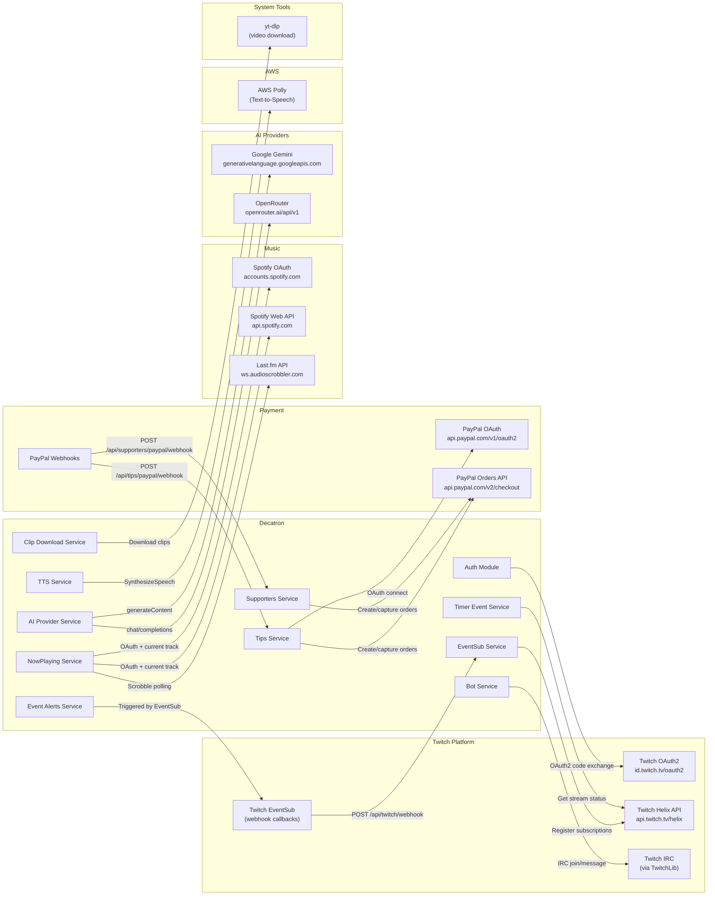

### Integration Details

| Integration | Auth Method | Data Flow | Polling Interval |
|-------------|-----------|-----------|-----------------|
| **Twitch OAuth** | OAuth2 Authorization Code | Login, token exchange, refresh every 30 min | -- |
| **Twitch Helix API** | Bearer (user/app token) | User info, streams, clips, channel points, followers, chatters | On-demand |
| **Twitch EventSub** | HMAC-SHA256 webhook verification | 10 event types per user (chat, follow, bits, sub, gift, raid, hype, points, online, offline) | Push-based |
| **Twitch IRC** | OAuth token via TwitchLib | Chat messages (send/receive), command processing | Persistent connection |
| **PayPal** | OAuth2 Client Credentials | Order creation, capture, webhook notifications | On-demand + webhook |
| **Spotify** | OAuth2 Authorization Code | Current track, playback state | Every 3 seconds (background) |
| **Last.fm** | API Key (query param) | Recent tracks, track info | Every 3 seconds (background) |
| **Google Gemini** | API Key (query param) | Content generation for `!ia` command | On-demand |
| **OpenRouter** | Bearer token (header) | Chat completions (fallback provider) | On-demand |
| **AWS Polly** | AWS credentials (IAM) | Text-to-Speech audio generation with file cache | On-demand, cached |
| **yt-dlp** | None (system binary) | Twitch clip download for shoutout overlay | On-demand |

---

## 9. Background Services

Nine `BackgroundService` instances registered in `Program.cs` run continuously alongside the web server:

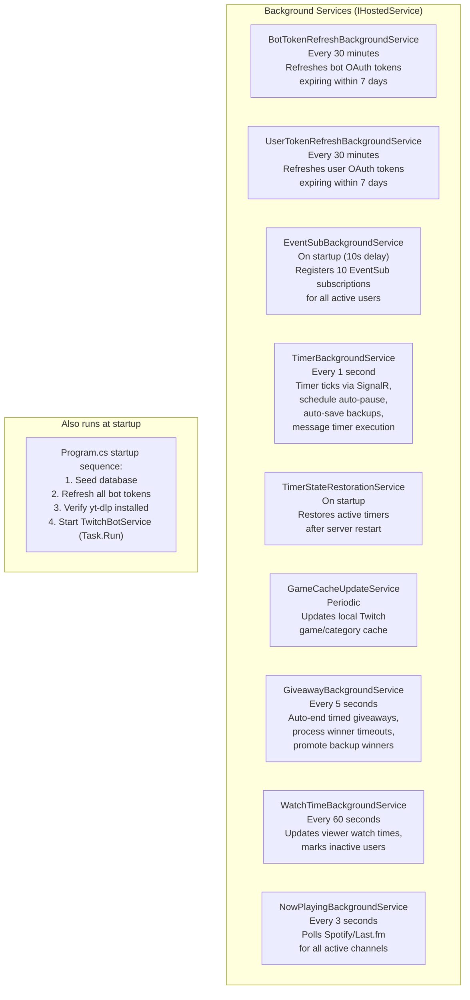

| Service | Interval | Responsibility |
|---------|----------|---------------|
| `BotTokenRefreshBackgroundService` | 30 min | Proactively refreshes Twitch bot tokens before they expire |
| `UserTokenRefreshBackgroundService` | 30 min | Proactively refreshes user Twitch tokens before they expire |
| `EventSubBackgroundService` | Startup only | Iterates all active users with bot enabled and registers 10 EventSub webhook subscriptions per user |
| `TimerBackgroundService` | 1 second | Sends `TimerTick` via SignalR, evaluates schedule-based auto-pause, auto-saves timer backups every 5 min, executes message timers |
| `TimerStateRestorationService` | Startup only | Scans for timers that were active when the server last stopped, recalculates elapsed time, and restores them |
| `GameCacheUpdateService` | Periodic | Fetches the Twitch game/category directory and updates local cache table for game search autocomplete |
| `GiveawayBackgroundService` | 5 seconds | Monitors active giveaways: auto-ends timed sessions, processes winner response timeouts, promotes backup winners |
| `WatchTimeBackgroundService` | 60 seconds | Updates `stream_watch_times` for all active viewers, marks users inactive after 5 min without chat activity |
| `NowPlayingBackgroundService` | 3 seconds | Polls Spotify API or Last.fm API for each active channel and sends `NowPlayingUpdate` via SignalR when the track changes |

**Additional long-running process:**
- `TwitchBotService` is started via `Task.Run()` at application startup (not as a formal `BackgroundService`). It maintains the persistent IRC connection to Twitch and handles reconnection with exponential backoff.

---

*This document was generated from a comprehensive audit of all 21 Decatron modules (120,000+ lines of code across backend and frontend).*
