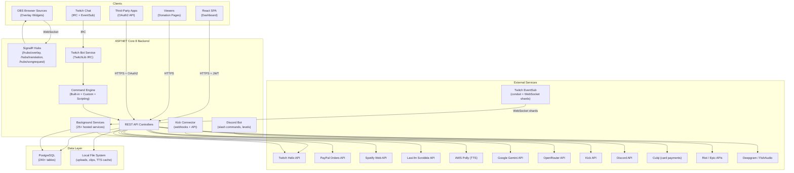
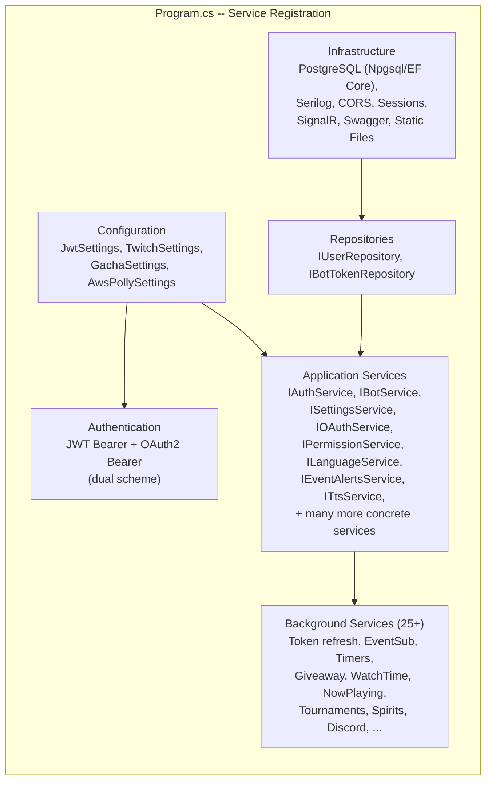
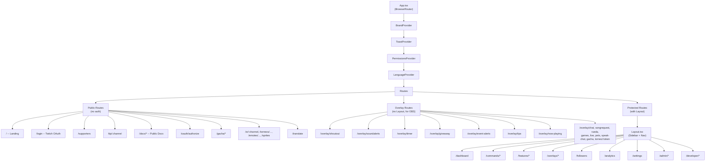
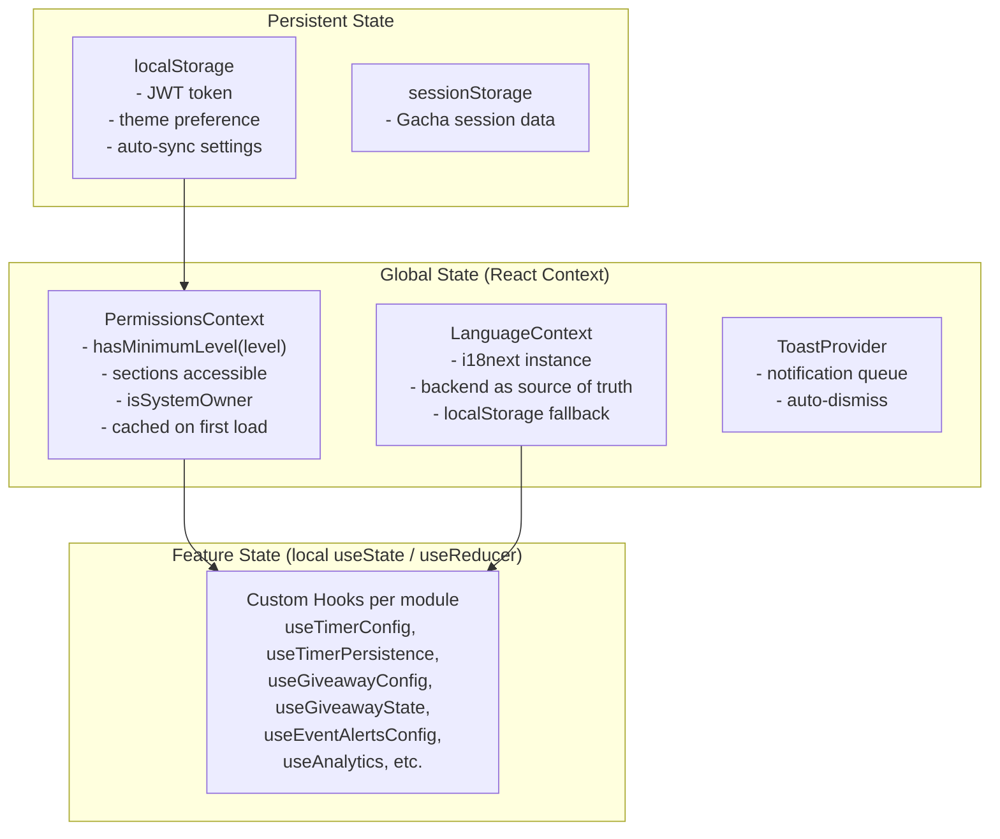
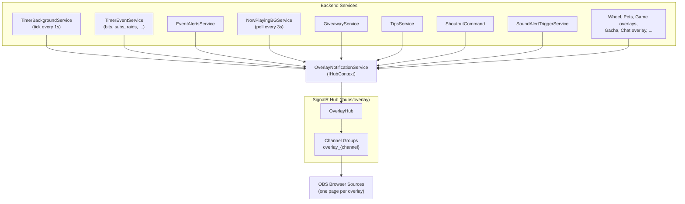
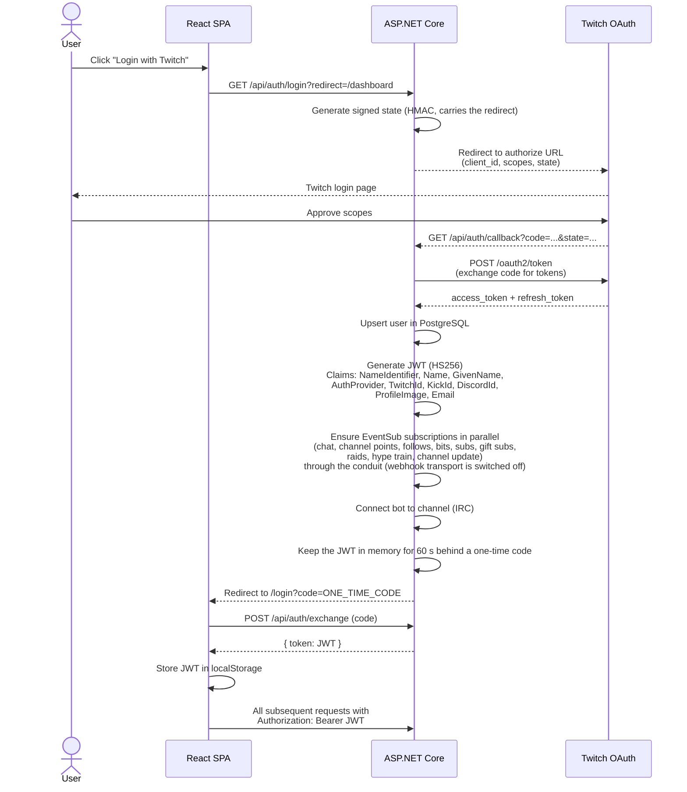
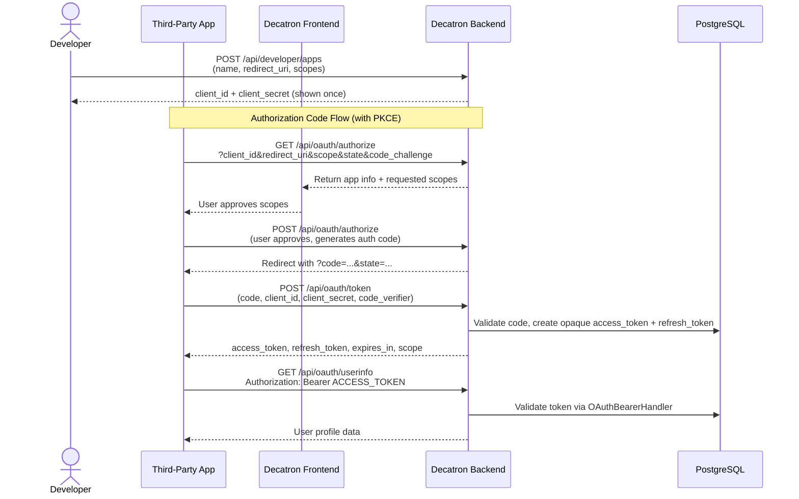
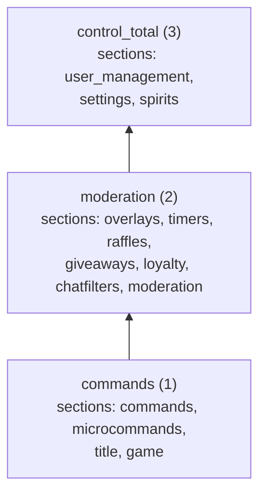
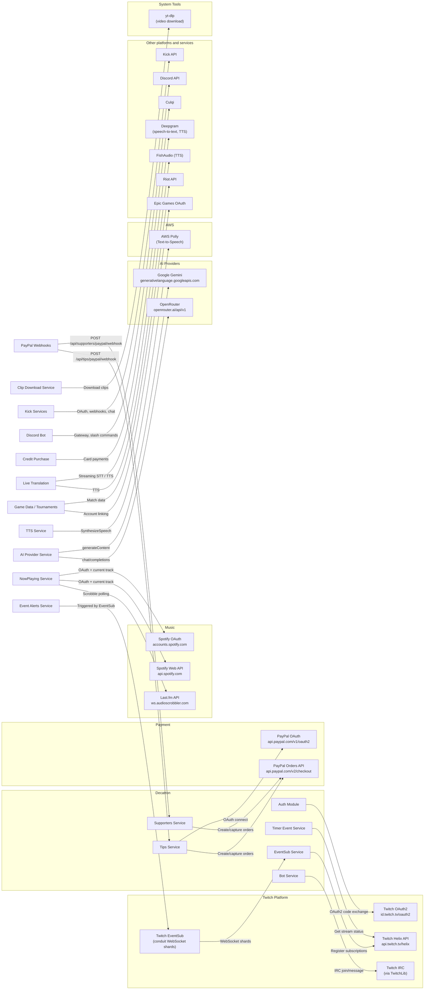
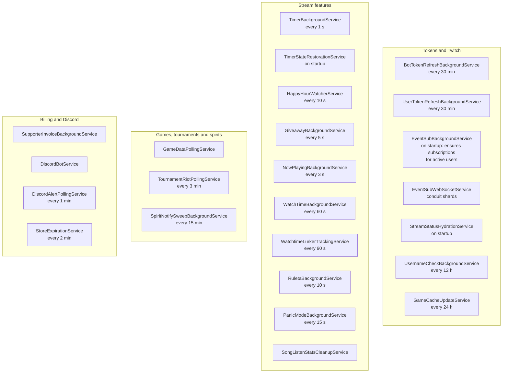

# Decatron v2 -- Technical Architecture

> Español: [es/ARCHITECTURE.md](es/ARCHITECTURE.md)
>
> **Stack:** ASP.NET Core 8 / React 19 / PostgreSQL / SignalR / TwitchLib
> **Last reviewed against the code:** 2026-10-10

---

## Table of Contents

1. [System Overview](#1-system-overview)
2. [Backend Architecture](#2-backend-architecture)
3. [Frontend Architecture](#3-frontend-architecture)
4. [Real-time Communication](#4-real-time-communication)
5. [Authentication Flow](#5-authentication-flow)
6. [Database Schema](#6-database-schema)
7. [Module Map](#7-module-map)
8. [External Integrations](#8-external-integrations)
9. [Background Services](#9-background-services)

---

## 1. System Overview

Decatron is a multi-tenant bot and streaming toolkit for Twitch, with Kick support for chat and several modules. It provides chat commands, overlay widgets for OBS, event-driven alerts, a donation/tipping system, AI chat, moderation tools, song requests, wheels and raffles, tournaments, live chat translation, a Discord bot, and a full OAuth2 API for third-party developers. The platform serves three audiences: **streamers** (dashboard + bot + desktop companion), **viewers** (chat commands, public pages, browser extension), and **developers** (public OAuth2 API).


```mermaid
graph TD
    subgraph Clients
        OBS["OBS Browser Sources<br/>(Overlay Widgets)"]
        Dashboard["React SPA<br/>(Dashboard)"]
        TwitchChat["Twitch Chat<br/>(IRC + EventSub)"]
        Viewers["Viewers<br/>(Donation Pages)"]
        ThirdParty["Third-Party Apps<br/>(OAuth2 API)"]
    end

    subgraph Backend ["ASP.NET Core 8 Backend"]
        API["REST API Controllers"]
        SignalR["SignalR Hubs<br/>(/hubs/overlay, /hubs/translation,<br/>/hubs/songrequest)"]
        Bot["Twitch Bot Service<br/>(TwitchLib IRC)"]
        KickConn["Kick Connector<br/>(webhooks + API)"]
        DiscordBot["Discord Bot<br/>(slash commands, levels)"]
        BGServices["Background Services<br/>(25+ hosted services)"]
        CommandEngine["Command Engine<br/>(Built-in + Custom + Scripting)"]
    end

    subgraph Data ["Data Layer"]
        PG["PostgreSQL<br/>(240+ tables)"]
        FileSystem["Local File System<br/>(uploads, clips, TTS cache)"]
    end

    subgraph External ["External Services"]
        TwitchAPI["Twitch Helix API"]
        TwitchEventSub["Twitch EventSub<br/>(conduit + WebSocket shards)"]
        PayPal["PayPal Orders API"]
        Spotify["Spotify Web API"]
        LastFM["Last.fm Scrobble API"]
        AWSPolly["AWS Polly (TTS)"]
        Gemini["Google Gemini API"]
        OpenRouter["OpenRouter API"]
        KickAPI["Kick API"]
        DiscordAPI["Discord API"]
        Culqi["Culqi (card payments)"]
        Riot["Riot / Epic APIs"]
        Deepgram["Deepgram / FishAudio"]
    end

    Dashboard -->|HTTPS + JWT| API
    OBS -->|WebSocket| SignalR
    TwitchChat -->|IRC| Bot
    Viewers -->|HTTPS| API
    ThirdParty -->|HTTPS + OAuth2| API

    API --> PG
    API --> FileSystem
    Bot --> CommandEngine
    CommandEngine --> API
    BGServices --> PG
    BGServices --> TwitchAPI
    SignalR --> OBS

    TwitchEventSub -->|WebSocket shards| BGServices
    API --> TwitchAPI
    API --> PayPal
    API --> Spotify
    API --> LastFM
    API --> AWSPolly
    API --> Gemini
    API --> OpenRouter
    KickConn --> KickAPI
    DiscordBot --> DiscordAPI
    API --> Culqi
    API --> Riot
    API --> Deepgram
```

---

## 2. Backend Architecture

### 2.1 Project Structure

The backend follows a layered architecture split across multiple .NET projects within a single solution:

```
Decatron/
+-- Program.cs                          # Composition root (DI, auth, rate limits, pipeline, hubs)
+-- Decatron.Core/                      # Domain layer
|   +-- Interfaces/                     # Service contracts (IAuthService, IBotService, ...)
|   +-- Models/                         # EF Core entities
|   +-- OAuth/                          # OAuthBearerHandler, RequireScopeAttribute, DecatronScopes
|   +-- Hubs/                           # OverlayHub, TranslationHub
|   +-- Settings/                       # POCOs: Jwt, Twitch, Kick, Gacha, AwsPolly, Email, WheelOfLuck
|   +-- Services/                       # ModerationService, FollowersService, Moderation/
|   +-- Scripting/                      # ScriptParser, ScriptValidator, ScriptExecutor, AST models
|   +-- Functions/, Resolvers/          # Script functions and template variables
|   +-- Converters/, Helpers/, Exceptions/
+-- Decatron.Data/                      # Persistence layer
|   +-- DecatronDbContext.cs            # Fluent API configuration for all entities
|   +-- BotTokenRepository.cs, UserRepository.cs
|   +-- Encryption/                     # Encryption of stored tokens
|   +-- Migrations/                     # Manual SQL migration scripts (Add_*.sql)
+-- Decatron.Controllers/               # Primary API controllers (auth, OAuth, timers, event alerts,
|                                       #   tips, moderation, settings, analytics, supporters,
|                                       #   giveaway/raffle, now playing, Spotify, TTS, Kick, Epic,
|                                       #   Fortnite, game overlays, live translation, song request,
|                                       #   tournaments (Tournament*Controller), wheel (partial
|                                       #   classes), emotes, chat overlay, desktop, brand, design,
|                                       #   admin controllers, public API)
+-- Decatron.Default/                   # Default module: controllers (chat, followers, shoutout, sound
|   |                                   #   alerts, AI config, micro commands, game) and built-in commands
|   +-- Commands/                       # Title, Game, Shoutout, Followage, !ia, Timer (D*), Gacha,
|                                       #   Spirits, Raffle, Wheel commands, ...
+-- Decatron.Custom/                    # Custom commands controller and !crear
+-- Decatron.Scripting/                 # ScriptsController, ScriptingService
+-- Decatron.Discord/                   # Discord bot: slash commands (/live, /level, /top, /shop, /torneo, ...), levels (XP),
|                                       #   welcome images, live alerts, OAuth link, store expiration
+-- Decatron.Services/                  # Application services
|   +-- Auth, OAuth, Permission, TwitchBot, TwitchApi, EventSub (conduit/WebSocket; webhook transport switched off)
|   +-- Command, CommandMessages, CommandTranslation, MessageSender (+ Platforms/MessageSenderRouter)
|   +-- Timer*, EventAlerts, Tips, Giveaway, Raffle, NowPlaying, StreamStatus, Supporters
|   +-- SongRequest/, Tournament/, LiveTranslation/, Moderation/, AI/, Emotes/, ChatOverlay/,
|   |   Pets/, GameData/ (Riot, LoL live), Platforms/Kick/, Desktop/, Finance/, Brand/, Design/,
|   |   BotList/, Accounts/
|   +-- Wheel*, Ruleta, SpeakChat, Tts*, Piper, Polly voices, Coin*, Billing, Invoices, Email
|   +-- *BackgroundService / hosted services (see section 9)
+-- Decatron.Attributes/                # RequirePermission, RequireSystemOwner, TcgAccessExceptionFilter
+-- Decatron.Middleware/                # GlobalExceptionMiddleware, ChannelAccessMiddleware (not registered)
+-- Decatron.Business/                  # Placeholder project (no source files)
+-- ClientApp/                          # React SPA (see Frontend section)
```

### 2.2 Dependency Injection Flow


```mermaid
graph LR
    subgraph "Program.cs -- Service Registration"
        direction TB
        Config["Configuration<br/>JwtSettings, TwitchSettings,<br/>GachaSettings, AwsPollySettings"]
        Infra["Infrastructure<br/>PostgreSQL (Npgsql/EF Core),<br/>Serilog, CORS, Sessions,<br/>SignalR, Swagger, Static Files"]
        Auth["Authentication<br/>JWT Bearer + OAuth2 Bearer<br/>(dual scheme)"]
        Repos["Repositories<br/>IUserRepository, IBotTokenRepository"]
        Services["Application Services<br/>IAuthService, IBotService,<br/>ISettingsService, IOAuthService,<br/>IPermissionService, ILanguageService,<br/>IEventAlertsService, ITtsService,<br/>+ many more concrete services"]
        BG["Background Services (25+)<br/>Token refresh, EventSub, Timers,<br/>Giveaway, WatchTime, NowPlaying,<br/>Tournaments, Spirits, Discord, ..."]
    end

    Config --> Auth
    Config --> Services
    Infra --> Repos
    Repos --> Services
    Services --> BG
```

### 2.3 Request Pipeline


```mermaid
graph LR
    Request["HTTP Request"]
    CORS["CORS Middleware"]
    Session["Session Middleware"]
    Auth["JWT / OAuth2<br/>Authentication"]
    Err["GlobalException<br/>Middleware"]
    Authz["Authorization"]
    Rate["Rate Limiter<br/>(named policies)"]
    WS["WebSockets +<br/>Desktop WS middleware"]
    Routing["Endpoint Routing"]
    Perm["RequirePermission<br/>Attribute Filter"]
    Scope["RequireScope<br/>Attribute Filter"]
    Controller["Controller Action"]
    Service["Application Service"]
    Data["DecatronDbContext /<br/>Repository"]
    PG["PostgreSQL"]

    Request --> CORS --> Session --> Auth --> Err --> Authz --> Rate --> WS --> Routing
    Routing --> Perm --> Controller
    Routing --> Scope --> Controller
    Controller --> Service --> Data --> PG
```

**Key pipeline details:**
- **Dual authentication**: JWT Bearer for dashboard sessions; custom `OAuthBearerHandler` for public API tokens
- **Active channel**: when a user manages another streamer's channel, `ChannelSwitchController` stores the active channel in the session (`ActiveChannelId`). Controllers resolve it themselves. `ChannelAccessMiddleware` (which would inject a `ChannelOwnerId` claim from that session value) exists in `Decatron.Middleware/` but is **not registered** in `Program.cs`; `RequirePermission` falls back to the authenticated user's own channel when the claim is absent
- **RequirePermission**: Three-level hierarchy -- `commands` (1) < `moderation` (2) < `control_total` (3) -- mapped to 14 sections (see 5.3)
- **RequireSystemOwner**: restricts the admin endpoints to system owners (platform admins)
- **RequireScope / RequireAnyScope**: Validates OAuth2 scopes (25 scopes across read/write/action categories)
- **Rate limiting**: named fixed-window policies for public endpoints (`tcg-images`, `tournament-register`, `tournament-embed`, `live-translation-public`, `live-translation-claim`)
- **Desktop WebSocket**: `DesktopWsMiddleware` serves a single multiplexed WebSocket (`/api/desktop/ws`) for the Decatron Desktop companion app

---

## 3. Frontend Architecture

### 3.1 Technology Stack

| Layer | Technology |
|-------|-----------|
| Framework | React 19 with TypeScript, built with Vite 7 |
| Routing | react-router-dom v7 (BrowserRouter) |
| State Management | React Context (Brand, Toast, Permissions, Language) -- no Redux/Zustand |
| HTTP Client | Axios with JWT interceptors (`services/api.ts`) |
| Real-time | @microsoft/signalr |
| Styling | Tailwind CSS |
| Icons | lucide-react |
| i18n | i18next + react-i18next + http-backend (JSON per namespace in `public/locales/{es,en}`), language persisted in the backend |
| UI Components | @headlessui/react |

### 3.2 Component Hierarchy


```mermaid
graph TD
    App["App.tsx<br/>(BrowserRouter)"]
    Brand["BrandProvider"]
    Toast["ToastProvider"]
    Perm["PermissionsProvider"]
    Lang["LanguageProvider"]
    Routes["Routes"]

    App --> Brand --> Toast --> Perm --> Lang --> Routes

    Routes --> Public["Public Routes<br/>(no auth)"]
    Routes --> Overlay["Overlay Routes<br/>(no Layout, for OBS)"]
    Routes --> Protected["Protected Routes<br/>(with Layout)"]

    Public --> Index["/ -- Landing"]
    Public --> Login["/login -- Twitch OAuth"]
    Public --> Supporters["/supporters"]
    Public --> TipDonate["/tip/:channel"]
    Public --> Docs["/docs/* -- Public Docs"]
    Public --> OAuthPage["/oauth/authorize"]
    Public --> Gacha["/gacha/*"]
    Public --> SRPub["/sr/:channel, /torneos/..., /emotes/..., /sprites"]
    Public --> Translate["/translate"]

    Overlay --> ShoutoutOV["/overlay/shoutout"]
    Overlay --> SoundOV["/overlay/soundalerts"]
    Overlay --> TimerOV["/overlay/timer"]
    Overlay --> GiveawayOV["/overlay/giveaway"]
    Overlay --> EventsOV["/overlay/event-alerts"]
    Overlay --> TipsOV["/overlay/tips"]
    Overlay --> NowPlayOV["/overlay/now-playing"]
    Overlay --> MoreOV["/overlay/chat, songrequest, rueda,<br/>games, live, pets, speak-chat, gacha, torneo/:token"]

    Protected --> Layout["Layout.tsx<br/>(Sidebar + Nav)"]
    Layout --> Dashboard["/dashboard"]
    Layout --> Commands["/commands/*"]
    Layout --> Features["/features/*"]
    Layout --> Overlays["/overlays/*"]
    Layout --> Followers["/followers"]
    Layout --> Analytics["/analytics"]
    Layout --> Settings["/settings"]
    Layout --> Admin["/admin/*"]
    Layout --> DevPortal["/developer/*"]
```

### 3.3 Routing Structure

All routes are declared in `App.tsx` (about 200 `<Route>` entries). Access control is enforced by the backend (`RequirePermission`, `RequireSystemOwner`); the SPA additionally hides sections the user cannot use through `PermissionsContext`. Routes are grouped as follows:

| Group | Routes | Auth |
|-------|--------|------|
| Landing and legal | `/`, `/login`, `/supporters`, `/terminos`, `/privacidad`, `/devoluciones`, `/libro-reclamaciones`, `/tip/privacy`, `/tip/terms` | No |
| Public docs | `/docs/*` (about, getting started, features, FAQ, API, variables, default/custom/micro/scripting commands, overlays, Song Request, Wheel) | No |
| Public viewer pages | `/tip/:channelName`, `/donate/:channelName`, `/commands/:channelName`, `/sr/:channelName`, `/sr/:channelName/p/:code`, `/torneos/:channelName/:editionSlug` (+ `/mi-panel`), `/embed/torneo/:channelName/:editionSlug/ranking`, `/emotes/global`, `/emotes/:channelName`, `/sprites`, `/sprites/:username`, `/gacha/*`, `/translate` | No |
| OBS overlays (no layout) | `/overlay/{chat, shoutout, soundalerts, timer, giveaway, event-alerts, pets, tips, now-playing, songrequest, speak-chat, gacha, rueda, games, live}`, `/overlay/torneo/:token`, `/demo/game-overlay` | No (the overlay URL carries its own key/token) |
| OAuth consent | `/oauth/authorize` | Session |
| Dashboard | `/dashboard`, `/commands/*`, `/followers`, `/features/*` (timers, giveaways, sound alerts, AI, live translation, LoL coach, Decatron chat, tips, speak chat, moderation hub and its pages, emotes, bot list, torneos), `/overlays/*`, `/credits`, `/analytics`, `/settings`, `/discord/*` | JWT |
| Personal area | `/me`, `/me/account`, `/me/coins`, `/me/billing`, `/me/invoices`, `/me/gacha`, `/me/spirits`, `/me/tcg/*` | JWT |
| Private docs | `/dashboard/docs/*` (module manuals: Song Request, Wheel, commands, variables, overlays, ...) | JWT |
| Developer portal | `/developer`, `/developer/apps/new`, `/developer/apps/:id/edit`, `/developer/docs` | JWT |
| Admin | `/admin/*` (AI, chat, donations, supporters, channels, mods, economy, TCG, email, dev docs, TTS lab and credits, design guide `/admin/estilo`, finance, live translation, AI costs, project analysis, Fortnite, logos, global emotes, brand, game overlay promos) | JWT + system owner |

### 3.4 State Management Approach


```mermaid
graph TD
    subgraph "Global State (React Context)"
        PermCtx["PermissionsContext<br/>- hasMinimumLevel(level)<br/>- sections accessible<br/>- isSystemOwner<br/>- cached on first load"]
        LangCtx["LanguageContext<br/>- i18next instance<br/>- backend as source of truth<br/>- localStorage fallback"]
        ToastCtx["ToastProvider<br/>- notification queue<br/>- auto-dismiss"]
    end

    subgraph "Persistent State"
        LS["localStorage<br/>- JWT token<br/>- theme preference<br/>- auto-sync settings"]
        SS["sessionStorage<br/>- Gacha session data"]
    end

    subgraph "Feature State (local useState / useReducer)"
        Hooks["Custom Hooks per module<br/>useTimerConfig, useTimerPersistence,<br/>useGiveawayConfig, useGiveawayState,<br/>useEventAlertsConfig,<br/>useAnalytics, etc."]
    end

    PermCtx --> Hooks
    LangCtx --> Hooks
    LS --> PermCtx
```

---

## 4. Real-time Communication

Real-time communication uses three SignalR hubs plus one raw WebSocket:

| Endpoint | Class | Clients | Join method(s) |
|----------|-------|---------|----------------|
| `/hubs/overlay` | `OverlayHub` (`Decatron.Core/Hubs`) | OBS browser sources and dashboard previews | `JoinChannel(channel)` (group `overlay_{channel}`), `RegisterOverlay`, `SetOverlayVariant`, `LeaveChannel` |
| `/hubs/translation` | `TranslationHub` | Browser extension used by viewers for live translation | `Join(login, lang)`, `Leave()` (one group per channel and language) |
| `/hubs/songrequest` | `SongRequestHub` | Song Request player, overlays, dashboard and public queue | `Watch(channel)`, `RegisterPlayer(channel, key)`, plus player reports (`PlayerIdle`, `PlayerEnded`, `PlayerError`, `PlayerProgress`) |
| `/api/desktop/ws` | `DesktopWsMiddleware` (raw WebSocket) | Decatron Desktop companion app, one connection multiplexed by channel (`IDesktopChannel` per module) | Linked with a code from the dashboard |

### Live translation pipeline

Live translation turns the streamer's microphone into dubbed speech per viewer language. The path of one session:

1. **Capture.** Decatron Desktop sends 16 kHz mono PCM over the `translation` channel of `/api/desktop/ws` (`TranslationDesktopChannel`). `LiveTranslationSessionManager` holds one `ChannelSession` per channel; a new app replaces the previous session (end reason `replaced`).
2. **Speech to text.** The session streams the audio to Deepgram (`SttModel`, `nova-3` by default) in the streamer's source language.
3. **Translation.** Each finished phrase is translated by `LiveTranslator` through OpenRouter, falling back to Gemini when OpenRouter fails. A phrase that waited longer than `MaxStaleSeconds` is dropped instead of translated.
4. **Text to speech.** One pipeline per target language is created only while viewers listen to it and shut down after `IdleLanguageStopSeconds` without listeners. Engines: Piper (standard, local), Deepgram Aura and Fish Audio (premium).
5. **Delivery.** The viewer extension joins `/hubs/translation` with `Join(login, lang)` and receives `Status`, `SegmentStart`, `SegmentChunk` and `SegmentEnd` (plus `SegmentDropped` and `EngineFallback`). `GET /api/live-translation/public/{login}` gives it the languages, the suggested background volume and the `ClientTuning` values.

Credits are charged in three places: audio seconds (`SttCreditsPerSecond` converted by the `live_stt` rate), each translation call (through `AiCreditGate`) and the synthesized characters. Piper draws from the separate standard quota; a premium engine without credits falls back to Piper, and a session without any credits ends with the reason `no_credits`. Rates live in `credit_rates` and are edited from Finance. A session ends with one of the reasons `stopped_by_user`, `disconnected`, `no_credits`, `timeout` (no audio for `IngestTimeoutSeconds`), `error`, `admin`, `replaced`, `restarted` or `server`, stored in `live_translation_sessions`.

### Discord bot

`Decatron.Discord` runs one bot connection (`DiscordBotService`, DSharpPlus) and the REST controllers of the dashboard (`/api/discord/*`, nearly all behind `settings` at `control_total`).

- **Linking.** `GET /api/discord/auth` builds the OAuth2 invite (`identify guilds bot applications.commands`, permission `8`). The callback stores a `discord_guild_configs` row per Twitch channel and guild; the first link of a guild is its default channel for the commands.
- **Slash commands.** They are top-level commands (`/live`, `/timer`, `/stats`, `/followage`, `/song`, `/level`, `/top`, `/achievements`, `/shop`, `/spirits`, `/spirit`, `/xp`, `/torneo`), registered per guild with a bulk `PUT` when the bot joins a guild and on every start. `/xp` requires the Manage Server permission.
- **Live alerts.** The `stream.online` EventSub handler calls `LiveAlertHandler`, which posts the message (modes `instant`, `wait`, `instant_update`), tracks it, and `DiscordAlertPollingService` (every minute, each alert at its own interval of at least 10 minutes) edits it and applies the end-of-stream action (`summary`, `none`, `delete`). A 5-minute cooldown applies per channel.
- **Welcome.** `WelcomeHandler` listens to member join and leave and sends an image (editor export, then `WelcomeImageGenerator`, then a plain embed); it can also assign a role and send a DM.
- **XP.** `MessageXpHandler` and `XpService` award message XP (cooldown, hourly cap, boosts, live bonus), keep a per-server level (`100 x level^2 x difficulty` XP per level) and a global level, and feed `AchievementService`, `SeasonalService` (monthly ranking), `XpRoleService` (cumulative level roles) and the store (`StoreExpirationService` revokes timed roles and channel access every 2 minutes).

Most overlay traffic goes through the overlay hub:


```mermaid
graph TD
    subgraph Backend Services
        TimerBG["TimerBackgroundService<br/>(tick every 1s)"]
        TimerEvent["TimerEventService<br/>(bits, subs, raids, ...)"]
        EventAlerts["EventAlertsService"]
        NowPlaying["NowPlayingBGService<br/>(poll every 3s)"]
        Giveaway["GiveawayService"]
        Tips["TipsService"]
        Shoutout["ShoutoutCommand"]
        SoundAlerts["SoundAlertTriggerService"]
        Others["Wheel, Pets, Game overlays,<br/>Gacha, Chat overlay, ..."]
    end

    ONS["OverlayNotificationService<br/>(IHubContext)"]

    subgraph "SignalR Hub (/hubs/overlay)"
        Hub["OverlayHub"]
        Groups["Channel Groups<br/>overlay_{channel}"]
    end

    OBS["OBS Browser Sources<br/>(one page per overlay)"]

    TimerBG --> ONS
    TimerEvent --> ONS
    EventAlerts --> ONS
    NowPlaying --> ONS
    Giveaway --> ONS
    Tips --> ONS
    Shoutout --> ONS
    SoundAlerts --> ONS
    Others --> ONS

    ONS --> Hub --> Groups --> OBS
```

**SignalR Events (Server to Client):**

| Event | Source | Payload |
|-------|--------|---------|
| `TimerTick` | TimerBackgroundService | remaining seconds, state |
| `StartTimer` / `PauseTimer` / `ResumeTimer` / `ResetTimer` / `StopTimer` | OverlayNotificationService | timer state |
| `AddTime` | TimerEventService | seconds added, reason |
| `TimerEventAlert` | TimerEventService | event type, username, amount, media |
| `ShowEventAlert` | EventAlertsService | event type, tier, media, TTS URLs |
| `EventAlertsConfigChanged` | EventAlertsController | -- |
| `ShowShoutout` | ShoutoutCommand | user data, clip URL, config |
| `ShowSoundAlert` | SoundAlertTriggerService | reward data, media file, config |
| `ShowTipAlert` | TipsService | donor, amount, message, media |
| `NowPlayingUpdate` / `NowPlayingStopped` | NowPlayingBackgroundService | track info, album art, progress |
| `GiveawayParticipantJoined` | GiveawayService | participant info |
| `TimerStateUpdate`, `TimerCommandExecuted`, `HappyHourStarted` / `HappyHourEnded` | OverlayNotificationService, `HappyHourWatcherService` | timer state, command, happy hour window |
| `WheelSpin`, `WheelRaffleJoin`, `WheelConfigChanged` | OverlayNotificationService | spin result, participant, config |
| `GachaPull` | OverlayNotificationService | pull result |
| `PetEvent`, `PetConfigChanged` | PetService | pet event, config |
| `GameOverlayState`, `GameOverlayConfigChanged`, `LiveMatchState`, `LiveOverlayConfigChanged` | GameDataPollingService, GameOverlayConfigService, LiveOverlayService, LiveOverlaysController | match state, config |
| `ChatMessage` | ChatOverlayService | chat line with badges and emotes |
| `RefreshOverlay`, `ConfigurationChanged` | multiple controllers | -- |

---

## 5. Authentication Flow

### 5.1 Twitch OAuth Login (User Sessions)


```mermaid
sequenceDiagram
    actor User
    participant Frontend as React SPA
    participant Backend as ASP.NET Core
    participant Twitch as Twitch OAuth

    User->>Frontend: Click "Login with Twitch"
    Frontend->>Backend: GET /api/auth/login?redirect=/dashboard
    Backend->>Backend: Generate signed state (HMAC, carries the redirect)
    Backend-->>Twitch: Redirect to authorize URL<br/>(client_id, scopes, state)
    Twitch-->>User: Twitch login page
    User->>Twitch: Approve scopes
    Twitch-->>Backend: GET /api/auth/callback?code=...&state=...
    Backend->>Twitch: POST /oauth2/token<br/>(exchange code for tokens)
    Twitch-->>Backend: access_token + refresh_token
    Backend->>Backend: Upsert user in PostgreSQL
    Backend->>Backend: Generate JWT (HS256)<br/>Claims: NameIdentifier, Name, GivenName,<br/>AuthProvider, TwitchId, KickId, DiscordId,<br/>ProfileImage, Email
    Backend->>Backend: Ensure EventSub subscriptions in parallel<br/>(chat, channel points, follows, bits, subs, gift subs,<br/>raids, hype train, channel update)<br/>through the conduit (webhook transport is switched off)
    Backend->>Backend: Connect bot to channel (IRC)
    Backend->>Backend: Keep the JWT in memory for 60 s behind a one-time code
    Backend-->>Frontend: Redirect to /login?code=ONE_TIME_CODE
    Frontend->>Backend: POST /api/auth/exchange (code)
    Backend-->>Frontend: { token: JWT }
    Frontend->>Frontend: Store JWT in localStorage
    Frontend->>Backend: All subsequent requests with<br/>Authorization: Bearer JWT
```

### 5.2 Public OAuth2 API (Third-Party Apps)


```mermaid
sequenceDiagram
    actor Dev as Developer
    participant App as Third-Party App
    participant Frontend as Decatron Frontend
    participant Backend as Decatron Backend
    participant DB as PostgreSQL

    Dev->>Backend: POST /api/developer/apps<br/>(name, redirect_uri, scopes)
    Backend-->>Dev: client_id + client_secret (shown once)

    Note over App,Backend: Authorization Code Flow (with PKCE)

    App->>Backend: GET /api/oauth/authorize<br/>?client_id&redirect_uri&scope&state&code_challenge
    Backend-->>Frontend: Return app info + requested scopes
    Frontend-->>App: User approves scopes
    App->>Backend: POST /api/oauth/authorize<br/>(user approves, generates auth code)
    Backend-->>App: Redirect with ?code=...&state=...
    App->>Backend: POST /api/oauth/token<br/>(code, client_id, client_secret, code_verifier)
    Backend->>DB: Validate code, create opaque access_token + refresh_token
    Backend-->>App: access_token, refresh_token, expires_in, scope

    App->>Backend: GET /api/oauth/userinfo<br/>Authorization: Bearer ACCESS_TOKEN
    Backend->>DB: Validate token via OAuthBearerHandler
    Backend-->>App: User profile data
```

**OAuth2 Scopes (25 total in 3 categories, defined in `DecatronScopes.cs`):**

| Category | Scopes |
|----------|--------|
| Read (10) | `read:profile`, `read:timer`, `read:commands`, `read:alerts`, `read:giveaways`, `read:goals`, `read:analytics`, `read:sounds`, `read:games`, `read:stream` |
| Write (6) | `write:timer`, `write:commands`, `write:alerts`, `write:giveaways`, `write:goals`, `write:sounds` |
| Action (9) | `action:timer`, `action:alerts`, `action:chat`, `action:giveaway`, `action:goals`, `action:sounds`, `action:category`, `action:title`, `action:marker` |

`action:chat` (sending messages to the chat) is the only scope flagged as requiring app verification (`VerificationRequiredScopes`).

### 5.3 Permission Hierarchy

The channel owner always has `control_total`. Other users receive a level per channel (`user_channel_permissions`). `PermissionService` maps 14 sections to the minimum level required:


```mermaid
graph BT
    CMD["commands (1)<br/>sections: commands, microcommands,<br/>title, game"]
    MOD["moderation (2)<br/>sections: overlays, timers, raffles,<br/>giveaways, loyalty, chatfilters, moderation"]
    CTL["control_total (3)<br/>sections: user_management,<br/>settings, spirits"]

    CMD --> MOD --> CTL
```

Chat moderation (banned words, links, spam, raids, panic mode) has its own rules for who counts as streamer, moderator or Lead Moderator in `ModerationPermissions`; a user with `control_total` on the channel counts as the streamer there. Admin endpoints use `RequireSystemOwner`.

---

## 6. Database Schema

PostgreSQL with more than 240 tables (EF Core entities plus tables created by the SQL scripts in `Decatron.Data/Migrations/`). Below is an ER diagram of the core tables, generated from the production schema (primary keys, foreign keys and up to eight columns per table; the real tables have more columns).


```mermaid
erDiagram
    users {
        bigint id PK
        bigint account_id FK
        string twitch_id
        string login
        string display_name
        string email
        string profile_image_url
        string offline_image_url
    }

    bot_tokens {
        int Id PK
        string bot_username
        string bot_twitch_id
        string access_token
        string refresh_token
        string chat_token
        datetime token_expiration
        datetime created_at
    }

    system_admins {
        bigint id PK
        bigint user_id FK
        string username
        string role
        datetime created_at
    }

    system_settings {
        bigint id PK
        bigint user_id
        bool bot_enabled
        bool commands_enabled
        int command_cooldown
        bool timers_enabled
        int timer_min_messages
        bool auto_moderation_enabled
    }

    user_channel_permissions {
        bigint Id PK
        bigint channel_owner_id FK
        bigint granted_user_id FK
        bigint granted_by FK
        string access_level
        bool is_active
        datetime created_at
        datetime updated_at
    }

    custom_commands {
        int Id PK
        bigint user_id FK
        string channel_name
        string command_name
        text response
        string restriction
        bool is_active
        string created_by
    }

    timer_configs {
        int id PK
        bigint user_id FK
        string channel_name
        int default_duration
        bool auto_start
        jsonb display_config
        jsonb progressbar_config
        jsonb style_config
    }

    timer_states {
        int id PK
        bigint user_id FK
        string channel_name
        string status
        int time_remaining
        int total_time
        datetime started_at
        datetime paused_at
    }

    timer_sessions {
        int id PK
        bigint user_id FK
        string channel_name
        datetime started_at
        datetime ended_at
        int initial_duration
        int total_added_time
        datetime created_at
    }

    timer_event_logs {
        int id PK
        int timer_session_id FK
        string channel_name
        string event_type
        string username
        string user_id
        int time_added
        string details
    }

    event_alerts_configs {
        int id PK
        bigint user_id FK
        string channel_name
        jsonb config_json
        bool is_enabled
        datetime created_at
        datetime updated_at
    }

    sound_alert_configs {
        bigint id PK
        bigint user_id FK
        string username
        int global_volume
        bool global_enabled
        int duration
        jsonb text_lines
        jsonb styles
    }

    sound_alert_files {
        bigint id PK
        bigint user_id FK
        string username
        string reward_id
        string reward_title
        string file_type
        string file_path
        string file_name
    }

    shoutout_configs {
        bigint id PK
        bigint user_id FK
        string username
        int duration
        int cooldown
        bool show_debug_timer
        string shoutout_text
        jsonb text_lines
    }

    tips_configs {
        int id PK
        bigint user_id FK
        string channel_name
        bool is_enabled
        string paypal_email
        bool paypal_connected
        string currency
        decimal min_amount
    }

    tips_history {
        int id PK
        bigint user_id FK
        string channel_name
        string donor_name
        string donor_email
        decimal amount
        string currency
        string message
    }

    now_playing_configs {
        int id PK
        bigint user_id FK
        string channel_name
        bool is_enabled
        string provider
        string lastfm_username
        text spotify_access_token
        text spotify_refresh_token
    }

    giveaway_configs {
        int id PK
        string channel_id
        string name
        string prize_name
        text prize_description
        string duration_type
        int duration_minutes
        int max_participants
    }

    giveaway_sessions {
        int id PK
        int config_id FK
        string channel_id
        string name
        string prize_name
        text prize_description
        jsonb config_snapshot
        string status
    }

    giveaway_participants {
        int id PK
        int session_id FK
        string user_id
        string username
        string display_name
        bool is_follower
        bool is_subscriber
        smallint subscription_tier
    }

    giveaway_winners {
        int id PK
        int session_id FK
        int participant_id FK
        int position
        bool is_backup
        datetime selected_at
        bool has_responded
        datetime responded_at
    }

    raffles {
        int id PK
        bigint created_by FK
        bigint user_id FK
        string channel_name
        string name
        string description
        int winners_count
        string status
    }

    moderation_configs {
        bigint id PK
        bigint user_id
        string channel_name
        string vip_immunity
        string sub_immunity
        jsonb whitelist_users
        string warning_message
        string strike_expiration
    }

    banned_words {
        bigint id PK
        bigint user_id
        string channel_name
        string word
        string severity
        int detections
        datetime created_at
        datetime updated_at
    }

    oauth_applications {
        uuid id PK
        bigint owner_id FK
        string name
        text description
        string client_id
        string client_secret_hash
        ARRAY redirect_uris
        ARRAY scopes
    }

    oauth_access_tokens {
        uuid id PK
        uuid application_id FK
        bigint user_id FK
        string token
        ARRAY scopes
        datetime expires_at
        bool revoked
        string revoked_reason
    }

    decatron_ai_global_config {
        bigint id PK
        bool enabled
        string model
        int max_tokens
        text system_prompt
        string response_prefix
        int global_cooldown_seconds
        int min_channel_cooldown_seconds
    }

    decatron_ai_channel_permissions {
        bigint id PK
        bigint user_id FK
        string channel_name
        bool enabled
        bool can_configure
        text notes
        datetime created_at
        datetime updated_at
    }

    channel_followers {
        bigint id PK
        string broadcaster_id
        string broadcaster_name
        string user_id
        string user_name
        string user_login
        datetime followed_at
        datetime account_created_at
    }

    giveaway_configs ||--o{ giveaway_sessions : "config_id"
    giveaway_participants ||--o{ giveaway_winners : "participant_id"
    giveaway_sessions ||--o{ giveaway_participants : "session_id"
    giveaway_sessions ||--o{ giveaway_winners : "session_id"
    oauth_applications ||--o{ oauth_access_tokens : "application_id"
    timer_sessions ||--o{ timer_event_logs : "timer_session_id"
    users ||--o{ custom_commands : "user_id"
    users ||--o{ decatron_ai_channel_permissions : "user_id"
    users ||--o{ event_alerts_configs : "user_id"
    users ||--o{ now_playing_configs : "user_id"
    users ||--o{ oauth_access_tokens : "user_id"
    users ||--o{ oauth_applications : "owner_id"
    users ||--o{ raffles : "created_by"
    users ||--o{ raffles : "user_id"
    users ||--o{ shoutout_configs : "user_id"
    users ||--o{ sound_alert_configs : "user_id"
    users ||--o{ sound_alert_files : "user_id"
    users ||--o{ system_admins : "user_id"
    users ||--o{ timer_configs : "user_id"
    users ||--o{ timer_sessions : "user_id"
    users ||--o{ timer_states : "user_id"
    users ||--o{ tips_configs : "user_id"
    users ||--o{ tips_history : "user_id"
    users ||--o{ user_channel_permissions : "channel_owner_id"
    users ||--o{ user_channel_permissions : "granted_by"
    users ||--o{ user_channel_permissions : "granted_user_id"
```

**Notable schema characteristics:**
- Configuration tables store complex settings as JSONB blobs (`config_json`, `events_config`, `display_config`)
- Some older tables identify the channel by `username` (string) as well as by `user_id` -- for example `shoutout_configs`, `sound_alert_configs` and `sound_alert_files`
- A few tables are accessed with raw Npgsql instead of EF Core entities (for example `supporters_page_config` and `user_subscription_tiers`)
- Manual SQL migrations (not EF Core Migrations): scripts in `Decatron.Data/Migrations/`, applied by hand before the backend is restarted
- snake_case column naming convention via Fluent API

---

## 7. Module Map

Modules 01-21 come from the original codebase audit; later modules are appended below it. Line counts were removed because they go stale quickly. The Key Backend / Frontend Files columns list entry points, not every file.

| # | Module | Description | Key Backend Files | Key Frontend Files |
|---|--------|-------------|-------------------|-------------------|
| 01 | **Core / Configuration** | Application entry point, DI composition, settings POCOs, service interfaces, EF entity models, middleware | `Program.cs`, `Decatron.Core/*`, `GlobalExceptionMiddleware.cs` | -- |
| 02 | **Authentication & OAuth** | Twitch, Kick and Discord login, JWT issuance, public OAuth2 API (PKCE), Gacha auth, permissions | `AuthController`, `OAuthController`, `DeveloperController`, `GachaAuthController`, `AuthService`, `OAuthService`, `PermissionService` | `Login.tsx`, `OAuthAuthorizePage.tsx`, `DeveloperPortal.tsx` |
| 03 | **Bot / Chat** | Twitch IRC bot, command engine (built-in + custom + scripted), AI chat conversations, moderation integration | `TwitchBotService`, `CommandService`, `MessageSenderService`, `ChatController`, `ChatAdminController`, `CustomCommandsController` | -- |
| 04 | **Twitch API / EventSub** | Helix API wrapper, EventSub (conduit with WebSocket shards; the old webhook endpoint answers 200 and processes nothing), token refresh services, channel switching | `TwitchWebhookController`, `EventSubService`, `TwitchApiService`, `*TokenRefresh*` | -- |
| 05 | **Timer Extension** | Extensible stream timer (subathon-style), message timers, events, schedules, happy hours, backups, templates, media, overlay | `TimerExtensionController`, `TimerEventService`, `TimerBackgroundService`, `TimerService` | `TimerOverlay.tsx`, `TimerConfig.tsx`, 23+ tab/hook files |
| 06 | **Event Alerts** | Visual/audio alerts for Twitch events (follow, bits, sub, raid, hype train), tier system, variants, TTS, overlay editor | `EventAlertsController`, `EventAlertsService`, `FollowAlertController` | `EventAlertsOverlay.tsx`, `EventAlertsConfig.tsx`, 20+ extension files |
| 07 | **Sound Alerts** | Channel Points reward alerts with media upload, visual editor, overlay | `SoundAlertsController` | `SoundAlerts.tsx`, `SoundAlertsOverlay.tsx` |
| 08 | **Tips / Donations** | PayPal integration, donation page, tip alerts (basic/timer mode), overlay, statistics | `TipsController`, `TipsService` | `TipsConfig.tsx`, `TipsDonate.tsx`, `TipsOverlay.tsx`, `TipsOverlayEditor.tsx` |
| 09 | **Supporters** | Subscription tiers (Supporter/Premium/Founder), PayPal checkout, discount codes, admin panel | `SupportersController`, `SupportersService` | `SupportersConfig.tsx`, `SupportersPublic.tsx` |
| 10 | **Giveaway / Raffle** | Weighted giveaways with anti-cheat, timer integration, raffle system, background monitoring | `GiveawayController`, `GiveawayService`, `GiveawayBackgroundService`, `RaffleController`, `RaffleService` | 14 frontend files (types, hooks, tabs) |
| 12 | **Shoutout** | Visual shoutout overlay with clip download (yt-dlp), automatic shoutouts, permissions | `ShoutoutController`, `ClipDownloadService` | `ShoutoutConfig.tsx`, `ShoutoutOverlay.tsx` |
| 13 | **Now Playing** | Spotify and Last.fm integration, background polling every 3 seconds, Spotify slot system (the plan only orders the waiting list), overlay editor | `NowPlayingController`, `SpotifyController`, `NowPlayingService`, `NowPlayingBackgroundService`, `StreamStatusService` | `NowPlayingConfig.tsx`, `now-playing-extension/`, `NowPlayingOverlay.tsx` |
| 15 | **Followers / Analytics** | Follower sync from Twitch API, unfollow detection, analytics dashboard (6 tabs), watch time tracking, chat activity | `FollowersController`, `FollowersService`, `AnalyticsController`, `WatchTimeTrackingService`, `ChatActivityService` | `Followers.tsx`, `Analytics.tsx` + 6 tabs |
| 16 | **Scripting** | Custom DSL (set/when/send), parser, validator, executor, micro commands, game search/cache | `ScriptsController`, `ScriptingService`, `ScriptParser`, `ScriptExecutor`, `MicroCommandsController`, `GameSearchService`, `GameCacheUpdateService` | `ScriptingEditor.tsx`, `ScriptingList.tsx`, `MicroCommands.tsx`, `CustomCommands.tsx`, `DefaultCommands.tsx` |
| 17 | **Decatron AI** | AI chat via Google Gemini / OpenRouter with fallback, `!ia` command, per-channel config, admin panel | `DecatronAIController`, `DecatronAIAdminController`, `GeminiService`, `OpenRouterService`, `AIProviderService`, `DecatronAICommand` | `DecatronAIConfig.tsx`, `DecatronAIAdmin.tsx`, `AIDoc.tsx` |
| 18 | **Settings** | Bot settings, user management, language preferences, TTS generation (AWS Polly), user permissions | `SettingsController`, `SettingsService`, `LanguageController`, `TtsController`, `TtsService` | -- |
| 19 | **SignalR / Overlays** | Real-time hubs (overlay, translation, song request), overlay notification service | `OverlayHub.cs`, `TranslationHub.cs`, `SongRequestHub.cs`, `OverlayNotificationService.cs` | -- |
| 20 | **Database** | EF Core DbContext (200+ DbSets), repositories, token encryption, manual SQL migrations | `DecatronDbContext.cs`, `BotTokenRepository.cs`, `UserRepository.cs`, `Encryption/`, `Migrations/*.sql` | -- |
| 21 | **Frontend Shared** | Router, API service, contexts, hooks, Layout, overlays, docs, developer portal, Gacha pages | `App.tsx`, `api.ts`, `PermissionsContext.tsx`, `Layout.tsx`, shared components, overlay pages | All shared frontend |
| 22 | **Song Request** | Chat-driven song queue on Twitch and Kick: link/search resolvers (YouTube, SoundCloud; Spotify, Apple Music and Deezer links are matched on YouTube), request modes, filters, blacklists, review inbox, collaborative playlists with voting, listening stats, per-tier limits, public queue and playlist pages, OBS player overlay | `SongRequestController`, `Decatron.Services/SongRequest/*` (`SongResolverService`, `SongRequestChatHandler`, `SongRequestService`, `SongRequestLibraryService`, `SongRequestHub`, `SongRequestTierLimits`), Decatron Desktop channels `SongImportDesktopChannel` and `DownloadsDesktopChannel` | `SongRequestConfig.tsx`, `song-request-extension/`, `SongRequestOverlay.tsx`, `SongRequestPublicPage.tsx`, `SongRequestPlaylistPage.tsx` |
| 23 | **Wheel and Raffle** | Prize wheels and raffle wheels: weighted segments with stock, prize delivery (free spins, gacha pulls, timer time, timeout, sound alerts, manual messages) with a pending-deliveries queue, credit wallets per channel fed by bits, gifted subs, donations, channel points and deca coins, anti-farming caps and spin rules, raffles with tickets, requirements and weights, spin history and statistics, per-tier limits, public overlay. Includes the separate `!ruleta` timeout mini-game | `WheelController` (partial classes: Segments, Spins, Deliveries, History, Messages, Overlay, Raffle, Credits), `WheelService` (+ Delivery, Rules, Spins), `WheelWalletService`, `WheelRaffleService`, `Decatron.Default/Commands/WheelCommands.cs`, `RuletaCommand`, `RuletaController`, `RuletaBackgroundService` | `WheelConfig.tsx`, `features/wheel/`, `WheelOverlay.tsx`, `commands/RuletaConfig.tsx` |
| 24 | **Tournaments** | Tournament editions with brackets, registration, teams, prizes, sponsors, rules, win conditions, Riot-based and Fortnite-based formats, public pages, embeddable ranking, overlay | `Tournament*Controller` (admin, public, embed, me, overlay, Fortnite, BlueShell...), `Decatron.Services/Tournament/*`, `TournamentRiotPollingService`, Discord `TournamentSlashCommands` | `features/tournament-extension/`, `tournament-public/`, `TournamentPublicPage.tsx`, `TournamentOverlayPage.tsx`, `TournamentEmbedRankingPage.tsx` |
| 25 | **Live Translation** | Real-time speech-to-text, translation and text-to-speech of a stream for viewers, driven by the Desktop app and consumed by a browser extension | `LiveTranslationController`, `Decatron.Services/LiveTranslation/*`, `TranslationHub`, `TranslationDesktopChannel` | `LiveTranslationConfig.tsx`, `TranslatePublic.tsx`, `admin/LiveTranslationAdmin.tsx` |
| 26 | **Decatron Desktop** | Single multiplexed WebSocket for the desktop companion app; device linking by code | `DesktopController`, `DesktopWsMiddleware`, `DesktopDeviceService`, `DesktopConnectionRegistry`, `IDesktopChannel` implementations (translation, song import, downloads) | `settings/DesktopAppSettings.tsx` |
| 27 | **Kick platform** | Kick login, webhooks, API access and chat sending, so several modules work on both platforms | `KickAuthController`, `KickWebhookController`, `Decatron.Services/Platforms/Kick/*`, `MessageSenderRouter`, `KickTokenRefreshService` | -- |
| 28 | **Discord bot** | Slash commands, XP levels and rank cards, welcome images, live-stream alerts, account linking | `Decatron.Discord/*` (`DiscordBotService`, `DecatronSlashCommands`, `Discord*Controller`, `Services/Xp*`) | `pages/discord/`, `settings/DiscordIntegration.tsx` |
| 29 | **Moderation (chat)** | Banned words, links, spam and raid filters, strikes, permits, panic mode, action history, Twitch and Kick | `ModerationController`, `Decatron.Services/Moderation/*` (`ChatModerator`, `PanicModeService`), `Decatron.Services/Commands/*` (nuke, permit, panic, strikes) | `features/moderation/`, `ModerationHub.tsx` |
| 30 | **Fortnite / Spirits** | Fortnite account linking through Epic, spirit collection and notifications, public gallery | `FortniteController`, `EpicAuthController`, `FortniteService`, `SpiritNotifySweepBackgroundService`, `SpiritsCommand` | `me/MySpiritCollection.tsx`, `SpiritCollection.tsx`, `SpritesGallery.tsx`, `settings/EpicAccountsSettings.tsx` |
| 31 | **Chat overlay and emotes** | Chat overlay for OBS with badges and emotes, channel emotes and platform-wide global emotes, public emote pages | `ChatOverlayController`, `ChannelEmotesController`, `GlobalEmotesController`, `PublicEmotesController`, `Decatron.Services/ChatOverlay/*`, `Decatron.Services/Emotes/*` | `ChatOverlay.tsx`, `features/ChatOverlayConfig.tsx`, `features/ChannelEmotes.tsx`, `ChannelEmotesPublic.tsx`, `GlobalEmotesPublic.tsx` |
| 32 | **Speak Chat / TTS** | Chat messages and channel point redemptions read aloud (filters, voice generation, overlay delivery), TTS voices and credits | `SpeakChatController`, `SpeakChatService`, `TtsVoicesController`, `TtsCredits*Controller`, `TtsCreditService`, `PiperTtsService`, `PollyVoiceCatalogService` | `features/SpeakChat.tsx`, `SpeakChatOverlay.tsx` |
| 33 | **Credits and payments** | Unified credit balance for paid features (AI, TTS), credit packages, card payments (Culqi), invoices, billing profiles, DeCa coins | `CreditPurchaseController`, `CoinController`, `AiCreditGate`, `CoinService`, `BillingProfileService`, `SupporterInvoiceService` | `Credits.tsx`, `me/MeCoins.tsx`, `me/MeBilling.tsx`, `me/MeInvoices.tsx` |
| 34 | **Game overlays and Riot** | In-game data overlays (match state, live match), game accounts, promos, LoL coach | `GameOverlaysController`, `LiveOverlaysController`, `RiotAccountController`, `GameAccountsController`, `LolCoachController`, `Decatron.Services/GameData/*` | `features/game-overlays/`, `features/live-overlay/`, `GameOverlay.tsx`, `LiveOverlay.tsx`, `features/LolCoachConfig.tsx` |
| 35 | **Pets** | Pet shown on the channel overlay; channel events (alerts, chat, commands) trigger its reactions | `PetsController`, `Decatron.Services/Pets/*` | `features/pets/`, `PetsOverlay.tsx` |
| 36 | **Gacha / TCG** | Gacha pulls and collections for viewers, and trading cards (TCG) | `GachaController`, `GachaPublicController`, `GachaViewerController`, `TcgController`, `GachaService`, `TcgCardsService` | `gacha/`, `me/tcg/`, `GachaOverlay.tsx` |
| 37 | **Bot list** | Global catalog of known bots (kept by the platform owner) with per-channel changes, used to recognise bots in chat | `BotListController`, `BotListService` | `features/BotList.tsx` |
| 38 | **Brand and design system** | Logo management and the live-editable design tokens used by the dashboard and public site | `BrandController`, `DesignController`, `BrandService`, `DesignService` | `src/brand/`, `src/design/`, `components/ds/` |
| 39 | **Platform administration** | Admin-only controllers and pages (users, mods, AI costs, finance, e-mail, dev docs, project analysis). Documented here at architecture level only | `Admin*Controller`, `FinanceAdminController`, `EmailAdminController`, `DevDocsController`, `ProjectAnalysisController`, all protected by `RequireSystemOwner` | `pages/admin/*` |

---

### Credits and payments

A channel has one credit balance (`tts_credit_balances`) and an append-only ledger (`tts_credit_ledger`). `TtsCreditService` is the only place that charges or grants.

- **Pools.** Monthly credits come from the plan (150,000, 500,000 and 1,500,000 for Supporter, Premium and Fundador; none for free) and are spent first; purchased credits do not expire. The standard voice (Piper) has its own monthly quota in characters (1, 3, 6 and 10 million by plan) and never touches credits. Unlimited tiers record usage with a value of 0.
- **Rates.** What each engine costs per unit lives in `credit_rates` (edited from Finance), read through `CreditRates` with a one-minute cache; an engine without a rate is charged a deliberately high fallback. `GET /api/tts-credits/summary` returns the balance, spending by feature and the current rates for the `/credits` page.
- **Buying.** `GET /api/tts-credits/packages` lists `credit_packages`; `POST /api/tts-credits/billing-preview` shows the receipt that would be issued; `POST /api/tts-credits/buy` charges the package price converted to PEN at the platform exchange rate through Culqi (`/v2/charges`, keys from `PaymentModeService`, test or live), records a `credit_purchases` row with the billing data frozen, and grants the credits. Only the channel owner can buy, and the billing profile must exist first. A charge confirmed without a charge id is logged for manual review, and a charge that was not credited is logged as well.
- **Receipts.** `BillingProfileService` validates the profile (document type by country, RUC/DNI/CE/passport formats, RUC lookup against SUNAT) and builds the preview: boleta with IGV included (18 %), factura with IGV for a RUC holder who asks for it, or an export invoice without IGV for a foreign address. Issuing is asynchronous (`PENDING` to `ACCEPTED`); `GET /api/tts-credits/purchases` lists purchases with their receipt state and `.../download/{pdf|xml|cdr}` returns the files.

### Plans and supporters

Plans (tiers `free`, `supporter`, `premium`, `fundador`) are assigned by `SupportersService` and resolved everywhere through `TierResolver`; every module reads its own limits from the effective tier, so a plan only changes quantities.

- **Public page.** `GET /api/supporters/public-config` (title, goal, flags), `GET /api/supporters/list-public` (active supporters for the wall) and `GET /api/supporters/tier-limits`, which builds the "what changes in each plan" table from the same limit classes the bot applies (`-1` means unlimited).
- **Purchase.** The page asks `POST /api/supporters/billing-preview` first, which also runs `EvaluarCompraAsync`: a purchase may never leave the buyer with less than they had (renewing adds time from the current expiry, moving up is immediate, going down or buying over a permanent plan is blocked before charging, and monthly to permanent is an upgrade). Then `POST /api/supporters/create-culqi-charge` charges through Culqi (session and billing profile required), records the payment (`supporter_payments`), assigns the tier with the payment reference and queues the receipt. Discount codes are checked with `GET /api/supporters/validate-code` (percent or fixed amount). The PayPal order endpoints are still in the controller, but the page only uses Culqi. Free donations (`POST /api/supporters/create-culqi-donation`, from US$ 1) assign nothing.
- **Expiry.** Monthly plans are prepaid periods, not subscriptions: when `tier_expires_at` passes, the user resolves to `free` again and nothing is charged. Permanent plans have no expiry date.
- **Billing profile and receipts.** `GET`/`PUT /api/supporters/billing-profile`, `GET /api/supporters/billing-profile/ruc/{ruc}` (SUNAT lookup), and `GET /api/supporters/my-invoices` with `.../download/{pdf|xml|cdr}`; the same profile is used by credit purchases.

### Kick platform

Kick is a second platform next to Twitch. A Kick channel is its own row in `users` (`KickId`, tokens), and a Twitch and a Kick channel owned by the same person are grouped under one `Account`; overlays use the account's primary row (Twitch if it exists) so both platforms share one link and one configuration (see the multi-platform overlay pattern in `.dev`).

- **Login and linking.** `GET /api/auth/kick/login` starts OAuth with PKCE (state and verifier in cookies on `.decatron.net`); `POST /api/auth/kick/link-start` links a Kick channel to the signed-in account and `POST /api/auth/kick/unlink` separates it. A channel that belongs to another account is rejected (`kick_already_linked`). The JWT is handed over through the generic `/api/auth/exchange`.
- **Events.** On every Kick login `KickEventSubService` subscribes to `chat.message.sent` and `channel.reward.redemption.updated` (webhook method, Kick API `/public/v1/events/subscriptions`). `KickWebhookController` verifies the RSA signature (`Kick-Event-Signature`), then feeds chat messages to the overlay and to `CommandService` (the channel arrives as the numeric `KickId`) and reward redemptions to the sound alerts. Those two are the only events Kick sends; follows, subscriptions and raids are not received.
- **Outgoing.** `MessageSenderRouter` decides per channel whether a reply goes to Twitch or to `KickConnector`, which posts to `/public/v1/chat` with the channel's own token. `KickApiService` also deletes messages, bans and unbans for moderation and lists channel rewards.
- **Panel.** Overlays and features carry a `kickReady` or `kickVerified` flag; a Kick session shows the rest as "Próximamente en Kick". Commands without data on Kick (`followage`, `so`) or still to build (`title`, `game`) are marked in the default commands catalog.

### Game accounts

Linked game accounts live in `linked_game_accounts` and belong to the `Account` (so Twitch and Kick channels of the same person share them), not to a channel. The same rows serve tournaments and the game overlays.

- **Providers.** `GameAccountService` links through a provider per game: `RiotLolProvider` (League of Legends, with Riot API data, region required and ownership verification) and `ManualProvider` (every other game: TFT, VALORANT, Marvel Rivals, CS2, Fortnite, Rocket League and Warzone, name only, manual rank). Linking respects the plan cap per game (`GameOverlayTierLimits`: 1, 3, 5 and 10), rejects a duplicate and rejects an account already verified by another user.
- **Riot verification.** `POST /api/me/riot-accounts` resolves the PUUID (`RiotApiClient`, platform key from `RiotApiKeys`) and assigns a random profile icon from a fixed pool; `POST /api/me/riot-accounts/{id}/verify` reads the current icon and marks the row verified when it matches (`VerifiedAt`), clearing the challenge and verifying sibling rows of the same Riot account in the same Decatron account.
- **Epic.** `GET /api/me/epic/status`, `GET /api/me/epic/login-url` and `GET /api/auth/epic/callback` run the official Epic OAuth, exchange the code, read the account id and display name and save a verified `epic` account; without Epic OAuth available, Fortnite accounts are added by name through `POST /api/me/game-accounts` and stay unverified.
- **Other endpoints.** `GET /api/me/game-accounts` (with the game catalog), `PUT` to set a manual rank, `DELETE` to unlink. Tournaments only offer verified accounts of the edition's region (`TournamentMeController`).

## 8. External Integrations


```mermaid
graph LR
    subgraph Decatron
        Auth["Auth Module"]
        Bot["Bot Service"]
        EventSub["EventSub Service"]
        Timer["Timer Event Service"]
        EA["Event Alerts Service"]
        Tips["Tips Service"]
        Supp["Supporters Service"]
        NP["NowPlaying Service"]
        AI["AI Provider Service"]
        TTS["TTS Service"]
        Clip["Clip Download Service"]
        KickSvc["Kick Services"]
        Disc["Discord Bot"]
        Culq["Credit Purchase"]
        LT["Live Translation"]
        Games["Game Data / Tournaments"]
    end

    subgraph "Twitch Platform"
        TwitchOAuth["Twitch OAuth2<br/>id.twitch.tv/oauth2"]
        TwitchHelix["Twitch Helix API<br/>api.twitch.tv/helix"]
        TwitchESub["Twitch EventSub<br/>(conduit WebSocket shards)"]
        TwitchIRC["Twitch IRC<br/>(via TwitchLib)"]
    end

    subgraph "Payment"
        PayPalOAuth["PayPal OAuth<br/>api.paypal.com/v1/oauth2"]
        PayPalOrders["PayPal Orders API<br/>api.paypal.com/v2/checkout"]
        PayPalWebhook["PayPal Webhooks"]
    end

    subgraph "Music"
        SpotifyOAuth["Spotify OAuth<br/>accounts.spotify.com"]
        SpotifyAPI["Spotify Web API<br/>api.spotify.com"]
        LastFMAPI["Last.fm API<br/>ws.audioscrobbler.com"]
    end

    subgraph "AI Providers"
        Gemini["Google Gemini<br/>generativelanguage.googleapis.com"]
        OpenRouter["OpenRouter<br/>openrouter.ai/api/v1"]
    end

    subgraph "AWS"
        Polly["AWS Polly<br/>(Text-to-Speech)"]
    end

    subgraph "Other platforms and services"
        KickAPI["Kick API"]
        DiscordAPI["Discord API"]
        CulqiAPI["Culqi"]
        Deepgram["Deepgram<br/>(speech-to-text, TTS)"]
        FishAudio["FishAudio (TTS)"]
        Riot["Riot API"]
        Epic["Epic Games OAuth"]
    end

    subgraph "System Tools"
        YtDlp["yt-dlp<br/>(video download)"]
    end

    Auth -->|OAuth2 code exchange| TwitchOAuth
    Bot -->|IRC join/message| TwitchIRC
    EventSub -->|Register subscriptions| TwitchHelix
    TwitchESub -->|WebSocket shards| EventSub
    Timer -->|Get stream status| TwitchHelix
    EA -->|Triggered by EventSub| TwitchESub

    Tips -->|Create/capture orders| PayPalOrders
    Tips -->|OAuth connect| PayPalOAuth
    PayPalWebhook -->|POST /api/tips/paypal/webhook| Tips
    Supp -->|Create/capture orders| PayPalOrders
    PayPalWebhook -->|POST /api/supporters/paypal/webhook| Supp

    NP -->|OAuth + current track| SpotifyOAuth
    NP -->|OAuth + current track| SpotifyAPI
    NP -->|Scrobble polling| LastFMAPI

    AI -->|generateContent| Gemini
    AI -->|chat/completions| OpenRouter

    TTS -->|SynthesizeSpeech| Polly

    Clip -->|Download clips| YtDlp
    KickSvc -->|OAuth, webhooks, chat| KickAPI
    Disc -->|Gateway, slash commands| DiscordAPI
    Culq -->|Card payments| CulqiAPI
    LT -->|Streaming STT / TTS| Deepgram
    LT -->|TTS| FishAudio
    Games -->|Match data| Riot
    Games -->|Account linking| Epic
```

### Integration Details

| Integration | Auth Method | Data Flow | Polling Interval |
|-------------|-----------|-----------|-----------------|
| **Twitch OAuth** | OAuth2 Authorization Code | Login, token exchange, refresh every 30 min | -- |
| **Twitch Helix API** | Bearer (user/app token) | User info, streams, clips, channel points, followers, chatters | On-demand |
| **Twitch EventSub** | App access token; conduit fed by WebSocket shards (`EventSubSettings:ShardCount`). The webhook transport (HMAC-SHA256) has been switched off since 2026-08-06: `POST /api/twitch/webhook` answers 200 and does nothing | Per user: chat, channel points, follow, bits, sub, resub message, gift sub, raid, hype train stages, channel update, stream online/offline; plus one `conduit.shard.disabled` subscription per client. Subscriptions are created on the conduit | Push-based |
| **Twitch IRC** | OAuth token via TwitchLib | Chat messages (send/receive), command processing | Persistent connection |
| **PayPal** | OAuth2 Client Credentials | Order creation, capture, webhook notifications | On-demand + webhook |
| **Spotify** | OAuth2 Authorization Code | Current track, playback state | Every 3 seconds (background) |
| **Last.fm** | API Key (query param) | Recent tracks, track info | Every 3 seconds (background) |
| **Google Gemini** | API Key (`GeminiSettings:ApiKey`) | Content generation for `!ia` command | On-demand |
| **OpenRouter** | Bearer token (header) | Chat completions (fallback provider) | On-demand |
| **AWS Polly** | AWS credentials (IAM) | Text-to-Speech audio generation with file cache | On-demand, cached |
| **yt-dlp** | None (system binary) | Twitch clip download for shoutout overlay; media resolution for Song Request (`SongRequest:YtDlpPath`) | On-demand |
| **Kick** | OAuth2 (`KickSettings`) | Login, webhooks, API calls and chat messages | Push-based + on-demand |
| **Discord** | Bot token + OAuth2 (`DiscordSettings`) | Slash commands, XP, welcome images, live alerts | Gateway + `DiscordAlertPollingService` |
| **Culqi** | API keys (`CulqiSettings`, `CulqiSettingsTest`) | Card payments for credit packages and tiers | On-demand |
| **Deepgram / FishAudio** | API keys | Live translation speech-to-text and text-to-speech | Streaming |
| **Riot API** | API keys (`RiotApi`) | Account data and match polling for tournaments and game overlays | `TournamentRiotPollingService`, `GameDataPollingService` |
| **Epic Games** | OAuth2 (`EpicSettings`) | Fortnite account linking | On-demand |

---

## 9. Background Services

More than 25 hosted services are registered in `Program.cs` and run continuously alongside the web server. They are grouped below; intervals are the ones coded in each class.


```mermaid
graph TD
    subgraph "Tokens and Twitch"
        BotRefresh["BotTokenRefreshBackgroundService<br/>every 30 min"]
        UserRefresh["UserTokenRefreshBackgroundService<br/>every 30 min"]
        EventSubBG["EventSubBackgroundService<br/>on startup: ensures subscriptions<br/>for active users"]
        EventSubWS["EventSubWebSocketService<br/>conduit shards"]
        Hydrate["StreamStatusHydrationService<br/>on startup"]
        Username["UsernameCheckBackgroundService<br/>every 12 h"]
        GameCache["GameCacheUpdateService<br/>every 24 h"]
    end

    subgraph "Stream features"
        TimerBG["TimerBackgroundService<br/>every 1 s"]
        TimerRestore["TimerStateRestorationService<br/>on startup"]
        HappyHour["HappyHourWatcherService<br/>every 10 s"]
        GiveawayBG["GiveawayBackgroundService<br/>every 5 s"]
        NowPlayingBG["NowPlayingBackgroundService<br/>every 3 s"]
        WatchTimeBG["WatchTimeBackgroundService<br/>every 60 s"]
        Lurker["WatchtimeLurkerTrackingService<br/>every 90 s"]
        Ruleta["RuletaBackgroundService<br/>every 10 s"]
        Panic["PanicModeBackgroundService<br/>every 15 s"]
        SRStats["SongListenStatsCleanupService"]
    end

    subgraph "Games, tournaments and spirits"
        GameData["GameDataPollingService"]
        RiotPoll["TournamentRiotPollingService<br/>every 3 min"]
        Spirits["SpiritNotifySweepBackgroundService<br/>every 15 min"]
    end

    subgraph "Billing and Discord"
        Invoices["SupporterInvoiceBackgroundService"]
        DiscordBot["DiscordBotService"]
        DiscordAlerts["DiscordAlertPollingService<br/>every 1 min"]
        Store["StoreExpirationService<br/>every 2 min"]
    end
```

| Service | Interval | Responsibility |
|---------|----------|---------------|
| `BotTokenRefreshBackgroundService` | 30 min | Proactively refreshes Twitch bot tokens before they expire |
| `UserTokenRefreshBackgroundService` | 30 min | Proactively refreshes user Twitch tokens (and Kick tokens, through `IKickTokenRefreshService`) before they expire |
| `EventSubBackgroundService` | Startup | Iterates all active users with the bot enabled and ensures their EventSub subscriptions on the conduit |
| `EventSubWebSocketService` | Persistent | Creates or reuses the EventSub conduit and runs its WebSocket shards (`EventSubSettings:ShardCount`) |
| `StreamStatusHydrationService` | Startup | Rebuilds the in-memory live/offline state, since `IStreamStatusService` keeps it only in memory |
| `UsernameCheckBackgroundService` | 12 h | Detects Twitch username changes |
| `GameCacheUpdateService` | 24 h | Updates the local Twitch game/category cache used by game search |
| `TimerBackgroundService` | 1 s | Sends `TimerTick` via SignalR, evaluates schedule-based auto-pause, auto-saves backups, executes message timers |
| `TimerStateRestorationService` | Startup | Restores timers that were active when the server last stopped |
| `HappyHourWatcherService` | 10 s | Tells the overlay when a Happy Hour starts or ends |
| `GiveawayBackgroundService` | 5 s | Auto-ends timed giveaways, processes winner response timeouts, promotes backup winners |
| `NowPlayingBackgroundService` | 3 s | Polls Spotify or Last.fm for each active channel and notifies the overlay |
| `WatchTimeBackgroundService` | 60 s | Updates viewer watch times |
| `WatchtimeLurkerTrackingService` | 90 s | Tracks lurkers by polling the chatters list |
| `RuletaBackgroundService` | 10 s | Restores the moderator when a `!ruleta` timeout against a moderator expires |
| `PanicModeBackgroundService` | 15 s | Ends expired panic modes and reloads active ones on startup |
| `SongListenStatsCleanupService` | Periodic | Cleans Song Request listening statistics |
| `GameDataPollingService` | Per plan limits | Polls game data for the game and live overlays |
| `TournamentRiotPollingService` | 3 min | Polls the Riot API for Riot-based tournament modes |
| `SpiritNotifySweepBackgroundService` | 15 min | Sends Fortnite Spirits notices (Twitch chat and Discord DM) |
| `SupporterInvoiceBackgroundService` | 2 min | Issues receipts for tier and DeCa coin purchases |
| `DiscordBotService` | Persistent | Runs the Discord bot connection and slash commands |
| `DiscordAlertPollingService` | 1 min | Checks live streams for Discord live alerts |
| `StoreExpirationService` | 2 min | Expires Discord store items |

**Startup sequence in `Program.cs`** (after the app is built): seed the game cache and aliases, refresh all bot tokens, check that yt-dlp is installed (a warning is logged if not), and start `TwitchBotService` through `Task.Run()` (it is not a `BackgroundService`). The bot maintains the persistent IRC connection to Twitch and retries the connection a limited number of times (3) after a disconnect.

---

*Figures such as table counts and service counts are rounded on purpose; the code is the source of truth. Last reviewed against the code on 2026-10-10.*
