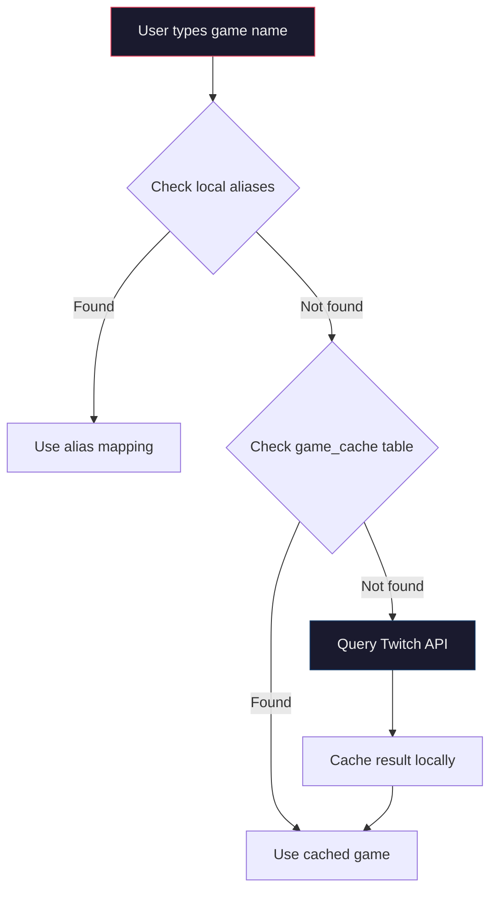
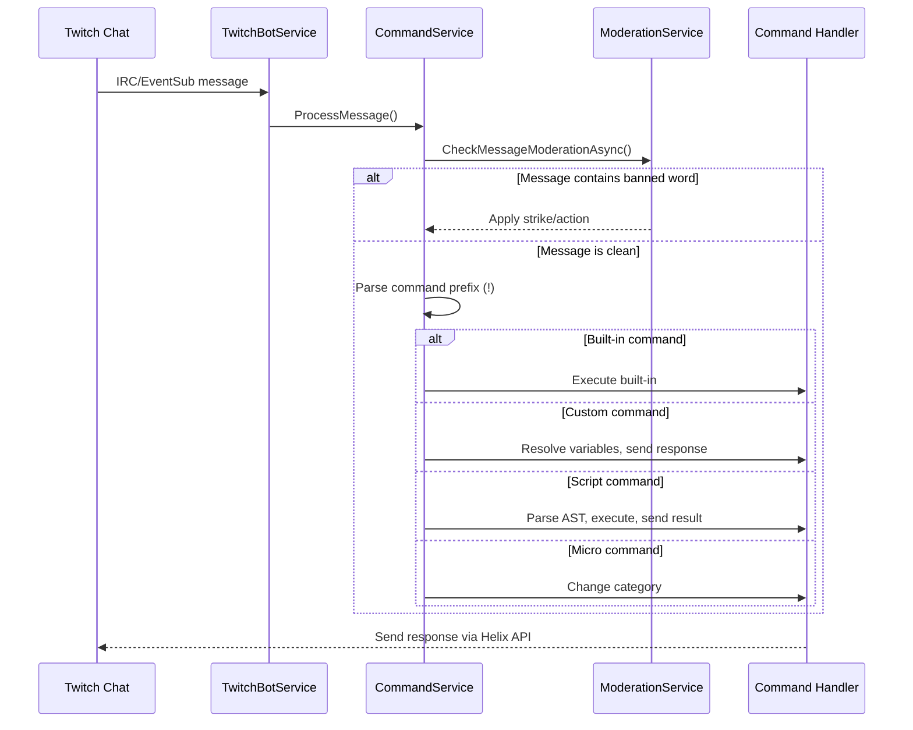

# Commands Reference

Complete reference for all Decatron v2 bot commands, the custom commands system, scripting engine, and micro commands.

---

## Table of Contents

- [Built-in Commands](#built-in-commands)
- [Timer Commands](#timer-commands)
- [Custom Commands](#custom-commands)
- [Scripting System](#scripting-system)
- [Micro Commands](#micro-commands)
- [Moderation System](#moderation-system)
- [Giveaway Commands](#giveaway-commands)
- [Goals Commands](#goals-commands)
- [Permission Levels](#permission-levels)
- [Architecture](#architecture)

---

## Built-in Commands

These commands are registered at startup by `CommandService` and are always available when the bot is enabled for a channel.

### General Commands

| Command | Aliases | Description | Permission | Example |
|---------|---------|-------------|------------|---------|
| `!hola` | -- | Interactive greeting from the bot | Everyone | `!hola` |
| `!followage` | -- | Shows how long the user has been following the channel | Everyone | `!followage` |
| `!ia [question]` | -- | Ask Decatron's AI a question (has per-channel and per-user cooldown) | Configurable per channel | `!ia What game should I play next?` |

### Stream Info Commands

| Command | Aliases | Description | Permission | Example |
|---------|---------|-------------|------------|---------|
| `!title` | `!t` | View current stream title (no args) or change it (with args) | View: Everyone / Change: Mod/Broadcaster | `!title` or `!title New Title Here` |
| `!game` | -- | View current category (no args) or change it (with args) | View: Everyone / Change: Mod/Broadcaster | `!game` or `!game Fortnite` |
| `!g` | -- | Advanced category management with micro command support | View: Everyone / Manage: Mod/Broadcaster | See below |

#### `!g` Subcommands

| Syntax | Description | Example |
|--------|-------------|---------|
| `!g` | View current stream category | `!g` |
| `!g [name]` | Change stream category | `!g League of Legends` |
| `!g set [!cmd] [category]` | Create a micro command shortcut | `!g set !lol League of Legends` |
| `!g remove [!cmd]` | Remove a micro command | `!g remove !lol` |
| `!g list` | List all micro commands for this channel | `!g list` |

### Shoutout Command

| Command | Description | Permission | Example |
|---------|-------------|------------|---------|
| `!so @user` | Shoutout a user -- shows their latest clip and profile in the overlay | Mod/Broadcaster | `!so @streamer_name` |

### Command Creation

| Command | Description | Permission | Example |
|---------|-------------|------------|---------|
| `!crear` | Create custom commands directly from chat | Everyone (internal validation) | `!crear !discord Join our Discord: https://...` |

---

## Timer Commands

These commands control the Timer Extension overlay (subathon-style visual timer). All timer commands use the `!d` prefix.

### Timer Control Commands

| Command | Description | Permission | Example |
|---------|-------------|------------|---------|
| `!dstart [duration]` | Start the timer with a duration (in seconds, or formatted) | Mod/Broadcaster | `!dstart 3600` |
| `!dpause` | Pause the running timer | Mod/Broadcaster | `!dpause` |
| `!dplay` | Resume a paused timer | Mod/Broadcaster | `!dplay` |
| `!dreset` | Reset the timer to its initial duration | Mod/Broadcaster | `!dreset` |
| `!dstop` | Stop and end the timer session | Mod/Broadcaster | `!dstop` |
| `!dtimer` | Advanced timer management (add/remove time) | Mod/Broadcaster | `!dtimer +300` or `!dtimer -60` |

### Timer Query Commands

| Command | Description | Permission | Example |
|---------|-------------|------------|---------|
| `!dtiempo` | Check how much time is left on the timer | Everyone | `!dtiempo` |
| `!dcuando` | Check when the timer will end | Everyone | `!dcuando` |
| `!dstats` | View timer statistics for the current session | Everyone | `!dstats` |
| `!drecord` | View the timer record (longest session) | Everyone | `!drecord` |
| `!dtop` | View the top timer times/contributors | Everyone | `!dtop` |

---

## Custom Commands

Custom commands let streamers create text-response commands with variable support, configurable via the web panel or through `!crear` in chat.

### Creating Custom Commands

**From the web panel:**

1. Navigate to **Dashboard > Commands > Custom Commands**.
2. Click "Create Command".
3. Fill in the command name (e.g., `!discord`), response text, and access level.
4. Save.

**From chat:**

```
!crear !commandname Response text here
```

### Access Levels

| Level | Who Can Use |
|-------|-------------|
| `all` | Everyone in chat |
| `mod` | Moderators and broadcaster only |
| `vip` | VIPs, moderators, and broadcaster |
| `sub` | Subscribers, moderators, and broadcaster |

### Template Variables

Custom command responses support template variables that are resolved at runtime by `VariableResolver`:

| Variable | Description | Example Output |
|----------|-------------|----------------|
| `{user}` or `$(user)` | The username who triggered the command | `viewer123` |
| `{channel}` or `$(channel)` | The channel name | `streamer_name` |
| `{game}` or `$(game)` | Current stream category | `Fortnite` |
| `{uptime}` or `$(uptime)` | Current stream uptime | `2h 34m` |
| `{touser}` or `$(touser)` | The target user (first argument) | `target_user` |
| `{count}` | Number of times the command has been used | `42` |

### Custom Commands API

| Method | Endpoint | Description |
|--------|----------|-------------|
| `GET` | `/api/CustomCommands` | List all custom commands for the active channel |
| `GET` | `/api/CustomCommands/{id}` | Get a specific command by ID |
| `POST` | `/api/CustomCommands` | Create a new custom command |
| `PUT` | `/api/CustomCommands/{id}` | Update an existing custom command |
| `DELETE` | `/api/CustomCommands/{id}` | Delete a custom command |

### Import/Export

The web panel supports JSON import and export of custom commands, allowing backup and migration between channels.

---

## Scripting System

Decatron includes a proprietary scripting language (DSL) for creating advanced bot commands with conditional logic, variables, and functions.

### Overview

The scripting engine pipeline:


### Syntax Reference

The scripting language supports three statement types: `set`, `when...then...end`, and `send`.

#### `set` -- Variable Assignment

```
set variable = value
set resultado = roll(1, 6)
set elegido = pick("piedra, papel, tijera")
```

#### `when...then...end` -- Conditional Logic

```
when $(resultado) >= 4 then
    send "You rolled a $(resultado) -- you win!"
end
when $(resultado) < 4 then
    send "You rolled a $(resultado) -- you lose!"
end
```

Conditions support cascading `when` blocks (similar to if-else-if).

#### `send` -- Output to Chat

```
send "Hello $(user), welcome to $(channel)!"
```

### Complete Script Example

```
set dice = roll(1, 6)
set prize = pick("cookie, gold star, high five, nothing")

when $(dice) >= 5 then
    send "$(user) rolled a $(dice) and wins a $(prize)! Amazing!"
end
when $(dice) >= 3 then
    send "$(user) rolled a $(dice) -- not bad! Here's a consolation $(prize)."
end
when $(dice) < 3 then
    send "$(user) rolled a $(dice)... better luck next time!"
end
```

### Built-in Variables

| Variable | Description |
|----------|-------------|
| `$(user)` | Username of the person who triggered the command |
| `$(channel)` | Channel name where the command was executed |
| `$(game)` | Current stream category |
| `$(uptime)` | Current stream uptime |
| `$(ruser)` | A random user from chat |
| `$(touser)` | The target user (first argument after the command) |

### Built-in Functions

| Function | Description | Example |
|----------|-------------|---------|
| `roll(min, max)` | Generate a random integer between min and max (inclusive) | `roll(1, 100)` |
| `pick("a, b, c")` | Pick a random item from a comma-separated list | `pick("yes, no, maybe")` |
| `count()` | Get the execution count for the current command (persistent counter) | `count()` |

### Script Management

**Web panel:** Navigate to **Dashboard > Commands > Scripting** to use the dedicated editor with:
- Syntax highlighting (Prism.js with custom DecatronScript grammar)
- Real-time validation
- Preview with simulated data
- Autocomplete support
- Undo/redo

**API endpoints:**

| Method | Endpoint | Description |
|--------|----------|-------------|
| `GET` | `/api/scripts` | List scripts for the active channel |
| `GET` | `/api/scripts/{id}` | Get a specific script |
| `POST` | `/api/scripts/validate` | Validate script syntax without saving |
| `POST` | `/api/scripts/preview` | Run script with simulated data |
| `POST` | `/api/scripts` | Create a new script |
| `PUT` | `/api/scripts/{id}` | Update an existing script |
| `DELETE` | `/api/scripts/{id}` | Delete a script |

### AST Node Types

The parser generates an Abstract Syntax Tree with these node types:

| Node | Description |
|------|-------------|
| `ScriptProgram` | Root node containing all statements |
| `SetStatement` | Variable assignment (`set x = value`) |
| `WhenStatement` | Conditional block (`when...then...end`) |
| `SendStatement` | Chat output (`send "message"`) |
| `BinaryExpression` | Comparison/arithmetic (`a >= b`) |
| `FunctionCallExpression` | Function invocation (`roll(1, 6)`) |
| `VariableExpression` | Variable reference (`$(user)`) |
| `LiteralExpression` | String or number literal |

### Supported Operators

| Operator | Description |
|----------|-------------|
| `==` | Equal to |
| `!=` | Not equal to |
| `>` | Greater than |
| `<` | Less than |
| `>=` | Greater than or equal to |
| `<=` | Less than or equal to |

---

## Micro Commands

Micro commands are channel-specific shortcut commands that quickly change the stream category.

### How They Work

1. A moderator or broadcaster creates a micro command mapping a `!command` to a game/category name.
2. When anyone with the appropriate permission types the command in chat, the bot changes the stream category.

### Creating Micro Commands

**From chat:**
```
!g set !lol League of Legends
!g set !apex Apex Legends
!g set !mc Minecraft
```

**From the web panel:**
Navigate to **Dashboard > Commands > Micro Commands** and use the autocomplete game search to select the correct category.

### Managing Micro Commands

| Action | Chat Syntax | Web Panel |
|--------|------------|-----------|
| Create | `!g set !cmd Category Name` | Create button + game autocomplete |
| Remove | `!g remove !cmd` | Delete button on the list |
| List all | `!g list` | Full list with search |

### Reserved Words

The following command names cannot be used as micro commands:

`!g`, `!game`, `!set`, `!remove`, `!delete`, `!list`, `!help`, `!title`, `!t`

### Game Search System

The micro commands system uses a hybrid game search:



### Micro Commands API

| Method | Endpoint | Description |
|--------|----------|-------------|
| `GET` | `/api/commands/microcommands` | List all micro commands |
| `POST` | `/api/commands/microcommands` | Create or update a micro command |
| `PUT` | `/api/commands/microcommands/{id}` | Update a micro command |
| `DELETE` | `/api/commands/microcommands/{id}` | Delete a micro command |
| `GET` | `/api/commands/microcommands/search/{command}` | Search for a micro command |
| `GET` | `/api/commands/microcommands/check-availability/{command}` | Check if a command name is available |
| `GET` | `/api/commands/microcommands/search-games?q=&limit=` | Search games (autocomplete) |

---

## Moderation System

The bot includes a real-time chat moderation system with banned words detection and an escalating strike system.

### Banned Words

- Up to 500 banned words/phrases per channel
- Three severity levels: **light**, **medium**, **severe**
- Wildcard support with `*` (e.g., `bad*word` matches `bad_word`, `badXword`, etc.)

### Strike Escalation

| Strike Level | Default Action |
|--------------|----------------|
| 1 | Warning message |
| 2 | Delete message |
| 3 | Timeout (configurable duration) |
| 4 | Longer timeout |
| 5 | Ban |

Strikes have configurable expiration (5 minutes to never).

### Immunity Rules

| Role | Default Immunity |
|------|-----------------|
| Broadcaster | Always immune |
| Moderators | Always immune |
| VIPs | Configurable (full immunity or escalation) |
| Subscribers | Configurable (full immunity or escalation) |
| Whitelisted users | Always immune |

### Moderation API

| Method | Endpoint | Description |
|--------|----------|-------------|
| `GET` | `/api/moderation/banned-words` | List banned words |
| `POST` | `/api/moderation/banned-words` | Add a banned word |
| `DELETE` | `/api/moderation/banned-words/{id}` | Remove a banned word |
| `POST` | `/api/moderation/banned-words/import` | Import words from JSON |
| `GET` | `/api/moderation/config` | Get moderation config |
| `POST` | `/api/moderation/config` | Update moderation config |
| `POST` | `/api/moderation/test-message` | Test a message against banned words |
| `GET` | `/api/moderation/stats` | Get daily moderation stats |

---

## Giveaway Commands

Giveaway participation is handled through chat commands.

| Command | Description | Example |
|---------|-------------|---------|
| `!join` (default, configurable) | Join an active giveaway | `!join` |

The join command name is configurable per giveaway. Participation requirements (follower, subscriber, watch time, account age, etc.) are validated server-side.

---

## Goals Commands

| Command | Description | Permission | Example |
|---------|-------------|------------|---------|
| `!meta` | View current goal progress | Everyone | `!meta` |
| `!meta reset` | Reset a goal to zero | Mod/Broadcaster | `!meta reset` |
| `!meta add N` | Add N points to the active goal | Mod/Broadcaster | `!meta add 5` |
| `!meta set N` | Set the goal progress to an absolute value | Mod/Broadcaster | `!meta set 50` |

---

## Permission Levels

Decatron uses a hierarchical permission system with three levels:

| Level | Numeric Value | Description |
|-------|--------------|-------------|
| `commands` | 1 | Basic command access |
| `moderation` | 2 | Moderation tools + all of commands |
| `control_total` | 3 | Full control + all of moderation |

### Section Permission Map

| Dashboard Section | Minimum Permission Required |
|-------------------|-----------------------------|
| Commands | `commands` |
| Custom Commands | `commands` |
| Scripting | `commands` |
| Micro Commands | `commands` |
| Game Command | `commands` |
| Moderation | `moderation` |
| Sound Alerts | `moderation` |
| Event Alerts | `moderation` |
| Overlays | `moderation` |
| Timers | `moderation` |
| Giveaways | `moderation` |
| Settings | `control_total` |
| User Management | `control_total` |

---

## Architecture

### Command Processing Flow



### Message Sending

All bot messages are sent through `MessageSenderService`, which:
- Uses the Twitch Helix API (`POST /helix/chat/messages`)
- Implements a concurrent queue with rate limiting (100ms between messages)
- Resolves broadcaster ID, bot Twitch ID, and access token per channel

### Internationalization

Bot command responses support two languages (Spanish and English), managed by `CommandMessagesService` with a hardcoded dictionary and `string.Format` templates. The `CommandTranslationService` provides command metadata (name, description, aliases, usage examples) in both languages for the web panel UI.
