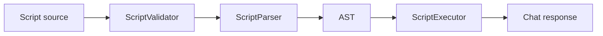
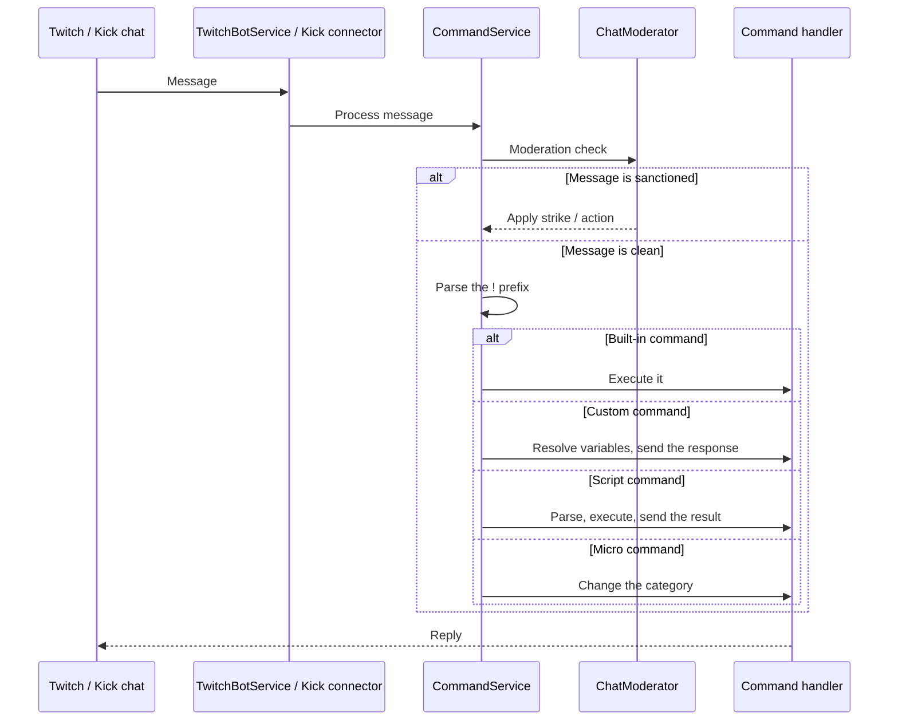

# Commands Reference

> Español: [es/COMMANDS.md](es/COMMANDS.md)

Reference for the Decatron bot commands: the built-in commands, custom commands, the scripting language, micro commands and the commands of the main modules. Descriptions of the built-in commands come from `Resources/bot-metadata/{en,es}.json`, the same source the dashboard and the public docs read.

---

## Table of Contents

- [Built-in Commands](#built-in-commands)
- [Timer Commands](#timer-commands)
- [Custom Commands](#custom-commands)
- [Scripting System](#scripting-system)
- [Micro Commands](#micro-commands)
- [Song Request Commands](#song-request-commands)
- [Wheel and Raffle Commands](#wheel-and-raffle-commands)
- [Roulette Command](#roulette-command)
- [Moderation Commands and System](#moderation-commands-and-system)
- [Giveaway Commands](#giveaway-commands)
- [Gacha, Spirits and Other Commands](#gacha-spirits-and-other-commands)
- [Permission Levels](#permission-levels)
- [Architecture](#architecture)

---

## Built-in Commands

Registered at startup by `CommandService`; they are available when the bot is enabled for a channel. The "Who can use it" column appears only where it was checked in the command's code.

### Stream info

| Command | Aliases | Description | Who can use it | Example |
|---------|---------|-------------|----------------|---------|
| `!title` | `!t` | Change or check the stream title | Check: everyone. Change: streamer and moderators | `!title`, `!title New stream title` |
| `!game` | `!g` | Change or check the stream category/game | Check: everyone. Change: streamer and moderators | `!game`, `!game Just Chatting` |
| `!g` | | Category and micro command management (see below) | | `!g`, `!g Just Chatting` |

On Kick, `!title` and `!game` are marked "coming soon": Kick exposes the API needed, but the work is not done yet.

#### `!g` subcommands

| Syntax | Description | Example |
|--------|-------------|---------|
| `!g` | View the current category | `!g` |
| `!g [name]` | Change the category | `!g League of Legends` |
| `!g set [!cmd] [category]` | Create a micro command | `!g set !lol League of Legends` |
| `!g remove [!cmd]` | Remove a micro command | `!g remove !lol` |
| `!g list` | List this channel's micro commands | `!g list` |

### Community

| Command | Description | Who can use it | Example |
|---------|-------------|----------------|---------|
| `!so` | Shoutout a user, showing their latest clip and profile in the overlay | Streamer and moderators | `!so @username` |
| `!followage` | Shows how long you have been following the channel | Everyone | `!followage`, `!followage @user` |
| `!ia` | Ask Decatron AI | Set by the channel's AI configuration (per-channel and per-user cooldown) | `!ia give me a fun fact` |
| `!raffle` | Chat raffle: `join`, `create <name>`, `close`, `draw`, `status` | Create, close, draw: streamer and moderators. Join and status: everyone | `!raffle join` |
| `!join` | Join the active giveaway | Set by the giveaway configuration | `!join` |
| `!watchtime` | Shows how long you have been watching the current stream (resets when the stream ends) | | `!watchtime` |
| `!commands` | Posts the link to the channel's public commands page (`/commands/{channel}`) | | `!commands` |

On Kick, `!followage` and `!so` are not available: Kick's public API has no follower date or clips.

### Games and LoL Coach

Commands of the Game Overlays and LoL Coach modules. They read the same state the overlay shows.

| Command | Aliases | Description | Who can use it |
|---------|---------|-------------|----------------|
| `!rango` | `!rank` | The streamer's current rank in the game being played | |
| `!lp` | `!puntos` | Points (LP/RR/ELO) won or lost during today's stream | |
| `!sesion` | `!session` | Wins and losses of today's stream | |
| `!ultimas` | `!recent` | The streamer's recent matches with KDA | |
| `!cuentas` | `!accounts` | The streamer's accounts in the current game and their rank | |
| `!juego` | | Force the overlay game, or go back to automatic (`!juego lol`, `!juego auto`) | Streamer and moderators |
| `!setrango` | | Manually set the visible account's rank, for games without an API | Streamer and moderators |
| `!rankup`, `!rankdown` | | Step the manual rank up or down one division | Streamer and moderators |
| `!win`, `!loss` | | Add a win or a loss to today's session | Streamer and moderators |
| `!matchup` | | Current lane matchup according to the LoL Coach (Decatron Desktop) | |
| `!build` | `!runas` | Runes, spells and first items suggested by the LoL Coach | |
| `!coach` | | The latest thing the LoL Coach said, or the post-game review | Everyone, 30 s between uses except moderators |
| `!vs` | | The streamer's record against a champion (direct opponent, last 60 games) | |
| `!duo` | | The streamer's record with the current lobby duo, someone specific, or the most frequent duos | |
| `!pool` | | The streamer's champion pool with win rate | |
| `!meta` | | Today's goal: view (everyone) or set (`!meta <text>`, `!meta off`) | View: everyone. Set: streamer and moderators |
| `!pred` | | Predict whether the streamer wins or loses the current LoL game, with channel prediction points (`!pred win 200`) | |
| `!predtop` | | Channel prediction points top 5 | |

### Custom command management

| Command | Description | Who can use it | Example |
|---------|-------------|----------------|---------|
| `!crear` | Create a custom command (plain or scripted) from chat | Streamer, moderators and platform admins | `!crear !discord Join our Discord` |
| `!editcom` | Edit an existing custom command | Streamer, moderators and platform admins | `!editcom !discord New text` |
| `!delcom` | Delete an existing custom command | Streamer, moderators and platform admins | `!delcom !discord` |

---

## Timer Commands

These commands control the Timer Extension overlay. All use the `!d` prefix.

### Control (streamer and moderators)

| Command | Description | Example |
|---------|-------------|---------|
| `!dstart` | Start the timer with a specific duration | `!dstart 5m`, `!dstart 1h30m`, `!dstart 300` |
| `!dpause` | Pause the current timer | `!dpause` |
| `!dplay` | Resume or start the paused timer | `!dplay` |
| `!dreset` | Reset the timer to the configured total time | `!dreset` |
| `!dstop` | Stop the timer completely and hide it from the overlay | `!dstop` |
| `!dtimer` | Manage the timer: start, add or remove time | `!dtimer 5m`, `!dtimer add 1h`, `!dtimer remove 30s` |

### Query

| Command | Description |
|---------|-------------|
| `!dtiempo` | How much time is left on the timer |
| `!dcuando` | When the timer will end |
| `!dstats` | Statistics of the current session |
| `!drecord` | The timer record |
| `!dtop` | Top timer contributors |

---

## Custom Commands

Custom commands are text-response commands with variable support, created from the dashboard (Commands > Custom) or from chat with `!crear`.

### Creating

**From the dashboard:** Commands > Custom, create the command, give it a name (for example `!discord`), a response and an access level.

**From chat:**

```
!crear !commandname Response text here
```

### Access levels

The `Restriction` of a command:

| Level | Who can use it |
|-------|----------------|
| `all` | Everyone |
| `mod` | Moderators and the streamer |
| `vip` | VIPs, moderators and the streamer |
| `sub` | Subscribers, moderators and the streamer |

### Variables

Responses are resolved by `VariableResolver`. Variables use the `$(name)` form:

| Variable | Description |
|----------|-------------|
| `$(user)` | The user who ran the command |
| `$(touser)` | The user mentioned in the command; the sender if nobody is mentioned |
| `$(ruser)` | A random user from the chat (uses the Twitch API) |
| `$(channel)` | The channel name |
| `$(game)` | The current category |
| `$(uptime)` | How long the stream has been live |
| `$(followage)` | How long the first argument (or the sender) has followed the channel |
| `$(accountage)` | Age of the Twitch account of the first argument (or the sender) |
| `$(count)` | Advanced counter. Everyone can view and increment it; only moderators can use set/reset |
| `$(uses)` | Simple counter that increments each time the command is used |
| `$(roll)` | Random number, 1-100 by default; `$(roll:min-max)` sets the range |
| `$(flip)` | Coin flip |
| `$(8ball)` | Magic 8-ball with 20 answers in Spanish |
| `$(choice:a,b,c)` | Random choice among options separated by comma or `\|` |
| `$(percent)` | Random percentage from 0 to 100 |
| `$(time)`, `$(date)` | Current time or date; `$(time:format)` and `$(date:format)` set the format |

The same variables are listed, with examples, in the public docs at `/docs/variables`.

### Custom Commands API

| Method | Endpoint | Description |
|--------|----------|-------------|
| `GET` | `/api/CustomCommands` | List the active channel's custom commands |
| `GET` | `/api/CustomCommands/{id}` | Get a command |
| `POST` | `/api/CustomCommands` | Create a command |
| `PUT` | `/api/CustomCommands/{id}` | Update a command |
| `DELETE` | `/api/CustomCommands/{id}` | Delete a command |

The dashboard also supports JSON import and export of custom commands.

---

## Scripting System

Decatron includes a small scripting language for advanced commands, with conditional logic, variables and functions.

### Pipeline


```mermaid
flowchart LR
    A[Script source] --> B[ScriptValidator]
    B --> C[ScriptParser]
    C --> D[AST]
    D --> E[ScriptExecutor]
    E --> F[Chat response]
```

### Syntax

The language has three statements: `set`, `when...then...end` and `send`.

```
set variable = value
set result = roll(1, 6)
set choice = pick("rock, paper, scissors")

when $(result) >= 4 then
    send "You rolled a $(result): you win!"
end
when $(result) < 4 then
    send "You rolled a $(result): you lose!"
end

send "Hello $(user), welcome to $(channel)!"
```

`when` blocks are evaluated one after another; chain several to get if / else-if behavior.

### Functions

| Function | Description | Example |
|----------|-------------|---------|
| `roll(min, max)` | Random integer between `min` and `max`. `min` must be lower than `max` | `roll(1, 100)` |
| `pick("a, b, c")` | A random item from a comma-separated list | `pick("yes, no, maybe")` |
| `count()` | Execution count of the current command (persistent counter) | `count()` |

### Operators

`==`, `!=`, `>`, `<`, `>=`, `<=`, `+` and `-`.

### Script management

In the dashboard (Commands > Scripting) the editor offers syntax highlighting, live validation, a preview with simulated data, autocomplete and undo/redo.

| Method | Endpoint | Description |
|--------|----------|-------------|
| `GET` | `/api/scripts` | List the active channel's scripts |
| `GET` | `/api/scripts/{id}` | Get a script |
| `POST` | `/api/scripts/validate` | Validate syntax without saving |
| `POST` | `/api/scripts/preview` | Run a script with simulated data |
| `POST` | `/api/scripts` | Create a script |
| `PUT` | `/api/scripts/{id}` | Update a script |
| `DELETE` | `/api/scripts/{id}` | Delete a script |

### AST node types

`ScriptProgram` (root), `SetStatement`, `WhenStatement`, `SendStatement`, `BinaryExpression`, `FunctionCallExpression`, `VariableExpression`, `LiteralExpression`.

---

## Micro Commands

Micro commands are channel-specific shortcuts that change the stream category.

1. A moderator or the streamer maps a `!command` to a game/category name.
2. When someone with permission types it, the bot changes the category.

```
!g set !lol League of Legends
!g set !apex Apex Legends
!g set !mc Minecraft
```

| Action | Chat syntax | Dashboard |
|--------|-------------|-----------|
| Create | `!g set !cmd Category Name` | Create button with game autocomplete |
| Remove | `!g remove !cmd` | Delete button |
| List | `!g list` | Full list with search |

### Reserved words

These names cannot be used as micro commands: `!g`, `!game`, `!set`, `!remove`, `!delete`, `!list`, `!help`, `!title`, `!t`.

### Game search

Game names are resolved with a hybrid search: local aliases first, then the `game_cache` table, then the Twitch API (and the result is cached locally).

### Micro Commands API

| Method | Endpoint | Description |
|--------|----------|-------------|
| `GET` | `/api/commands/microcommands` | List micro commands |
| `POST` | `/api/commands/microcommands` | Create or update a micro command |
| `PUT` | `/api/commands/microcommands/{id}` | Update a micro command |
| `DELETE` | `/api/commands/microcommands/{id}` | Delete a micro command |
| `GET` | `/api/commands/microcommands/search/{command}` | Search for a micro command |
| `GET` | `/api/commands/microcommands/check-availability/{command}` | Check whether a name is available |
| `GET` | `/api/commands/microcommands/search-games?q=&limit=` | Game autocomplete |

---

## Song Request Commands

Song Request lets viewers request songs from chat on Twitch and Kick, or from the public page `/sr/{channel}`. A request accepts a YouTube, SoundCloud, Spotify, Deezer or Apple Music link, or a song name. Songs go to a queue that plays in an OBS overlay (see [Song Request Overlay](OVERLAYS.md#song-request-overlay)).

The commands below are generated from the same source the dashboard and the public page use. **Default access** is the minimum role: that role and the ones above it can use the command, and anyone with full control on the dashboard counts as the streamer. Each channel can change it in the dashboard (Overlays → Song Request → Commands).

#### Request and check

| Command | Default access | Description |
|---|---|---|
| `!sr <link or name>` | Everyone | Requests a song with a YouTube, Spotify, SoundCloud, Deezer or Apple Music link, or by typing its name. (Also: `!songrequest`) |
| `!sr #<number>` | Everyone | Requests to the queue, by its number, a song from the background playlist. |
| `!wrongsong` | Everyone | Removes your last request from the queue, in case you got it wrong. |
| `!song` | Everyone | Says which song is playing, with the link. (Also: `!currentsong`) |
| `!lastsong` | Everyone | Says which song played before, with the link. (Also: `!prevsong`) |
| `!queue` | Everyone | Shows the next songs and the link to the queue. |
| `!myqueue` | Everyone | Says where your requests are in the queue. |
| `!skip` | Everyone | Votes to skip the song that's playing (request or playlist); it's skipped with 3 votes. |
| `!srvolume` | Everyone | Says the music volume. |

#### Background playlist

| Command | Default access | Description |
|---|---|---|
| `!pl` | Everyone | Says which playlist is in the background and which number is playing. |
| `!playlist [name]` | Everyone | Gives the link to listen to the channel's public playlists; with a name, that playlist's link. |
| `!plplay <playlist \| #number>` | Lead Mods+ | With a name, sets that playlist as background (it plays when there are no requests). With #number it jumps right away to that song of the background playlist; if a request is playing, right after it. They can be combined: !plplay chill #19. (Also: `!srplay`) |
| `!plstop` | Lead Mods+ | Stops the background playlist: when the queue is empty nothing plays. !plplay off works too. |
| `!plnext` | Mods+ | Moves to the next song of the background playlist. It doesn't skip requests (use !skip). |
| `!plshuffle [on \| off]` | Lead Mods+ | The background playlist plays in random order (on) or in order (off); with nothing, it toggles. |
| `!pladd <playlist> <link or name>` | Per playlist | Adds a song to a collaborative playlist. If only one is open, the playlist name isn't needed. Each playlist decides who can add. |

#### Player

They work on whatever is playing: requests and the background playlist.

| Command | Default access | Description |
|---|---|---|
| `!skip` | Mods+ | Skips the song that's playing (request or playlist), without a vote. (Also: `!srskip`, `!srnext`) |
| `!srpause · !srresume` | Lead Mods+ | Pauses or resumes the music. The overlay stays visible; !srresume also leaves a stop. |
| `!srstop` | Lead Mods+ | Silence and overlay hidden, without losing the song or the queue. !srresume shows it again and continues where it left off. New requests don't resume it by themselves. |
| `!srvolume <0-100>` | Lead Mods+ | Changes the music volume. |
| `!srvideo · !srcover` | Lead Mods+ | The player shows the video or the cover, without stopping the music. |

#### Queue

| Command | Default access | Description |
|---|---|---|
| `!srclear` | Lead Mods+ | Clears the request queue. The one playing keeps going and anything waiting for review is untouched. |
| `!srremove <position>` | Mods+ | Removes the request at that queue position. |
| `!srpromote <position>` | Mods+ | Moves the request at that position to the front of the queue. |

#### Review

| Command | Default access | Description |
|---|---|---|
| `!srapprove [number]` | Mods+ | Approves what is waiting for review by its number in the inbox; with no number, the oldest. |
| `!srreject [number]` | Mods+ | Rejects what is waiting for review by its number in the inbox; with no number, the oldest. |

#### Manage

| Command | Default access | Description |
|---|---|---|
| `!srmode <open \| playlists \| review \| closed>` | Lead Mods+ | Changes the request mode instantly: open, playlists only, with review or closed. With nothing, says the current mode. (Also: `abiertos`, `revisión`, `cerrados`) |
| `!sropen · !srclose` | Lead Mods+ | Opens or closes requests. |
| `!srban [@user]` | Lead Mods+ | With nothing, bans the song that's playing and skips it; with @user, bans that person. |
| `!srunban @usuario` | Lead Mods+ | Lifts a user's ban so they can request again. Song and artist bans are lifted in the dashboard. |

#### Request modes

`!srmode <open | playlists | review | closed>` changes how `!sr` requests come in:

| Mode | Behavior |
|------|----------|
| `open` | Any song that passes the filters is accepted |
| `playlists` | Only songs from the channel's playlists (and `!sr #number`) |
| `review` | Each request waits for a moderator to approve it (`!srapprove` / `!srreject`) |
| `closed` | No requests are accepted |

The full user guide (setup, filters, playlists, design) lives in the dashboard documentation under Song Request.

---

## Wheel and Raffle Commands

The Wheel module has two wheel types: **prize wheels** (viewers earn spins with credits and win the prize of the segment that comes up) and **raffle wheels** (viewers sign up and the wheel picks a winner). The bot decides the result; the overlay (see [Wheel Overlay](OVERLAYS.md#wheel-overlay)) only animates it.

These are the default names. The spin, balance, buy and sign-up commands can be renamed per wheel in the dashboard; the moderation ones are fixed.

| Command | Access | Description |
|---------|--------|-------------|
| `!dgirar` | Everyone | Spins the wheel and charges the spin price in credits. `!dgirar 5` spins several times in a row (up to the configured maximum) and is charged together |
| `!dcreditos` | Everyone | Shows the sender's credit balance |
| `!dcomprar <coins>` | Everyone | Exchanges the sender's deca coins for credits. Only answers if the "Deca coins" source is on and the sender has a Decatron account |
| `!djoin` | Everyone | Signs the sender up for the raffle while sign-ups are open |
| `!drueda abrir` | Mods, Lead Moderators, streamer | Opens sign-ups and announces the join command |
| `!drueda cerrar` | Mods, Lead Moderators, streamer | Closes sign-ups |
| `!drueda sortear` | Mods, Lead Moderators, streamer | Draws and announces the winner (one message per winner) |
| `!drueda reset` | Mods, Lead Moderators, streamer | Empties the pool of entrants without announcing it |

Credits come from bits, gifted subs, donations, channel point rewards or deca coins, with a configurable price per spin, anti-farming caps (wait between spins, spins per viewer per stream) and spin rules (no repeat, pity, multi-spin). Prize types: no prize, manual message, free spins, gacha pulls, timer time, timeout and sound alert. Raffles support tickets, a credit cost, requirements (subs, followers, minimum watchtime) and weights (watchtime, sub, supporter tier, coins spent). The full user guide lives in the dashboard documentation under Wheel.

---

## Roulette Command

`!ruleta` is a Russian-roulette style chat mini-game, separate from the Wheel. The sender aims at themselves (`!ruleta`) or at another user (`!ruleta @user`), and there is a configurable chance (17% by default) of a timeout. The timeout is applied through the Twitch API, so the bot must be a moderator of the channel. Targeting a moderator requires the Twitch Lead Moderator role.

| Setting | Description |
|---------|-------------|
| Chance and timeout | Hit chance, and a minimum and maximum timeout in seconds (random between them) |
| Cooldowns | Global and per-user, in seconds |
| Permissions | Everyone, Subscribers, VIPs, Moderators, Lead Moderators or streamer only |
| Targets | Allow aiming at yourself; allow aiming at moderators (the bot removes the mod role, applies the timeout and restores it automatically) |
| Special users | Protected users can never be targeted; blocked users cannot use the command. The streamer is always immune |
| Messages | Several hit/miss messages (and separate self-target ones) with `{shooter}`, `{target}` and `{seconds}` |

---

## Moderation Commands and System

Chat moderation works on Twitch and Kick. **Every filter is turned on separately and starts off.** The streamer, Lead Moderators, moderators, the whitelist and anyone with full control of the channel in the dashboard are never sanctioned.

### Commands

The minimum role of each command is chosen in the dashboard (Moderation > Commands); the order is moderator < Lead Moderator < streamer (full control counts as streamer), and users who do not reach it are ignored silently. By default `!permit`, `!strikes` and `!nuke` need a moderator; `!resetstrikes`, `!addword`/`!delword`, `!addlink`/`!dellink` and `!panico` need a Lead Moderator. Lead Moderator is a Twitch role: on Kick it does not exist, so those commands are only usable by the owner or anyone with full control unless you lower the role. `!nuke` looks back 60 seconds by default (up to 300) and gives a 10-minute timeout, or a ban.

| Command | Description |
|---------|-------------|
| `!permit @user` | Lets a user's links through, for a time or for one message, as configured in the links filter |
| `!strikes @user` | Shows which strike a user is on and when the next one drops |
| `!resetstrikes @user` | Resets a user's strikes to 0 |
| `!addword <word or phrase> [leve\|medio\|severo]` | Adds a banned word (mild when no severity is given) |
| `!delword <word>` | Removes a banned word |
| `!addlink <domain>` | Allows a domain in the links filter |
| `!dellink <domain>` | Removes an allowed domain |
| `!nuke <phrase>` | Sanctions everyone who wrote that phrase in the last seconds. It does not touch the streamer, moderators, Lead Moderators or the whitelist |
| `!panico`, `!pánico`, `!panic` | Turns panic mode on (or extends it); `!panico off` turns it off. Not available on Kick |

### Filters

| Filter | What it does |
|--------|--------------|
| Banned words | Words and phrases with wildcard `*` (`*spam*` matches `spammer`, `antispam`), up to 500 per channel, with three severities: mild (normal escalation), medium (strike plus a 10 minute timeout at least) and severe (direct ban) |
| Links | Blocks links, including disguised ones (`site . com`, `site(dot)com`), except allowed domains (subdomains included) or someone with `!permit`. A blocked link is always deleted |
| Spam | Caps, symbols, emotes, long messages, repetition, copypasta, zalgo text and mass mentions, each with its own thresholds |
| Raids and bots | Panic mode, a new-accounts filter and bot phrases that sell viewers. On Kick only the bot-phrase filter works (the Kick API cannot change chat modes or report account age) |

### Strikes

Strikes escalate with the actions below by default; every step is configurable. Strikes drop one level after the configured time without infractions (default 15 minutes).

| Strike | Default action |
|--------|----------------|
| 1 | Warning |
| 2 | Timeout 1 minute |
| 3 | Timeout 5 minutes |
| 4 | Timeout 10 minutes |
| 5 | Ban |

VIPs and subscribers have **escalation** by default (they are sanctioned like anyone else) and can be set to full immunity. The history page lists every sanction with who applied it and lets you lift a timeout or ban and give the strike back.

Messages sent by the bot for each action can be customized with `$(user)`, `$(strike)` and `$(word)`.

### Moderation API

| Method | Endpoint | Description |
|--------|----------|-------------|
| `GET` | `/api/moderation/banned-words` | List banned words |
| `POST` | `/api/moderation/banned-words` | Add a banned word |
| `DELETE` | `/api/moderation/banned-words/{id}` | Remove a banned word |
| `POST` | `/api/moderation/banned-words/import` | Import words from JSON |
| `GET` | `/api/moderation/config` | Get moderation config |
| `POST` | `/api/moderation/config` | Update moderation config |
| `POST` | `/api/moderation/test-message` | Test a message against the filters |
| `GET` | `/api/moderation/stats` | Daily moderation stats |

---

## Giveaway Commands

| Command | Description | Example |
|---------|-------------|---------|
| `!join` (default, configurable) | Join the active giveaway | `!join` |

The join command name is configurable per giveaway. Entry requirements (follower, subscriber, watch time, account age and so on) are validated by the server.

---

## Gacha, Spirits and Other Commands

### Gacha (`!gacha`, short form `!gc`)

| Syntax | Description |
|--------|-------------|
| `!gacha` | Shows help |
| `!gacha pull [n]` (alias `!gcpull`) | Pull once or `n` times |
| `!gacha pulls [user]` (alias `!gcpulls`) | See available pulls |
| `!gacha col [user]` (alias `!gccol`) | See a collection |
| `!gacha pause` / `!gacha resume` (aliases `!gcpause`, `!gcresume`) | Pause or resume a multi-pull |

### Fortnite Spirits (`!spirits`, `!spirit`)

By default everything refers to the current season; `all` shows every season, and a season name filters that season.

| Syntax | Description |
|--------|-------------|
| `!spirits [@user] [all\|season]` | See progress |
| `!spirits top [all\|season]` | Global leaderboard (top 5) |
| `!spirits missing [@user] [all\|season]` | The first missing spirits |
| `!spirit <name>` | Mark a spirit as obtained |
| `!spirit remove <name>` | Unmark a spirit |

---

## Permission Levels

Decatron uses a hierarchical permission system for the dashboard, with three levels:

| Level | Value | Description |
|-------|-------|-------------|
| `commands` | 1 | Basic command access |
| `moderation` | 2 | Moderation tools plus everything in `commands` |
| `control_total` | 3 | Full control plus everything in `moderation` |

Sections (as defined in `PermissionService`):

| Level | Sections |
|-------|----------|
| `commands` | `commands`, `microcommands`, `title`, `game` |
| `moderation` | `overlays`, `timers`, `raffles`, `giveaways`, `loyalty`, `chatfilters`, `moderation` |
| `control_total` | `user_management`, `settings`, `spirits` |

The channel owner always has `control_total` on their own channel. Chat commands have their own checks (streamer, Lead Moderator, moderator, VIP, subscriber), described in each section above.

---

## Architecture

### Command processing


```mermaid
sequenceDiagram
    participant Chat as Twitch / Kick chat
    participant Bot as TwitchBotService / Kick connector
    participant Cmd as CommandService
    participant Mod as ChatModerator
    participant Handler as Command handler

    Chat->>Bot: Message
    Bot->>Cmd: Process message
    Cmd->>Mod: Moderation check
    alt Message is sanctioned
        Mod-->>Cmd: Apply strike / action
    else Message is clean
        Cmd->>Cmd: Parse the ! prefix
        alt Built-in command
            Cmd->>Handler: Execute it
        else Custom command
            Cmd->>Handler: Resolve variables, send the response
        else Script command
            Cmd->>Handler: Parse, execute, send the result
        else Micro command
            Cmd->>Handler: Change the category
        end
    end
    Handler-->>Chat: Reply
```

### Message sending

Bot messages go through `MessageSenderService` (Twitch) and `MessageSenderRouter` (platform routing). On Twitch they use the Helix API (`POST /helix/chat/messages`) through a queue with a 100 ms delay between messages.

### Internationalization

Command responses support Spanish and English through `CommandMessagesService`. `CommandTranslationService` provides the command metadata (description, aliases, usage examples) from `Resources/bot-metadata/{es,en}.json`, which the dashboard and the public docs also read.
