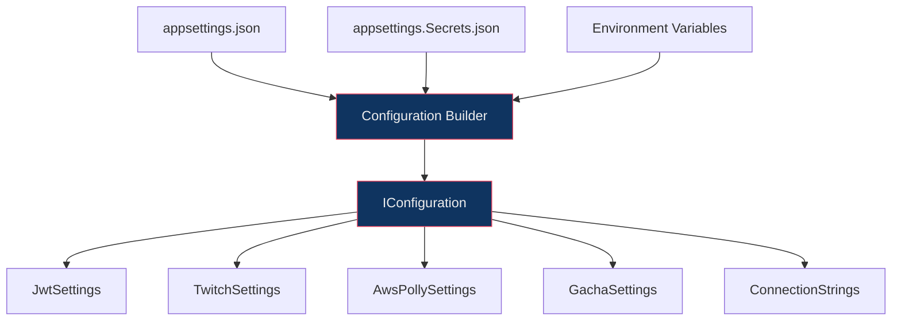
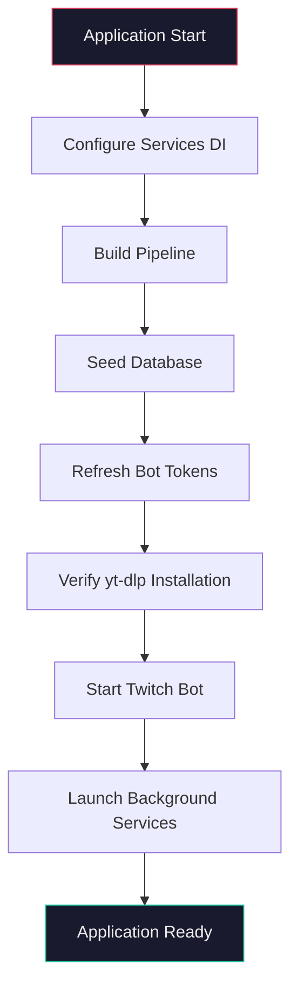
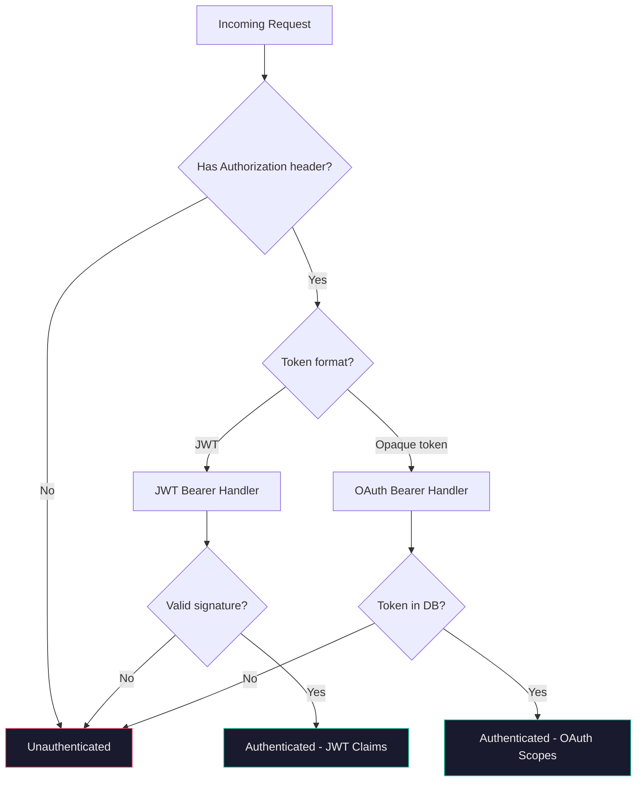

# Configuration Reference

> Español: [es/CONFIGURATION.md](es/CONFIGURATION.md)

Guide to configuring Decatron v2: configuration files, Twitch setup, database, integrations, sessions, permissions and logging. The complete list of settings (names, types, defaults) is in [ENV_VARIABLES.md](ENV_VARIABLES.md).

---

## Table of Contents

- [Overview](#overview)
- [Configuration Files](#configuration-files)
- [Settings Reference](#settings-reference)
- [Twitch Setup](#twitch-setup)
- [Database Setup](#database-setup)
- [AWS Polly (TTS)](#aws-polly-tts)
- [PayPal Integration](#paypal-integration)
- [Spotify Integration](#spotify-integration)
- [CORS and Static Files](#cors-and-static-files)
- [Background Services](#background-services)
- [Session and Authentication](#session-and-authentication)
- [Permission System](#permission-system)
- [Logging Configuration](#logging-configuration)

---

## Overview

Decatron v2 is built on ASP.NET Core 8 and uses a layered configuration system:

1. **`appsettings.json`** -- Public configuration (logging, allowed hosts, Twitch scopes)
2. **`appsettings.Secrets.json`** -- Private credentials (not committed to source control)
3. **`appsettings.Secrets.{Environment}.json`** -- Environment-specific overrides (staging, production)
4. **Environment variables** -- Standard ASP.NET Core pattern (`Section__Key`). Note that the two `appsettings.Secrets*` files are added after the default sources, so they win over environment variables; see the load order in [ENV_VARIABLES.md](ENV_VARIABLES.md#configuration-files-and-load-order)

Configuration is loaded at startup in `Program.cs` and bound to strongly-typed settings classes via `IOptions<T>`.


```mermaid
flowchart TD
    A[appsettings.json] --> D[Configuration Builder]
    B[appsettings.Secrets.json] --> D
    C[Environment Variables] --> D
    D --> E[IConfiguration]
    E --> F[JwtSettings]
    E --> G[TwitchSettings]
    E --> H[AwsPollySettings]
    E --> I[GachaSettings]
    E --> J[ConnectionStrings]

    style D fill:#0f3460,stroke:#e94560,color:#eee
    style E fill:#0f3460,stroke:#e94560,color:#eee
```

---

## Configuration Files

### appsettings.json (committed to repo)

This file contains non-sensitive settings that are safe to share. These are the top-level sections it holds today (the file itself is the source of truth):

| Section | Keys | Purpose |
|---------|------|---------|
| `TwitchSettings` | `Scopes` | Space-separated Twitch scopes requested at login (see [Twitch Setup](#twitch-setup)) |
| `Serilog` | `MinimumLevel`, `WriteTo`, `Enrich` | Console sink and rolling file sink `logs/decatron-.txt` (daily, 50 MB size limit, 14 files kept) |
| `Logging` | `LogLevel` | ASP.NET Core log levels |
| `AllowedHosts` | -- | Host filtering |
| `ClipSettings` | `DownloadsPath` | Folder where shoutout clips are stored; served under `/downloads` |
| `EventSubSettings` | `ShardCount` | Number of WebSocket shards of the EventSub conduit (default 1) |
| `LiveTranslation` | `SttModel`, `GeminiFallbackModel`, `SttCreditsPerSecond`, `MaxConcurrentChannels`, `MaxLanguagesPerChannel`, `LinkCodeMinutes`, `SmartSegmentation`, ..., `ClientTuning` | Live translation pipeline limits and client timing (hot-reloaded) |
| `WheelOfLuck` | `Enabled` | Master switch of the Wheel module |
| `Fortnite` | `CurrentSeason` | Season used by the Fortnite modules |
| `DecatronApi` | `BaseUrl`, `Enabled` | Optional link to the invoicing API |
| `TtsCredits` | `TransitionEndsAt` | End date of the TTS credits transition |
| `RiotApi` | (comments only) | Riot keys belong in the secrets file |

Binders such as `IOptionsMonitor` reload some of these sections without a restart (for example `LiveTranslation`).

### appsettings.Secrets.json (NOT in source control)

This file must be created manually on each deployment. It contains all credentials and connection strings.

---

## Settings Reference

[ENV_VARIABLES.md](ENV_VARIABLES.md) lists every setting the backend reads, grouped by purpose: database, Twitch, JWT, Kick, Discord, PayPal and Culqi, Spotify and Last.fm, AI providers, TTS and speech-to-text, live translation, games, Song Request, tournaments, trading cards, emotes, brand, e-mail and invoicing, CORS origins and physical paths.

Only three groups are needed to start the bot: the database connection string (`ConnectionStrings:DefaultConnection`), `JwtSettings` and `TwitchSettings`. That minimum is what `appsettings.Secrets.json.example` contains. Each module that uses an external service needs its own keys; without them the module is not usable but the application still starts.

---

## Twitch Setup

### Step 1: Create a Twitch Application

1. Go to [Twitch Developer Console](https://dev.twitch.tv/console/apps).
2. Click **Register Your Application**.
3. Fill in:
   - **Name:** Your bot name (e.g., "Decatron Bot")
   - **OAuth Redirect URLs:** `https://yourdomain.com/api/auth/callback`
   - **Category:** Chat Bot
4. Note the **Client ID**.
5. Generate and note the **Client Secret**.

### Step 2: Create a Bot Account

1. Create a separate Twitch account for the bot.
2. The bot account's OAuth tokens are stored in the `bot_tokens` table and refreshed by `BotTokenRefreshBackgroundService`; the `TwitchSettings:BotToken` property exists but the code does not read it.
3. Note the bot's **username** and **channel ID** (numeric Twitch user ID).

### Step 3: Twitch Scopes

The scopes requested at login are defined in `appsettings.json` under `TwitchSettings:Scopes` (a single space-separated string). That value is the source of truth; at the time of writing it contains:

`chat:read`, `chat:edit`, `clips:edit`, `channel:bot`, `channel:edit:commercial`, `channel:manage:broadcast`, `channel:manage:redemptions`, `channel:manage:moderators`, `channel:read:editors`, `channel:read:redemptions`, `channel:read:subscriptions`, `channel:read:vips`, `moderation:read`, `moderator:read:followers`, `user:read:email`, `user:edit:broadcast`, `channel_editor`, `user:manage:blocked_users`, `user:write:chat`, `bits:read`, `channel:read:hype_train`.

If you add a feature that needs another Twitch scope, add it to that string; streamers must log in again to grant it.

### Step 4: EventSub (conduit)

EventSub delivers real-time Twitch events (chat, follows, bits, subs, raids, hype train, stream status) through a **conduit** whose WebSocket shards are run by `EventSubWebSocketService`. This needs only the Twitch application credentials: no public URL and no webhook secret.

- `EventSubSettings:ShardCount` in `appsettings.json` sets the number of shards (default 1). If the existing conduit has a different shard count, the service scales it.
- The old webhook transport was switched off on 2026-08-06. `POST /api/twitch/webhook` still answers 200 so Twitch does not get 404s, but it processes nothing. The code that verifies and dispatches webhook payloads is kept (marked obsolete) in case it has to be reverted.
- `TwitchSettings:WebhookCallbackUrl` and `TwitchSettings:WebhookSecret` are read only when a subscription is created with the webhook transport, which happens only when no conduit exists.

### EventSub Subscriptions

Subscriptions are ensured per user at login and again for all active users when the backend starts (`EventSubBackgroundService`). They use `transport.method = "conduit"`. The conduit is created or reused by `EventSubWebSocketService`, which runs `EventSubSettings:ShardCount` WebSocket shards and also subscribes once to `conduit.shard.disabled`. Notifications reach `EventSubNotificationHandler`.

| Subscription Type | Event |
|-------------------|-------|
| `channel.chat.message` | Chat messages |
| `channel.channel_points_custom_reward_redemption.add` | Channel Points redemptions |
| `channel.follow` | New followers |
| `channel.cheer` | Bits/cheers |
| `channel.subscribe` | New subscriptions |
| `channel.subscription.gift` | Gift subscriptions |
| `channel.subscription.message` | Resub messages |
| `channel.raid` | Incoming raids |
| `channel.hype_train.begin` (and later stages) | Hype train |
| `channel.update` | Title/category changes |
| `stream.online` / `stream.offline` | Stream goes live / offline |

---

## Database Setup

### PostgreSQL Requirements

- **Version:** PostgreSQL 14+
- **Extensions:** the baseline schema uses `pgcrypto` (created with `CREATE EXTENSION IF NOT EXISTS`)
- **Character set:** UTF-8

### Connection String Format

```
Host=localhost;Port=5432;Database=decatron;Username=decatron_user;Password=YOUR_PASSWORD
```

### Initial Setup

1. **Create the database and user:**

```sql
CREATE USER decatron_user WITH PASSWORD 'your_secure_password';
CREATE DATABASE decatron OWNER decatron_user;
GRANT ALL PRIVILEGES ON DATABASE decatron TO decatron_user;
```

2. **Create the schema.** The backend does **not** create or migrate tables on startup: `Program.cs` has no `EnsureCreated` or `Migrate` call, and the project does not use `dotnet ef migrations`. The schema is built from the SQL scripts in `Decatron.Data/Migrations/`, applied by hand with `psql` before the backend is restarted. For an empty database, load the baseline snapshot `Decatron.Data/Schema/baseline.sql` (structure only, generated from production with `pg_dump --schema-only`, 2026-10-10): `psql -U decatron_user -d decatron -f Decatron.Data/Schema/baseline.sql`. The incremental scripts in `Migrations/` (`Add_*`, `Fix_*`, ...) are then applied for any change made after the snapshot.

3. **Seed data.** On startup, `Program.cs` runs `DatabaseSeeder.SeedGameCacheAndAliasesAsync()`, which seeds the game cache and game aliases.

### Database Schema Overview

The production database contains more than 240 tables. The categories below list the core ones (names checked against the production schema); newer modules (Song Request, Wheel, Tournaments, Discord, Kick, live translation, credits, emotes, ...) add their own tables, each created by its own script in `Decatron.Data/Migrations/`:

The relationships of the core tables are in the ER diagram of [ARCHITECTURE.md](ARCHITECTURE.md#6-database-schema).

### Table Categories

| Category | Tables | Description |
|----------|--------|-------------|
| **Users & Auth** | `users`, `bot_tokens`, `user_channel_permissions`, `user_access`, `system_admins`, `system_settings` | User accounts, permissions, bot tokens |
| **OAuth2** | `oauth_applications`, `oauth_authorization_codes`, `oauth_access_tokens`, `oauth_refresh_tokens` | Developer API OAuth system |
| **Commands** | `custom_commands`, `scripted_commands`, `micro_game_commands`, `command_settings`, `command_counters`, `command_uses` | Bot commands and scripting |
| **Timer** | `timer_configs`, `timer_states`, `timer_sessions`, `timer_session_backups`, `timer_event_logs`, `timer_event_cooldowns`, `timer_schedules`, `timer_happyhour`, `timer_templates`, `timer_media_files`, `timers` | Timer Extension + message timers |
| **Alerts** | `event_alerts_configs`, `sound_alert_configs`, `sound_alert_files`, `sound_alert_history`, `follow_alert_configs`, `follow_alert_history` | Event and sound alert systems |
| **Overlays** | `shoutout_configs`, `shoutout_history`, `now_playing_configs` | Overlay configurations |
| **Giveaways** | `giveaway_configs`, `giveaway_sessions`, `giveaway_participants`, `giveaway_winners`, `giveaway_winner_cooldowns`, `giveaway_blacklist`, `raffles`, `raffle_participants`, `raffle_winners` | Giveaway and raffle systems |
| **Tips** | `tips_configs`, `tips_history` | Donation system |
| **Moderation** | `banned_words`, `moderation_configs`, `moderation_logs`, `user_strikes` | Chat moderation |
| **AI/Chat** | `decatron_ai_global_config`, `decatron_ai_channel_config`, `decatron_ai_channel_permissions`, `decatron_ai_usage`, `decatron_chat_config`, `decatron_chat_conversations`, `decatron_chat_messages`, `decatron_chat_permissions` | AI and private chat features |
| **Streaming** | `game_cache`, `game_aliases`, `game_history`, `title_history`, `categories`, `stream_watch_times`, `stream_chat_activities`, `channel_followers`, `follower_history` | Stream data and tracking |
| **Misc** | `tts_cache_entries`, `discount_codes`, `gacha_linked_accounts`, `chat_messages` | TTS cache, promo codes, integrations |
| **Tiers** | `user_subscription_tiers`, `tier_features`, `tier_history`, `supporter_payments`, `supporters_page_config` | Subscription tier system (some tables are accessed with raw Npgsql) |

### Database Naming Convention

- All table names use **snake_case** (e.g., `timer_event_logs`)
- All column names use **snake_case** (e.g., `channel_name`, `created_at`)
- Most primary keys are `id`; some older tables use a PascalCase `Id` column (for example `bot_tokens` and `custom_commands`)
- Timestamps use `created_at` and `updated_at`
- JSON/JSONB columns are used for flexible configuration storage

### Indexes

The production schema has several hundred indexes, defined in `DecatronDbContext.cs` (Fluent API) and in the SQL scripts.

---

## AWS Polly (TTS)

Amazon Polly is used for Text-to-Speech in event alerts, timer alerts, and tips alerts.

### Configuration

The settings (`AwsPolly:AccessKeyId`, `SecretAccessKey`, `Region`, `CachePath`) are described in [ENV_VARIABLES.md](ENV_VARIABLES.md#text-to-speech-and-speech-to-text).

### Required IAM Permissions

```json
{
  "Version": "2012-10-17",
  "Statement": [
    {
      "Effect": "Allow",
      "Action": [
        "polly:SynthesizeSpeech",
        "polly:DescribeVoices"
      ],
      "Resource": "*"
    }
  ]
}
```

### TTS Caching

TTS audio is cached using a SHA-256 hash of the voice, engine, language and normalized text:
1. Generate the hash from `voice:engine:language:text`, where the text is `text.Trim().ToLowerInvariant()`
2. Check the database (`tts_cache_entries`) for an existing entry
3. If cached and the file exists on disk, return the cached URL
4. If not cached, call Polly, save the MP3 to disk and upsert the cache entry
5. Return the public URL under `/tts-audio/`

### Fallback Behavior

If AWS credentials are not configured, the system creates a Polly client with anonymous credentials. TTS generation calls will fail at runtime but the application will start normally. All TTS-dependent features (event alert TTS, timer TTS, tips TTS) will gracefully skip TTS generation.

---

## PayPal Integration

PayPal is used for the Tips/Donations system. Payments go directly to the streamer's PayPal account.

### Configuration

The settings (`PayPalSettings` for tips, `SupportersPayPal` for tier purchases) are described in [ENV_VARIABLES.md](ENV_VARIABLES.md#payments-paypal-and-culqi).

### Setup Flow

1. The streamer connects their PayPal account via OAuth from the Tips configuration page.
2. The OAuth callback captures the streamer's PayPal email.
3. When a viewer donates, the payment is sent directly to the streamer's PayPal email (the streamer is the `payee`).
4. Decatron acts as the intermediary that creates and captures the order via the PayPal API.

---

## Spotify Integration

Spotify is an optional provider for the Now Playing overlay.

### Configuration

The settings (`SpotifySettings:ClientId`, `ClientSecret`, `RedirectUri`) are described in [ENV_VARIABLES.md](ENV_VARIABLES.md#music-spotify-and-lastfm).

### Setup

1. Create a Spotify Developer application at [Spotify Developer Dashboard](https://developer.spotify.com/dashboard).
2. Add the redirect URI to the application settings.
3. Configure the Client ID, Secret, and Redirect URI in `appsettings.Secrets.json`.

---

## CORS and Static Files

The CORS origins (hard-coded in `Program.cs`) and the folders served as static files are listed in [ENV_VARIABLES.md](ENV_VARIABLES.md#cors-origins) and [ENV_VARIABLES.md](ENV_VARIABLES.md#physical-paths).

---

## Background Services

Decatron registers more than 25 hosted services at startup (token refresh, EventSub, timers, giveaways, now playing, watch time, panic mode, tournaments, Fortnite Spirits notices, invoicing and the Discord bot, among others). The full table, with the interval of each one, is in [ARCHITECTURE.md section 9](ARCHITECTURE.md#9-background-services).

### Startup Sequence


```mermaid
flowchart TD
    A[Application Start] --> B[Configure Services DI]
    B --> C[Build Pipeline]
    C --> D[Seed Database]
    D --> E[Refresh Bot Tokens]
    E --> F[Verify yt-dlp Installation]
    F --> G[Start Twitch Bot]
    G --> H[Launch Background Services]
    H --> I[Application Ready]

    style A fill:#1a1a2e,stroke:#e94560,color:#eee
    style I fill:#1a1a2e,stroke:#16c79a,color:#eee
```

---

## Session and Authentication

### JWT Configuration

Decatron uses JWT Bearer authentication for the API. The same token format is issued after a Twitch, Kick or Discord login (`AuthController`, `KickAuthController`, `DiscordAuthController`):

| Parameter | Description |
|-----------|-------------|
| Token type | JWT Bearer |
| Signing algorithm | HMAC-SHA256 |
| Token location | `Authorization: Bearer {token}` header |
| Issuer validation | Disabled (configurable) |
| Audience validation | Disabled (configurable) |
| Clock skew | 5 minutes |
| Lifetime validation | Enabled |

### JWT Claims

| Claim | Description |
|-------|-------------|
| `NameIdentifier` | Internal user ID (numeric) |
| `Name` | Login (for Kick users, the Kick username) |
| `GivenName` | Display name |
| `AuthProvider` | `twitch` (default), `kick` or `discord` |
| `TwitchId` | Twitch user ID (empty if not linked) |
| `KickId` | Kick user ID (empty if not linked) |
| `DiscordId` | Discord user ID (empty if not linked) |
| `ProfileImage` | Profile image URL |
| `Email` | User email |

The `ChannelOwnerId` claim is **not** part of the issued token. Controllers and `RequirePermission` read it if it exists and otherwise fall back to the user's own ID (see below).

### Session Storage

ASP.NET Core sessions are used to store the active channel context for multi-channel management:

| Key | Type | Description |
|-----|------|-------------|
| `ActiveChannelId` | string | The ID of the channel the user is currently managing |

Sessions use in-memory distributed cache (`AddDistributedMemoryCache`) with a 30-minute idle timeout and a `HttpOnly`, `SameSite=None`, `Secure` cookie. Sessions are lost on server restart.

Other keys written by `ChannelSwitchController`: `ActiveChannelLogin` and `ActiveChannelAccessLevel`.

### Dual Authentication Scheme

The application supports two authentication schemes:

1. **JWT Bearer** -- For the web dashboard and standard API calls
2. **OAuth2 Bearer** -- For third-party API access via the public OAuth2 system


```mermaid
flowchart TD
    R[Incoming Request] --> A{Has Authorization header?}
    A -->|No| U[Unauthenticated]
    A -->|Yes| B{Token format?}
    B -->|JWT| C[JWT Bearer Handler]
    B -->|Opaque token| D[OAuth Bearer Handler]
    C --> E{Valid signature?}
    D --> F{Token in DB?}
    E -->|Yes| G[Authenticated - JWT Claims]
    E -->|No| U
    F -->|Yes| H[Authenticated - OAuth Scopes]
    F -->|No| U

    style G fill:#1a1a2e,stroke:#16c79a,color:#eee
    style H fill:#1a1a2e,stroke:#16c79a,color:#eee
    style U fill:#1a1a2e,stroke:#e94560,color:#eee
```

### Channel Context Resolution

Multiple controllers use a priority-based pattern to determine which channel the user is operating on:

| Priority | Source | Description |
|----------|--------|-------------|
| 1 (highest) | `HttpContext.Session["ActiveChannelId"]` | Set when switching channels via the dashboard |
| 2 | JWT claim `ChannelOwnerId` | Only present if a middleware injects it (see note below) |
| 3 (fallback) | Claim `NameIdentifier` (user's own ID) | Default to the user's own channel |

`ChannelAccessMiddleware` (in `Decatron.Middleware/`) can inject the `ChannelOwnerId` claim from the session value, but it is **not registered** in the pipeline in `Program.cs`. In practice each controller reads the session value itself, and `RequirePermission` uses the claim if present or the user's own ID otherwise.

---

## Permission System

### Permission Hierarchy

| Level | Value | Access |
|-------|-------|--------|
| `commands` | 1 | Basic command management |
| `moderation` | 2 | Moderation tools + commands |
| `control_total` | 3 | Full channel control + moderation + commands |

### Section to Permission Mapping

Defined in `PermissionService`:

| Section | Required Level |
|---------|---------------|
| `commands`, `microcommands`, `title`, `game` | `commands` (1) |
| `overlays`, `timers`, `raffles`, `giveaways`, `loyalty`, `chatfilters`, `moderation` | `moderation` (2) |
| `user_management`, `settings`, `spirits` | `control_total` (3) |

A section name that is not in the table is denied to everyone except the channel owner, who always passes. Admin endpoints use `[RequireSystemOwner]` instead of this hierarchy.

### Permission Enforcement

Permissions are enforced via the `[RequirePermission]` attribute:

```csharp
[RequirePermission("overlays")]                    // section "overlays": needs the moderation level or higher
public async Task<IActionResult> GetConfig()

[RequirePermission("analytics", "moderation")]     // second argument: an explicit minimum level
public async Task<IActionResult> GetAnalytics()
```

The first argument is a section name from the table above; the optional second argument is a minimum level (`commands`, `moderation` or `control_total`) that is checked directly instead of looking the section up. The attribute:
1. Reads the `ChannelOwnerId` claim, if any
2. Falls back to the user's own ID if not present
3. Checks the `user_channel_permissions` table for the user's access level on that channel
4. Channel owners automatically have `control_total` on their own channel

### OAuth2 Scopes (Public API)

For the public OAuth2 API, 25 scopes are available (defined in `DecatronScopes.cs`):

| Category | Scopes |
|----------|--------|
| **Read** | `read:profile`, `read:timer`, `read:commands`, `read:alerts`, `read:giveaways`, `read:goals`, `read:analytics`, `read:sounds`, `read:games`, `read:stream` |
| **Write** | `write:timer`, `write:commands`, `write:alerts`, `write:giveaways`, `write:goals`, `write:sounds` |
| **Action** | `action:timer`, `action:alerts`, `action:chat`, `action:giveaway`, `action:goals`, `action:sounds`, `action:category`, `action:title`, `action:marker` |

---

## Logging Configuration

### Serilog

Decatron uses Serilog for structured logging with two sinks:

| Sink | Configuration |
|------|--------------|
| **Console** | All log levels, useful for development |
| **File** | Rolling daily files `logs/decatron-{date}.txt`, 50 MB size limit per file (rolls over), retains 14 files |

### Log Levels

| Level | Usage |
|-------|-------|
| `Debug` | Detailed diagnostic information |
| `Information` | General operational events (default minimum) |
| `Warning` | Unexpected situations that are not errors |
| `Error` | Errors that prevent a specific operation |
| `Fatal` | Application-level failures |

### Override Levels

| Namespace | Level | Reason |
|-----------|-------|--------|
| `Microsoft` | Warning | Suppress verbose ASP.NET Core framework logs |
| `System` | Warning | Suppress verbose system logs |
| `Microsoft.AspNetCore` | Warning | Suppress per-request middleware logs |

### Swagger

Swagger UI is available in the Development environment at `/swagger`. It is automatically disabled in production.
