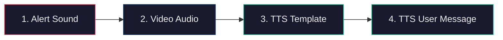
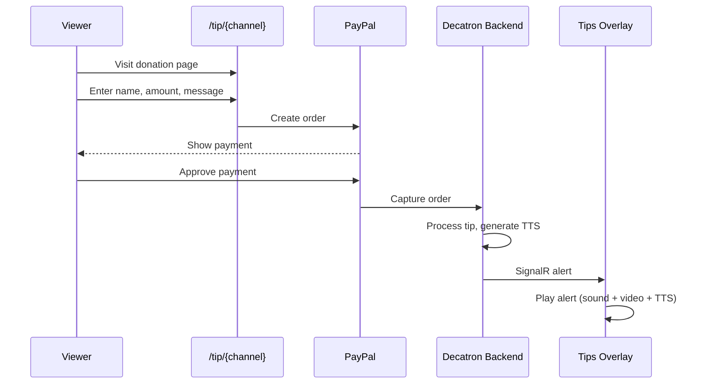
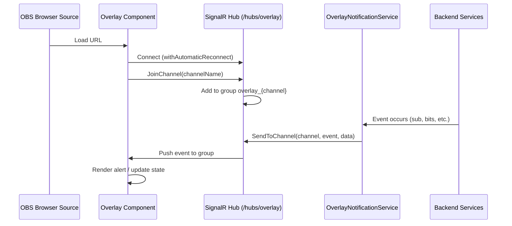
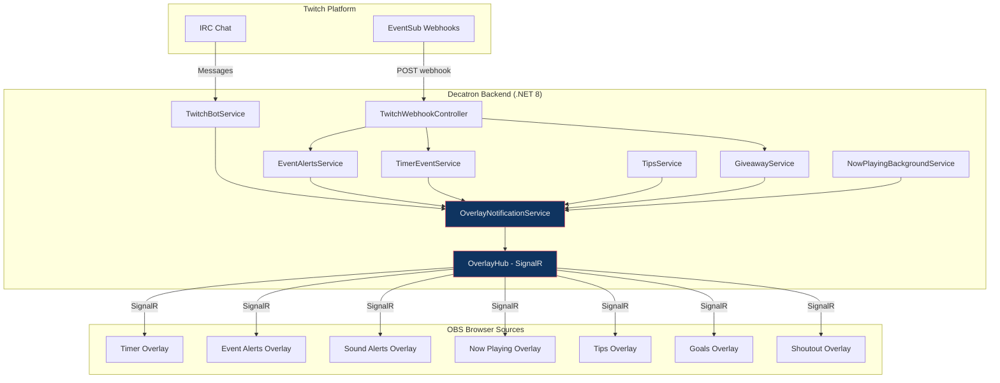

# Overlays Reference

Complete reference for all Decatron v2 overlay types, OBS setup instructions, configuration options, and real-time architecture.

---

## Table of Contents

- [Overview](#overview)
- [Adding Overlays to OBS](#adding-overlays-to-obs)
- [Timer Overlay](#timer-overlay)
- [Event Alerts Overlay](#event-alerts-overlay)
- [Sound Alerts Overlay](#sound-alerts-overlay)
- [Now Playing Overlay](#now-playing-overlay)
- [Tips Overlay](#tips-overlay)
- [Goals Overlay](#goals-overlay)
- [Shoutout Overlay](#shoutout-overlay)
- [Giveaway System](#giveaway-system)
- [Real-Time Architecture](#real-time-architecture)
- [SignalR Events Reference](#signalr-events-reference)

---

## Overview

Decatron overlays are React components served as web pages that connect to the backend via SignalR for real-time updates. They are designed to be loaded as **Browser Sources** in OBS Studio (or compatible streaming software).

All overlays follow this pattern:
1. Load configuration from an anonymous API endpoint (`/api/{feature}/config/overlay/{channel}`)
2. Connect to the SignalR hub at `/hubs/overlay`
3. Join the channel group via `JoinChannel(channelName)`
4. Listen for specific events and render visual elements accordingly
5. Automatically reconnect if the connection drops

---

## Adding Overlays to OBS

### General Setup

1. In OBS Studio, click **+** under Sources and select **Browser**.
2. Give it a name (e.g., "Decatron Timer").
3. Enter the overlay URL (see specific URLs below).
4. Set the recommended width and height for the overlay type.
5. Check **"Shutdown source when not visible"** if desired.
6. Click **OK**.

### Overlay URL Format

All overlay URLs follow this pattern:

```
https://your-decatron-domain.com/overlay/{type}?channel={channel_name}
```

Replace `{channel_name}` with your Twitch username (lowercase).

### Quick Reference

| Overlay | URL Path | Recommended Size |
|---------|----------|-----------------|
| Timer | `/overlay/timer?channel={name}` | 1920x1080 |
| Event Alerts | `/overlay/event-alerts?channel={name}` | 1920x1080 |
| Sound Alerts | `/overlay/soundalerts?channel={name}` | 400x450 |
| Now Playing | `/overlay/now-playing?channel={name}` | Varies by config |
| Tips | `/overlay/tips?channel={name}` | 1920x1080 |
| Goals | `/overlay/goals?channel={name}` | 1920x1080 |
| Shoutout | `/overlay/shoutout?channel={name}` | 1000x300 |

> **Tip:** You can find the exact overlay URL with your channel pre-filled in each feature's configuration page on the dashboard. Look for the "Copy Overlay URL" button.

---

## Timer Overlay

The Timer Extension is the most complex overlay in Decatron. It displays a visual countdown timer (subathon-style) that viewers can extend through Twitch events.

### Features

| Feature | Description |
|---------|-------------|
| Countdown display | Real-time countdown with local tick fallback |
| Progress bars | Horizontal, vertical, or circular with custom indicators |
| Event alerts | Visual + audio alerts when viewers add time |
| Panic mode | Special effects and audio playlist when time is critically low |
| Happy Hours | Time multipliers during configured periods |
| Auto-pause/resume | Schedule-based automatic pause (e.g., sleep hours) |
| Extra lives (Chances) | Resurrection system with custom messages when timer hits zero |
| TTS | Amazon Polly text-to-speech for event announcements |
| Media support | Custom sounds, images, videos, and GIFs for alerts |

### Event Types That Add Time

| Event | Configuration |
|-------|---------------|
| Bits/Cheers | Time per bit with tier-based rules |
| Subscriptions | Time per sub (Prime, Tier 1/2/3) with custom rules |
| Gift Subs | Time per gifted sub with tier rules |
| Raids | Base time + time per viewer, with rules |
| Hype Train | Time per level |
| Follows | Fixed time with cooldown (anti-abuse) |
| Donations/Tips | Multi-currency support (USD, EUR, MXN, ARS, etc.) |

### Timer Control

Control the timer from:
- **Dashboard panel:** Start, pause, resume, reset, stop, add/remove time
- **Chat commands:** `!dstart`, `!dpause`, `!dplay`, `!dreset`, `!dstop`, `!dtimer +/-seconds`
- **API:** `POST /api/timer/control` with action parameter

### Configuration Options

| Tab | Options |
|-----|---------|
| **General** | Duration, auto-start, appearance (colors, fonts, progress bar style) |
| **Events** | Enable/disable each event type, configure time amounts and tier rules |
| **Alerts** | Visual alerts for events (media, animation, duration) |
| **Happy Hours** | Day/time multiplier schedules with timezone support |
| **Schedules** | Auto-pause periods (e.g., 01:00--08:00 for sleep) |
| **Media** | Upload sounds, images, videos, GIFs organized by categories |
| **Templates** | Save/load complete timer configurations |
| **Sessions** | View history with detailed event logs per session |
| **Backups** | Auto-save every 5 minutes, manual backup, session restore |
| **Raffles** | Integrated raffle system with the timer |

### Timer API Endpoints

| Method | Endpoint | Auth | Description |
|--------|----------|------|-------------|
| `GET` | `/api/timer/config` | JWT | Get timer configuration |
| `POST` | `/api/timer/config` | JWT | Save timer configuration |
| `POST` | `/api/timer/config/reset` | JWT | Reset to factory defaults |
| `GET` | `/api/timer/state/{channel}` | Anonymous | Get timer state for a channel |
| `POST` | `/api/timer/control` | JWT | Control timer (start/pause/resume/reset/stop/addtime/removetime) |
| `GET` | `/api/timer/config/overlay/{channel}` | Anonymous | Get overlay config + state |
| `GET` | `/api/timer/sessions` | JWT | List timer sessions |
| `GET` | `/api/timer/sessions/{id}/logs` | JWT | Get session event logs |
| `POST` | `/api/timer/test/event` | JWT | Simulate an event |
| `GET/POST/PUT/DELETE` | `/api/timer/templates` | JWT | CRUD for configuration templates |
| `GET/POST/PUT/DELETE` | `/api/timer/schedules` | JWT | CRUD for auto-pause schedules |
| `GET/POST/PUT/DELETE` | `/api/timer/happyhour` | JWT | CRUD for happy hours |
| `POST` | `/api/timer/backup` | JWT | Create manual backup |
| `POST` | `/api/timer/backup/restore-session` | JWT | Restore a previous session |

### Timer Media Management

| Method | Endpoint | Description |
|--------|----------|-------------|
| `GET` | `/api/timer/media` | List media files |
| `GET` | `/api/timer/media/categories` | List available categories |
| `POST` | `/api/timer/media/upload` | Upload file (50MB max) |
| `PUT` | `/api/timer/media/{id}/rename` | Rename file |
| `PUT` | `/api/timer/media/{id}/move` | Move to another category |
| `DELETE` | `/api/timer/media/{id}` | Delete file |

---

## Event Alerts Overlay

The primary alert system for Twitch events. Shows visual and audio alerts when viewers follow, subscribe, donate bits, raid, gift subs, resub, or trigger hype trains.

### Supported Event Types

| Event Type | Variables Available | Tier Support |
|------------|--------------------|--------------|
| Follow | `{username}` | No |
| Bits/Cheers | `{username}`, `{amount}` | Yes (by amount range) |
| Subscriptions | `{username}`, `{tier}`, `{months}` | Yes (Prime, T1/T2/T3) |
| Gift Subs | `{username}`, `{amount}`, `{tier}` | Yes (by gift count) |
| Resubs | `{username}`, `{months}`, `{tier}` | Yes (by month count) |
| Raids | `{username}`, `{viewers}` | Yes (by viewer count) |
| Hype Train | `{level}` | Yes (by level) |

### Tier System

Each event type supports **tiers** -- different alert configurations based on the event amount:

| Condition Type | Description | Example |
|----------------|-------------|---------|
| `range` | Amount falls within a range | 100--499 bits |
| `minimum` | Amount is at or above a threshold | 500+ bits |
| `exact` | Amount exactly matches | Exactly 1000 bits |

Each tier can have its own media, message, animation, sound, and TTS configuration.

### Variant System

Each tier (or the base alert) can have multiple **variants** that rotate:

| Mode | Description |
|------|-------------|
| `random` | Randomly pick a variant each time |
| `weighted` | Pick based on configured weights (probability) |
| `sequential` | Cycle through variants in order |
| `noRepeat` | Random but avoids repeating the last N variants |

**Variant limits by plan:** Free = 5, Supporter = 15, Premium = unlimited.

### Audio Pipeline

The overlay plays audio in a 4-layer sequence:



### Configuration Tabs

| Tab | Description |
|-----|-------------|
| **Global** | Master enable/disable, default alert duration, cooldowns, queue settings |
| **Follow** | Follow alert config (message, media, TTS, animation) |
| **Bits** | Bits alert config with tier support |
| **Subs** | Subscription alert config with tier support (Prime/T1/T2/T3) |
| **Gift Subs** | Gift subscription alert config with tier support |
| **Resubs** | Resubscription alert config with tier support |
| **Raids** | Raid alert config with tier support |
| **Hype Train** | Hype train alert config by level |
| **Style** | Visual styles (colors, fonts, shadows, effects) |
| **Editor** | Drag-and-drop visual editor for positioning elements on 1920x1080 canvas |
| **Media** | Media file management |
| **Testing** | Send test alerts of any type |

### Visual Effects

| Effect | Description |
|--------|-------------|
| `shake` | Shake the alert card |
| `glow` | Glowing border effect |
| `float` | Floating/bobbing animation |
| `pulse` | Pulsing scale animation |
| `confetti` | Confetti particle effect |

### Entry/Exit Animations

| Animation | Description |
|-----------|-------------|
| `fade` | Fade in/out |
| `slide` | Slide in from edge |
| `bounce` | Bounce in with elastic easing |
| `zoom` | Scale from 0 to 100% |

### Event Alerts API

| Method | Endpoint | Auth | Description |
|--------|----------|------|-------------|
| `GET` | `/api/eventalerts/config` | JWT | Get alert configuration |
| `POST` | `/api/eventalerts/config` | JWT | Save configuration (JSON blob) |
| `POST` | `/api/eventalerts/test` | JWT | Send test alert via SignalR |
| `GET` | `/api/eventalerts/config/overlay/{channel}` | Anonymous | Get overlay config |

---

## Sound Alerts Overlay

Plays audiovisual alerts when viewers redeem Channel Points rewards that have been assigned a sound/media file.

### How It Works

1. Configure Channel Point rewards in your Twitch dashboard.
2. In Decatron, assign a media file (audio, video, or image) to each reward.
3. When a viewer redeems the reward, the overlay plays the assigned media.

### Configuration Tabs

| Tab | Description |
|-----|-------------|
| **Basic** | Global volume (0--100%), alert duration (3--30s), text lines with `@redeemer`/`@reward` variables |
| **Text** | Font family, color, shadow, outline |
| **Background** | Transparent (for OBS), solid color, or gradient with opacity |
| **Layout** | Drag-and-drop editor for media and text positioning on 400x450 canvas |
| **Animation** | Entry/exit animation type and speed, cooldown between alerts |
| **Files** | Select a Channel Points reward and assign a media file (upload or system library) |

### Supported Media Types

| Category | Formats |
|----------|---------|
| Audio | MP3, WAV, OGG |
| Video | MP4, WEBM |
| Image | PNG, JPG, GIF |

### Sound Alerts API

| Method | Endpoint | Auth | Description |
|--------|----------|------|-------------|
| `GET` | `/api/soundalerts/channel-points-rewards` | JWT | Get Channel Points rewards from Twitch |
| `GET` | `/api/soundalerts/config` | JWT | Get configuration |
| `POST` | `/api/soundalerts/config` | JWT | Save configuration |
| `GET` | `/api/soundalerts/config/overlay/{channel}` | Anonymous | Get overlay config |
| `GET` | `/api/soundalerts/files` | JWT | List assigned files |
| `POST` | `/api/soundalerts/upload` | JWT | Upload media file |
| `DELETE` | `/api/soundalerts/file/{rewardId}` | JWT | Delete file assignment |
| `PATCH` | `/api/soundalerts/file/{rewardId}/volume` | JWT | Set per-file volume |
| `PATCH` | `/api/soundalerts/file/{rewardId}/toggle` | JWT | Enable/disable a file |
| `GET` | `/api/soundalerts/system-files` | JWT | List system library files |
| `POST` | `/api/soundalerts/assign-system-file` | JWT | Assign a system file to a reward |
| `POST` | `/api/soundalerts/test` | JWT | Send test alert |

---

## Now Playing Overlay

Displays the currently playing song in the stream via a customizable widget. Supports two music providers.

### Providers

| Provider | Connection Method | Requirements |
|----------|-------------------|--------------|
| **Last.fm** | Enter Last.fm username | Any music player that scrobbles to Last.fm |
| **Spotify** | OAuth2 connection | Supporter+ tier, limited slots for free users |

### Spotify Slot System

Spotify integration uses limited connection slots due to API rate limits:
- **Free users:** Must request a slot (5 available, managed by admin)
- **Supporter+ users:** Direct connection available
- Admin endpoints manage slot assignment and revocation

### Polling Architecture

`NowPlayingBackgroundService` polls all active channels every 3 seconds:
1. Check current song from Last.fm API or Spotify API
2. Compare with previously known track
3. If changed, send update via SignalR to the overlay

### Configuration Tabs (8 tabs)

| Tab | Description |
|-----|-------------|
| **General** | Provider selection, connection, enable/disable |
| **Layout** | Card mode vs. free positioning mode |
| **Style** | Colors, borders, shadows, opacity |
| **Typography** | Font family, sizes, colors for song title and artist |
| **Progress Bar** | Interpolated progress bar with colors and animation |
| **Animations** | Entry/exit and transition animations between tracks |
| **Position** | Overlay positioning on the stream canvas |
| **Preview** | Live preview of the overlay widget |

### Tier-Locked Features

Some visual features are locked behind subscription tiers:

| Feature | Free | Supporter | Premium |
|---------|------|-----------|---------|
| Basic overlay | Yes | Yes | Yes |
| Spotify provider | Slot required | Yes | Yes |
| Custom animations | Limited | Yes | Yes |
| Advanced styling | Limited | Yes | Yes |

### Now Playing API

| Method | Endpoint | Auth | Description |
|--------|----------|------|-------------|
| `GET` | `/api/nowplaying/config` | JWT | Get configuration |
| `POST` | `/api/nowplaying/config` | JWT | Save configuration |
| `POST` | `/api/nowplaying/connect/lastfm` | JWT | Connect Last.fm |
| `POST` | `/api/nowplaying/validate/lastfm` | JWT | Validate Last.fm username |
| `POST` | `/api/nowplaying/disconnect` | JWT | Disconnect provider |
| `GET` | `/api/nowplaying/config/overlay/{channel}` | Anonymous | Get overlay config |
| `GET` | `/api/nowplaying/now/{channel}` | Anonymous | Get currently playing track |
| `POST` | `/api/nowplaying/test` | JWT | Send test track to overlay |
| `GET` | `/api/spotify/authorize-url` | JWT | Get Spotify OAuth URL |
| `GET` | `/api/spotify/callback` | Anonymous | Spotify OAuth callback |
| `GET` | `/api/spotify/status` | JWT | Check Spotify connection status |

---

## Tips Overlay

Displays donation alerts when viewers send tips via PayPal. Supports two alert modes.

### Alert Modes

| Mode | Description |
|------|-------------|
| **Basic** | Independent alert system with tiers, media, TTS, and variants |
| **Timer** | Delegates alerts to the Timer Extension (adds time based on donation amount) |

### Donation Flow



### Configuration

| Section | Options |
|---------|---------|
| **PayPal** | Connect/disconnect PayPal account via OAuth |
| **Amounts** | Minimum/maximum, suggested amounts, currency |
| **Donation Page** | Custom title, description, theme for the public `/tip/{channel}` page |
| **Alerts** | Media, animation, TTS voice, tier-based configurations |
| **Timer Integration** | Seconds/minutes/hours added per currency unit |
| **Security** | Minimum amounts, content filters |
| **History** | View past donations with stats (top donors, totals, averages) |

### Tips API

| Method | Endpoint | Auth | Description |
|--------|----------|------|-------------|
| `GET` | `/api/tips/config` | JWT | Get configuration |
| `POST` | `/api/tips/config` | JWT | Save configuration |
| `GET` | `/api/tips/page/{channel}` | Anonymous | Get public donation page config |
| `GET` | `/api/tips/paypal/connect` | JWT | Start PayPal OAuth |
| `POST` | `/api/tips/paypal/disconnect` | JWT | Disconnect PayPal |
| `POST` | `/api/tips/paypal/create-order` | Anonymous | Create PayPal order |
| `POST` | `/api/tips/paypal/capture-order` | Anonymous | Capture completed payment |
| `GET` | `/api/tips/history` | JWT | Donation history |
| `GET` | `/api/tips/top-donors` | JWT | Top donors by period |
| `GET` | `/api/tips/statistics` | JWT | Donation statistics |
| `POST` | `/api/tips/test` | JWT | Send test alert |

---

## Goals Overlay

Displays progress bars for stream goals (subscribers, bits, followers, raids, or combined targets).

### Features

| Feature | Description |
|---------|-------------|
| Multiple simultaneous goals | Unlike native Twitch Goals, supports several active goals at once |
| Combined goals | A single goal can combine subs + bits + follows + raids with configurable weights |
| Milestones | Intermediate checkpoints within each goal with notifications and timer bonus |
| Timer integration | Completing goals or milestones can add time to the Timer Extension |
| Chat commands | `!meta`, `!meta reset`, `!meta add N`, `!meta set N` |
| Drag-and-drop editor | Visual positioning of each goal bar on the overlay canvas |
| History | Event log for progress, milestones, completions, and resets |

### Goal Types

| Type | Tracks |
|------|--------|
| Subscriptions | New subscriber count |
| Bits | Total bits cheered |
| Followers | New follower count |
| Raids | Number of raids received |
| Combined | Weighted sum of multiple event types |

### Configuration Tabs

| Tab | Description |
|-----|-------------|
| **Basic** | Create goals, set type, target value, current value, visual style |
| **Design** | Global colors, gradients, typography, bar styles |
| **Sources** | Configure which event types contribute and their weights |
| **Milestones** | Set intermediate checkpoints with rewards |
| **Notifications** | Alert sounds and messages for milestones and completions |
| **Commands** | Enable/disable chat commands, configure permissions |
| **Timer Integration** | Time bonus for goal/milestone completion |
| **Overlay** | Drag-and-drop positioning editor |
| **Media** | Media files for notifications |
| **History** | View event log |
| **Guide** | Built-in setup guide |

### Goals API

| Method | Endpoint | Auth | Description |
|--------|----------|------|-------------|
| `GET` | `/api/goals/config` | JWT | Get goals configuration |
| `POST` | `/api/goals/config` | JWT | Save goals configuration |
| `GET` | `/api/goals/config/overlay/{channel}` | Anonymous | Get overlay data |
| `POST` | `/api/goals/{goalId}/progress` | JWT | Increment goal progress |
| `POST` | `/api/goals/{goalId}/set` | JWT | Set absolute progress value |
| `POST` | `/api/goals/{goalId}/reset` | JWT | Reset goal to zero |
| `GET` | `/api/goals/history` | JWT | Get event history |

---

## Shoutout Overlay

Displays a visual shoutout card when a moderator or broadcaster uses `!so @username` in chat. Shows the target user's profile and latest clip.

### Features

- Profile picture and username display
- Latest clip playback (downloaded via `yt-dlp`)
- Customizable text lines with variables
- Drag-and-drop layout editor
- Blacklist and whitelist management
- Auto-save for lists

### Shoutout Variables

| Variable | Description |
|----------|-------------|
| `{username}` | The shouted-out user's display name |
| `{game}` | The game they were last playing |
| `{url}` | Link to their Twitch channel |

### Configuration Tabs

| Tab | Description |
|-----|-------------|
| **Basic** | Duration (5--60s), cooldown (0--300s), text lines |
| **Typography** | Font, color, shadow, outline for each text line |
| **Background** | Transparent, solid, or gradient backgrounds |
| **Layout** | Drag-and-drop for profile image, clip, and text elements |
| **Animations** | Entry/exit animation type and speed |
| **Management** | Blacklist/whitelist with auto-save |
| **Debug** | Test shoutout button |

### Shoutout API

| Method | Endpoint | Auth | Description |
|--------|----------|------|-------------|
| `GET` | `/api/shoutout/config` | JWT | Get configuration |
| `POST` | `/api/shoutout/config` | JWT | Save configuration |
| `GET` | `/api/shoutout/config/overlay/{channel}` | Anonymous | Get overlay config |
| `POST` | `/api/shoutout/test` | JWT | Send test shoutout |
| `GET` | `/api/shoutout/history` | JWT | Get shoutout history |

---

## Giveaway System

While the giveaway system does not have a dedicated overlay page, it integrates with the existing overlay infrastructure via SignalR for real-time participant notifications.

### Features

| Feature | Description |
|---------|-------------|
| Weighted selection | Subscribers, VIPs, watch time, bits, sub streak multiply winning probability |
| Entry requirements | Follower, subscriber, minimum watch time, account age, follow age, chat messages |
| Anti-cheat | Duplicate IP detection (SHA-256 hashed), multi-account detection |
| Multiple winners | Select multiple winners with backup winners |
| Response timeout | Auto-reroll or promote backup if winner does not respond in time |
| Winner cooldown | Recent winners cannot participate for N days |
| Chat announcements | Auto-announce start, reminders, winners, no-response |
| Raffle system | Separate simpler raffle system with timer session participant import |

### Giveaway API

| Method | Endpoint | Description |
|--------|----------|-------------|
| `POST` | `/api/giveaway/start` | Start giveaway |
| `POST` | `/api/giveaway/end` | End and select winners |
| `POST` | `/api/giveaway/cancel` | Cancel active giveaway |
| `POST` | `/api/giveaway/reroll` | Re-select a winner |
| `GET` | `/api/giveaway/active` | Get active giveaway state |
| `GET` | `/api/giveaway/history` | Get past giveaways |
| `GET` | `/api/giveaway/statistics` | Get statistics |

---

## Real-Time Architecture

All overlays communicate with the backend via a single shared SignalR hub.

### Connection Flow



### Architecture Diagram



### Key Design Points

1. **Single hub, multiple overlay types.** All overlays connect to `/hubs/overlay` and join a channel-specific group (`overlay_{channelName}`). Events are dispatched to the correct group.

2. **OverlayNotificationService is the central dispatcher.** It is injected into 32+ backend files. All real-time notifications flow through this service, which uses `IHubContext<OverlayHub>` to send messages without needing a direct SignalR connection.

3. **Anonymous overlay access.** Overlay endpoints and SignalR connections do not require authentication. This is necessary because OBS Browser Sources cannot send JWT tokens. Channel names in URLs serve as the routing key.

4. **Automatic reconnection.** All overlay components use SignalR's `withAutomaticReconnect()` and re-join their channel group after reconnection.

5. **Alert queuing.** Overlays that display sequential alerts (Event Alerts, Sound Alerts, Tips) maintain an internal queue to ensure alerts are shown one at a time in order.

---

## SignalR Events Reference

### Hub Methods (Client to Server)

| Method | Parameters | Description |
|--------|------------|-------------|
| `JoinChannel` | `channel: string` | Subscribe to a channel's overlay group |
| `LeaveChannel` | `channel: string` | Unsubscribe from a channel's group |
| `UpdateTimer` | `channel: string, state: object` | Send timer state update (server use) |
| `TimerCommand` | `channel: string, command: string, parameters?: object` | Send timer command (server use) |
| `ConfigurationChanged` | `channel: string` | Notify configuration change (server use) |

### Server to Client Events

| Event | Payload | Used By |
|-------|---------|---------|
| `ShowShoutout` | Shoutout data (user info, clip URL, config) | Shoutout Overlay |
| `ShowEventAlert` | Alert data (type, username, amount, media, TTS URLs) | Event Alerts Overlay |
| `ShowSoundAlert` | Sound alert data (media URL, config, styles) | Sound Alerts Overlay |
| `ShowTipAlert` | Tip data (donor, amount, message, media, TTS) | Tips Overlay |
| `ConfigurationChanged` | `{ channel }` | All overlays (triggers config reload) |
| `EventAlertsConfigChanged` | Config data | Event Alerts Overlay |
| `RefreshOverlay` | -- | All overlays (force refresh) |
| `StartTimer` | Timer state | Timer Overlay |
| `PauseTimer` | Timer state | Timer Overlay |
| `ResumeTimer` | Timer state | Timer Overlay |
| `ResetTimer` | Timer state | Timer Overlay |
| `StopTimer` | Timer state | Timer Overlay |
| `AddTime` | `{ seconds, source, username }` | Timer Overlay |
| `TimerTick` | `{ remainingSeconds }` | Timer Overlay |
| `TimerEventAlert` | Alert data (event type, username, time added, media) | Timer Overlay |
| `TimerStateUpdate` | Full timer state object | Timer Overlay |
| `TimerCommandExecuted` | `{ command, parameters }` | Timer Overlay |
| `TimerConfigChanged` | -- | Timer Overlay |
| `GoalProgress` | `{ goalId, currentValue, targetValue }` | Goals Overlay |
| `GoalCompleted` | `{ goalId, goalName }` | Goals Overlay |
| `GoalMilestone` | `{ goalId, milestoneName }` | Goals Overlay |
| `GoalsConfigChanged` | -- | Goals Overlay |
| `NowPlayingUpdate` | Track data (title, artist, album art, progress) | Now Playing Overlay |
| `NowPlayingStop` | -- | Now Playing Overlay |
| `GiveawayParticipantJoined` | Participant data | Dashboard (giveaway panel) |
