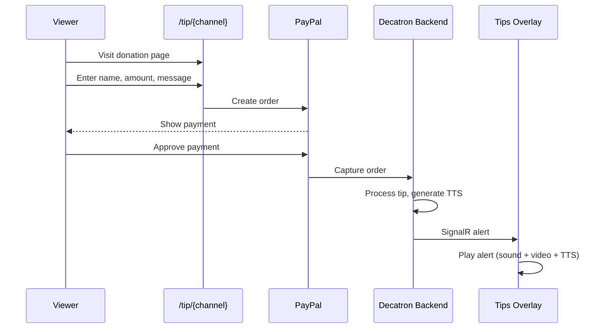
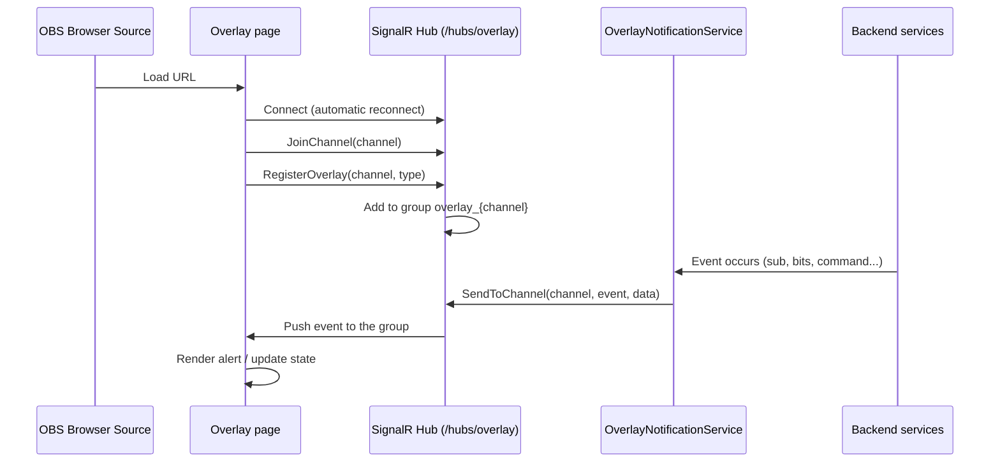
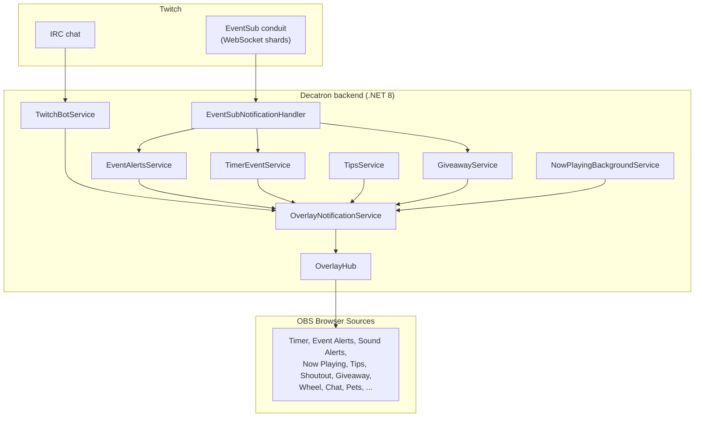

# Overlays Reference

> Español: [es/OVERLAYS.md](es/OVERLAYS.md)

Reference for the Decatron overlays: URLs, OBS setup, what each overlay does, its public endpoints and the real-time events it listens to. Step-by-step manuals for each module are in the app, under `/dashboard/docs`.

---

## Table of Contents

- [Overview](#overview)
- [Adding Overlays to OBS](#adding-overlays-to-obs)
- [Timer Overlay](#timer-overlay)
- [Event Alerts Overlay](#event-alerts-overlay)
- [Sound Alerts Overlay](#sound-alerts-overlay)
- [Now Playing Overlay](#now-playing-overlay)
- [Song Request Overlay](#song-request-overlay)
- [Wheel Overlay](#wheel-overlay)
- [Tips Overlay](#tips-overlay)
- [Shoutout Overlay](#shoutout-overlay)
- [Giveaway](#giveaway)
- [Other Overlays](#other-overlays)
- [Tournament Overlay and Widget](#tournament-overlay-and-widget)
- [Real-Time Architecture](#real-time-architecture)
- [SignalR Events Reference](#signalr-events-reference)

---

## Overview

Decatron overlays are pages of the React app that connect to the backend with SignalR for real-time updates. They are loaded as **Browser Sources** in OBS Studio (or compatible streaming software). They need no login: the channel name (and, for some overlays, a key) in the URL identifies the channel.

Most overlays follow this pattern:

1. Load the configuration from a public endpoint (`/api/{feature}/config/overlay/{channel}` or a similar one).
2. Connect to the SignalR hub `/hubs/overlay`.
3. Join the channel group with `JoinChannel(channelName)` and identify itself with `RegisterOverlay(channel, overlayType)`.
4. Listen for specific events and render them.
5. Reconnect automatically if the connection drops.

The Song Request overlay uses its own hub, `/hubs/songrequest`.

---

## Adding Overlays to OBS

1. In OBS Studio, click **+** under Sources and select **Browser**.
2. Give it a name (for example "Decatron Timer").
3. Paste the overlay URL.
4. Set the width and height that the module's page in the dashboard shows. The size is set in each module's editor (canvas), not fixed here.
5. Optionally check **Shutdown source when not visible**.
6. Click **OK**.

### Overlay URL format

```
https://your-decatron-domain.com/overlay/{type}?channel={channel_name}
```

Replace `{channel_name}` with the channel login (lowercase).

> **Tip:** the dashboard page of each module shows the exact overlay URL with your channel filled in (and any private key), with a copy button. Prefer copying it from there.

### Quick reference

| Overlay | URL | Extra parameters |
|---------|-----|------------------|
| Timer | `/overlay/timer?channel={name}` | |
| Event alerts | `/overlay/event-alerts?channel={name}` | |
| Sound alerts | `/overlay/soundalerts?channel={name}` | `source=all`, `twitch` or `kick` |
| Now playing | `/overlay/now-playing?channel={name}` | |
| Tips | `/overlay/tips?channel={name}` | |
| Shoutout | `/overlay/shoutout?channel={name}` | |
| Giveaway | `/overlay/giveaway?channel={name}` | |
| Song Request (player) | `/overlay/songrequest?channel={name}&key={playerKey}` | `key` is private to the channel |
| Song Request (display only) | `/overlay/songrequest?channel={name}` | |
| Wheel | `/overlay/rueda?channel={name}&wheel={slug}` | |
| Chat | `/overlay/chat?channel={name}` | `source=all`, `twitch` or `kick` |
| Speak chat | `/overlay/speak-chat?channel={name}` | |
| Pets | `/overlay/pets?channel={name}` | `platform=twitch` (default) or `kick` |
| Games | `/overlay/games?channel={name}` | `platform`, `slug`; preview parameters: `layout`, `preset`, `view`, `preview` |
| Live match | `/overlay/live?channel={name}` | `platform`, `slug`, `layout`, `preview` |
| Gacha | `/overlay/gacha?channel={name}` | |
| Tournament | `/overlay/torneo/{token}` | The token comes from the tournament dashboard |

---

## Timer Overlay

The Timer Extension displays a visual countdown (subathon style) that viewers extend through events.

### Features

| Feature | Description |
|---------|-------------|
| Countdown display | Real-time countdown with local tick fallback |
| Progress bars | Horizontal, vertical or circular, with custom indicators |
| Event alerts | Visual and audio alerts when viewers add time |
| Panic mode | Special effects and audio playlist when time is critically low |
| Happy hours | Time multipliers during configured periods |
| Auto-pause/resume | Schedule-based automatic pause (for example sleep hours) |
| Extra lives | Resurrection system with custom messages when the timer reaches zero |
| TTS | Text-to-speech for event announcements |
| Media | Custom sounds, images, videos and GIFs for alerts |

### Events that add time

| Event | Configuration |
|-------|---------------|
| Bits/cheers | Time per bit, with tier-based rules |
| Subscriptions | Time per sub (Prime, Tier 1/2/3) with custom rules |
| Gift subs | Time per gifted sub, with tier rules |
| Raids | Base time plus time per viewer, with rules |
| Hype train | Time per level |
| Follows | Fixed time with cooldown (anti-abuse) |
| Donations/tips | Multi-currency support |

### Control

- **Dashboard panel:** start, pause, resume, reset, stop, add or remove time.
- **Chat commands:** `!dstart`, `!dpause`, `!dplay`, `!dreset`, `!dstop`, `!dtimer`; information commands `!dtiempo`, `!dcuando`, `!dstats`, `!drecord`, `!dtop`. See [COMMANDS.md](COMMANDS.md).
- **API:** `POST /api/timer/control` with an action parameter.

### Configuration tabs

Guide, Basic, Events, Theme, Bar, Display, Typography, Alerts, Commands, Info Cmds, Goal, Raffles, Animations, Advanced, History, Media, Widgets and Overlay. Happy hours, schedules, templates, session history and backups (automatic every 5 minutes plus manual) are managed from these tabs.

### Timer API

| Method | Endpoint | Auth | Description |
|--------|----------|------|-------------|
| `GET` | `/api/timer/config` | JWT | Get timer configuration |
| `POST` | `/api/timer/config` | JWT | Save timer configuration |
| `POST` | `/api/timer/config/reset` | JWT | Reset to defaults |
| `GET` | `/api/timer/state/{channel}` | Anonymous | Get timer state for a channel |
| `POST` | `/api/timer/control` | JWT | Control the timer (start, pause, resume, reset, stop, add or remove time) |
| `GET` | `/api/timer/config/overlay/{channel}` | Anonymous | Get overlay config and state |
| `GET` | `/api/timer/sessions` | JWT | List timer sessions |
| `GET` | `/api/timer/sessions/{id}/logs` | JWT | Get session event logs |
| `POST` | `/api/timer/test/event` | JWT | Simulate an event |
| `GET/POST/PUT/DELETE` | `/api/timer/templates` | JWT | Configuration templates (item routes use an id) |
| `GET/POST/PUT/DELETE` | `/api/timer/schedules` | JWT | Auto-pause schedules (item routes use an id) |
| `GET/POST/PUT/DELETE` | `/api/timer/happyhour` | JWT | Happy hours (item routes use an id) |
| `POST` | `/api/timer/backup` | JWT | Create a manual backup |
| `POST` | `/api/timer/backup/restore-session` | JWT | Restore a previous session |

### Timer media

| Method | Endpoint | Description |
|--------|----------|-------------|
| `GET` | `/api/timer/media` | List media files |
| `GET` | `/api/timer/media/categories` | List categories |
| `POST` | `/api/timer/media/upload` | Upload a file |
| `PUT` | `/api/timer/media/{id}/rename` | Rename a file |
| `PUT` | `/api/timer/media/{id}/move` | Move to another category |
| `DELETE` | `/api/timer/media/{id}` | Delete a file |

---

## Event Alerts Overlay

The alert system for channel events. It shows visual and audio alerts when viewers follow, subscribe, cheer, raid, gift subs, resub or trigger hype trains.

### Supported event types

| Event type | Variables | Tier support |
|------------|-----------|--------------|
| Follow | `{username}` | No |
| Bits/cheers | `{username}`, `{amount}` | Yes (by amount) |
| Subscriptions | `{username}`, `{tier}`, `{months}` | Yes (Prime, T1/T2/T3) |
| Gift subs | `{username}`, `{amount}`, `{tier}` | Yes (by gift count) |
| Resubs | `{username}`, `{months}`, `{tier}` | Yes (by month count) |
| Raids | `{username}`, `{viewers}` | Yes (by viewer count) |
| Hype train | `{level}` | Yes (by level) |

### Tier system

Each event type can have **tiers**: different alert configurations depending on the amount.

| Condition type | Description | Example |
|----------------|-------------|---------|
| `range` | Amount falls within a range | 100-499 bits |
| `minimum` | Amount is at or above a threshold | 500+ bits |
| `exact` | Amount matches exactly | Exactly 1000 bits |

Each tier can have its own media, message, animation, sound and TTS configuration.

### Variant system

Each tier (or the base alert) can have several **variants** that rotate:

| Mode | Description |
|------|-------------|
| `random` | Pick a variant at random each time |
| `weighted` | Pick according to configured weights |
| `sequential` | Cycle through the variants in order |
| `noRepeat` | Random, but avoiding the last variants shown |

Variant limits per plan, as set in the editor: Free 5, Supporter 15, Premium effectively unlimited.

### Audio pipeline

The overlay plays audio in four layers, one after another: alert sound, video audio, TTS template, TTS of the user's message.

### Configuration tabs

Guide, General, Events, Design, Advanced, Media and Tests. The design editor places elements on a canvas; the canvas size is shared by all events and copied to every design when you save.

### Visual effects and animations

Effects: `shake`, `glow`, `float`, `pulse`, `confetti`. Entry/exit animations: `fade`, `slide`, `bounce`, `zoom`.

### Event Alerts API

| Method | Endpoint | Auth | Description |
|--------|----------|------|-------------|
| `GET` | `/api/eventalerts/config` | JWT | Get alert configuration |
| `POST` | `/api/eventalerts/config` | JWT | Save configuration |
| `POST` | `/api/eventalerts/test` | JWT | Send a test alert through SignalR |
| `GET` | `/api/eventalerts/config/overlay/{channel}` | Anonymous | Get overlay config |

---

## Sound Alerts Overlay

Plays an audiovisual alert when a viewer redeems a Channel Points reward that has a media file assigned.

### How it works

1. Create the rewards in your Twitch dashboard.
2. In Decatron, assign a media file (audio, video or image) to each reward.
3. When a viewer redeems the reward, the overlay plays the assigned media.

### Configuration tabs

Guide, Rewards, Library, Basic, Texts, Background, Animation and Editor. Text lines accept the variables `@redeemer` and `@reward`. The duration and the volume are set in Basic; the Rewards tab links a Channel Points reward to a file, and Library lists the system library.

### Supported media

| Category | Formats |
|----------|---------|
| Audio | MP3, WAV, OGG |
| Video | MP4, WEBM |
| Image | PNG, JPG, GIF |

### Sound Alerts API

| Method | Endpoint | Auth | Description |
|--------|----------|------|-------------|
| `GET` | `/api/soundalerts/channel-points-rewards` | JWT | Channel Points rewards from Twitch |
| `GET` | `/api/soundalerts/config` | JWT | Get configuration |
| `POST` | `/api/soundalerts/config` | JWT | Save configuration |
| `GET` | `/api/soundalerts/config/overlay/{channel}` | Anonymous | Get overlay config |
| `GET` | `/api/soundalerts/files` | JWT | List assigned files |
| `POST` | `/api/soundalerts/upload` | JWT | Upload a media file |
| `DELETE` | `/api/soundalerts/file/{rewardId}` | JWT | Delete a file assignment |
| `PATCH` | `/api/soundalerts/file/{rewardId}/volume` | JWT | Set per-file volume |
| `PATCH` | `/api/soundalerts/file/{rewardId}/toggle` | JWT | Enable or disable a file |
| `GET` | `/api/soundalerts/system-files` | JWT | List system library files |
| `POST` | `/api/soundalerts/assign-system-file` | JWT | Assign a system file to a reward |
| `POST` | `/api/soundalerts/test` | JWT | Send a test alert |

---

## Now Playing Overlay

Shows the song that is currently playing, in a customizable widget.

### Providers

| Provider | Connection | Requirements |
|----------|------------|--------------|
| **Last.fm** | Enter your Last.fm username | Any player that scrobbles to Last.fm |
| **Spotify** | OAuth2 connection | A free Spotify slot (see below) |

### Spotify slots

Spotify access is limited to 5 slots for non-premium users (`MaxSpotifyUsers`), assigned by the administrator. Now Playing has the same features for every plan: the plan only affects the order of the waiting list for Spotify slots.

### Polling

`NowPlayingBackgroundService` checks every active channel every 3 seconds, compares the track with the previous one and, when it changes, sends an update through SignalR.

### Configuration tabs

Guide, Connection, Theme, Elements, Typography, Animations and Editor.

### Now Playing API

| Method | Endpoint | Auth | Description |
|--------|----------|------|-------------|
| `GET` | `/api/nowplaying/config` | JWT | Get configuration |
| `POST` | `/api/nowplaying/config` | JWT | Save configuration |
| `POST` | `/api/nowplaying/connect/lastfm` | JWT | Connect Last.fm |
| `POST` | `/api/nowplaying/validate/lastfm` | JWT | Validate a Last.fm username |
| `POST` | `/api/nowplaying/disconnect` | JWT | Disconnect the provider |
| `GET` | `/api/nowplaying/config/overlay/{channel}` | Anonymous | Get overlay config |
| `GET` | `/api/nowplaying/now/{channel}` | Anonymous | Get the current track |
| `POST` | `/api/nowplaying/test` | JWT | Send a test track to the overlay |
| `GET` | `/api/spotify/authorize-url` | JWT | Get the Spotify OAuth URL |
| `GET` | `/api/spotify/callback` | Anonymous | Spotify OAuth callback |
| `GET` | `/api/spotify/status` | JWT | Check the Spotify connection |

---

## Song Request Overlay

The queue player for [Song Request](COMMANDS.md#song-request-commands). It comes in two forms, each with its own design:

| Form | URL | What it does |
|------|-----|--------------|
| Player | `/overlay/songrequest?channel={name}&key={playerKey}` | Plays the audio. The queue does not advance without it. `{playerKey}` is private to the channel: do not share it, and regenerate it from the dashboard if it leaks |
| Display only | `/overlay/songrequest?channel={name}` | Shows "now playing" without audio, for another scene |

### Design

The design tabs (Theme, Elements, Typography, Animations, Editor) share the music-overlay engine: ready-made themes, per-element typography, entry/exit animations, a visual canvas editor with starting layouts and saved templates. The number of saved templates depends on the supporter tier. The overlay design is served publicly (without the player key) at `GET /api/public/song-request/{channel}/overlay`.

### Real-time

The player, the display overlay, the dashboard and the public queue page all listen to the `SongRequestHub` SignalR hub (`/hubs/songrequest`).

### Audio and VODs

Requested music can mute Twitch VODs. In OBS, enable "Control audio via OBS" on the player source, leave it on a single track in Advanced Audio Properties, and set a different track for "Twitch VOD Track".

---

## Wheel Overlay

The overlay of a prize or raffle wheel (see [Wheel and Raffle Commands](COMMANDS.md#wheel-and-raffle-commands)). Every wheel has its own link:

`/overlay/rueda?channel={name}&wheel={slug}`

The link carries no key: anyone who has it can see the overlay but cannot change anything. The background is transparent. The overlay data is public and uncached, served by `GET /api/wheel/overlay?channel={name}&wheel={slug}`; the bot decides every result and the overlay only animates it.

### Look

Colors and palette, center image, spin motion (duration, turns, easing), visibility (while spinning, always, or during sign-ups on raffle wheels), celebration (confetti, flash or none), per-event sounds and typography, plus a canvas editor to place the wheel, winner card, watermark, background and your own text and image pieces. The Decatron watermark can be hidden from the Premium tier.

---

## Tips Overlay

Shows donation alerts when viewers send tips through PayPal.

### Alert modes

| Mode | Description |
|------|-------------|
| **Basic** | Independent alert system with tiers, media, TTS and variants |
| **Timer** | Delegates the alert to the Timer Extension (adds time according to the donation amount) |

### Donation flow


```mermaid
sequenceDiagram
    participant Viewer
    participant DonationPage as /tip/{channel}
    participant PayPal
    participant Backend as Decatron Backend
    participant Overlay as Tips Overlay

    Viewer->>DonationPage: Visit donation page
    Viewer->>DonationPage: Enter name, amount, message
    DonationPage->>PayPal: Create order
    PayPal-->>Viewer: Show payment
    Viewer->>PayPal: Approve payment
    PayPal->>Backend: Capture order
    Backend->>Backend: Process tip, generate TTS
    Backend->>Overlay: SignalR alert
    Overlay->>Overlay: Play alert (sound + video + TTS)
```

### Configuration tabs

General, Page, Alerts, Timer, Security and History. General covers the PayPal connection, amounts and currency; Page the public `/tip/{channel}` donation page; Alerts the media, animation, TTS voice and tiers; Timer the time added per currency unit; History the past donations, top donors and totals.

### Tips API

| Method | Endpoint | Auth | Description |
|--------|----------|------|-------------|
| `GET` | `/api/tips/config` | JWT | Get configuration |
| `POST` | `/api/tips/config` | JWT | Save configuration |
| `GET` | `/api/tips/page/{channel}` | Anonymous | Public donation page config |
| `GET` | `/api/tips/paypal/connect` | JWT | Start the PayPal OAuth flow |
| `POST` | `/api/tips/paypal/disconnect` | JWT | Disconnect PayPal |
| `POST` | `/api/tips/paypal/create-order` | Anonymous | Create a PayPal order |
| `POST` | `/api/tips/paypal/capture-order` | Anonymous | Capture a completed payment |
| `GET` | `/api/tips/history` | JWT | Donation history |
| `GET` | `/api/tips/top-donors` | JWT | Top donors by period |
| `GET` | `/api/tips/statistics` | JWT | Donation statistics |
| `POST` | `/api/tips/test` | JWT | Send a test alert |

---

## Shoutout Overlay

Shows a visual shoutout card when a moderator or the broadcaster uses `!so @username` in chat, with the target's profile and latest clip (downloaded with `yt-dlp`).

### Features

- Profile picture and name
- Latest clip playback
- Customizable text lines
- Drag-and-drop layout editor
- Automatic shoutouts and permissions
- Duration 5-60 s and cooldown 0-300 s (validated by the backend)

### Configuration tabs

Guide, General, Clip, Theme, Elements, Text, Animations, Editor, Automatic and Permissions.

### Shoutout API

| Method | Endpoint | Auth | Description |
|--------|----------|------|-------------|
| `GET` | `/api/shoutout/config` | JWT | Get configuration |
| `POST` | `/api/shoutout/config` | JWT | Save configuration |
| `GET` | `/api/shoutout/config/overlay/{channel}` | Anonymous | Get overlay config |
| `POST` | `/api/shoutout/test` | JWT | Send a test shoutout |
| `GET` | `/api/shoutout/history` | JWT | Shoutout history |

---

## Giveaway

The giveaway overlay (`/overlay/giveaway`) shows participants joining in real time. Giveaways are managed from the dashboard (tabs Create, Requirements, Weights, Active, History, Settings and Debug).

### Features

| Feature | Description |
|---------|-------------|
| Weighted selection | Subscribers, VIPs, watch time, bits and sub streak raise the winning probability |
| Entry requirements | Follower, subscriber, minimum watch time, account age, follow age, chat messages |
| Anti-cheat | Duplicate IP detection (hashed) and multi-account detection |
| Multiple winners | Several winners plus backup winners |
| Response timeout | Re-roll or promote a backup if the winner does not answer in time |
| Winner cooldown | Recent winners cannot take part for N days |
| Chat announcements | Start, reminders, winners and no-response notices |
| Raffle system | A separate, simpler raffle with timer-session participant import |

### Giveaway API

| Method | Endpoint | Description |
|--------|----------|-------------|
| `POST` | `/api/giveaway/start` | Start a giveaway |
| `POST` | `/api/giveaway/end` | End it and select winners |
| `POST` | `/api/giveaway/cancel` | Cancel the active giveaway |
| `POST` | `/api/giveaway/reroll` | Select a winner again |
| `GET` | `/api/giveaway/active` | Active giveaway state |
| `GET` | `/api/giveaway/history` | Past giveaways |
| `GET` | `/api/giveaway/statistics` | Statistics |

---

## Other Overlays

These overlays are configured from their own dashboard pages; their manuals are in `/dashboard/docs`.

| Overlay | What it shows | Configuration tabs |
|---------|---------------|--------------------|
| Chat (`/overlay/chat`) | Chat messages and bubbles with badges and emotes, from Twitch, Kick or both (`source`) | Guide, General, Bubbles, Messages, Sources, Emotes, Filters, Theme, Text, Animations, Editor |
| Speak chat (`/overlay/speak-chat`) | Plays chat messages and redemptions as text-to-speech | Global, Activation, Voice, Filters, Overlay, Tests |
| Pets (`/overlay/pets`) | A pet that reacts to alerts, chat and commands | Pet, Behavior, Reactions, Commands, Overlay, Test |
| Games (`/overlay/games`) | Game data cards for linked game accounts | Accounts, Games, Detection, Design, Overlay |
| Live match (`/overlay/live`) | State of the match in progress | Design, Overlay |
| Gacha (`/overlay/gacha`) | Gacha pulls made by viewers | |
| Tournament (`/overlay/torneo/{token}`) | One participant's data for their stream | See [Tournament Overlay and Widget](#tournament-overlay-and-widget) |

---

## Tournament Overlay and Widget

Tournaments (see `/dashboard/docs/tournaments/look` in the app) have two public pieces for OBS and third-party sites. Neither needs a login and both answer with open CORS (`TournamentEmbed` policy), unlike the rest of the API.

| Piece | URL | What it is |
|-------|-----|------------|
| Participant overlay | `/overlay/torneo/{token}` | Transparent overlay for one participant's OBS. The 32-byte token is the only key; the participant (from "Mi inscripción") or the organizer can generate it, and regenerating invalidates the old one. The page polls `GET /api/overlay/torneo/{token}` (an unknown token answers 404) |
| Ranking widget | `/embed/torneo/{channel}/{edition}/ranking` | Standings for an `<iframe>` or an OBS browser source. Refreshes every 30 s. Parameters: `bg=transparent`, `layout=bar` (horizontal bar instead of a list), `limit=N` (default 20 for the list, 8 for the bar), `theme=light` or `dark`. Data: `GET /api/embed/torneo/{channel}/{edition}/ranking`, rate-limited to 60 requests per minute per IP |

Suggested sizes of the two widget links the dashboard shows: list 400 x 600, bottom bar 1920 x 80.

---

## Real-Time Architecture

Overlays communicate with the backend through SignalR hubs; most use the shared overlay hub.

### Connection flow


```mermaid
sequenceDiagram
    participant OBS as OBS Browser Source
    participant Overlay as Overlay page
    participant Hub as SignalR Hub (/hubs/overlay)
    participant Service as OverlayNotificationService
    participant Backend as Backend services

    OBS->>Overlay: Load URL
    Overlay->>Hub: Connect (automatic reconnect)
    Overlay->>Hub: JoinChannel(channel)
    Overlay->>Hub: RegisterOverlay(channel, type)
    Hub->>Hub: Add to group overlay_{channel}

    Backend->>Service: Event occurs (sub, bits, command...)
    Service->>Hub: SendToChannel(channel, event, data)
    Hub->>Overlay: Push event to the group
    Overlay->>Overlay: Render alert / update state
```

### Where events come from


```mermaid
flowchart TB
    subgraph Twitch["Twitch"]
        ES["EventSub conduit<br/>(WebSocket shards)"]
        IRC["IRC chat"]
    end

    subgraph Backend["Decatron backend (.NET 8)"]
        Notif["EventSubNotificationHandler"]
        Bot["TwitchBotService"]
        EAS["EventAlertsService"]
        TES["TimerEventService"]
        TS["TipsService"]
        GS["GiveawayService"]
        NPS["NowPlayingBackgroundService"]
        ONS["OverlayNotificationService"]
        Hub["OverlayHub"]
    end

    subgraph Overlays["OBS Browser Sources"]
        O["Timer, Event Alerts, Sound Alerts,<br/>Now Playing, Tips, Shoutout, Giveaway,<br/>Wheel, Chat, Pets, ..."]
    end

    ES --> Notif
    IRC --> Bot
    Notif --> EAS
    Notif --> TES
    Notif --> GS
    Bot --> ONS
    EAS --> ONS
    TES --> ONS
    TS --> ONS
    GS --> ONS
    NPS --> ONS
    ONS --> Hub --> O
```

### Key design points

1. **A shared hub with channel groups.** Overlays connect to `/hubs/overlay` and join the group `overlay_{channelName}`. Events are sent to the right group. Song Request uses `/hubs/songrequest` and live translation `/hubs/translation`.
2. **OverlayNotificationService is the central dispatcher.** Backend services use it, through `IHubContext<OverlayHub>`, to send messages without a SignalR connection of their own.
3. **Anonymous access.** Overlay endpoints and hub connections need no authentication, because OBS Browser Sources cannot send a JWT. The channel name in the URL is the routing key; the Song Request player also requires its private key.
4. **Platform variant.** After registering, an overlay can tell the hub which variant it shows (`all`, `twitch` or `kick`) with `SetOverlayVariant`.
5. **Alert queues.** Overlays that show sequential alerts (Event Alerts, Sound Alerts, Tips) keep an internal queue so alerts play one at a time, in order.

---

## SignalR Events Reference

### Hub methods (client to server) on `/hubs/overlay`

| Method | Parameters | Description |
|--------|------------|-------------|
| `JoinChannel` | `channel: string` | Subscribe to a channel's overlay group |
| `LeaveChannel` | `channel: string` | Unsubscribe from a channel's group |
| `RegisterOverlay` | `channel: string, overlayType: string` | Say which overlay this connection is (call right after `JoinChannel`) |
| `SetOverlayVariant` | `variant: string` | `all`, `twitch` or `kick` (call after `RegisterOverlay`) |

### Server to client events

| Event | Payload | Used by |
|-------|---------|---------|
| `ShowShoutout` | Shoutout data (user info, clip URL, config) | Shoutout |
| `ShowEventAlert` | Alert data (type, username, amount, media, TTS URLs) | Event Alerts |
| `EventAlertsConfigChanged` | Config data | Event Alerts |
| `ShowSoundAlert` | Media URL, config, styles | Sound Alerts |
| `ShowTipAlert` | Donor, amount, message, media, TTS | Tips |
| `ConfigurationChanged` | `{ channel }` | Overlays that reload their config |
| `RefreshOverlay` | none | Force a refresh |
| `StartTimer`, `PauseTimer`, `ResumeTimer`, `ResetTimer`, `StopTimer` | Timer state | Timer |
| `AddTime` | `{ seconds, source, username }` | Timer |
| `TimerTick` | `{ remainingSeconds }` | Timer |
| `TimerEventAlert` | Event type, username, time added, media | Timer |
| `TimerStateUpdate` | Full timer state | Timer |
| `TimerCommandExecuted` | `{ command, parameters }` | Timer |
| `HappyHourStarted`, `HappyHourEnded` | Happy hour window | Timer |
| `NowPlayingUpdate` | Title, artist, album art, progress | Now Playing |
| `NowPlayingStopped` | none | Now Playing |
| `GiveawayParticipantJoined` | Participant data | Giveaway |
| `WheelSpin`, `WheelRaffleJoin`, `WheelConfigChanged` | Spin result, participant, config | Wheel |
| `GachaPull` | Pull result | Gacha |
| `PetEvent`, `PetConfigChanged` | Pet stimulus, config | Pets |
| `GameOverlayState`, `GameOverlayConfigChanged`, `LiveMatchState`, `LiveOverlayConfigChanged` | Match state, config | Games, Live match |
| `ChatMessage` | Chat line with badges and emotes | Chat |
