# Decatron v2 -- Arquitectura técnica

> English: [../ARCHITECTURE.md](../ARCHITECTURE.md)
>
> **Stack:** ASP.NET Core 8 / React 19 / PostgreSQL / SignalR / TwitchLib
> **Última revisión contra el código:** 2026-10-10

---

## Contenido

1. [Visión general del sistema](#1-visión-general-del-sistema)
2. [Arquitectura del backend](#2-arquitectura-del-backend)
3. [Arquitectura del frontend](#3-arquitectura-del-frontend)
4. [Comunicación en tiempo real](#4-comunicación-en-tiempo-real)
5. [Flujo de autenticación](#5-flujo-de-autenticación)
6. [Esquema de la base de datos](#6-esquema-de-la-base-de-datos)
7. [Mapa de módulos](#7-mapa-de-módulos)
8. [Integraciones externas](#8-integraciones-externas)
9. [Servicios en segundo plano](#9-servicios-en-segundo-plano)

---

## 1. Visión general del sistema

Decatron es un bot y conjunto de herramientas multi-tenant para streamers de Twitch, con soporte de Kick para el chat y varios módulos. Ofrece comandos de chat, widgets de overlay para OBS, alertas guiadas por eventos, un sistema de donaciones y propinas, chat con IA, herramientas de moderación, peticiones de canciones, ruedas y sorteos, torneos, traducción de chat en vivo, un bot de Discord y una API OAuth2 completa para desarrolladores externos. La plataforma atiende a tres públicos: **streamers** (panel + bot + app de escritorio), **espectadores** (comandos de chat, páginas públicas, extensión de navegador) y **desarrolladores** (API pública OAuth2).

```mermaid
graph TD
    subgraph Clientes
        OBS["Fuentes de navegador de OBS<br/>(widgets de overlay)"]
        Dashboard["SPA de React<br/>(panel)"]
        TwitchChat["Chat de Twitch<br/>(IRC + EventSub)"]
        Viewers["Espectadores<br/>(páginas de donación)"]
        ThirdParty["Apps de terceros<br/>(API OAuth2)"]
    end

    subgraph Backend ["Backend ASP.NET Core 8"]
        API["Controladores de la API REST"]
        SignalR["Hubs de SignalR<br/>(/hubs/overlay, /hubs/translation,<br/>/hubs/songrequest)"]
        Bot["Servicio del bot de Twitch<br/>(TwitchLib IRC)"]
        KickConn["Conector de Kick<br/>(webhooks + API)"]
        DiscordBot["Bot de Discord<br/>(comandos slash, niveles)"]
        BGServices["Servicios en segundo plano<br/>(más de 25 servicios hospedados)"]
        CommandEngine["Motor de comandos<br/>(por defecto + personalizados + scripting)"]
    end

    subgraph Data ["Capa de datos"]
        PG["PostgreSQL<br/>(más de 240 tablas)"]
        FileSystem["Sistema de archivos local<br/>(subidas, clips, caché de TTS)"]
    end

    subgraph External ["Servicios externos"]
        TwitchAPI["API Helix de Twitch"]
        TwitchEventSub["EventSub de Twitch<br/>(conduit + shards WebSocket)"]
        PayPal["API de órdenes de PayPal"]
        Spotify["API web de Spotify"]
        LastFM["API de scrobbles de Last.fm"]
        AWSPolly["AWS Polly (TTS)"]
        Gemini["API de Google Gemini"]
        OpenRouter["API de OpenRouter"]
        KickAPI["API de Kick"]
        DiscordAPI["API de Discord"]
        Culqi["Culqi (pagos con tarjeta)"]
        Riot["APIs de Riot / Epic"]
        Deepgram["Deepgram / FishAudio"]
    end

    Dashboard -->|HTTPS + JWT| API
    OBS -->|WebSocket| SignalR
    TwitchChat -->|IRC| Bot
    Viewers -->|HTTPS| API
    ThirdParty -->|HTTPS + OAuth2| API

    API --> PG
    API --> FileSystem
    Bot --> CommandEngine
    CommandEngine --> API
    BGServices --> PG
    BGServices --> TwitchAPI
    SignalR --> OBS

    TwitchEventSub -->|shards WebSocket| BGServices
    API --> TwitchAPI
    API --> PayPal
    API --> Spotify
    API --> LastFM
    API --> AWSPolly
    API --> Gemini
    API --> OpenRouter
    KickConn --> KickAPI
    DiscordBot --> DiscordAPI
    API --> Culqi
    API --> Riot
    API --> Deepgram
```

---

## 2. Arquitectura del backend

### 2.1 Estructura del proyecto

El backend sigue una arquitectura por capas repartida en varios proyectos .NET dentro de una sola solución:

```
Decatron/
+-- Program.cs                          # Raíz de composición (DI, auth, límites, pipeline, hubs)
+-- Decatron.Core/                      # Capa de dominio
|   +-- Interfaces/                     # Contratos de servicios (IAuthService, IBotService, ...)
|   +-- Models/                         # Entidades de EF Core
|   +-- OAuth/                          # OAuthBearerHandler, RequireScopeAttribute, DecatronScopes
|   +-- Hubs/                           # OverlayHub, TranslationHub
|   +-- Settings/                       # POCO: Jwt, Twitch, Kick, Gacha, AwsPolly, Email, WheelOfLuck
|   +-- Services/                       # ModerationService, FollowersService, Moderation/
|   +-- Scripting/                      # ScriptParser, ScriptValidator, ScriptExecutor, modelos del AST
|   +-- Functions/, Resolvers/          # Funciones de script y variables de plantilla
|   +-- Converters/, Helpers/, Exceptions/
+-- Decatron.Data/                      # Capa de persistencia
|   +-- DecatronDbContext.cs            # Configuración con Fluent API de todas las entidades
|   +-- BotTokenRepository.cs, UserRepository.cs
|   +-- Encryption/                     # Cifrado de los tokens guardados
|   +-- Schema/baseline.sql             # Esquema base (solo estructura)
|   +-- Migrations/                     # Scripts SQL manuales (Add_*.sql)
+-- Decatron.Controllers/               # Controladores principales de la API (auth, OAuth, timers,
|                                       #   alertas de eventos, propinas, moderación, ajustes, analíticas,
|                                       #   supporters, sorteos/rifas, now playing, Spotify, TTS, Kick,
|                                       #   Epic, Fortnite, overlays de juegos, traducción en vivo,
|                                       #   song request, torneos (Tournament*Controller), rueda (clases
|                                       #   parciales), emotes, overlay de chat, desktop, marca, diseño,
|                                       #   controladores de administración, API pública)
+-- Decatron.Default/                   # Módulo por defecto: controladores (chat, seguidores, shoutout,
|   |                                   #   alertas de sonido, config. de IA, microcomandos, juego) y
|   |                                   #   comandos por defecto
|   +-- Commands/                       # Title, Game, Shoutout, Followage, !ia, Timer (D*), Gacha,
|                                       #   Spirits, Raffle, comandos de la rueda, ...
+-- Decatron.Custom/                    # Controlador de comandos personalizados y !crear
+-- Decatron.Scripting/                 # ScriptsController, ScriptingService
+-- Decatron.Discord/                   # Bot de Discord: comandos slash (/live, /level, /top, /shop, /torneo, ...), niveles (XP),
|                                       #   imágenes de bienvenida, alertas de directo, vínculo OAuth,
|                                       #   vencimiento de la tienda
+-- Decatron.Services/                  # Servicios de aplicación
|   +-- Auth, OAuth, Permission, TwitchBot, TwitchApi, EventSub (conduit/WebSocket; transporte webhook apagado)
|   +-- Command, CommandMessages, CommandTranslation, MessageSender (+ Platforms/MessageSenderRouter)
|   +-- Timer*, EventAlerts, Tips, Giveaway, Raffle, NowPlaying, StreamStatus, Supporters
|   +-- SongRequest/, Tournament/, LiveTranslation/, Moderation/, AI/, Emotes/, ChatOverlay/,
|   |   Pets/, GameData/ (Riot, LoL en vivo), Platforms/Kick/, Desktop/, Finance/, Brand/, Design/,
|   |   BotList/, Accounts/
|   +-- Wheel*, Ruleta, SpeakChat, Tts*, Piper, voces de Polly, Coin*, Billing, comprobantes, correo
|   +-- *BackgroundService / servicios hospedados (ver sección 9)
+-- Decatron.Attributes/                # RequirePermission, RequireSystemOwner, TcgAccessExceptionFilter
+-- Decatron.Middleware/                # GlobalExceptionMiddleware, ChannelAccessMiddleware (no registrado)
+-- Decatron.Business/                  # Proyecto vacío (sin archivos de código)
+-- ClientApp/                          # SPA de React (ver la sección del frontend)
```

### 2.2 Flujo de inyección de dependencias

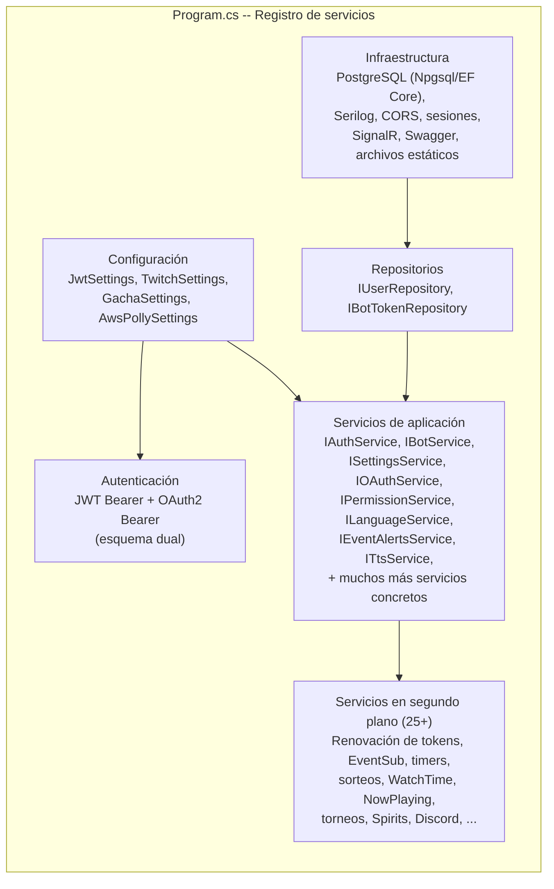

### 2.3 Pipeline de solicitudes

```mermaid
graph LR
    Request["Solicitud HTTP"]
    CORS["Middleware de CORS"]
    Session["Middleware de sesión"]
    Auth["Autenticación<br/>JWT / OAuth2"]
    Err["Middleware<br/>GlobalException"]
    Authz["Autorización"]
    Rate["Limitador de solicitudes<br/>(políticas nombradas)"]
    WS["WebSockets +<br/>middleware WS de Desktop"]
    Routing["Enrutamiento de endpoints"]
    Perm["Filtro del atributo<br/>RequirePermission"]
    Scope["Filtro del atributo<br/>RequireScope"]
    Controller["Acción del controlador"]
    Service["Servicio de aplicación"]
    Data["DecatronDbContext /<br/>repositorio"]
    PG["PostgreSQL"]

    Request --> CORS --> Session --> Auth --> Err --> Authz --> Rate --> WS --> Routing
    Routing --> Perm --> Controller
    Routing --> Scope --> Controller
    Controller --> Service --> Data --> PG
```

**Detalles clave del pipeline:**
- **Autenticación dual**: JWT Bearer para las sesiones del panel; `OAuthBearerHandler` propio para los tokens de la API pública
- **Canal activo**: cuando un usuario administra el canal de otro streamer, `ChannelSwitchController` guarda el canal activo en la sesión (`ActiveChannelId`). Los controladores lo resuelven por su cuenta. `ChannelAccessMiddleware` (que inyectaría un claim `ChannelOwnerId` a partir de ese valor de sesión) existe en `Decatron.Middleware/` pero **no está registrado** en `Program.cs`; `RequirePermission` usa el canal propio del usuario autenticado cuando falta el claim
- **RequirePermission**: jerarquía de tres niveles -- `commands` (1) < `moderation` (2) < `control_total` (3) -- asignada a 14 secciones (ver 5.3)
- **RequireSystemOwner**: restringe los endpoints de administración a los dueños del sistema (administradores de la plataforma)
- **RequireScope / RequireAnyScope**: valida los scopes de OAuth2 (25 scopes en las categorías de lectura, escritura y acción)
- **Límite de solicitudes**: políticas nombradas de ventana fija para endpoints públicos (`tcg-images`, `tournament-register`, `tournament-embed`, `live-translation-public`, `live-translation-claim`)
- **WebSocket de Desktop**: `DesktopWsMiddleware` sirve un único WebSocket multiplexado (`/api/desktop/ws`) para la app de escritorio Decatron Desktop

---

## 3. Arquitectura del frontend

### 3.1 Stack tecnológico

| Capa | Tecnología |
|------|------------|
| Framework | React 19 con TypeScript, compilado con Vite 7 |
| Enrutamiento | react-router-dom v7 (BrowserRouter) |
| Gestión de estado | React Context (Brand, Toast, Permissions, Language) -- sin Redux/Zustand |
| Cliente HTTP | Axios con interceptores de JWT (`services/api.ts`) |
| Tiempo real | @microsoft/signalr |
| Estilos | Tailwind CSS |
| Iconos | lucide-react |
| i18n | i18next + react-i18next + http-backend (un JSON por espacio de nombres en `public/locales/{es,en}`), idioma guardado en el backend |
| Componentes de UI | @headlessui/react |

### 3.2 Jerarquía de componentes

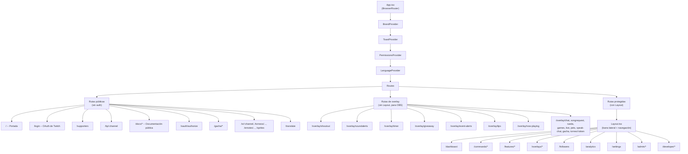

### 3.3 Estructura de rutas

Todas las rutas se declaran en `App.tsx` (unas 200 entradas `<Route>`). El control de acceso lo aplica el backend (`RequirePermission`, `RequireSystemOwner`); además, la SPA oculta las secciones que el usuario no puede usar mediante `PermissionsContext`. Las rutas se agrupan así:

| Grupo | Rutas | Auth |
|-------|-------|------|
| Portada y legales | `/`, `/login`, `/supporters`, `/terminos`, `/privacidad`, `/devoluciones`, `/libro-reclamaciones`, `/tip/privacy`, `/tip/terms` | No |
| Documentación pública | `/docs/*` (acerca de, primeros pasos, funciones, FAQ, API, variables, comandos por defecto/personalizados/microcomandos/scripting, overlays, Song Request, Rueda) | No |
| Páginas públicas para espectadores | `/tip/:channelName`, `/donate/:channelName`, `/commands/:channelName`, `/sr/:channelName`, `/sr/:channelName/p/:code`, `/torneos/:channelName/:editionSlug` (+ `/mi-panel`), `/embed/torneo/:channelName/:editionSlug/ranking`, `/emotes/global`, `/emotes/:channelName`, `/sprites`, `/sprites/:username`, `/gacha/*`, `/translate` | No |
| Overlays de OBS (sin layout) | `/overlay/{chat, shoutout, soundalerts, timer, giveaway, event-alerts, pets, tips, now-playing, songrequest, speak-chat, gacha, rueda, games, live}`, `/overlay/torneo/:token`, `/demo/game-overlay` | No (la URL del overlay lleva su propia clave o token) |
| Consentimiento OAuth | `/oauth/authorize` | Sesión |
| Panel | `/dashboard`, `/commands/*`, `/followers`, `/features/*` (timers, sorteos, alertas de sonido, IA, traducción en vivo, coach de LoL, chat de Decatron, propinas, speak chat, centro de moderación y sus páginas, emotes, lista de bots, torneos), `/overlays/*`, `/credits`, `/analytics`, `/settings`, `/discord/*` | JWT |
| Área personal | `/me`, `/me/account`, `/me/coins`, `/me/billing`, `/me/invoices`, `/me/gacha`, `/me/spirits`, `/me/tcg/*` | JWT |
| Documentación privada | `/dashboard/docs/*` (manuales de módulos: Song Request, Rueda, comandos, variables, overlays, ...) | JWT |
| Portal de desarrolladores | `/developer`, `/developer/apps/new`, `/developer/apps/:id/edit`, `/developer/docs` | JWT |
| Administración | `/admin/*` (IA, chat, donaciones, supporters, canales, mods, economía, TCG, correo, documentación interna, laboratorio y créditos de TTS, guía de diseño `/admin/estilo`, finanzas, traducción en vivo, costos de IA, análisis del proyecto, Fortnite, logos, emotes globales, marca, promos de overlays de juegos) | JWT + dueño del sistema |

### 3.4 Enfoque de gestión de estado

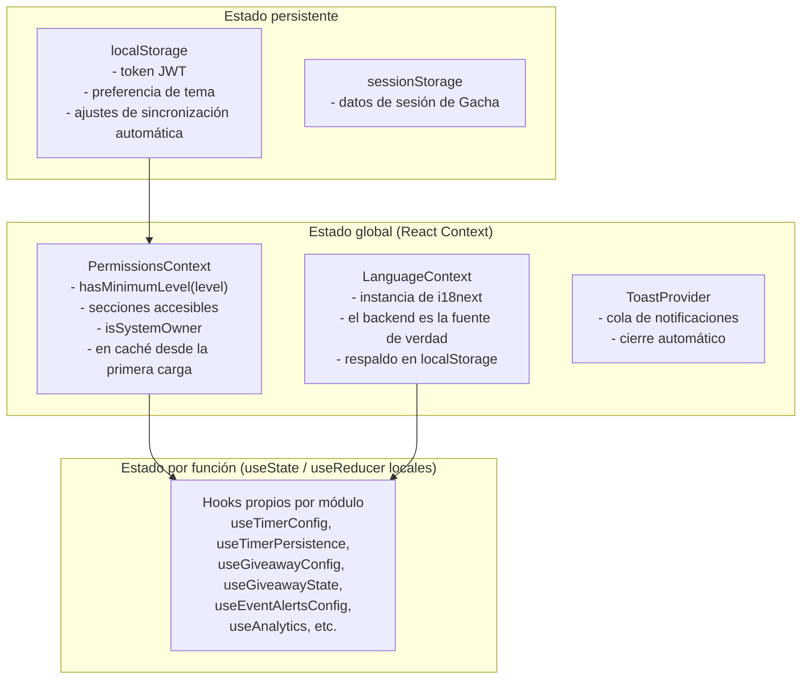

---
## 4. Comunicación en tiempo real

La comunicación en tiempo real usa tres hubs de SignalR y un WebSocket directo:

| Endpoint | Clase | Clientes | Método(s) para unirse |
|----------|-------|----------|-----------------------|
| `/hubs/overlay` | `OverlayHub` (`Decatron.Core/Hubs`) | Fuentes de navegador de OBS y vistas previas del panel | `JoinChannel(channel)` (grupo `overlay_{channel}`), `RegisterOverlay`, `SetOverlayVariant`, `LeaveChannel` |
| `/hubs/translation` | `TranslationHub` | Extensión de navegador que usan los espectadores para la traducción en vivo | `Join(login, lang)`, `Leave()` (un grupo por canal e idioma) |
| `/hubs/songrequest` | `SongRequestHub` | Reproductor, overlays, panel y cola pública de Song Request | `Watch(channel)`, `RegisterPlayer(channel, key)`, además de los reportes del reproductor (`PlayerIdle`, `PlayerEnded`, `PlayerError`, `PlayerProgress`) |
| `/api/desktop/ws` | `DesktopWsMiddleware` (WebSocket directo) | App de escritorio Decatron Desktop, una conexión multiplexada por canal (un `IDesktopChannel` por módulo) | Vinculada con un código desde el panel |

### Pipeline de traducción en vivo

La traducción en vivo convierte el micrófono del streamer en voz doblada por idioma de espectador. El recorrido de una sesión:

1. **Captura.** Decatron Desktop envía PCM mono de 16 kHz por el canal `translation` de `/api/desktop/ws` (`TranslationDesktopChannel`). `LiveTranslationSessionManager` guarda una `ChannelSession` por canal; una app nueva releva a la sesión anterior (motivo de fin `replaced`).
2. **Voz a texto.** La sesión transmite el audio a Deepgram (`SttModel`, `nova-3` por defecto) en el idioma de origen del streamer.
3. **Traducción.** Cada frase terminada la traduce `LiveTranslator` mediante OpenRouter, con Gemini de respaldo si OpenRouter falla. Una frase que esperó más de `MaxStaleSeconds` se descarta en lugar de traducirse.
4. **Texto a voz.** Se crea un pipeline por idioma destino solo mientras hay espectadores escuchándolo y se apaga tras `IdleLanguageStopSeconds` sin oyentes. Motores: Piper (estándar, local), Deepgram Aura y Fish Audio (premium).
5. **Entrega.** La extensión del espectador entra a `/hubs/translation` con `Join(login, lang)` y recibe `Status`, `SegmentStart`, `SegmentChunk` y `SegmentEnd` (además de `SegmentDropped` y `EngineFallback`). `GET /api/live-translation/public/{login}` le da los idiomas, el volumen de fondo sugerido y los valores de `ClientTuning`.

Los créditos se cobran en tres puntos: los segundos de audio (`SttCreditsPerSecond` convertido con la tarifa `live_stt`), cada llamada de traducción (por `AiCreditGate`) y los caracteres sintetizados. Piper usa la cuota estándar aparte; un motor premium sin créditos cae a Piper, y una sesión sin ningún crédito termina con el motivo `no_credits`. Las tarifas están en `credit_rates` y se editan desde Finanzas. Una sesión termina con uno de estos motivos: `stopped_by_user`, `disconnected`, `no_credits`, `timeout` (sin audio durante `IngestTimeoutSeconds`), `error`, `admin`, `replaced`, `restarted` o `server`, guardado en `live_translation_sessions`.

### Bot de Discord

`Decatron.Discord` ejecuta una conexión del bot (`DiscordBotService`, DSharpPlus) y los controladores REST del panel (`/api/discord/*`, casi todos detrás de `settings` con `control_total`).

- **Vinculación.** `GET /api/discord/auth` arma la invitación OAuth2 (`identify guilds bot applications.commands`, permiso `8`). El callback guarda una fila de `discord_guild_configs` por canal de Twitch y servidor; la primera vinculación de un servidor es su canal predeterminado para los comandos.
- **Comandos de barra.** Son comandos de primer nivel (`/live`, `/timer`, `/stats`, `/followage`, `/song`, `/level`, `/top`, `/achievements`, `/shop`, `/spirits`, `/spirit`, `/xp`, `/torneo`), registrados por servidor con un `PUT` masivo cuando el bot entra a un servidor y en cada arranque. `/xp` pide el permiso Gestionar servidor.
- **Alertas de directo.** El manejador EventSub de `stream.online` llama a `LiveAlertHandler`, que publica el mensaje (modos `instant`, `wait`, `instant_update`) y lo registra; `DiscordAlertPollingService` (cada minuto, cada alerta con su propio intervalo de al menos 10 minutos) lo edita y aplica la acción de fin de directo (`summary`, `none`, `delete`). Hay un enfriamiento de 5 minutos por canal.
- **Bienvenida.** `WelcomeHandler` escucha la entrada y salida de miembros y envía una imagen (la exportada del editor, luego `WelcomeImageGenerator`, luego un embed simple); también puede dar un rol y enviar un mensaje privado.
- **XP.** `MessageXpHandler` y `XpService` otorgan XP por mensaje (cooldown, tope por hora, boosts, bonus en vivo), llevan un nivel por servidor (`100 x nivel^2 x dificultad` de XP por nivel) y un nivel global, y alimentan a `AchievementService`, `SeasonalService` (ranking mensual), `XpRoleService` (roles acumulativos por nivel) y la tienda (`StoreExpirationService` retira cada 2 minutos los roles y accesos con vencimiento).

La mayor parte del tráfico de overlays pasa por el hub de overlays:

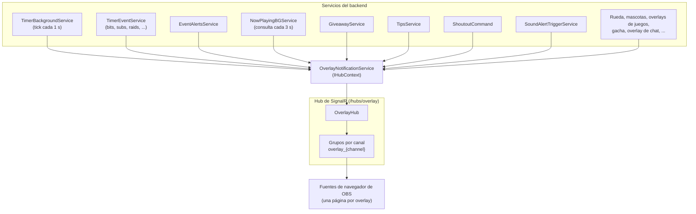

**Eventos de SignalR (servidor a cliente):**

| Evento | Origen | Contenido |
|--------|--------|-----------|
| `TimerTick` | TimerBackgroundService | segundos restantes, estado |
| `StartTimer` / `PauseTimer` / `ResumeTimer` / `ResetTimer` / `StopTimer` | OverlayNotificationService | estado del timer |
| `AddTime` | TimerEventService | segundos agregados, motivo |
| `TimerEventAlert` | TimerEventService | tipo de evento, usuario, cantidad, medios |
| `ShowEventAlert` | EventAlertsService | tipo de evento, tier, medios, URL de TTS |
| `EventAlertsConfigChanged` | EventAlertsController | -- |
| `ShowShoutout` | ShoutoutCommand | datos del usuario, URL del clip, configuración |
| `ShowSoundAlert` | SoundAlertTriggerService | datos de la recompensa, archivo de medios, configuración |
| `ShowTipAlert` | TipsService | donante, monto, mensaje, medios |
| `NowPlayingUpdate` / `NowPlayingStopped` | NowPlayingBackgroundService | datos de la canción, carátula, progreso |
| `GiveawayParticipantJoined` | GiveawayService | datos del participante |
| `TimerStateUpdate`, `TimerCommandExecuted`, `HappyHourStarted` / `HappyHourEnded` | OverlayNotificationService, `HappyHourWatcherService` | estado del timer, comando, ventana de la happy hour |
| `WheelSpin`, `WheelRaffleJoin`, `WheelConfigChanged` | OverlayNotificationService | resultado del giro, participante, configuración |
| `GachaPull` | OverlayNotificationService | resultado de la tirada |
| `PetEvent`, `PetConfigChanged` | PetService | estímulo de la mascota, configuración |
| `GameOverlayState`, `GameOverlayConfigChanged`, `LiveMatchState`, `LiveOverlayConfigChanged` | GameDataPollingService, GameOverlayConfigService, LiveOverlayService, LiveOverlaysController | estado de la partida, configuración |
| `ChatMessage` | ChatOverlayService | línea de chat con insignias y emotes |
| `RefreshOverlay`, `ConfigurationChanged` | varios controladores | -- |

---

## 5. Flujo de autenticación

### 5.1 Inicio de sesión con Twitch (sesiones de usuario)

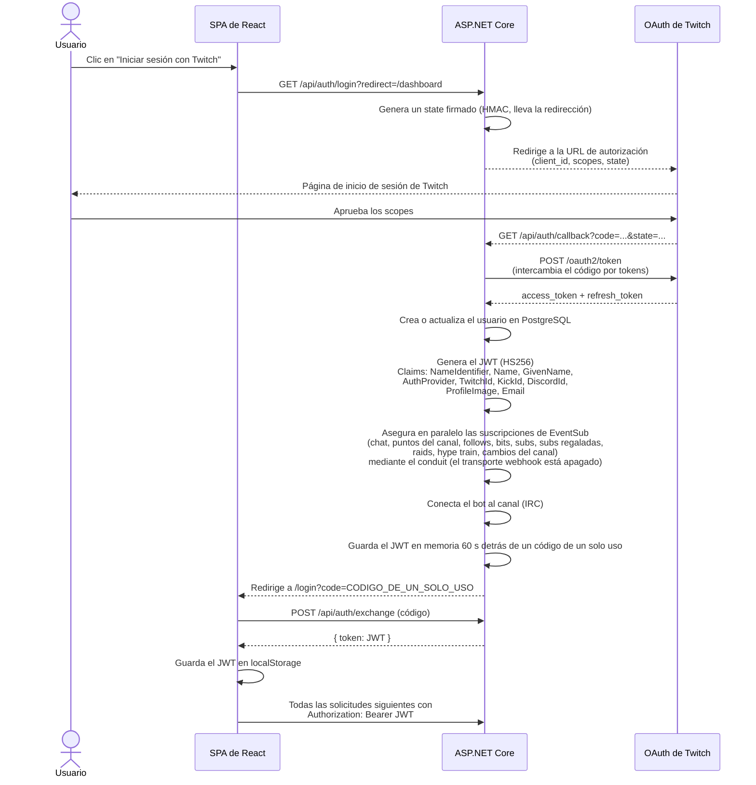

### 5.2 API pública OAuth2 (aplicaciones de terceros)

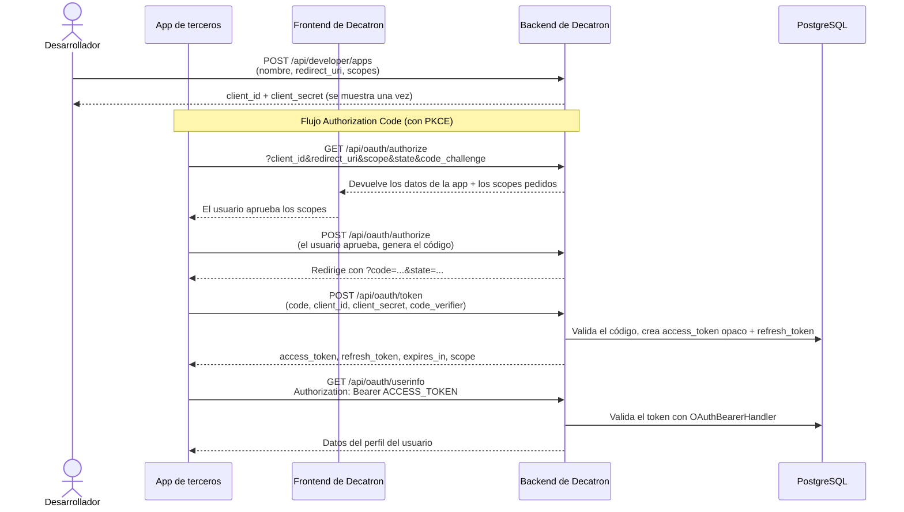

**Scopes de OAuth2 (25 en total en 3 categorías, definidos en `DecatronScopes.cs`):**

| Categoría | Scopes |
|-----------|--------|
| Lectura (10) | `read:profile`, `read:timer`, `read:commands`, `read:alerts`, `read:giveaways`, `read:goals`, `read:analytics`, `read:sounds`, `read:games`, `read:stream` |
| Escritura (6) | `write:timer`, `write:commands`, `write:alerts`, `write:giveaways`, `write:goals`, `write:sounds` |
| Acción (9) | `action:timer`, `action:alerts`, `action:chat`, `action:giveaway`, `action:goals`, `action:sounds`, `action:category`, `action:title`, `action:marker` |

`action:chat` (enviar mensajes al chat) es el único scope marcado como requeridor de verificación de la aplicación (`VerificationRequiredScopes`).

### 5.3 Jerarquía de permisos

El dueño del canal siempre tiene `control_total`. Los demás usuarios reciben un nivel por canal (`user_channel_permissions`). `PermissionService` asigna 14 secciones al nivel mínimo requerido:

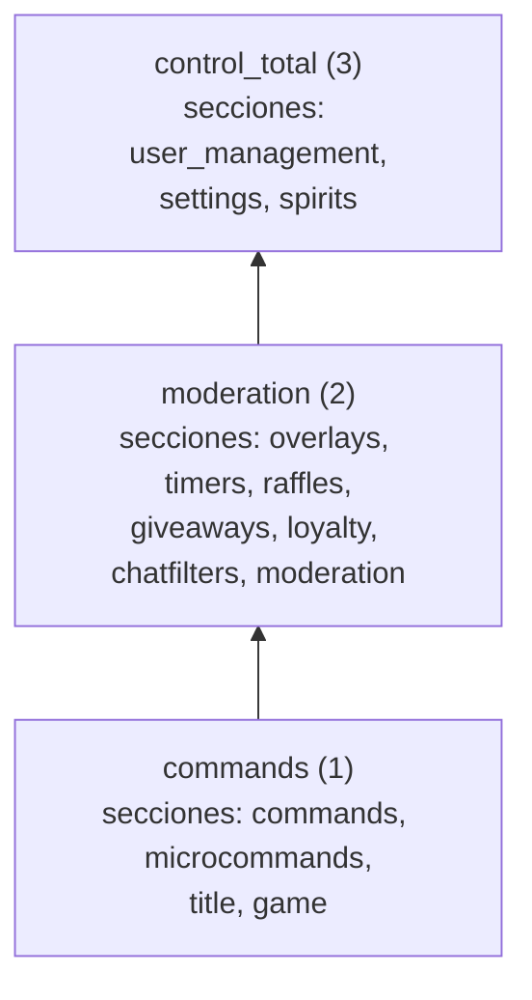

La moderación del chat (palabras prohibidas, enlaces, spam, raids, modo pánico) tiene sus propias reglas sobre quién cuenta como streamer, moderador o Lead Moderator en `ModerationPermissions`; un usuario con `control_total` en el canal cuenta allí como el streamer. Los endpoints de administración usan `RequireSystemOwner`.

---

## 6. Esquema de la base de datos

PostgreSQL con más de 240 tablas (entidades de EF Core más las tablas creadas por los scripts SQL de `Decatron.Data/Migrations/`). A continuación hay un diagrama ER de las tablas principales, generado desde el esquema de producción (claves primarias, claves foráneas y hasta ocho columnas por tabla; las tablas reales tienen más columnas).

```mermaid
erDiagram
    users {
        bigint id PK
        bigint account_id FK
        string twitch_id
        string login
        string display_name
        string email
        string profile_image_url
        string offline_image_url
    }

    bot_tokens {
        int Id PK
        string bot_username
        string bot_twitch_id
        string access_token
        string refresh_token
        string chat_token
        datetime token_expiration
        datetime created_at
    }

    system_admins {
        bigint id PK
        bigint user_id FK
        string username
        string role
        datetime created_at
    }

    system_settings {
        bigint id PK
        bigint user_id
        bool bot_enabled
        bool commands_enabled
        int command_cooldown
        bool timers_enabled
        int timer_min_messages
        bool auto_moderation_enabled
    }

    user_channel_permissions {
        bigint Id PK
        bigint channel_owner_id FK
        bigint granted_user_id FK
        bigint granted_by FK
        string access_level
        bool is_active
        datetime created_at
        datetime updated_at
    }

    custom_commands {
        int Id PK
        bigint user_id FK
        string channel_name
        string command_name
        text response
        string restriction
        bool is_active
        string created_by
    }

    timer_configs {
        int id PK
        bigint user_id FK
        string channel_name
        int default_duration
        bool auto_start
        jsonb display_config
        jsonb progressbar_config
        jsonb style_config
    }

    timer_states {
        int id PK
        bigint user_id FK
        string channel_name
        string status
        int time_remaining
        int total_time
        datetime started_at
        datetime paused_at
    }

    timer_sessions {
        int id PK
        bigint user_id FK
        string channel_name
        datetime started_at
        datetime ended_at
        int initial_duration
        int total_added_time
        datetime created_at
    }

    timer_event_logs {
        int id PK
        int timer_session_id FK
        string channel_name
        string event_type
        string username
        string user_id
        int time_added
        string details
    }

    event_alerts_configs {
        int id PK
        bigint user_id FK
        string channel_name
        jsonb config_json
        bool is_enabled
        datetime created_at
        datetime updated_at
    }

    sound_alert_configs {
        bigint id PK
        bigint user_id FK
        string username
        int global_volume
        bool global_enabled
        int duration
        jsonb text_lines
        jsonb styles
    }

    sound_alert_files {
        bigint id PK
        bigint user_id FK
        string username
        string reward_id
        string reward_title
        string file_type
        string file_path
        string file_name
    }

    shoutout_configs {
        bigint id PK
        bigint user_id FK
        string username
        int duration
        int cooldown
        bool show_debug_timer
        string shoutout_text
        jsonb text_lines
    }

    tips_configs {
        int id PK
        bigint user_id FK
        string channel_name
        bool is_enabled
        string paypal_email
        bool paypal_connected
        string currency
        decimal min_amount
    }

    tips_history {
        int id PK
        bigint user_id FK
        string channel_name
        string donor_name
        string donor_email
        decimal amount
        string currency
        string message
    }

    now_playing_configs {
        int id PK
        bigint user_id FK
        string channel_name
        bool is_enabled
        string provider
        string lastfm_username
        text spotify_access_token
        text spotify_refresh_token
    }

    giveaway_configs {
        int id PK
        string channel_id
        string name
        string prize_name
        text prize_description
        string duration_type
        int duration_minutes
        int max_participants
    }

    giveaway_sessions {
        int id PK
        int config_id FK
        string channel_id
        string name
        string prize_name
        text prize_description
        jsonb config_snapshot
        string status
    }

    giveaway_participants {
        int id PK
        int session_id FK
        string user_id
        string username
        string display_name
        bool is_follower
        bool is_subscriber
        smallint subscription_tier
    }

    giveaway_winners {
        int id PK
        int session_id FK
        int participant_id FK
        int position
        bool is_backup
        datetime selected_at
        bool has_responded
        datetime responded_at
    }

    raffles {
        int id PK
        bigint created_by FK
        bigint user_id FK
        string channel_name
        string name
        string description
        int winners_count
        string status
    }

    moderation_configs {
        bigint id PK
        bigint user_id
        string channel_name
        string vip_immunity
        string sub_immunity
        jsonb whitelist_users
        string warning_message
        string strike_expiration
    }

    banned_words {
        bigint id PK
        bigint user_id
        string channel_name
        string word
        string severity
        int detections
        datetime created_at
        datetime updated_at
    }

    oauth_applications {
        uuid id PK
        bigint owner_id FK
        string name
        text description
        string client_id
        string client_secret_hash
        ARRAY redirect_uris
        ARRAY scopes
    }

    oauth_access_tokens {
        uuid id PK
        uuid application_id FK
        bigint user_id FK
        string token
        ARRAY scopes
        datetime expires_at
        bool revoked
        string revoked_reason
    }

    decatron_ai_global_config {
        bigint id PK
        bool enabled
        string model
        int max_tokens
        text system_prompt
        string response_prefix
        int global_cooldown_seconds
        int min_channel_cooldown_seconds
    }

    decatron_ai_channel_permissions {
        bigint id PK
        bigint user_id FK
        string channel_name
        bool enabled
        bool can_configure
        text notes
        datetime created_at
        datetime updated_at
    }

    channel_followers {
        bigint id PK
        string broadcaster_id
        string broadcaster_name
        string user_id
        string user_name
        string user_login
        datetime followed_at
        datetime account_created_at
    }

    giveaway_configs ||--o{ giveaway_sessions : "config_id"
    giveaway_participants ||--o{ giveaway_winners : "participant_id"
    giveaway_sessions ||--o{ giveaway_participants : "session_id"
    giveaway_sessions ||--o{ giveaway_winners : "session_id"
    oauth_applications ||--o{ oauth_access_tokens : "application_id"
    timer_sessions ||--o{ timer_event_logs : "timer_session_id"
    users ||--o{ custom_commands : "user_id"
    users ||--o{ decatron_ai_channel_permissions : "user_id"
    users ||--o{ event_alerts_configs : "user_id"
    users ||--o{ now_playing_configs : "user_id"
    users ||--o{ oauth_access_tokens : "user_id"
    users ||--o{ oauth_applications : "owner_id"
    users ||--o{ raffles : "created_by"
    users ||--o{ raffles : "user_id"
    users ||--o{ shoutout_configs : "user_id"
    users ||--o{ sound_alert_configs : "user_id"
    users ||--o{ sound_alert_files : "user_id"
    users ||--o{ system_admins : "user_id"
    users ||--o{ timer_configs : "user_id"
    users ||--o{ timer_sessions : "user_id"
    users ||--o{ timer_states : "user_id"
    users ||--o{ tips_configs : "user_id"
    users ||--o{ tips_history : "user_id"
    users ||--o{ user_channel_permissions : "channel_owner_id"
    users ||--o{ user_channel_permissions : "granted_by"
    users ||--o{ user_channel_permissions : "granted_user_id"
```

**Características notables del esquema:**
- Las tablas de configuración guardan ajustes complejos como bloques JSONB (`config_json`, `events_config`, `display_config`)
- Algunas tablas antiguas identifican el canal por `username` (string) además de por `user_id` -- por ejemplo `shoutout_configs`, `sound_alert_configs` y `sound_alert_files`
- Unas pocas tablas se acceden con Npgsql directo en lugar de entidades de EF Core (por ejemplo `supporters_page_config` y `user_subscription_tiers`)
- Migraciones SQL manuales (no migraciones de EF Core): scripts en `Decatron.Data/Migrations/`, que se aplican a mano antes de reiniciar el backend
- Convención de nombres de columnas en snake_case mediante Fluent API

---
## 7. Mapa de módulos

Los módulos 01-21 vienen de la auditoría original del código; los módulos posteriores se agregan debajo. Se quitaron los conteos de líneas porque caducan rápido. Las columnas de archivos clave del backend y del frontend listan puntos de entrada, no todos los archivos.

| # | Módulo | Descripción | Archivos clave del backend | Archivos clave del frontend |
|---|--------|-------------|----------------------------|-----------------------------|
| 01 | **Núcleo / Configuración** | Punto de entrada de la aplicación, composición de DI, POCO de ajustes, interfaces de servicios, modelos de entidades de EF, middleware | `Program.cs`, `Decatron.Core/*`, `GlobalExceptionMiddleware.cs` | -- |
| 02 | **Autenticación y OAuth** | Inicio de sesión con Twitch, Kick y Discord, emisión de JWT, API pública OAuth2 (PKCE), autenticación de Gacha, permisos | `AuthController`, `OAuthController`, `DeveloperController`, `GachaAuthController`, `AuthService`, `OAuthService`, `PermissionService` | `Login.tsx`, `OAuthAuthorizePage.tsx`, `DeveloperPortal.tsx` |
| 03 | **Bot / Chat** | Bot IRC de Twitch, motor de comandos (por defecto + personalizados + con script), conversaciones de chat con IA, integración con la moderación | `TwitchBotService`, `CommandService`, `MessageSenderService`, `ChatController`, `ChatAdminController`, `CustomCommandsController` | -- |
| 04 | **API de Twitch / EventSub** | Envoltorio de la API Helix, EventSub (conduit con shards WebSocket; el antiguo endpoint de webhook responde 200 y no procesa nada), servicios de renovación de tokens, cambio de canal | `TwitchWebhookController`, `EventSubService`, `TwitchApiService`, `*TokenRefresh*` | -- |
| 05 | **Extensión del timer** | Timer extensible de stream (estilo subathon), timers de mensajes, eventos, horarios, happy hours, copias de seguridad, plantillas, medios, overlay | `TimerExtensionController`, `TimerEventService`, `TimerBackgroundService`, `TimerService` | `TimerOverlay.tsx`, `TimerConfig.tsx`, más de 23 archivos de pestañas y hooks |
| 06 | **Alertas de eventos** | Alertas visuales y de audio para eventos de Twitch (follow, bits, sub, raid, hype train), sistema de tiers, variantes, TTS, editor del overlay | `EventAlertsController`, `EventAlertsService`, `FollowAlertController` | `EventAlertsOverlay.tsx`, `EventAlertsConfig.tsx`, más de 20 archivos de la extensión |
| 07 | **Alertas de sonido** | Alertas de recompensas de puntos del canal con carga de medios, editor visual, overlay | `SoundAlertsController` | `SoundAlerts.tsx`, `SoundAlertsOverlay.tsx` |
| 08 | **Propinas / Donaciones** | Integración con PayPal, página de donación, alertas de propinas (modo básico o timer), overlay, estadísticas | `TipsController`, `TipsService` | `TipsConfig.tsx`, `TipsDonate.tsx`, `TipsOverlay.tsx`, `TipsOverlayEditor.tsx` |
| 09 | **Supporters** | Tiers de suscripción (Supporter/Premium/Founder), pago con PayPal, códigos de descuento, panel de administración | `SupportersController`, `SupportersService` | `SupportersConfig.tsx`, `SupportersPublic.tsx` |
| 10 | **Sorteos / Rifas** | Sorteos ponderados con anti-trampa, integración con el timer, sistema de rifas, monitoreo en segundo plano | `GiveawayController`, `GiveawayService`, `GiveawayBackgroundService`, `RaffleController`, `RaffleService` | 14 archivos del frontend (tipos, hooks, pestañas) |
| 12 | **Shoutout** | Overlay visual de shoutout con descarga de clips (yt-dlp), shoutouts automáticos, permisos | `ShoutoutController`, `ClipDownloadService` | `ShoutoutConfig.tsx`, `ShoutoutOverlay.tsx` |
| 13 | **Now Playing** | Integración con Spotify y Last.fm, consulta periódica cada 3 segundos, sistema de cupos de Spotify (el plan solo ordena la lista de espera), editor del overlay | `NowPlayingController`, `SpotifyController`, `NowPlayingService`, `NowPlayingBackgroundService`, `StreamStatusService` | `NowPlayingConfig.tsx`, `now-playing-extension/`, `NowPlayingOverlay.tsx` |
| 15 | **Seguidores / Analíticas** | Sincronización de seguidores desde la API de Twitch, detección de unfollows, panel de analíticas (6 pestañas), seguimiento del tiempo de visualización, actividad del chat | `FollowersController`, `FollowersService`, `AnalyticsController`, `WatchTimeTrackingService`, `ChatActivityService` | `Followers.tsx`, `Analytics.tsx` + 6 pestañas |
| 16 | **Scripting** | DSL propio (set/when/send), analizador, validador, ejecutor, microcomandos, búsqueda y caché de juegos | `ScriptsController`, `ScriptingService`, `ScriptParser`, `ScriptExecutor`, `MicroCommandsController`, `GameSearchService`, `GameCacheUpdateService` | `ScriptingEditor.tsx`, `ScriptingList.tsx`, `MicroCommands.tsx`, `CustomCommands.tsx`, `DefaultCommands.tsx` |
| 17 | **Decatron IA** | Chat con IA mediante Google Gemini / OpenRouter con respaldo, comando `!ia`, configuración por canal, panel de administración | `DecatronAIController`, `DecatronAIAdminController`, `GeminiService`, `OpenRouterService`, `AIProviderService`, `DecatronAICommand` | `DecatronAIConfig.tsx`, `DecatronAIAdmin.tsx`, `AIDoc.tsx` |
| 18 | **Ajustes** | Ajustes del bot, gestión de usuarios, preferencias de idioma, generación de TTS (AWS Polly), permisos de usuario | `SettingsController`, `SettingsService`, `LanguageController`, `TtsController`, `TtsService` | -- |
| 19 | **SignalR / Overlays** | Hubs en tiempo real (overlay, traducción, song request), servicio de notificación de overlays | `OverlayHub.cs`, `TranslationHub.cs`, `SongRequestHub.cs`, `OverlayNotificationService.cs` | -- |
| 20 | **Base de datos** | DbContext de EF Core (más de 200 DbSets), repositorios, cifrado de tokens, migraciones SQL manuales | `DecatronDbContext.cs`, `BotTokenRepository.cs`, `UserRepository.cs`, `Encryption/`, `Migrations/*.sql` | -- |
| 21 | **Frontend compartido** | Enrutador, servicio de API, contextos, hooks, Layout, overlays, documentación, portal de desarrolladores, páginas de Gacha | `App.tsx`, `api.ts`, `PermissionsContext.tsx`, `Layout.tsx`, componentes compartidos, páginas de overlay | Todo el frontend compartido |
| 22 | **Song Request** | Cola de canciones por chat en Twitch y Kick: resolutores de enlaces y búsqueda (YouTube, SoundCloud; los enlaces de Spotify, Apple Music y Deezer se buscan en YouTube), modos de pedido, filtros, listas negras, bandeja de revisión, playlists colaborativas con votación, estadísticas de escucha, límites por tier, páginas públicas de cola y playlists, overlay reproductor para OBS | `SongRequestController`, `Decatron.Services/SongRequest/*` (`SongResolverService`, `SongRequestChatHandler`, `SongRequestService`, `SongRequestLibraryService`, `SongRequestHub`, `SongRequestTierLimits`), canales de Decatron Desktop `SongImportDesktopChannel` y `DownloadsDesktopChannel` | `SongRequestConfig.tsx`, `song-request-extension/`, `SongRequestOverlay.tsx`, `SongRequestPublicPage.tsx`, `SongRequestPlaylistPage.tsx` |
| 23 | **Rueda y sorteo** | Ruedas de premios y ruedas de sorteo: gajos ponderados con stock, entrega de premios (giros gratis, tiradas de gacha, tiempo del timer, timeout, alertas de sonido, mensajes manuales) con una cola de entregas pendientes, billeteras de créditos por canal alimentadas por bits, subs regaladas, donaciones, puntos del canal y deca coins, topes anti-farmeo y reglas de giro, sorteos con tickets, requisitos y pesos, historial y estadísticas de giros, límites por tier, overlay público. Incluye el minijuego de timeout `!ruleta`, que es aparte | `WheelController` (clases parciales: Segments, Spins, Deliveries, History, Messages, Overlay, Raffle, Credits), `WheelService` (+ Delivery, Rules, Spins), `WheelWalletService`, `WheelRaffleService`, `Decatron.Default/Commands/WheelCommands.cs`, `RuletaCommand`, `RuletaController`, `RuletaBackgroundService` | `WheelConfig.tsx`, `features/wheel/`, `WheelOverlay.tsx`, `commands/RuletaConfig.tsx` |
| 24 | **Torneos** | Ediciones de torneos con llaves, inscripción, equipos, premios, patrocinadores, reglas, condiciones de victoria, formatos basados en Riot y en Fortnite, páginas públicas, ranking incrustable, overlay | `Tournament*Controller` (admin, público, embed, me, overlay, Fortnite, BlueShell...), `Decatron.Services/Tournament/*`, `TournamentRiotPollingService`, `TournamentSlashCommands` de Discord | `features/tournament-extension/`, `tournament-public/`, `TournamentPublicPage.tsx`, `TournamentOverlayPage.tsx`, `TournamentEmbedRankingPage.tsx` |
| 25 | **Traducción en vivo** | Reconocimiento de voz, traducción y texto a voz en tiempo real de un stream para los espectadores, impulsados por la app de escritorio y consumidos por una extensión de navegador | `LiveTranslationController`, `Decatron.Services/LiveTranslation/*`, `TranslationHub`, `TranslationDesktopChannel` | `LiveTranslationConfig.tsx`, `TranslatePublic.tsx`, `admin/LiveTranslationAdmin.tsx` |
| 26 | **Decatron Desktop** | WebSocket único y multiplexado para la app de escritorio; vinculación del dispositivo por código | `DesktopController`, `DesktopWsMiddleware`, `DesktopDeviceService`, `DesktopConnectionRegistry`, implementaciones de `IDesktopChannel` (traducción, importación de canciones, descargas) | `settings/DesktopAppSettings.tsx` |
| 27 | **Plataforma Kick** | Inicio de sesión de Kick, webhooks, acceso a la API y envío de mensajes al chat, para que varios módulos funcionen en ambas plataformas | `KickAuthController`, `KickWebhookController`, `Decatron.Services/Platforms/Kick/*`, `MessageSenderRouter`, `KickTokenRefreshService` | -- |
| 28 | **Bot de Discord** | Comandos slash, niveles de XP y tarjetas de rango, imágenes de bienvenida, alertas de directo, vinculación de cuentas | `Decatron.Discord/*` (`DiscordBotService`, `DecatronSlashCommands`, `Discord*Controller`, `Services/Xp*`) | `pages/discord/`, `settings/DiscordIntegration.tsx` |
| 29 | **Moderación (chat)** | Filtros de palabras, enlaces, spam y raids, strikes, permisos temporales, modo pánico, historial de acciones, Twitch y Kick | `ModerationController`, `Decatron.Services/Moderation/*` (`ChatModerator`, `PanicModeService`), `Decatron.Services/Commands/*` (nuke, permit, panic, strikes) | `features/moderation/`, `ModerationHub.tsx` |
| 30 | **Fortnite / Spirits** | Vinculación de cuentas de Fortnite mediante Epic, colección de spirits y notificaciones, galería pública | `FortniteController`, `EpicAuthController`, `FortniteService`, `SpiritNotifySweepBackgroundService`, `SpiritsCommand` | `me/MySpiritCollection.tsx`, `SpiritCollection.tsx`, `SpritesGallery.tsx`, `settings/EpicAccountsSettings.tsx` |
| 31 | **Overlay de chat y emotes** | Overlay de chat para OBS con insignias y emotes, emotes del canal y emotes globales de la plataforma, páginas públicas de emotes | `ChatOverlayController`, `ChannelEmotesController`, `GlobalEmotesController`, `PublicEmotesController`, `Decatron.Services/ChatOverlay/*`, `Decatron.Services/Emotes/*` | `ChatOverlay.tsx`, `features/ChatOverlayConfig.tsx`, `features/ChannelEmotes.tsx`, `ChannelEmotesPublic.tsx`, `GlobalEmotesPublic.tsx` |
| 32 | **Speak Chat / TTS** | Mensajes del chat y canjes de puntos del canal leídos en voz alta (filtros, generación de voz, entrega al overlay), voces y créditos de TTS | `SpeakChatController`, `SpeakChatService`, `TtsVoicesController`, `TtsCredits*Controller`, `TtsCreditService`, `PiperTtsService`, `PollyVoiceCatalogService` | `features/SpeakChat.tsx`, `SpeakChatOverlay.tsx` |
| 33 | **Créditos y pagos** | Saldo unificado de créditos para funciones de pago (IA, TTS), paquetes de créditos, pagos con tarjeta (Culqi), comprobantes, perfiles de facturación, deca coins | `CreditPurchaseController`, `CoinController`, `AiCreditGate`, `CoinService`, `BillingProfileService`, `SupporterInvoiceService` | `Credits.tsx`, `me/MeCoins.tsx`, `me/MeBilling.tsx`, `me/MeInvoices.tsx` |
| 34 | **Overlays de juegos y Riot** | Overlays con datos de juego (estado de la partida, partida en vivo), cuentas de juego, promos, coach de LoL | `GameOverlaysController`, `LiveOverlaysController`, `RiotAccountController`, `GameAccountsController`, `LolCoachController`, `Decatron.Services/GameData/*` | `features/game-overlays/`, `features/live-overlay/`, `GameOverlay.tsx`, `LiveOverlay.tsx`, `features/LolCoachConfig.tsx` |
| 35 | **Mascotas** | Mascota en el overlay del canal; los eventos del canal (alertas, chat, comandos) disparan sus reacciones | `PetsController`, `Decatron.Services/Pets/*` | `features/pets/`, `PetsOverlay.tsx` |
| 36 | **Gacha / TCG** | Tiradas de gacha y colecciones para los espectadores, y cartas coleccionables (TCG) | `GachaController`, `GachaPublicController`, `GachaViewerController`, `TcgController`, `GachaService`, `TcgCardsService` | `gacha/`, `me/tcg/`, `GachaOverlay.tsx` |
| 37 | **Lista de bots** | Catálogo global de bots conocidos (lo mantiene el dueño de la plataforma) con cambios por canal, usado para reconocer bots en el chat | `BotListController`, `BotListService` | `features/BotList.tsx` |
| 38 | **Marca y sistema de diseño** | Gestión de logos y los tokens de diseño editables en vivo que usan el panel y el sitio público | `BrandController`, `DesignController`, `BrandService`, `DesignService` | `src/brand/`, `src/design/`, `components/ds/` |
| 39 | **Administración de la plataforma** | Controladores y páginas solo para administradores (usuarios, mods, costos de IA, finanzas, correo, documentación interna, análisis del proyecto). Se documenta aquí solo a nivel de arquitectura | `Admin*Controller`, `FinanceAdminController`, `EmailAdminController`, `DevDocsController`, `ProjectAnalysisController`, todos protegidos con `RequireSystemOwner` | `pages/admin/*` |

---

### Créditos y pagos

Un canal tiene un saldo de créditos (`tts_credit_balances`) y un libro mayor solo de altas (`tts_credit_ledger`). `TtsCreditService` es el único lugar que cobra o acredita.

- **Bolsas.** Los créditos mensuales vienen del plan (150 000, 500 000 y 1 500 000 en Supporter, Premium y Fundador; ninguno en el plan gratis) y se gastan primero; los comprados no vencen. La voz estándar (Piper) tiene su propia cuota mensual en caracteres (1, 3, 6 y 10 millones según el plan) y nunca toca los créditos. Los tiers sin límite registran el uso con valor 0.
- **Tarifas.** Lo que cuesta cada motor por unidad vive en `credit_rates` (se edita desde Finanzas), leído mediante `CreditRates` con un caché de un minuto; un motor sin tarifa se cobra con un valor de resguardo deliberadamente alto. `GET /api/tts-credits/summary` devuelve el saldo, el gasto por función y las tarifas vigentes para la página `/credits`.
- **Compra.** `GET /api/tts-credits/packages` lista `credit_packages`; `POST /api/tts-credits/billing-preview` muestra el comprobante que se emitiría; `POST /api/tts-credits/buy` cobra el precio del paquete convertido a PEN al tipo de cambio de la plataforma mediante Culqi (`/v2/charges`, llaves de `PaymentModeService`, de prueba o reales), registra una fila de `credit_purchases` con los datos de facturación congelados y acredita los créditos. Solo el dueño del canal puede comprar y antes debe existir el perfil de facturación. Un cargo confirmado sin id de cargo queda en el registro para revisión manual, igual que un cargo que no se acreditó.
- **Comprobantes.** `BillingProfileService` valida el perfil (tipo de documento según el país, formatos de RUC, DNI, CE y pasaporte, consulta del RUC a SUNAT) y arma la vista previa: boleta con IGV incluido (18 %), factura con IGV para quien tiene RUC y la pide, o factura de exportación sin IGV para un domicilio extranjero. La emisión es asíncrona (`PENDING` a `ACCEPTED`); `GET /api/tts-credits/purchases` lista las compras con el estado de su comprobante y `.../download/{pdf|xml|cdr}` devuelve los archivos.

### Planes y supporters

Los planes (tiers `free`, `supporter`, `premium` y `fundador`) los asigna `SupportersService` y se resuelven en todas partes mediante `TierResolver`; cada módulo lee sus propios límites del tier efectivo, así que un plan solo cambia cantidades.

- **Página pública.** `GET /api/supporters/public-config` (título, objetivo, opciones), `GET /api/supporters/list-public` (supporters activos para el muro) y `GET /api/supporters/tier-limits`, que arma la tabla «qué cambia en cada plan» con las mismas clases de límites que aplica el bot (`-1` significa sin tope).
- **Compra.** La página consulta primero `POST /api/supporters/billing-preview`, que también ejecuta `EvaluarCompraAsync`: una compra nunca puede dejar al comprador con menos de lo que tenía (renovar suma tiempo desde el vencimiento actual, subir es inmediato, bajar o comprar sobre un plan permanente se bloquea antes de cobrar, y de mensual a permanente es una mejora). Luego `POST /api/supporters/create-culqi-charge` cobra mediante Culqi (exige sesión y perfil de facturación), registra el pago (`supporter_payments`), asigna el tier con la referencia del pago y encola el comprobante. Los códigos de descuento se validan con `GET /api/supporters/validate-code` (porcentaje o monto fijo). Los endpoints de órdenes de PayPal siguen en el controlador, pero la página solo usa Culqi. Las donaciones libres (`POST /api/supporters/create-culqi-donation`, desde US$ 1) no asignan nada.
- **Vencimiento.** Los planes mensuales son períodos prepagados, no suscripciones: cuando pasa `tier_expires_at`, el usuario vuelve a resolverse como `free` y no se cobra nada. Los permanentes no tienen fecha de fin.
- **Perfil de facturación y comprobantes.** `GET`/`PUT /api/supporters/billing-profile`, `GET /api/supporters/billing-profile/ruc/{ruc}` (consulta a SUNAT) y `GET /api/supporters/my-invoices` con `.../download/{pdf|xml|cdr}`; el mismo perfil lo usan las compras de créditos.

### Plataforma Kick

Kick es una segunda plataforma junto a Twitch. Un canal de Kick es su propia fila en `users` (`KickId`, tokens), y un canal de Twitch y uno de Kick de la misma persona se agrupan bajo una `Account`; los overlays usan la fila principal de la cuenta (la de Twitch si existe) para que ambas plataformas compartan un enlace y una configuración (ver el patrón de overlays multiplataforma en `.dev`).

- **Inicio de sesión y vinculación.** `GET /api/auth/kick/login` inicia OAuth con PKCE (estado y verificador en cookies de `.decatron.net`); `POST /api/auth/kick/link-start` vincula un canal de Kick a la cuenta con sesión iniciada y `POST /api/auth/kick/unlink` lo separa. Un canal que pertenece a otra cuenta se rechaza (`kick_already_linked`). El JWT se entrega mediante el genérico `/api/auth/exchange`.
- **Eventos.** En cada inicio de sesión con Kick, `KickEventSubService` se suscribe a `chat.message.sent` y a `channel.reward.redemption.updated` (método webhook, API de Kick `/public/v1/events/subscriptions`). `KickWebhookController` verifica la firma RSA (`Kick-Event-Signature`) y entrega los mensajes del chat al overlay y a `CommandService` (el canal llega como el `KickId` numérico) y los canjes de recompensas a las alertas de sonido. Esos dos son los únicos eventos que Kick envía; no se reciben follows, suscripciones ni raids.
- **Salida.** `MessageSenderRouter` decide por canal si una respuesta va a Twitch o a `KickConnector`, que publica en `/public/v1/chat` con el token del propio canal. `KickApiService` también borra mensajes, banea y desbanea para la moderación y lista las recompensas del canal.
- **Panel.** Los overlays y las funciones llevan una marca `kickReady` o `kickVerified`; una sesión de Kick muestra el resto como «Próximamente en Kick». Los comandos sin datos en Kick (`followage`, `so`) o por construir (`title`, `game`) están marcados en el catálogo de comandos por defecto.

## 8. Integraciones externas

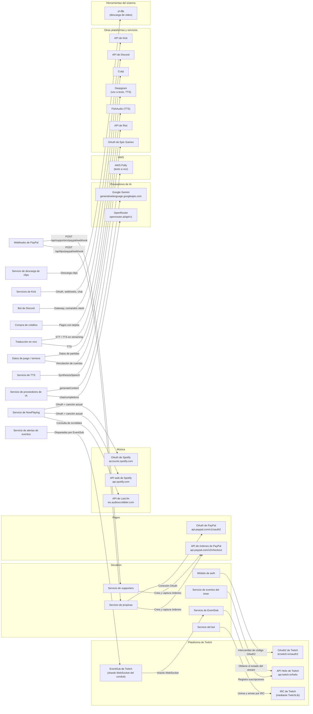

### Detalle de las integraciones

| Integración | Método de autenticación | Flujo de datos | Intervalo de consulta |
|-------------|-------------------------|----------------|-----------------------|
| **OAuth de Twitch** | OAuth2 Authorization Code | Inicio de sesión, intercambio de tokens, renovación cada 30 min | -- |
| **API Helix de Twitch** | Bearer (token de usuario o de aplicación) | Datos de usuario, streams, clips, puntos del canal, seguidores, chatters | Bajo demanda |
| **EventSub de Twitch** | Token de acceso de la aplicación; conduit alimentado por shards WebSocket (`EventSubSettings:ShardCount`). El transporte webhook (HMAC-SHA256) está apagado desde el 2026-08-06: `POST /api/twitch/webhook` responde 200 y no hace nada | Por usuario: chat, puntos del canal, follow, bits, sub, mensaje de resub, sub regalada, raid, etapas del hype train, cambios del canal, stream online/offline; más una suscripción `conduit.shard.disabled` por cliente. Las suscripciones se crean en el conduit | Por eventos (push) |
| **IRC de Twitch** | Token OAuth mediante TwitchLib | Mensajes del chat (envío y recepción), procesamiento de comandos | Conexión persistente |
| **PayPal** | OAuth2 Client Credentials | Creación y captura de órdenes, notificaciones por webhook | Bajo demanda + webhook |
| **Spotify** | OAuth2 Authorization Code | Canción actual, estado de reproducción | Cada 3 segundos (segundo plano) |
| **Last.fm** | API key (parámetro de consulta) | Canciones recientes, datos de la canción | Cada 3 segundos (segundo plano) |
| **Google Gemini** | API key (`GeminiSettings:ApiKey`) | Generación de contenido para el comando `!ia` | Bajo demanda |
| **OpenRouter** | Token Bearer (cabecera) | Chat completions (proveedor de respaldo) | Bajo demanda |
| **AWS Polly** | Credenciales de AWS (IAM) | Generación de audio de texto a voz con caché de archivos | Bajo demanda, en caché |
| **yt-dlp** | Ninguno (binario del sistema) | Descarga de clips de Twitch para el overlay de shoutout; resolución de medios para Song Request (`SongRequest:YtDlpPath`) | Bajo demanda |
| **Kick** | OAuth2 (`KickSettings`) | Inicio de sesión, webhooks, llamadas a la API y mensajes de chat | Por eventos + bajo demanda |
| **Discord** | Token de bot + OAuth2 (`DiscordSettings`) | Comandos slash, XP, imágenes de bienvenida, alertas de directo | Gateway + `DiscordAlertPollingService` |
| **Culqi** | API keys (`CulqiSettings`, `CulqiSettingsTest`) | Pagos con tarjeta de paquetes de créditos y tiers | Bajo demanda |
| **Deepgram / FishAudio** | API keys | Reconocimiento de voz y texto a voz de la traducción en vivo | En streaming |
| **API de Riot** | API keys (`RiotApi`) | Datos de cuentas y consulta de partidas para torneos y overlays de juegos | `TournamentRiotPollingService`, `GameDataPollingService` |
| **Epic Games** | OAuth2 (`EpicSettings`) | Vinculación de cuentas de Fortnite | Bajo demanda |

---

## 9. Servicios en segundo plano

Más de 25 servicios hospedados se registran en `Program.cs` y se ejecutan de forma continua junto al servidor web. Se agrupan abajo; los intervalos son los programados en cada clase.

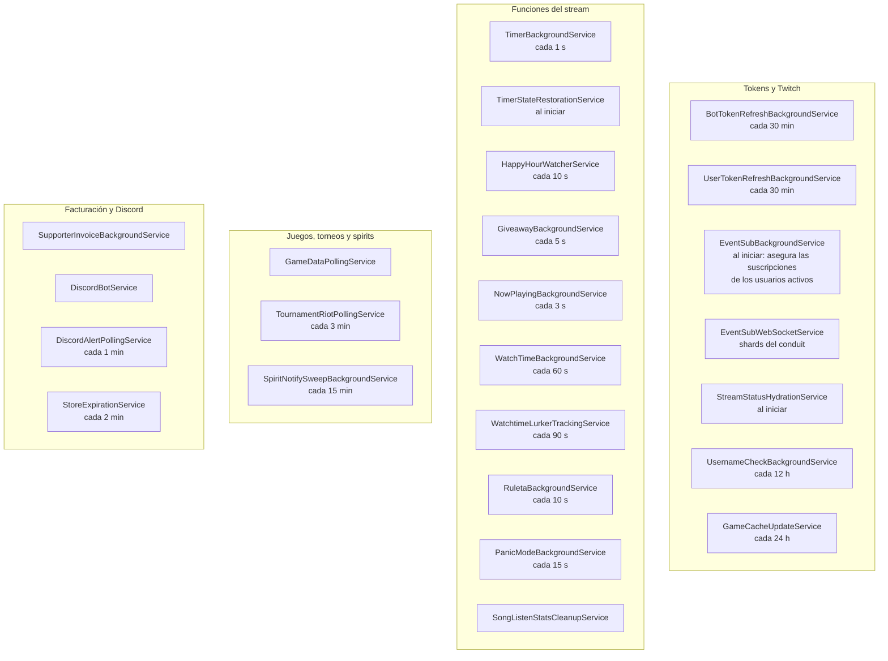

| Servicio | Intervalo | Responsabilidad |
|----------|-----------|-----------------|
| `BotTokenRefreshBackgroundService` | 30 min | Renueva de forma anticipada los tokens del bot de Twitch antes de que venzan |
| `UserTokenRefreshBackgroundService` | 30 min | Renueva de forma anticipada los tokens de Twitch de los usuarios (y los de Kick, mediante `IKickTokenRefreshService`) antes de que venzan |
| `EventSubBackgroundService` | Al iniciar | Recorre todos los usuarios activos con el bot habilitado y asegura sus suscripciones de EventSub en el conduit |
| `EventSubWebSocketService` | Persistente | Crea o reutiliza el conduit de EventSub y ejecuta sus shards WebSocket (`EventSubSettings:ShardCount`) |
| `StreamStatusHydrationService` | Al iniciar | Reconstruye el estado en vivo/fuera de línea en memoria, ya que `IStreamStatusService` lo guarda solo en memoria |
| `UsernameCheckBackgroundService` | 12 h | Detecta cambios de nombre de usuario de Twitch |
| `GameCacheUpdateService` | 24 h | Actualiza la caché local de juegos/categorías de Twitch que usa la búsqueda de juegos |
| `TimerBackgroundService` | 1 s | Envía `TimerTick` por SignalR, evalúa la pausa automática por horario, guarda copias de seguridad automáticas y ejecuta los timers de mensajes |
| `TimerStateRestorationService` | Al iniciar | Restaura los timers que estaban activos cuando el servidor se detuvo por última vez |
| `HappyHourWatcherService` | 10 s | Avisa al overlay cuando una happy hour empieza o termina |
| `GiveawayBackgroundService` | 5 s | Termina los sorteos con tiempo, procesa los tiempos de respuesta de los ganadores y promueve a los de respaldo |
| `NowPlayingBackgroundService` | 3 s | Consulta Spotify o Last.fm de cada canal activo y avisa al overlay |
| `WatchTimeBackgroundService` | 60 s | Actualiza el tiempo de visualización de los espectadores |
| `WatchtimeLurkerTrackingService` | 90 s | Registra a los lurkers consultando la lista de chatters |
| `RuletaBackgroundService` | 10 s | Restaura al moderador cuando vence un timeout de `!ruleta` contra un moderador |
| `PanicModeBackgroundService` | 15 s | Termina los modos pánico vencidos y recarga los activos al iniciar |
| `SongListenStatsCleanupService` | Periódico | Limpia las estadísticas de escucha de Song Request |
| `GameDataPollingService` | Según los límites del plan | Consulta los datos de juego para los overlays de juegos y de partida en vivo |
| `TournamentRiotPollingService` | 3 min | Consulta la API de Riot para los modos de torneo basados en Riot |
| `SpiritNotifySweepBackgroundService` | 15 min | Envía avisos de Fortnite Spirits (chat de Twitch y DM de Discord) |
| `SupporterInvoiceBackgroundService` | 2 min | Emite los comprobantes de las compras de tier y de deca coins |
| `DiscordBotService` | Persistente | Mantiene la conexión del bot de Discord y los comandos slash |
| `DiscordAlertPollingService` | 1 min | Revisa los directos para las alertas de directo de Discord |
| `StoreExpirationService` | 2 min | Hace vencer los artículos de la tienda de Discord |

**Secuencia de arranque en `Program.cs`** (después de construir la aplicación): siembra la caché de juegos y los alias, renueva todos los tokens del bot, comprueba que yt-dlp esté instalado (si no, se registra una advertencia) e inicia `TwitchBotService` mediante `Task.Run()` (no es un `BackgroundService`). El bot mantiene la conexión IRC persistente con Twitch y reintenta la conexión un número limitado de veces (3) tras una desconexión.

---

*Las cifras, como la cantidad de tablas y de servicios, se redondean a propósito; el código es la fuente de verdad. Última revisión contra el código: 2026-10-10.*
