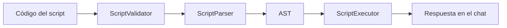
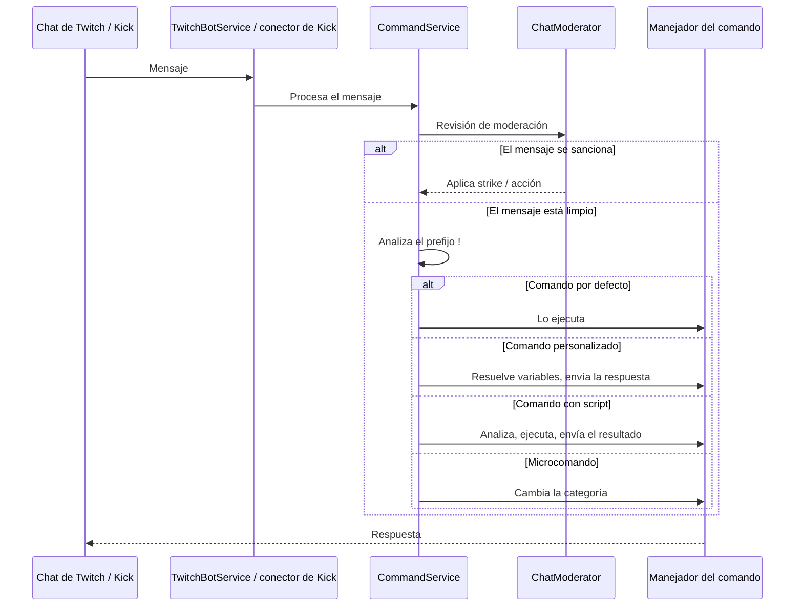

# Referencia de comandos

> English: [../COMMANDS.md](../COMMANDS.md)

Referencia de los comandos del bot de Decatron: los comandos por defecto, los comandos personalizados, el lenguaje de scripting, los microcomandos y los comandos de los módulos principales. Las descripciones de los comandos por defecto salen de `Resources/bot-metadata/{en,es}.json`, la misma fuente que leen el panel y la documentación pública.

---

## Contenido

- [Comandos por defecto](#comandos-por-defecto)
- [Comandos del timer](#comandos-del-timer)
- [Comandos personalizados](#comandos-personalizados)
- [Sistema de scripting](#sistema-de-scripting)
- [Microcomandos](#microcomandos)
- [Comandos de Song Request](#comandos-de-song-request)
- [Comandos de rueda y sorteo](#comandos-de-rueda-y-sorteo)
- [Comando de ruleta](#comando-de-ruleta)
- [Comandos y sistema de moderación](#comandos-y-sistema-de-moderación)
- [Comandos de sorteo (giveaway)](#comandos-de-sorteo-giveaway)
- [Gacha, Spirits y otros comandos](#gacha-spirits-y-otros-comandos)
- [Niveles de permisos](#niveles-de-permisos)
- [Arquitectura](#arquitectura)

---

## Comandos por defecto

Los registra `CommandService` al iniciar; están disponibles cuando el bot está habilitado en un canal. La columna "Quién puede usarlo" aparece solo donde se comprobó en el código del comando.

### Información del stream

| Comando | Alias | Descripción | Quién puede usarlo | Ejemplo |
|---------|-------|-------------|--------------------|---------|
| `!title` | `!t` | Cambia o consulta el título del stream | Consultar: todos. Cambiar: streamer y moderadores | `!title`, `!title Nuevo título del stream` |
| `!game` | `!g` | Cambia o consulta la categoría/juego del stream | Consultar: todos. Cambiar: streamer y moderadores | `!game`, `!game Just Chatting` |
| `!g` | | Gestión de categorías y microcomandos (ver abajo) | | `!g`, `!g Just Chatting` |

En Kick, `!title` y `!game` figuran como "próximamente": Kick ya expone la API necesaria, pero el trabajo aún no está hecho.

#### Subcomandos de `!g`

| Sintaxis | Descripción | Ejemplo |
|----------|-------------|---------|
| `!g` | Ver la categoría actual | `!g` |
| `!g [nombre]` | Cambiar la categoría | `!g League of Legends` |
| `!g set [!cmd] [categoría]` | Crear un microcomando | `!g set !lol League of Legends` |
| `!g remove [!cmd]` | Quitar un microcomando | `!g remove !lol` |
| `!g list` | Listar los microcomandos del canal | `!g list` |

### Comunidad

| Comando | Descripción | Quién puede usarlo | Ejemplo |
|---------|-------------|--------------------|---------|
| `!so` | Hace shoutout a un usuario mostrando su último clip y perfil en el overlay | Streamer y moderadores | `!so @usuario` |
| `!followage` | Muestra el tiempo que llevas siguiendo el canal | Todos | `!followage`, `!followage @usuario` |
| `!ia` | Pregunta a Decatron IA | Lo define la configuración de IA del canal (tiempo de espera por canal y por usuario) | `!ia dame un dato curioso` |
| `!raffle` | Sorteo de chat: `join`, `create <nombre>`, `close`, `draw`, `status` | Crear, cerrar y sortear: streamer y moderadores. Unirse y ver el estado: todos | `!raffle join` |
| `!join` | Únete al giveaway activo | Lo define la configuración del giveaway | `!join` |
| `!watchtime` | Muestra cuánto tiempo llevas viendo el stream actual (se reinicia cuando termina el stream) | | `!watchtime` |
| `!commands` | Publica el enlace a la página pública de comandos del canal (`/commands/{canal}`) | | `!commands` |

En Kick, `!followage` y `!so` no están disponibles: la API pública de Kick no tiene la fecha de follow ni los clips.

### Juegos y Coach de LoL

Comandos de los módulos Game Overlays y Coach de LoL. Leen el mismo estado que muestra el overlay.

| Comando | Alias | Descripción | Quién puede usarlo |
|---------|-------|-------------|--------------------|
| `!rango` | `!rank` | Rango actual del streamer en el juego que está jugando | |
| `!lp` | `!puntos` | Puntos (LP/RR/ELO) ganados o perdidos en el stream de hoy | |
| `!sesion` | `!session` | Victorias y derrotas del stream de hoy | |
| `!ultimas` | `!recent` | Últimas partidas del streamer con KDA | |
| `!cuentas` | `!accounts` | Cuentas del streamer en el juego actual y su rango | |
| `!juego` | | Fuerza el juego del overlay o vuelve a automático (`!juego lol`, `!juego auto`) | Streamer y moderadores |
| `!setrango` | | Fija a mano el rango de la cuenta visible, para juegos sin API | Streamer y moderadores |
| `!rankup`, `!rankdown` | | Sube o baja una división el rango manual | Streamer y moderadores |
| `!win`, `!loss` | | Suma una victoria o una derrota a la sesión de hoy | Streamer y moderadores |
| `!matchup` | | Matchup de la partida actual según el Coach de LoL (Decatron Desktop) | |
| `!build` | `!runas` | Runas, hechizos y primeros ítems que sugirió el Coach de LoL | |
| `!coach` | | Lo último que dijo el Coach de LoL o el resumen de la partida recién terminada | Todos, 30 s entre usos salvo moderadores |
| `!vs` | | Cómo le va al streamer contra un campeón (rival directo, últimas 60 partidas) | |
| `!duo` | | Récord del streamer con su dúo del lobby, con alguien concreto, o sus dúos más frecuentes | |
| `!pool` | | Champ pool del streamer con winrate | |
| `!meta` | | Objetivo del día: verlo (todos) o fijarlo (`!meta <texto>`, `!meta off`) | Ver: todos. Fijar: streamer y moderadores |
| `!pred` | | Predice si el streamer gana o pierde la partida de LoL en curso, con puntos de predicción del canal (`!pred win 200`) | |
| `!predtop` | | Top 5 de puntos de predicción del canal | |

### Gestión de comandos personalizados

| Comando | Descripción | Quién puede usarlo | Ejemplo |
|---------|-------------|--------------------|---------|
| `!crear` | Crea un comando personalizado (normal o con script) desde el chat | Streamer, moderadores y administradores de la plataforma | `!crear !discord Únete a nuestro Discord` |
| `!editcom` | Edita un comando personalizado existente | Streamer, moderadores y administradores de la plataforma | `!editcom !discord Texto nuevo` |
| `!delcom` | Borra un comando personalizado existente | Streamer, moderadores y administradores de la plataforma | `!delcom !discord` |

---

## Comandos del timer

Estos comandos controlan el overlay de la extensión del timer. Todos usan el prefijo `!d`.

### Control (streamer y moderadores)

| Comando | Descripción | Ejemplo |
|---------|-------------|---------|
| `!dstart` | Inicia el timer con una duración específica | `!dstart 5m`, `!dstart 1h30m`, `!dstart 300` |
| `!dpause` | Pausa el timer actual | `!dpause` |
| `!dplay` | Resume o inicia el timer pausado | `!dplay` |
| `!dreset` | Reinicia el timer al tiempo total configurado | `!dreset` |
| `!dstop` | Detiene el timer completamente y lo oculta del overlay | `!dstop` |
| `!dtimer` | Gestiona el timer: iniciar, añadir o quitar tiempo | `!dtimer 5m`, `!dtimer add 1h`, `!dtimer remove 30s` |

### Consulta

| Comando | Descripción |
|---------|-------------|
| `!dtiempo` | Cuánto tiempo queda en el timer |
| `!dcuando` | Cuándo terminará el timer |
| `!dstats` | Estadísticas de la sesión actual |
| `!drecord` | El récord del timer |
| `!dtop` | Mayores contribuyentes del timer |

---

## Comandos personalizados

Los comandos personalizados son comandos de respuesta de texto con soporte de variables, creados desde el panel (Comandos > Personalizados) o desde el chat con `!crear`.

### Crear

**Desde el panel:** Comandos > Personalizados, crea el comando, dale un nombre (por ejemplo `!discord`), una respuesta y un nivel de acceso.

**Desde el chat:**

```
!crear !nombrecomando Texto de la respuesta
```

### Niveles de acceso

La `Restriction` de un comando:

| Nivel | Quién puede usarlo |
|-------|--------------------|
| `all` | Todos |
| `mod` | Moderadores y streamer |
| `vip` | VIP, moderadores y streamer |
| `sub` | Suscriptores, moderadores y streamer |

### Variables

Las respuestas las resuelve `VariableResolver`. Las variables usan la forma `$(nombre)`:

| Variable | Descripción |
|----------|-------------|
| `$(user)` | El usuario que ejecutó el comando |
| `$(touser)` | El usuario mencionado en el comando; el que lo ejecutó si no se menciona a nadie |
| `$(ruser)` | Un usuario aleatorio del chat (usa la API de Twitch) |
| `$(channel)` | El nombre del canal |
| `$(game)` | La categoría actual |
| `$(uptime)` | Cuánto lleva el stream en vivo |
| `$(followage)` | Cuánto tiempo lleva siguiendo el canal el primer argumento (o quien ejecuta) |
| `$(accountage)` | Antigüedad de la cuenta de Twitch del primer argumento (o de quien ejecuta) |
| `$(count)` | Contador avanzado. Todos pueden verlo e incrementarlo; solo los moderadores pueden usar set/reset |
| `$(uses)` | Contador simple que se incrementa cada vez que se usa el comando |
| `$(roll)` | Número aleatorio, de 1 a 100 por defecto; `$(roll:min-max)` define el rango |
| `$(flip)` | Lanzar una moneda |
| `$(8ball)` | Bola mágica 8 con 20 respuestas en español |
| `$(choice:a,b,c)` | Elige al azar entre opciones separadas por coma o `\|` |
| `$(percent)` | Porcentaje aleatorio de 0 a 100 |
| `$(time)`, `$(date)` | Hora o fecha actual; `$(time:formato)` y `$(date:formato)` definen el formato |

Las mismas variables, con ejemplos, están en la documentación pública en `/docs/variables`.

### API de comandos personalizados

| Método | Endpoint | Descripción |
|--------|----------|-------------|
| `GET` | `/api/CustomCommands` | Lista los comandos personalizados del canal activo |
| `GET` | `/api/CustomCommands/{id}` | Obtiene un comando |
| `POST` | `/api/CustomCommands` | Crea un comando |
| `PUT` | `/api/CustomCommands/{id}` | Actualiza un comando |
| `DELETE` | `/api/CustomCommands/{id}` | Elimina un comando |

El panel también permite importar y exportar los comandos personalizados en JSON.

---

## Sistema de scripting

Decatron incluye un lenguaje de scripting pequeño para comandos avanzados, con lógica condicional, variables y funciones.

### Cadena de procesamiento



### Sintaxis

El lenguaje tiene tres instrucciones: `set`, `when...then...end` y `send`.

```
set variable = valor
set resultado = roll(1, 6)
set eleccion = pick("piedra, papel, tijera")

when $(resultado) >= 4 then
    send "Sacaste un $(resultado): ¡ganas!"
end
when $(resultado) < 4 then
    send "Sacaste un $(resultado): pierdes."
end

send "¡Hola $(user), bienvenido a $(channel)!"
```

Los bloques `when` se evalúan uno tras otro; encadena varios para obtener un comportamiento if / else-if.

### Funciones

| Función | Descripción | Ejemplo |
|---------|-------------|---------|
| `roll(min, max)` | Entero aleatorio entre `min` y `max`. `min` debe ser menor que `max` | `roll(1, 100)` |
| `pick("a, b, c")` | Un elemento aleatorio de una lista separada por comas | `pick("sí, no, quizás")` |
| `count()` | Cantidad de ejecuciones del comando actual (contador persistente) | `count()` |

### Operadores

`==`, `!=`, `>`, `<`, `>=`, `<=`, `+` y `-`.

### Gestión de scripts

En el panel (Comandos > Scripting) el editor ofrece resaltado de sintaxis, validación en vivo, vista previa con datos simulados, autocompletado y deshacer/rehacer.

| Método | Endpoint | Descripción |
|--------|----------|-------------|
| `GET` | `/api/scripts` | Lista los scripts del canal activo |
| `GET` | `/api/scripts/{id}` | Obtiene un script |
| `POST` | `/api/scripts/validate` | Valida la sintaxis sin guardar |
| `POST` | `/api/scripts/preview` | Ejecuta un script con datos simulados |
| `POST` | `/api/scripts` | Crea un script |
| `PUT` | `/api/scripts/{id}` | Actualiza un script |
| `DELETE` | `/api/scripts/{id}` | Elimina un script |

### Tipos de nodo del AST

`ScriptProgram` (raíz), `SetStatement`, `WhenStatement`, `SendStatement`, `BinaryExpression`, `FunctionCallExpression`, `VariableExpression`, `LiteralExpression`.

---

## Microcomandos

Los microcomandos son atajos de cada canal que cambian la categoría del stream.

1. Un moderador o el streamer asigna un `!comando` a un nombre de juego/categoría.
2. Cuando alguien con permiso lo escribe, el bot cambia la categoría.

```
!g set !lol League of Legends
!g set !apex Apex Legends
!g set !mc Minecraft
```

| Acción | Sintaxis en el chat | Panel |
|--------|---------------------|-------|
| Crear | `!g set !cmd Nombre de la categoría` | Botón de crear con autocompletado de juegos |
| Quitar | `!g remove !cmd` | Botón de eliminar |
| Listar | `!g list` | Lista completa con búsqueda |

### Palabras reservadas

Estos nombres no pueden usarse como microcomandos: `!g`, `!game`, `!set`, `!remove`, `!delete`, `!list`, `!help`, `!title`, `!t`.

### Búsqueda de juegos

Los nombres de juegos se resuelven con una búsqueda híbrida: primero los alias locales, luego la tabla `game_cache` y después la API de Twitch (y el resultado se guarda en caché local).

### API de microcomandos

| Método | Endpoint | Descripción |
|--------|----------|-------------|
| `GET` | `/api/commands/microcommands` | Lista los microcomandos |
| `POST` | `/api/commands/microcommands` | Crea o actualiza un microcomando |
| `PUT` | `/api/commands/microcommands/{id}` | Actualiza un microcomando |
| `DELETE` | `/api/commands/microcommands/{id}` | Elimina un microcomando |
| `GET` | `/api/commands/microcommands/search/{command}` | Busca un microcomando |
| `GET` | `/api/commands/microcommands/check-availability/{command}` | Comprueba si un nombre está disponible |
| `GET` | `/api/commands/microcommands/search-games?q=&limit=` | Autocompletado de juegos |

---

## Comandos de Song Request

Song Request permite a los espectadores pedir canciones desde el chat en Twitch y Kick, o desde la página pública `/sr/{canal}`. Un pedido acepta un enlace de YouTube, SoundCloud, Spotify, Deezer o Apple Music, o el nombre de la canción. Las canciones van a una cola que suena en un overlay de OBS (consulta [Overlay de Song Request](OVERLAYS.md#overlay-de-song-request)).

Los comandos de abajo se generan desde la misma fuente que usan el panel y la página pública. **Acceso por defecto** es el rol mínimo: ese rol y los superiores pueden usar el comando, y quien tenga control total en el panel cuenta como el streamer. Cada canal puede cambiarlo en el panel (Overlays → Song Request → Comandos).

#### Pedir y consultar

| Comando | Acceso por defecto | Descripción |
|---|---|---|
| `!sr <link o nombre>` | Todos | Pide una canción con un link de YouTube, Spotify, SoundCloud, Deezer o Apple Music, o escribiendo el nombre. (También: `!songrequest`) |
| `!sr #<número>` | Todos | Pide a la cola, por su número, una canción de la playlist de fondo. |
| `!wrongsong` | Todos | Quita de la cola tu último pedido, por si te equivocaste. |
| `!song` | Todos | Dice qué canción suena ahora, con el link. (También: `!currentsong`) |
| `!lastsong` | Todos | Dice cuál fue la canción anterior, con el link. (También: `!prevsong`) |
| `!queue` | Todos | Muestra las próximas canciones y el link a la cola. |
| `!myqueue` | Todos | Dice en qué puesto están tus pedidos. |
| `!skip` | Todos | Vota para saltar la canción que suena (pedido o de la playlist); se salta con 3 votos. |
| `!srvolume` | Todos | Dice el volumen de la música. |

#### Playlist de fondo

| Comando | Acceso por defecto | Descripción |
|---|---|---|
| `!pl` | Todos | Dice cuál es la playlist de fondo y qué número está sonando. |
| `!playlist [nombre]` | Todos | Da el enlace para escuchar las playlists públicas del canal; con un nombre, el de esa playlist. |
| `!plplay <playlist \| #número>` | Lead Mods+ | Con el nombre, pone esa playlist de fondo (suena cuando no hay pedidos). Con #número salta ya a esa canción de la playlist de fondo; si suena un pedido, va apenas termine. Se pueden juntar: !plplay chill #19. (También: `!srplay`) |
| `!plstop` | Lead Mods+ | Para la playlist de fondo: con la cola vacía no suena nada. También vale !plplay off. |
| `!plnext` | Mods+ | Pasa a la siguiente canción de la playlist de fondo. No salta pedidos (para eso, !skip). |
| `!plshuffle [on \| off]` | Lead Mods+ | La playlist de fondo suena al azar (on) o en orden (off); sin nada, cambia entre los dos. |
| `!pladd <playlist> <link o nombre>` | Según la playlist | Agrega una canción a una playlist colaborativa. Si hay una sola abierta, no hace falta el nombre de la playlist. Quién puede agregar lo decide cada playlist. |

#### Reproductor

Sirven para todo lo que suene: pedidos y playlist de fondo.

| Comando | Acceso por defecto | Descripción |
|---|---|---|
| `!skip` | Mods+ | Salta la canción que suena (pedido o de la playlist), sin votación. (También: `!srskip`, `!srnext`) |
| `!srpause · !srresume` | Lead Mods+ | Pausa o reanuda la música. El overlay sigue a la vista; !srresume también sale de un stop. |
| `!srstop` | Lead Mods+ | Silencio y overlay oculto, sin perder la canción ni la cola. !srresume lo muestra de nuevo y sigue donde se quedó. Los pedidos nuevos no lo reanudan solos. |
| `!srvolume <0-100>` | Lead Mods+ | Cambia el volumen de la música. |
| `!srvideo · !srcover` | Lead Mods+ | El reproductor muestra el video o la portada, sin cortar la música. |

#### Cola

| Comando | Acceso por defecto | Descripción |
|---|---|---|
| `!srclear` | Lead Mods+ | Vacía la cola de pedidos. La que suena sigue y lo que espera revisión no se toca. |
| `!srremove <posición>` | Mods+ | Quita de la cola el pedido en esa posición. |
| `!srpromote <posición>` | Mods+ | Sube el pedido en esa posición al primer lugar de la cola. |

#### Revisión

| Comando | Acceso por defecto | Descripción |
|---|---|---|
| `!srapprove [número]` | Mods+ | Aprueba lo que espera revisión por su número en la bandeja; sin número, el más viejo. |
| `!srreject [número]` | Mods+ | Rechaza lo que espera revisión por su número en la bandeja; sin número, el más viejo. |

#### Administrar

| Comando | Acceso por defecto | Descripción |
|---|---|---|
| `!srmode <open \| playlists \| review \| closed>` | Lead Mods+ | Cambia el modo de pedidos al instante: abiertos, solo de las playlists, con revisión o cerrados. Sin nada, dice el modo actual. (También: `abiertos`, `revisión`, `cerrados`) |
| `!sropen · !srclose` | Lead Mods+ | Abre o cierra los pedidos. |
| `!srban [@usuario]` | Lead Mods+ | Sin nada, veta la canción que suena y la salta; con @usuario, veta a esa persona. |
| `!srunban @usuario` | Lead Mods+ | Le quita el veto a un usuario para que vuelva a pedir. Los vetos de canciones y artistas se quitan en el dashboard. |

#### Modos de pedido

`!srmode <open | playlists | review | closed>` cambia cómo entran los pedidos de `!sr`:

| Modo | Comportamiento |
|------|----------------|
| `open` | Se acepta cualquier canción que pase los filtros |
| `playlists` | Solo canciones de las playlists del canal (y `!sr #número`) |
| `review` | Cada pedido espera a que un moderador lo apruebe (`!srapprove` / `!srreject`) |
| `closed` | No se aceptan pedidos |

La guía completa para usuarios (puesta en marcha, filtros, playlists, diseño) está en la documentación del panel, en Song Request.

---

## Comandos de rueda y sorteo

El módulo de la Rueda tiene dos tipos de rueda: **ruedas de premios** (los espectadores obtienen giros con créditos y ganan el premio del gajo que sale) y **ruedas de sorteo** (los espectadores se inscriben y la rueda elige un ganador). El bot decide el resultado; el overlay (consulta [Overlay de la rueda](OVERLAYS.md#overlay-de-la-rueda)) solo lo anima.

Estos son los nombres por defecto. Los comandos de giro, saldo, compra e inscripción se pueden renombrar por rueda en el panel; los de moderación son fijos.

| Comando | Acceso | Descripción |
|---------|--------|-------------|
| `!dgirar` | Todos | Gira la rueda y cobra el precio del giro en créditos. `!dgirar 5` gira varias veces seguidas (hasta el máximo configurado) y se cobra junto |
| `!dcreditos` | Todos | Muestra el saldo de créditos de quien lo escribe |
| `!dcomprar <coins>` | Todos | Cambia las deca coins de quien lo escribe por créditos. Solo responde si la fuente "Deca coins" está activa y la persona tiene cuenta de Decatron |
| `!djoin` | Todos | Inscribe a quien lo escribe en el sorteo mientras las inscripciones están abiertas |
| `!drueda abrir` | Moderadores, Lead Moderators, streamer | Abre las inscripciones y anuncia el comando para unirse |
| `!drueda cerrar` | Moderadores, Lead Moderators, streamer | Cierra las inscripciones |
| `!drueda sortear` | Moderadores, Lead Moderators, streamer | Sortea y anuncia al ganador (un mensaje por ganador) |
| `!drueda reset` | Moderadores, Lead Moderators, streamer | Vacía el grupo de participantes sin anunciarlo |

Los créditos vienen de bits, subs regaladas, donaciones, recompensas de puntos del canal o deca coins, con un precio configurable por giro, topes anti-farmeo (espera entre giros, giros por espectador por stream) y reglas de giro (sin repetir, pity, multigiro). Tipos de premio: sin premio, mensaje manual, giros gratis, tiradas de gacha, tiempo del timer, timeout y alerta de sonido. Los sorteos admiten tickets, costo en créditos, requisitos (subs, seguidores, tiempo mínimo de visualización) y pesos (tiempo de visualización, sub, tier de supporter, coins gastadas). La guía completa para usuarios está en la documentación del panel, en Rueda.

---

## Comando de ruleta

`!ruleta` es un minijuego de chat estilo ruleta rusa, aparte de la Rueda. Quien lo escribe se apunta a sí mismo (`!ruleta`) o a otro usuario (`!ruleta @usuario`), y hay una probabilidad configurable (17 % por defecto) de recibir un timeout. El timeout se aplica mediante la API de Twitch, así que el bot debe ser moderador del canal. Apuntarle a un moderador requiere el rol Lead Moderator de Twitch.

| Ajuste | Descripción |
|--------|-------------|
| Probabilidad y timeout | Probabilidad de acierto y timeout mínimo y máximo en segundos (al azar entre ambos) |
| Enfriamientos | Global y por usuario, en segundos |
| Permisos | Todos, suscriptores, VIP, moderadores, Lead Moderators o solo el streamer |
| Objetivos | Permitir apuntarse a uno mismo; permitir apuntar a moderadores (el bot quita el rol de moderador, aplica el timeout y lo restaura automáticamente) |
| Usuarios especiales | Los protegidos nunca pueden ser objetivo; los bloqueados no pueden usar el comando. El streamer siempre es inmune |
| Mensajes | Varios mensajes de acierto y fallo (y otros para cuando se apunta a sí mismo) con `{shooter}`, `{target}` y `{seconds}` |

---

## Comandos y sistema de moderación

La moderación del chat funciona en Twitch y Kick. **Cada filtro se activa por separado y empieza apagado.** El streamer, los Lead Moderators, los moderadores, la lista blanca y quien tenga control total del canal en el panel nunca son sancionados.

### Comandos

El rol mínimo de cada comando se elige en el panel (Moderación > Comandos); el orden es moderador < Lead Moderator < streamer (el control total cuenta como streamer), y a quien no le alcanza el rol se lo ignora en silencio. Por defecto `!permit`, `!strikes` y `!nuke` los usa un moderador; `!resetstrikes`, `!addword`/`!delword`, `!addlink`/`!dellink` y `!panico` requieren un Lead Moderator. Lead Moderator es un rol de Twitch: en Kick no existe, así que esos comandos solo los usa el dueño o quien tenga control total, a menos que bajes el rol. `!nuke` mira 60 segundos hacia atrás por defecto (hasta 300) y da un timeout de 10 minutos, o un ban.

| Comando | Descripción |
|---------|-------------|
| `!permit @usuario` | Deja pasar los enlaces de un usuario, por un tiempo o por un mensaje, según el filtro de enlaces |
| `!strikes @usuario` | Muestra en qué strike está un usuario y cuándo baja el próximo |
| `!resetstrikes @usuario` | Deja en 0 los strikes de un usuario |
| `!addword <palabra o frase> [leve\|medio\|severo]` | Agrega una palabra prohibida (leve si no se indica severidad) |
| `!delword <palabra>` | Quita una palabra prohibida |
| `!addlink <dominio>` | Permite un dominio en el filtro de enlaces |
| `!dellink <dominio>` | Quita un dominio permitido |
| `!nuke <frase>` | Sanciona a todos los que escribieron esa frase en los últimos segundos. No toca al streamer, los moderadores, los Lead Moderators ni la lista blanca |
| `!panico`, `!pánico`, `!panic` | Activa el modo pánico (o lo extiende); `!panico off` lo apaga. No disponible en Kick |

### Filtros

| Filtro | Qué hace |
|--------|----------|
| Palabras prohibidas | Palabras y frases con comodín `*` (`*spam*` coincide con `spammer`, `antispam`), hasta 500 por canal, con tres severidades: leve (escalado normal), media (strike y al menos 10 minutos de timeout) y severa (ban directo) |
| Enlaces | Bloquea enlaces, incluso disfrazados (`sitio . com`, `sitio(dot)com`), salvo los dominios permitidos (con sus subdominios) o quien tenga un `!permit`. Un enlace bloqueado siempre se borra |
| Spam | Mayúsculas, símbolos, emotes, mensajes largos, repetición, copypasta, texto zalgo y menciones masivas, cada uno con sus propios umbrales |
| Raids y bots | Modo pánico, filtro de cuentas nuevas y frases de bots que venden espectadores. En Kick solo funciona el filtro de frases de bots (la API de Kick no puede cambiar los modos del chat ni informa la edad de las cuentas) |

### Strikes

Por defecto los strikes escalan con las acciones de abajo; cada paso es configurable. Los strikes bajan un nivel tras el tiempo configurado sin infracciones (por defecto 15 minutos).

| Strike | Acción por defecto |
|--------|--------------------|
| 1 | Advertencia |
| 2 | Timeout de 1 minuto |
| 3 | Timeout de 5 minutos |
| 4 | Timeout de 10 minutos |
| 5 | Ban |

Los VIP y los suscriptores tienen **escalado** por defecto (se los sanciona como a cualquiera) y se pueden configurar con inmunidad total. La página de historial lista cada sanción con quién la aplicó y permite levantar un timeout o un ban y devolver el strike.

Los mensajes que envía el bot en cada acción se pueden personalizar con `$(user)`, `$(strike)` y `$(word)`.

### API de moderación

| Método | Endpoint | Descripción |
|--------|----------|-------------|
| `GET` | `/api/moderation/banned-words` | Lista las palabras prohibidas |
| `POST` | `/api/moderation/banned-words` | Agrega una palabra prohibida |
| `DELETE` | `/api/moderation/banned-words/{id}` | Quita una palabra prohibida |
| `POST` | `/api/moderation/banned-words/import` | Importa palabras desde JSON |
| `GET` | `/api/moderation/config` | Obtiene la configuración de moderación |
| `POST` | `/api/moderation/config` | Actualiza la configuración de moderación |
| `POST` | `/api/moderation/test-message` | Prueba un mensaje contra los filtros |
| `GET` | `/api/moderation/stats` | Estadísticas diarias de moderación |

---

## Comandos de sorteo (giveaway)

| Comando | Descripción | Ejemplo |
|---------|-------------|---------|
| `!join` (por defecto, configurable) | Únete al giveaway activo | `!join` |

El nombre del comando para unirse es configurable por sorteo. Los requisitos de participación (seguidor, suscriptor, tiempo de visualización, antigüedad de la cuenta, etc.) los valida el servidor.

---

## Gacha, Spirits y otros comandos

### Gacha (`!gacha`, forma corta `!gc`)

| Sintaxis | Descripción |
|----------|-------------|
| `!gacha` | Muestra la ayuda |
| `!gacha pull [n]` (alias `!gcpull`) | Tira una vez o `n` veces |
| `!gacha pulls [usuario]` (alias `!gcpulls`) | Ver las tiradas disponibles |
| `!gacha col [usuario]` (alias `!gccol`) | Ver una colección |
| `!gacha pause` / `!gacha resume` (alias `!gcpause`, `!gcresume`) | Pausar o reanudar una multitirada |

### Fortnite Spirits (`!spirits`, `!spirit`)

Por defecto todo se refiere a la temporada actual; `all` muestra todas las temporadas y el nombre de una temporada filtra esa.

| Sintaxis | Descripción |
|----------|-------------|
| `!spirits [@usuario] [all\|temporada]` | Ver el progreso |
| `!spirits top [all\|temporada]` | Tabla de posiciones global (top 5) |
| `!spirits missing [@usuario] [all\|temporada]` | Los primeros spirits que faltan |
| `!spirit <nombre>` | Marcar un spirit como obtenido |
| `!spirit remove <nombre>` | Desmarcar un spirit |

---

## Niveles de permisos

Decatron usa un sistema jerárquico de permisos para el panel, con tres niveles:

| Nivel | Valor | Descripción |
|-------|-------|-------------|
| `commands` | 1 | Acceso básico a comandos |
| `moderation` | 2 | Herramientas de moderación más todo lo de `commands` |
| `control_total` | 3 | Control total más todo lo de `moderation` |

Secciones (según `PermissionService`):

| Nivel | Secciones |
|-------|-----------|
| `commands` | `commands`, `microcommands`, `title`, `game` |
| `moderation` | `overlays`, `timers`, `raffles`, `giveaways`, `loyalty`, `chatfilters`, `moderation` |
| `control_total` | `user_management`, `settings`, `spirits` |

El dueño del canal siempre tiene `control_total` en su propio canal. Los comandos de chat tienen sus propias comprobaciones (streamer, Lead Moderator, moderador, VIP, suscriptor), descritas en cada sección de arriba.

---

## Arquitectura

### Procesamiento de comandos



### Envío de mensajes

Los mensajes del bot pasan por `MessageSenderService` (Twitch) y `MessageSenderRouter` (enrutamiento por plataforma). En Twitch usan la API Helix (`POST /helix/chat/messages`) mediante una cola con 100 ms de espera entre mensajes.

### Internacionalización

Las respuestas de los comandos admiten español e inglés mediante `CommandMessagesService`. `CommandTranslationService` aporta los metadatos de los comandos (descripción, alias, ejemplos de uso) desde `Resources/bot-metadata/{es,en}.json`, que también leen el panel y la documentación pública.
