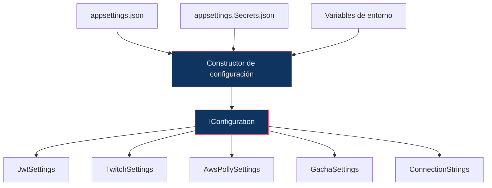
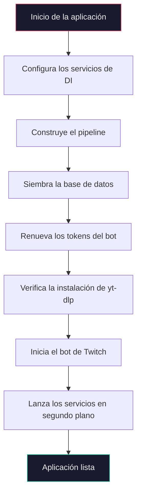
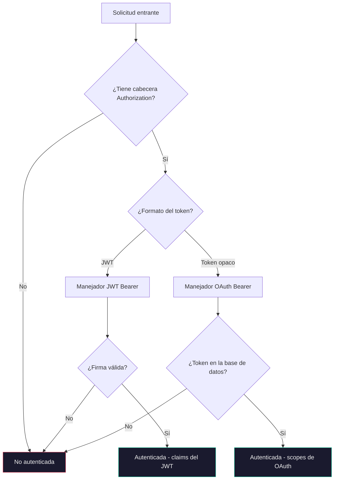

# Referencia de configuración

> English: [../CONFIGURATION.md](../CONFIGURATION.md)

Guía para configurar Decatron v2: archivos de configuración, Twitch, base de datos, integraciones, sesiones, permisos y registros. La lista completa de ajustes (nombres, tipos y valores por defecto) está en [ENV_VARIABLES.md](ENV_VARIABLES.md).

---

## Contenido

- [Descripción general](#descripción-general)
- [Archivos de configuración](#archivos-de-configuración)
- [Referencia de ajustes](#referencia-de-ajustes)
- [Configuración de Twitch](#configuración-de-twitch)
- [Configuración de la base de datos](#configuración-de-la-base-de-datos)
- [AWS Polly (TTS)](#aws-polly-tts)
- [Integración con PayPal](#integración-con-paypal)
- [Integración con Spotify](#integración-con-spotify)
- [CORS y archivos estáticos](#cors-y-archivos-estáticos)
- [Servicios en segundo plano](#servicios-en-segundo-plano)
- [Sesión y autenticación](#sesión-y-autenticación)
- [Sistema de permisos](#sistema-de-permisos)
- [Configuración de registros](#configuración-de-registros)

---

## Descripción general

Decatron v2 está construido sobre ASP.NET Core 8 y usa un sistema de configuración por capas:

1. **`appsettings.json`** -- Configuración pública (registros, hosts permitidos, scopes de Twitch)
2. **`appsettings.Secrets.json`** -- Credenciales privadas (no se suben al control de versiones)
3. **`appsettings.Secrets.{Environment}.json`** -- Sobrescrituras por entorno (staging, producción)
4. **Variables de entorno** -- Patrón estándar de ASP.NET Core (`Seccion__Clave`). Ten en cuenta que los dos archivos `appsettings.Secrets*` se agregan después de las fuentes por defecto, así que ganan a las variables de entorno; consulta el orden de carga en [ENV_VARIABLES.md](ENV_VARIABLES.md#archivos-de-configuración-y-orden-de-carga)

La configuración se carga al iniciar en `Program.cs` y se enlaza a clases de ajustes tipadas mediante `IOptions<T>`.



---

## Archivos de configuración

### appsettings.json (se sube al repositorio)

Este archivo contiene ajustes no sensibles que se pueden compartir. Estas son las secciones de primer nivel que tiene hoy (el propio archivo es la fuente de verdad):

| Sección | Claves | Propósito |
|---------|--------|-----------|
| `TwitchSettings` | `Scopes` | Scopes de Twitch separados por espacios que se piden al iniciar sesión (ver [Configuración de Twitch](#configuración-de-twitch)) |
| `Serilog` | `MinimumLevel`, `WriteTo`, `Enrich` | Salida por consola y archivo rotativo `logs/decatron-.txt` (diario, límite de 50 MB, 14 archivos conservados) |
| `Logging` | `LogLevel` | Niveles de registro de ASP.NET Core |
| `AllowedHosts` | -- | Filtrado de hosts |
| `ClipSettings` | `DownloadsPath` | Carpeta donde se guardan los clips de shoutout; se sirve en `/downloads` |
| `EventSubSettings` | `ShardCount` | Cantidad de shards WebSocket del conduit de EventSub (por defecto 1) |
| `LiveTranslation` | `SttModel`, `GeminiFallbackModel`, `SttCreditsPerSecond`, `MaxConcurrentChannels`, `MaxLanguagesPerChannel`, `LinkCodeMinutes`, `SmartSegmentation`, ..., `ClientTuning` | Límites del pipeline de traducción en vivo y tiempos del cliente (se recarga en caliente) |
| `WheelOfLuck` | `Enabled` | Interruptor general del módulo de la Rueda |
| `Fortnite` | `CurrentSeason` | Temporada que usan los módulos de Fortnite |
| `DecatronApi` | `BaseUrl`, `Enabled` | Enlace opcional con la API de facturación |
| `TtsCredits` | `TransitionEndsAt` | Fecha de fin de la transición de créditos de TTS |
| `RiotApi` | (solo comentarios) | Las llaves de Riot van en el archivo de secretos |

Enlazadores como `IOptionsMonitor` recargan algunas de estas secciones sin reiniciar (por ejemplo `LiveTranslation`).

### appsettings.Secrets.json (NO está en el control de versiones)

Este archivo debe crearse a mano en cada despliegue. Contiene todas las credenciales y cadenas de conexión.

---

## Referencia de ajustes

[ENV_VARIABLES.md](ENV_VARIABLES.md) lista todos los ajustes que lee el backend, agrupados por propósito: base de datos, Twitch, JWT, Kick, Discord, PayPal y Culqi, Spotify y Last.fm, proveedores de IA, TTS y reconocimiento de voz, traducción en vivo, juegos, Song Request, torneos, cartas coleccionables, emotes, marca, correo y facturación, orígenes CORS y rutas físicas.

Solo se necesitan tres grupos para iniciar el bot: la cadena de conexión de la base de datos (`ConnectionStrings:DefaultConnection`), `JwtSettings` y `TwitchSettings`. Ese mínimo es lo que contiene `appsettings.Secrets.json.example`. Cada módulo que usa un servicio externo necesita sus propias llaves; sin ellas el módulo no se puede usar, pero la aplicación igual inicia.

---

## Configuración de Twitch

### Paso 1: Crear una aplicación de Twitch

1. Ve a la [consola de desarrolladores de Twitch](https://dev.twitch.tv/console/apps).
2. Haz clic en **Register Your Application**.
3. Completa:
   - **Name:** el nombre de tu bot (por ejemplo, "Decatron Bot")
   - **OAuth Redirect URLs:** `https://tudominio.com/api/auth/callback`
   - **Category:** Chat Bot
4. Anota el **Client ID**.
5. Genera y anota el **Client Secret**.

### Paso 2: Crear una cuenta para el bot

1. Crea una cuenta de Twitch aparte para el bot.
2. Los tokens OAuth de la cuenta del bot se guardan en la tabla `bot_tokens` y los renueva `BotTokenRefreshBackgroundService`; la propiedad `TwitchSettings:BotToken` existe, pero el código no la lee.
3. Anota el **nombre de usuario** del bot y el **ID del canal** (ID numérico de usuario de Twitch).

### Paso 3: Scopes de Twitch

Los scopes que se piden al iniciar sesión están definidos en `appsettings.json`, en `TwitchSettings:Scopes` (una sola cadena separada por espacios). Ese valor es la fuente de verdad; al momento de escribir esto contiene:

`chat:read`, `chat:edit`, `clips:edit`, `channel:bot`, `channel:edit:commercial`, `channel:manage:broadcast`, `channel:manage:redemptions`, `channel:manage:moderators`, `channel:read:editors`, `channel:read:redemptions`, `channel:read:subscriptions`, `channel:read:vips`, `moderation:read`, `moderator:read:followers`, `user:read:email`, `user:edit:broadcast`, `channel_editor`, `user:manage:blocked_users`, `user:write:chat`, `bits:read`, `channel:read:hype_train`.

Si agregas una función que necesita otro scope de Twitch, agrégalo a esa cadena; los streamers deben volver a iniciar sesión para concederlo.

### Paso 4: EventSub (conduit)

EventSub entrega los eventos de Twitch en tiempo real (chat, follows, bits, subs, raids, hype train, estado del stream) mediante un **conduit** cuyos shards WebSocket ejecuta `EventSubWebSocketService`. Solo necesita las credenciales de la aplicación de Twitch: no hace falta una URL pública ni un secreto de webhook.

- `EventSubSettings:ShardCount` en `appsettings.json` define la cantidad de shards (por defecto 1). Si el conduit existente tiene otra cantidad de shards, el servicio lo escala.
- El antiguo transporte webhook se apagó el 2026-08-06. `POST /api/twitch/webhook` sigue respondiendo 200 para que Twitch no reciba 404, pero no procesa nada. El código que verifica y despacha los payloads de webhook se conserva (marcado como obsoleto) por si hubiera que revertirlo.
- `TwitchSettings:WebhookCallbackUrl` y `TwitchSettings:WebhookSecret` solo se leen cuando se crea una suscripción con el transporte webhook, lo que ocurre únicamente si no existe un conduit.

### Suscripciones de EventSub

Las suscripciones se aseguran por usuario al iniciar sesión y de nuevo para todos los usuarios activos cuando arranca el backend (`EventSubBackgroundService`). Usan `transport.method = "conduit"`. El conduit lo crea o reutiliza `EventSubWebSocketService`, que ejecuta `EventSubSettings:ShardCount` shards WebSocket y además se suscribe una vez a `conduit.shard.disabled`. Las notificaciones llegan a `EventSubNotificationHandler`.

| Tipo de suscripción | Evento |
|---------------------|--------|
| `channel.chat.message` | Mensajes del chat |
| `channel.channel_points_custom_reward_redemption.add` | Canjes de puntos del canal |
| `channel.follow` | Nuevos seguidores |
| `channel.cheer` | Bits |
| `channel.subscribe` | Nuevas suscripciones |
| `channel.subscription.gift` | Suscripciones regaladas |
| `channel.subscription.message` | Mensajes de resub |
| `channel.raid` | Raids entrantes |
| `channel.hype_train.begin` (y etapas posteriores) | Hype train |
| `channel.update` | Cambios de título o categoría |
| `stream.online` / `stream.offline` | El stream empieza o termina |

---

## Configuración de la base de datos

### Requisitos de PostgreSQL

- **Versión:** PostgreSQL 14 o superior
- **Extensiones:** el esquema base usa `pgcrypto` (se crea con `CREATE EXTENSION IF NOT EXISTS`)
- **Codificación:** UTF-8

### Formato de la cadena de conexión

```
Host=localhost;Port=5432;Database=decatron;Username=decatron_user;Password=TU_CONTRASEÑA
```

### Configuración inicial

1. **Crea la base de datos y el usuario:**

```sql
CREATE USER decatron_user WITH PASSWORD 'tu_contraseña_segura';
CREATE DATABASE decatron OWNER decatron_user;
GRANT ALL PRIVILEGES ON DATABASE decatron TO decatron_user;
```

2. **Crea el esquema.** El backend **no** crea ni migra tablas al iniciar: `Program.cs` no llama a `EnsureCreated` ni a `Migrate`, y el proyecto no usa `dotnet ef migrations`. El esquema se construye con los scripts SQL de `Decatron.Data/Migrations/`, que se aplican a mano con `psql` antes de reiniciar el backend. Para una base vacía, carga la copia del esquema base `Decatron.Data/Schema/baseline.sql` (solo estructura, generada desde producción con `pg_dump --schema-only`, 2026-10-10): `psql -U decatron_user -d decatron -f Decatron.Data/Schema/baseline.sql`. Después se aplican los scripts incrementales de `Migrations/` (`Add_*`, `Fix_*`, ...) para cualquier cambio posterior a esa copia.

3. **Datos iniciales.** Al iniciar, `Program.cs` ejecuta `DatabaseSeeder.SeedGameCacheAndAliasesAsync()`, que siembra la caché de juegos y los alias de juegos.

### Vista general del esquema

La base de datos de producción tiene más de 240 tablas. Las categorías de abajo listan las principales (los nombres se comprobaron contra el esquema de producción); los módulos más nuevos (Song Request, Rueda, torneos, Discord, Kick, traducción en vivo, créditos, emotes, ...) agregan sus propias tablas, cada una creada por su propio script en `Decatron.Data/Migrations/`.

Las relaciones de las tablas principales están en el diagrama ER de [ARCHITECTURE.md](ARCHITECTURE.md#6-esquema-de-la-base-de-datos).

### Categorías de tablas

| Categoría | Tablas | Descripción |
|----------|--------|-------------|
| **Usuarios y autenticación** | `users`, `bot_tokens`, `user_channel_permissions`, `user_access`, `system_admins`, `system_settings` | Cuentas de usuario, permisos, tokens del bot |
| **OAuth2** | `oauth_applications`, `oauth_authorization_codes`, `oauth_access_tokens`, `oauth_refresh_tokens` | Sistema OAuth de la API para desarrolladores |
| **Comandos** | `custom_commands`, `scripted_commands`, `micro_game_commands`, `command_settings`, `command_counters`, `command_uses` | Comandos del bot y scripting |
| **Timer** | `timer_configs`, `timer_states`, `timer_sessions`, `timer_session_backups`, `timer_event_logs`, `timer_event_cooldowns`, `timer_schedules`, `timer_happyhour`, `timer_templates`, `timer_media_files`, `timers` | Extensión del timer + timers de mensajes |
| **Alertas** | `event_alerts_configs`, `sound_alert_configs`, `sound_alert_files`, `sound_alert_history`, `follow_alert_configs`, `follow_alert_history` | Sistemas de alertas de eventos y de sonido |
| **Overlays** | `shoutout_configs`, `shoutout_history`, `now_playing_configs` | Configuraciones de overlays |
| **Sorteos** | `giveaway_configs`, `giveaway_sessions`, `giveaway_participants`, `giveaway_winners`, `giveaway_winner_cooldowns`, `giveaway_blacklist`, `raffles`, `raffle_participants`, `raffle_winners` | Sistemas de sorteos y rifas |
| **Propinas** | `tips_configs`, `tips_history` | Sistema de donaciones |
| **Moderación** | `banned_words`, `moderation_configs`, `moderation_logs`, `user_strikes` | Moderación del chat |
| **IA / Chat** | `decatron_ai_global_config`, `decatron_ai_channel_config`, `decatron_ai_channel_permissions`, `decatron_ai_usage`, `decatron_chat_config`, `decatron_chat_conversations`, `decatron_chat_messages`, `decatron_chat_permissions` | Funciones de IA y chat privado |
| **Streaming** | `game_cache`, `game_aliases`, `game_history`, `title_history`, `categories`, `stream_watch_times`, `stream_chat_activities`, `channel_followers`, `follower_history` | Datos y seguimiento del stream |
| **Varios** | `tts_cache_entries`, `discount_codes`, `gacha_linked_accounts`, `chat_messages` | Caché de TTS, códigos promocionales, integraciones |
| **Tiers** | `user_subscription_tiers`, `tier_features`, `tier_history`, `supporter_payments`, `supporters_page_config` | Sistema de tiers de suscripción (algunas tablas se acceden con Npgsql directo) |


### Convención de nombres de la base de datos

- Todos los nombres de tablas usan **snake_case** (por ejemplo, `timer_event_logs`)
- Todos los nombres de columnas usan **snake_case** (por ejemplo, `channel_name`, `created_at`)
- La mayoría de las claves primarias son `id`; algunas tablas antiguas usan una columna `Id` en PascalCase (por ejemplo `bot_tokens` y `custom_commands`)
- Las marcas de tiempo usan `created_at` y `updated_at`
- Se usan columnas JSON/JSONB para guardar configuraciones flexibles

### Índices

El esquema de producción tiene varios cientos de índices, definidos en `DecatronDbContext.cs` (Fluent API) y en los scripts SQL.

---

## AWS Polly (TTS)

Amazon Polly se usa para el texto a voz en las alertas de eventos, las alertas del timer y las alertas de propinas.

### Configuración

Los ajustes (`AwsPolly:AccessKeyId`, `SecretAccessKey`, `Region`, `CachePath`) se describen en [ENV_VARIABLES.md](ENV_VARIABLES.md#texto-a-voz-y-reconocimiento-de-voz).

### Permisos de IAM necesarios

```json
{
  "Version": "2012-10-17",
  "Statement": [
    {
      "Effect": "Allow",
      "Action": [
        "polly:SynthesizeSpeech",
        "polly:DescribeVoices"
      ],
      "Resource": "*"
    }
  ]
}
```

### Caché de TTS

El audio de TTS se guarda en caché usando un hash SHA-256 de la voz, el motor, el idioma y el texto normalizado:
1. Se genera el hash a partir de `voz:motor:idioma:texto`, donde el texto es `text.Trim().ToLowerInvariant()`
2. Se busca una entrada existente en la base de datos (`tts_cache_entries`)
3. Si está en caché y el archivo existe en disco, se devuelve la URL en caché
4. Si no está en caché, se llama a Polly, se guarda el MP3 en disco y se crea o actualiza la entrada de caché
5. Se devuelve la URL pública bajo `/tts-audio/`

### Comportamiento de respaldo

Si no hay credenciales de AWS configuradas, el sistema crea un cliente de Polly con credenciales anónimas. Las llamadas de generación de TTS fallarán en ejecución, pero la aplicación inicia con normalidad. Todas las funciones que dependen de TTS (TTS de alertas de eventos, del timer y de propinas) omiten la generación de TTS sin errores.

---

## Integración con PayPal

PayPal se usa para el sistema de propinas y donaciones. Los pagos van directamente a la cuenta de PayPal del streamer.

### Configuración

Los ajustes (`PayPalSettings` para propinas, `SupportersPayPal` para compras de tier) se describen en [ENV_VARIABLES.md](ENV_VARIABLES.md#pagos-paypal-y-culqi).

### Flujo de configuración

1. El streamer conecta su cuenta de PayPal mediante OAuth desde la página de configuración de propinas.
2. El callback de OAuth captura el correo de PayPal del streamer.
3. Cuando un espectador dona, el pago se envía directamente al correo de PayPal del streamer (el streamer es el `payee`).
4. Decatron actúa como intermediario que crea y captura la orden mediante la API de PayPal.

---

## Integración con Spotify

Spotify es un proveedor opcional para el overlay de Now Playing.

### Configuración

Los ajustes (`SpotifySettings:ClientId`, `ClientSecret`, `RedirectUri`) se describen en [ENV_VARIABLES.md](ENV_VARIABLES.md#música-spotify-y-lastfm).

### Puesta en marcha

1. Crea una aplicación en el [panel de desarrolladores de Spotify](https://developer.spotify.com/dashboard).
2. Agrega la URI de redirección a los ajustes de la aplicación.
3. Configura el Client ID, el Secret y la URI de redirección en `appsettings.Secrets.json`.

---

## CORS y archivos estáticos

Los orígenes CORS (escritos directamente en `Program.cs`) y las carpetas que se sirven como archivos estáticos están en [ENV_VARIABLES.md](ENV_VARIABLES.md#orígenes-cors) y [ENV_VARIABLES.md](ENV_VARIABLES.md#rutas-físicas).

---

## Servicios en segundo plano

Decatron registra más de 25 servicios hospedados al iniciar (renovación de tokens, EventSub, timers, sorteos, now playing, tiempo de visualización, modo pánico, torneos, avisos de Fortnite Spirits, comprobantes y el bot de Discord, entre otros). La tabla completa, con el intervalo de cada uno, está en la [sección 9 de ARCHITECTURE.md](ARCHITECTURE.md#9-servicios-en-segundo-plano).

### Secuencia de arranque



---

## Sesión y autenticación

### Configuración de JWT

Decatron usa autenticación JWT Bearer para la API. El mismo formato de token se emite tras iniciar sesión con Twitch, Kick o Discord (`AuthController`, `KickAuthController`, `DiscordAuthController`):

| Parámetro | Descripción |
|-----------|-------------|
| Tipo de token | JWT Bearer |
| Algoritmo de firma | HMAC-SHA256 |
| Ubicación del token | Cabecera `Authorization: Bearer {token}` |
| Validación del emisor | Desactivada |
| Validación de la audiencia | Desactivada |
| Tolerancia de reloj | 5 minutos |
| Validación de vigencia | Activada |

### Claims del JWT

| Claim | Descripción |
|-------|-------------|
| `NameIdentifier` | ID interno del usuario (numérico) |
| `Name` | Login (para usuarios de Kick, el usuario de Kick) |
| `GivenName` | Nombre para mostrar |
| `AuthProvider` | `twitch` (por defecto), `kick` o `discord` |
| `TwitchId` | ID de usuario de Twitch (vacío si no está vinculado) |
| `KickId` | ID de usuario de Kick (vacío si no está vinculado) |
| `DiscordId` | ID de usuario de Discord (vacío si no está vinculado) |
| `ProfileImage` | URL de la imagen de perfil |
| `Email` | Correo del usuario |

El claim `ChannelOwnerId` **no** forma parte del token emitido. Los controladores y `RequirePermission` lo leen si existe y, si no, usan el ID del propio usuario (ver abajo).

### Almacenamiento de la sesión

Las sesiones de ASP.NET Core guardan el contexto del canal activo para la administración de varios canales:

| Clave | Tipo | Descripción |
|-------|------|-------------|
| `ActiveChannelId` | string | El ID del canal que el usuario está administrando en ese momento |

Las sesiones usan una caché distribuida en memoria (`AddDistributedMemoryCache`) con 30 minutos de inactividad y una cookie `HttpOnly`, `SameSite=None` y `Secure`. Las sesiones se pierden al reiniciar el servidor.

Otras claves que escribe `ChannelSwitchController`: `ActiveChannelLogin` y `ActiveChannelAccessLevel`.

### Esquema de autenticación dual

La aplicación admite dos esquemas de autenticación:

1. **JWT Bearer** -- Para el panel web y las llamadas estándar a la API
2. **OAuth2 Bearer** -- Para el acceso de terceros mediante el sistema público OAuth2



### Resolución del contexto del canal

Varios controladores usan un patrón por prioridad para decidir en qué canal está operando el usuario:

| Prioridad | Fuente | Descripción |
|-----------|--------|-------------|
| 1 (la más alta) | `HttpContext.Session["ActiveChannelId"]` | Se define al cambiar de canal desde el panel |
| 2 | Claim `ChannelOwnerId` del JWT | Solo está presente si un middleware lo inyecta (ver la nota de abajo) |
| 3 (respaldo) | Claim `NameIdentifier` (el ID del propio usuario) | Por defecto, el canal del propio usuario |

`ChannelAccessMiddleware` (en `Decatron.Middleware/`) puede inyectar el claim `ChannelOwnerId` a partir del valor de la sesión, pero **no está registrado** en el pipeline de `Program.cs`. En la práctica, cada controlador lee por su cuenta el valor de la sesión, y `RequirePermission` usa el claim si está presente o, si no, el ID del propio usuario.

---

## Sistema de permisos

### Jerarquía de permisos

| Nivel | Valor | Acceso |
|-------|-------|--------|
| `commands` | 1 | Gestión básica de comandos |
| `moderation` | 2 | Herramientas de moderación + comandos |
| `control_total` | 3 | Control total del canal + moderación + comandos |

### Asignación de secciones a permisos

Definida en `PermissionService`:

| Sección | Nivel requerido |
|---------|-----------------|
| `commands`, `microcommands`, `title`, `game` | `commands` (1) |
| `overlays`, `timers`, `raffles`, `giveaways`, `loyalty`, `chatfilters`, `moderation` | `moderation` (2) |
| `user_management`, `settings`, `spirits` | `control_total` (3) |

Un nombre de sección que no está en la tabla se deniega a todos excepto al dueño del canal, que siempre pasa. Los endpoints de administración usan `[RequireSystemOwner]` en lugar de esta jerarquía.

### Aplicación de los permisos

Los permisos se aplican con el atributo `[RequirePermission]`:

```csharp
[RequirePermission("overlays")]                    // sección "overlays": requiere nivel moderation o superior
public async Task<IActionResult> GetConfig()

[RequirePermission("analytics", "moderation")]     // segundo argumento: un nivel mínimo explícito
public async Task<IActionResult> GetAnalytics()
```

El primer argumento es el nombre de una sección de la tabla de arriba; el segundo, opcional, es un nivel mínimo (`commands`, `moderation` o `control_total`) que se comprueba directamente en lugar de buscar la sección. El atributo:
1. Lee el claim `ChannelOwnerId`, si existe
2. Usa el ID del propio usuario si no está presente
3. Consulta en la tabla `user_channel_permissions` el nivel de acceso del usuario en ese canal
4. Los dueños de canal tienen automáticamente `control_total` en su propio canal

### Scopes de OAuth2 (API pública)

Para la API pública OAuth2 hay 25 scopes disponibles (definidos en `DecatronScopes.cs`):

| Categoría | Scopes |
|-----------|--------|
| **Lectura** | `read:profile`, `read:timer`, `read:commands`, `read:alerts`, `read:giveaways`, `read:goals`, `read:analytics`, `read:sounds`, `read:games`, `read:stream` |
| **Escritura** | `write:timer`, `write:commands`, `write:alerts`, `write:giveaways`, `write:goals`, `write:sounds` |
| **Acción** | `action:timer`, `action:alerts`, `action:chat`, `action:giveaway`, `action:goals`, `action:sounds`, `action:category`, `action:title`, `action:marker` |

---

## Configuración de registros

### Serilog

Decatron usa Serilog para registros estructurados con dos salidas:

| Salida | Configuración |
|--------|---------------|
| **Consola** | Todos los niveles, útil para desarrollo |
| **Archivo** | Archivos rotativos diarios `logs/decatron-{fecha}.txt`, límite de 50 MB por archivo (rota al llegar), conserva 14 archivos |

### Niveles de registro

| Nivel | Uso |
|-------|-----|
| `Debug` | Información de diagnóstico detallada |
| `Information` | Eventos operativos generales (mínimo por defecto) |
| `Warning` | Situaciones inesperadas que no son errores |
| `Error` | Errores que impiden una operación concreta |
| `Fatal` | Fallos a nivel de aplicación |

### Niveles sobrescritos

| Espacio de nombres | Nivel | Motivo |
|--------------------|-------|--------|
| `Microsoft` | Warning | Suprime los registros detallados del framework de ASP.NET Core |
| `System` | Warning | Suprime los registros detallados del sistema |
| `Microsoft.AspNetCore` | Warning | Suprime los registros por solicitud del middleware |

### Swagger

Swagger UI está disponible en el entorno Development en `/swagger`. En producción se desactiva automáticamente.
