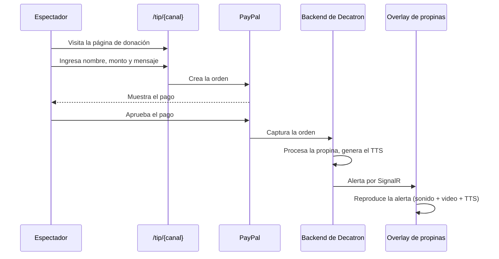
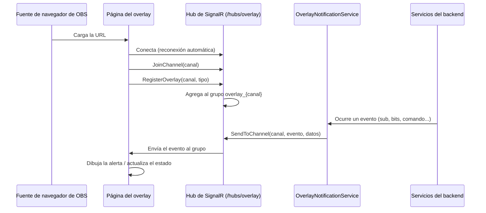
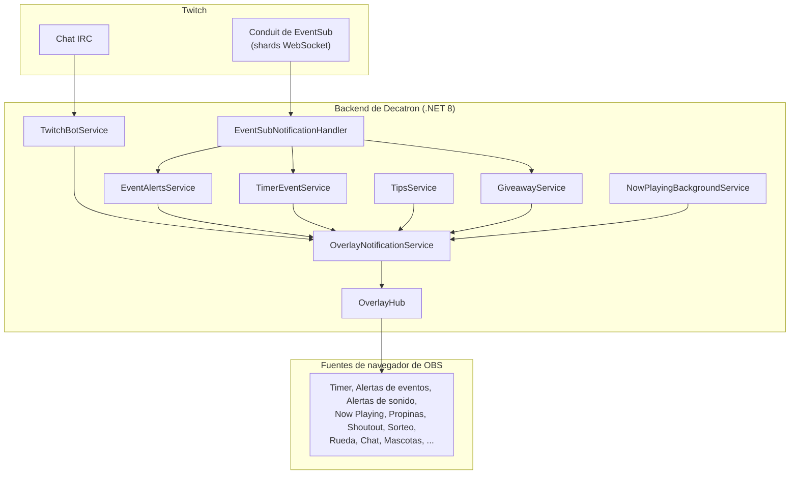

# Referencia de overlays

> English: [../OVERLAYS.md](../OVERLAYS.md)

Referencia de los overlays de Decatron: URLs, configuración en OBS, qué hace cada overlay, sus endpoints públicos y los eventos en tiempo real que escucha. Los manuales paso a paso de cada módulo están dentro de la aplicación, en `/dashboard/docs`.

---

## Contenido

- [Descripción general](#descripción-general)
- [Agregar overlays a OBS](#agregar-overlays-a-obs)
- [Overlay del timer](#overlay-del-timer)
- [Overlay de alertas de eventos](#overlay-de-alertas-de-eventos)
- [Overlay de alertas de sonido](#overlay-de-alertas-de-sonido)
- [Overlay de Now Playing](#overlay-de-now-playing)
- [Overlay de Song Request](#overlay-de-song-request)
- [Overlay de la rueda](#overlay-de-la-rueda)
- [Overlay de propinas](#overlay-de-propinas)
- [Overlay de shoutout](#overlay-de-shoutout)
- [Sorteo](#sorteo)
- [Otros overlays](#otros-overlays)
- [Overlay de Speak Chat](#overlay-de-speak-chat)
- [Overlay de chat y emotes](#overlay-de-chat-y-emotes)
- [Overlay y widget de torneos](#overlay-y-widget-de-torneos)
- [Arquitectura en tiempo real](#arquitectura-en-tiempo-real)
- [Referencia de eventos de SignalR](#referencia-de-eventos-de-signalr)

---

## Descripción general

Los overlays de Decatron son páginas de la aplicación React que se conectan al backend con SignalR para recibir actualizaciones en tiempo real. Se cargan como **fuentes de navegador** en OBS Studio (o software de streaming compatible). No necesitan inicio de sesión: el nombre del canal (y, en algunos overlays, una clave) en la URL identifica el canal.

La mayoría de los overlays sigue este patrón:

1. Cargan la configuración desde un endpoint público (`/api/{funcion}/config/overlay/{canal}` o uno similar).
2. Se conectan al hub de SignalR `/hubs/overlay`.
3. Se unen al grupo del canal con `JoinChannel(nombreCanal)` y se identifican con `RegisterOverlay(canal, tipoOverlay)`.
4. Escuchan eventos específicos y los dibujan.
5. Se reconectan automáticamente si se cae la conexión.

El overlay de Song Request usa su propio hub, `/hubs/songrequest`.

---

## Agregar overlays a OBS

1. En OBS Studio, haz clic en **+** en Fuentes y elige **Navegador**.
2. Ponle un nombre (por ejemplo "Decatron Timer").
3. Pega la URL del overlay.
4. Configura el ancho y el alto que indica la página del módulo en el panel. El tamaño se define en el editor (lienzo) de cada módulo, no es fijo aquí.
5. Opcionalmente marca **Apagar la fuente cuando no está visible**.
6. Haz clic en **Aceptar**.

### Formato de la URL

```
https://tu-dominio-de-decatron.com/overlay/{tipo}?channel={nombre_del_canal}
```

Reemplaza `{nombre_del_canal}` por el login del canal (en minúsculas).

> **Consejo:** la página de cada módulo en el panel muestra la URL exacta del overlay con tu canal ya completado (y la clave privada si corresponde), con un botón para copiarla. Es preferible copiarla desde ahí.

### Referencia rápida

| Overlay | URL | Parámetros adicionales |
|---------|-----|------------------------|
| Timer | `/overlay/timer?channel={nombre}` | |
| Alertas de eventos | `/overlay/event-alerts?channel={nombre}` | |
| Alertas de sonido | `/overlay/soundalerts?channel={nombre}` | `source=all`, `twitch` o `kick` |
| Now playing | `/overlay/now-playing?channel={nombre}` | |
| Propinas | `/overlay/tips?channel={nombre}` | |
| Shoutout | `/overlay/shoutout?channel={nombre}` | |
| Sorteo | `/overlay/giveaway?channel={nombre}` | |
| Song Request (reproductor) | `/overlay/songrequest?channel={nombre}&key={claveDelReproductor}` | `key` es privada del canal |
| Song Request (solo visual) | `/overlay/songrequest?channel={nombre}` | |
| Rueda | `/overlay/rueda?channel={nombre}&wheel={slug}` | |
| Chat | `/overlay/chat?channel={nombre}` | `source=all`, `twitch` o `kick` |
| Speak chat | `/overlay/speak-chat?channel={nombre}` | |
| Mascotas | `/overlay/pets?channel={nombre}` | `platform=twitch` (por defecto) o `kick` |
| Juegos | `/overlay/games?channel={nombre}` | `platform`, `slug`; parámetros de vista previa: `layout`, `preset`, `view`, `preview` |
| Partida en vivo | `/overlay/live?channel={nombre}` | `platform`, `slug`, `layout`, `preview` |
| Gacha | `/overlay/gacha?channel={nombre}` | |
| Torneo | `/overlay/torneo/{token}` | El token sale del panel del torneo |

---

## Overlay del timer

La extensión del timer muestra una cuenta regresiva visual (estilo subathon) que los espectadores extienden mediante eventos.

### Funciones

| Función | Descripción |
|---------|-------------|
| Cuenta regresiva | Cuenta regresiva en tiempo real con respaldo de ticks locales |
| Barras de progreso | Horizontales, verticales o circulares, con indicadores personalizados |
| Alertas de eventos | Alertas visuales y de audio cuando los espectadores agregan tiempo |
| Modo pánico | Efectos especiales y lista de audio cuando queda muy poco tiempo |
| Happy hours | Multiplicadores de tiempo durante periodos configurados |
| Pausa/reanudación automática | Pausa automática por horario (por ejemplo, horas de sueño) |
| Vidas extra | Sistema de resurrección con mensajes personalizados cuando el timer llega a cero |
| TTS | Texto a voz para los anuncios de eventos |
| Medios | Sonidos, imágenes, videos y GIF personalizados para las alertas |

### Eventos que suman tiempo

| Evento | Configuración |
|--------|---------------|
| Bits/cheers | Tiempo por bit, con reglas por tier |
| Suscripciones | Tiempo por sub (Prime, Tier 1/2/3) con reglas personalizadas |
| Subs regaladas | Tiempo por sub regalada, con reglas por tier |
| Raids | Tiempo base más tiempo por espectador, con reglas |
| Hype train | Tiempo por nivel |
| Follows | Tiempo fijo con enfriamiento (anti-abuso) |
| Donaciones/propinas | Soporte multimoneda |

### Control

- **Panel:** iniciar, pausar, reanudar, reiniciar, detener, sumar o restar tiempo.
- **Comandos de chat:** `!dstart`, `!dpause`, `!dplay`, `!dreset`, `!dstop`, `!dtimer`; comandos informativos `!dtiempo`, `!dcuando`, `!dstats`, `!drecord`, `!dtop`. Consulta [COMMANDS.md](COMMANDS.md).
- **API:** `POST /api/timer/control` con un parámetro de acción.

### Pestañas de configuración

Guía, Básico, Eventos, Tema, Barra, Pantalla, Tipografía, Alertas, Comandos, Info Cmds, Meta, Sorteos, Animaciones, Avanzado, Historial, Media, Widgets y Overlay. Las happy hours, los horarios, las plantillas, el historial de sesiones y las copias de seguridad (automáticas cada 5 minutos más las manuales) se gestionan desde estas pestañas.

### API del timer

| Método | Endpoint | Auth | Descripción |
|--------|----------|------|-------------|
| `GET` | `/api/timer/config` | JWT | Obtiene la configuración del timer |
| `POST` | `/api/timer/config` | JWT | Guarda la configuración del timer |
| `POST` | `/api/timer/config/reset` | JWT | Restablece los valores por defecto |
| `GET` | `/api/timer/state/{channel}` | Anónimo | Obtiene el estado del timer de un canal |
| `POST` | `/api/timer/control` | JWT | Controla el timer (iniciar, pausar, reanudar, reiniciar, detener, sumar o restar tiempo) |
| `GET` | `/api/timer/config/overlay/{channel}` | Anónimo | Obtiene la configuración y el estado para el overlay |
| `GET` | `/api/timer/sessions` | JWT | Lista las sesiones del timer |
| `GET` | `/api/timer/sessions/{id}/logs` | JWT | Obtiene los registros de eventos de una sesión |
| `POST` | `/api/timer/test/event` | JWT | Simula un evento |
| `GET/POST/PUT/DELETE` | `/api/timer/templates` | JWT | Plantillas de configuración (las rutas por elemento usan un id) |
| `GET/POST/PUT/DELETE` | `/api/timer/schedules` | JWT | Horarios de pausa automática (las rutas por elemento usan un id) |
| `GET/POST/PUT/DELETE` | `/api/timer/happyhour` | JWT | Happy hours (las rutas por elemento usan un id) |
| `POST` | `/api/timer/backup` | JWT | Crea una copia de seguridad manual |
| `POST` | `/api/timer/backup/restore-session` | JWT | Restaura una sesión anterior |

### Medios del timer

| Método | Endpoint | Descripción |
|--------|----------|-------------|
| `GET` | `/api/timer/media` | Lista los archivos de medios |
| `GET` | `/api/timer/media/categories` | Lista las categorías |
| `POST` | `/api/timer/media/upload` | Sube un archivo |
| `PUT` | `/api/timer/media/{id}/rename` | Renombra un archivo |
| `PUT` | `/api/timer/media/{id}/move` | Mueve a otra categoría |
| `DELETE` | `/api/timer/media/{id}` | Elimina un archivo |

---

## Overlay de alertas de eventos

El sistema de alertas de los eventos del canal. Muestra alertas visuales y de audio cuando los espectadores siguen, se suscriben, envían bits, hacen raid, regalan subs, renuevan o activan hype trains.

### Tipos de evento admitidos

| Tipo de evento | Variables | Soporte de tiers |
|----------------|-----------|------------------|
| Follow | `{username}` | No |
| Bits/cheers | `{username}`, `{amount}` | Sí (por cantidad) |
| Suscripciones | `{username}`, `{tier}`, `{months}` | Sí (Prime, T1/T2/T3) |
| Subs regaladas | `{username}`, `{amount}`, `{tier}` | Sí (por cantidad de regalos) |
| Resubs | `{username}`, `{months}`, `{tier}` | Sí (por cantidad de meses) |
| Raids | `{username}`, `{viewers}` | Sí (por cantidad de espectadores) |
| Hype train | `{level}` | Sí (por nivel) |

### Sistema de tiers

Cada tipo de evento puede tener **tiers**: configuraciones de alerta distintas según la cantidad.

| Tipo de condición | Descripción | Ejemplo |
|-------------------|-------------|---------|
| `range` | La cantidad está dentro de un rango | 100-499 bits |
| `minimum` | La cantidad es igual o mayor a un umbral | 500+ bits |
| `exact` | La cantidad coincide exactamente | Exactamente 1000 bits |

Cada tier puede tener su propia configuración de medios, mensaje, animación, sonido y TTS.

### Sistema de variantes

Cada tier (o la alerta base) puede tener varias **variantes** que rotan:

| Modo | Descripción |
|------|-------------|
| `random` | Elige una variante al azar cada vez |
| `weighted` | Elige según los pesos configurados |
| `sequential` | Recorre las variantes en orden |
| `noRepeat` | Aleatorio, pero evitando las últimas variantes mostradas |

Límites de variantes por plan, según el editor: Free 5, Supporter 15, Premium prácticamente ilimitado.

### Cadena de audio

El overlay reproduce el audio en cuatro capas, una tras otra: sonido de la alerta, audio del video, plantilla de TTS y TTS del mensaje del usuario.

### Pestañas de configuración

Guía, General, Eventos, Diseño, Avanzado, Media y Pruebas. El editor de diseño coloca elementos en un lienzo; el tamaño del lienzo es compartido por todos los eventos y se copia a todos los diseños al guardar.

### Efectos visuales y animaciones

Efectos: `shake`, `glow`, `float`, `pulse`, `confetti`. Animaciones de entrada y salida: `fade`, `slide`, `bounce`, `zoom`.

### API de alertas de eventos

| Método | Endpoint | Auth | Descripción |
|--------|----------|------|-------------|
| `GET` | `/api/eventalerts/config` | JWT | Obtiene la configuración de alertas |
| `POST` | `/api/eventalerts/config` | JWT | Guarda la configuración |
| `POST` | `/api/eventalerts/test` | JWT | Envía una alerta de prueba por SignalR |
| `GET` | `/api/eventalerts/config/overlay/{channel}` | Anónimo | Obtiene la configuración del overlay |

---

## Overlay de alertas de sonido

Reproduce una alerta audiovisual cuando un espectador canjea una recompensa de puntos del canal que tiene un archivo de medios asignado.

### Cómo funciona

1. Crea las recompensas en tu panel de Twitch.
2. En Decatron, asigna un archivo de medios (audio, video o imagen) a cada recompensa.
3. Cuando un espectador canjea la recompensa, el overlay reproduce el medio asignado.

### Pestañas de configuración

Guía, Recompensas, Biblioteca, Básico, Textos, Fondo, Animación y Editor. Las líneas de texto aceptan las variables `@redeemer` y `@reward`. La duración y el volumen se definen en Básico; la pestaña Recompensas vincula una recompensa de puntos del canal con un archivo, y Biblioteca lista la biblioteca del sistema.

### Medios admitidos

| Categoría | Formatos |
|-----------|----------|
| Audio | MP3, WAV, OGG |
| Video | MP4, WEBM |
| Imagen | PNG, JPG, GIF |

### API de alertas de sonido

| Método | Endpoint | Auth | Descripción |
|--------|----------|------|-------------|
| `GET` | `/api/soundalerts/channel-points-rewards` | JWT | Recompensas de puntos del canal desde Twitch |
| `GET` | `/api/soundalerts/config` | JWT | Obtiene la configuración |
| `POST` | `/api/soundalerts/config` | JWT | Guarda la configuración |
| `GET` | `/api/soundalerts/config/overlay/{channel}` | Anónimo | Obtiene la configuración del overlay |
| `GET` | `/api/soundalerts/files` | JWT | Lista los archivos asignados |
| `POST` | `/api/soundalerts/upload` | JWT | Sube un archivo de medios |
| `DELETE` | `/api/soundalerts/file/{rewardId}` | JWT | Elimina la asignación de un archivo |
| `PATCH` | `/api/soundalerts/file/{rewardId}/volume` | JWT | Define el volumen por archivo |
| `PATCH` | `/api/soundalerts/file/{rewardId}/toggle` | JWT | Activa o desactiva un archivo |
| `GET` | `/api/soundalerts/system-files` | JWT | Lista los archivos de la biblioteca del sistema |
| `POST` | `/api/soundalerts/assign-system-file` | JWT | Asigna un archivo del sistema a una recompensa |
| `POST` | `/api/soundalerts/test` | JWT | Envía una alerta de prueba |

---

## Overlay de Now Playing

Muestra la canción que se está reproduciendo, en un widget personalizable.

### Proveedores

| Proveedor | Conexión | Requisitos |
|-----------|----------|------------|
| **Last.fm** | Ingresa tu usuario de Last.fm | Cualquier reproductor que haga scrobbling a Last.fm |
| **Spotify** | Conexión OAuth2 | Un cupo libre de Spotify (ver abajo) |

### Cupos de Spotify

El acceso a Spotify está limitado a 5 cupos para usuarios no premium (`MaxSpotifyUsers`), asignados por el administrador. Now Playing tiene las mismas funciones para todos los planes: el plan solo afecta el orden de la lista de espera de cupos de Spotify.

### Consulta periódica

`NowPlayingBackgroundService` revisa cada canal activo cada 3 segundos, compara la canción con la anterior y, cuando cambia, envía una actualización por SignalR.

### Pestañas de configuración

Guía, Conexión, Tema, Elementos, Tipografía, Animaciones y Editor.

### API de Now Playing

| Método | Endpoint | Auth | Descripción |
|--------|----------|------|-------------|
| `GET` | `/api/nowplaying/config` | JWT | Obtiene la configuración |
| `POST` | `/api/nowplaying/config` | JWT | Guarda la configuración |
| `POST` | `/api/nowplaying/connect/lastfm` | JWT | Conecta Last.fm |
| `POST` | `/api/nowplaying/validate/lastfm` | JWT | Valida un usuario de Last.fm |
| `POST` | `/api/nowplaying/disconnect` | JWT | Desconecta el proveedor |
| `GET` | `/api/nowplaying/config/overlay/{channel}` | Anónimo | Obtiene la configuración del overlay |
| `GET` | `/api/nowplaying/now/{channel}` | Anónimo | Obtiene la canción actual |
| `POST` | `/api/nowplaying/test` | JWT | Envía una canción de prueba al overlay |
| `GET` | `/api/spotify/authorize-url` | JWT | Obtiene la URL de OAuth de Spotify |
| `GET` | `/api/spotify/callback` | Anónimo | Callback de OAuth de Spotify |
| `GET` | `/api/spotify/status` | JWT | Consulta la conexión con Spotify |

---

## Overlay de Song Request

El reproductor de la cola de [Song Request](COMMANDS.md#comandos-de-song-request). Tiene dos formas, cada una con su propio diseño:

| Forma | URL | Qué hace |
|-------|-----|----------|
| Reproductor | `/overlay/songrequest?channel={nombre}&key={claveDelReproductor}` | Reproduce el audio. La cola no avanza sin él. `{claveDelReproductor}` es privada del canal: no la compartas y regénérala desde el panel si se filtra |
| Solo visual | `/overlay/songrequest?channel={nombre}` | Muestra "ahora suena" sin audio, para otra escena |

### Diseño

Las pestañas de diseño (Tema, Elementos, Tipografía, Animaciones, Editor) comparten el motor de overlays de música: temas listos, tipografía por elemento, animaciones de entrada y salida, un editor visual de lienzo con diseños iniciales y plantillas guardadas. La cantidad de plantillas guardadas depende del tier de supporter. El diseño del overlay se sirve públicamente (sin la clave del reproductor) en `GET /api/public/song-request/{channel}/overlay`.

### Tiempo real

El reproductor, el overlay visual, el panel y la página pública de la cola escuchan el hub de SignalR `SongRequestHub` (`/hubs/songrequest`).

### Audio y VODs

La música pedida puede silenciar los VODs de Twitch. En OBS, activa "Controlar audio mediante OBS" en la fuente del reproductor, déjala en una sola pista en Propiedades de audio avanzadas y asigna una pista distinta a "Pista del VOD de Twitch".

---

## Overlay de la rueda

El overlay de una rueda de premios o de sorteo (consulta [Comandos de rueda y sorteo](COMMANDS.md#comandos-de-rueda-y-sorteo)). Cada rueda tiene su propio enlace:

`/overlay/rueda?channel={nombre}&wheel={slug}`

El enlace no lleva clave: cualquiera que lo tenga puede ver el overlay, pero no puede cambiar nada. El fondo es transparente. Los datos del overlay son públicos y sin caché, y los sirve `GET /api/wheel/overlay?channel={nombre}&wheel={slug}`; el bot decide cada resultado y el overlay solo lo anima.

### Aspecto

Colores y paleta, imagen central, movimiento del giro (duración, vueltas, curva), visibilidad (mientras gira, siempre o durante las inscripciones en las ruedas de sorteo), celebración (confeti, destello o ninguna), sonidos y tipografía por evento, además de un editor de lienzo para ubicar la rueda, la tarjeta del ganador, la marca de agua, el fondo y tus propios textos e imágenes. La marca de agua de Decatron se puede ocultar desde el tier Premium.

---

## Overlay de propinas

Muestra alertas de donación cuando los espectadores envían propinas con PayPal.

### Modos de alerta

| Modo | Descripción |
|------|-------------|
| **Básico** | Sistema de alertas independiente con tiers, medios, TTS y variantes |
| **Timer** | Delega la alerta a la extensión del timer (suma tiempo según el monto de la donación) |

### Flujo de una donación



### Pestañas de configuración

General, Página, Alertas, Timer, Seguridad e Historial. General cubre la conexión con PayPal, los montos y la moneda; Página, la página pública de donación `/tip/{canal}`; Alertas, los medios, la animación, la voz de TTS y los tiers; Timer, el tiempo que se suma por unidad de moneda; Historial, las donaciones pasadas, los mayores donantes y los totales.

### API de propinas

| Método | Endpoint | Auth | Descripción |
|--------|----------|------|-------------|
| `GET` | `/api/tips/config` | JWT | Obtiene la configuración |
| `POST` | `/api/tips/config` | JWT | Guarda la configuración |
| `GET` | `/api/tips/page/{channel}` | Anónimo | Configuración de la página pública de donación |
| `GET` | `/api/tips/paypal/connect` | JWT | Inicia el flujo OAuth de PayPal |
| `POST` | `/api/tips/paypal/disconnect` | JWT | Desconecta PayPal |
| `POST` | `/api/tips/paypal/create-order` | Anónimo | Crea una orden de PayPal |
| `POST` | `/api/tips/paypal/capture-order` | Anónimo | Captura un pago completado |
| `GET` | `/api/tips/history` | JWT | Historial de donaciones |
| `GET` | `/api/tips/top-donors` | JWT | Mayores donantes por periodo |
| `GET` | `/api/tips/statistics` | JWT | Estadísticas de donaciones |
| `POST` | `/api/tips/test` | JWT | Envía una alerta de prueba |

---

## Overlay de shoutout

Muestra una tarjeta visual de shoutout cuando un moderador o el streamer usa `!so @usuario` en el chat, con el perfil y el último clip del destinatario (descargado con `yt-dlp`).

### Funciones

- Foto de perfil y nombre
- Reproducción del último clip
- Líneas de texto personalizables
- Editor de diseño de arrastrar y soltar
- Shoutouts automáticos y permisos
- Duración de 5 a 60 s y enfriamiento de 0 a 300 s (validados por el backend)

### Pestañas de configuración

Guía, General, Clip, Tema, Elementos, Texto, Animaciones, Editor, Automático y Permisos.

### API de shoutout

| Método | Endpoint | Auth | Descripción |
|--------|----------|------|-------------|
| `GET` | `/api/shoutout/config` | JWT | Obtiene la configuración |
| `POST` | `/api/shoutout/config` | JWT | Guarda la configuración |
| `GET` | `/api/shoutout/config/overlay/{channel}` | Anónimo | Obtiene la configuración del overlay |
| `POST` | `/api/shoutout/test` | JWT | Envía un shoutout de prueba |
| `GET` | `/api/shoutout/history` | JWT | Historial de shoutouts |

---

## Sorteo

El overlay del sorteo (`/overlay/giveaway`) muestra en tiempo real a los participantes que se unen. Los sorteos se gestionan desde el panel (pestañas Crear, Requisitos, Pesos, Activo, Historial, Configuración y Debug).

### Funciones

| Función | Descripción |
|---------|-------------|
| Selección ponderada | Suscriptores, VIP, tiempo de visualización, bits y racha de subs aumentan la probabilidad de ganar |
| Requisitos de entrada | Seguidor, suscriptor, tiempo mínimo de visualización, antigüedad de la cuenta, antigüedad del follow, mensajes en el chat |
| Anti-trampa | Detección de IP duplicada (con hash) y detección de múltiples cuentas |
| Varios ganadores | Varios ganadores más ganadores de respaldo |
| Tiempo de respuesta | Se vuelve a sortear o se promueve a un respaldo si el ganador no responde a tiempo |
| Enfriamiento de ganadores | Los ganadores recientes no pueden participar durante N días |
| Anuncios en el chat | Avisos de inicio, recordatorios, ganadores y falta de respuesta |
| Sistema de rifas | Una rifa aparte, más simple, con importación de participantes de una sesión del timer |

### API de sorteos

| Método | Endpoint | Descripción |
|--------|----------|-------------|
| `POST` | `/api/giveaway/start` | Inicia un sorteo |
| `POST` | `/api/giveaway/end` | Lo termina y selecciona ganadores |
| `POST` | `/api/giveaway/cancel` | Cancela el sorteo activo |
| `POST` | `/api/giveaway/reroll` | Vuelve a seleccionar un ganador |
| `GET` | `/api/giveaway/active` | Estado del sorteo activo |
| `GET` | `/api/giveaway/history` | Sorteos anteriores |
| `GET` | `/api/giveaway/statistics` | Estadísticas |

---

## Otros overlays

Estos overlays se configuran desde sus propias páginas del panel; sus manuales están en `/dashboard/docs`.

| Overlay | Qué muestra | Pestañas de configuración |
|---------|-------------|---------------------------|
| Chat (`/overlay/chat`) | Mensajes y burbujas del chat con insignias y emotes, de Twitch, Kick o ambos (`source`) | Guía, General, Burbujas, Mensajes, Fuentes, Emotes, Filtros, Tema, Texto, Animaciones, Editor |
| Speak chat (`/overlay/speak-chat`) | Reproduce mensajes del chat y canjes como texto a voz | Global, Activación, Voz, Filtros, Overlay, Pruebas |
| Mascotas (`/overlay/pets`) | Una mascota que reacciona a alertas, chat y comandos | Mascota, Comportamiento, Reacciones, Comandos, Overlay, Probar |
| Juegos (`/overlay/games`) | Tarjetas con datos de juego de las cuentas vinculadas | Cuentas, Juegos, Detección, Diseño, Overlay |
| Partida en vivo (`/overlay/live`) | Estado de la partida en curso | Diseño, Overlay |
| Gacha (`/overlay/gacha`) | Tiradas de gacha de los espectadores | |
| Torneo (`/overlay/torneo/{token}`) | Datos de un participante para su stream | Consulta [Overlay y widget de torneos](#overlay-y-widget-de-torneos) |

---

## Overlay de Speak Chat

Speak Chat (`/overlay/speak-chat?channel={login}`) lee en voz alta los mensajes del chat. El manual está en `/dashboard/docs/speak-chat`.

- **Configuración.** Un documento JSON por canal en `speak_chat_configs` (`GET`/`POST /api/speakchat/config`), con las secciones `global`, `activation`, `voice`, `filters` y `overlay`. Al guardarlo se envía `SpeakChatConfigChanged` a los overlays del canal; `POST /api/speakchat/overlay/reload` hace lo mismo a pedido, y `GET /api/speakchat/config/overlay/{channel}` es la lectura anónima que usa la fuente de OBS.
- **Activación.** `SpeakChatService.ProcessChatMessageAsync` corre con cada mensaje del chat y `ProcessChannelPointRedemptionAsync` con los canjes que traen texto. Las reglas son `command` (el comando debe coincidir completo, seguido de un espacio o del fin del mensaje), `bits` (mínimo de bits), `channelPoints` (id de la recompensa), `roles` y `all`; gana la primera regla activa que coincide. Los moderadores líderes cuentan como moderadores. Un canje puede llegar dos veces (mensaje del chat y evento), así que los repetidos del mismo canal, recompensa y usuario se descartan durante 30 segundos.
- **Filtros.** Enfriamientos global y por usuario (en memoria), un largo máximo que recorta, palabras bloqueadas (coincidencia parcial sin distinguir mayúsculas) y usuarios bloqueados.
- **Voz y créditos.** El motor es `piper` (estándar, a cargo de la cuota estándar) o `polly` (premium, cobrado en créditos con `GenerateWithCreditsAsync`); sin créditos premium cae a la voz estándar. `GET /api/speakchat/usage` devuelve el saldo. `POST /api/speakchat/test` genera audio real para un mensaje de prueba y exige que la función esté activa.
- **Entrega.** La URL del MP3 generado llega al overlay en un evento `SpeakChatMessage` (usuario, texto, URL del audio, volumen y aspecto). El overlay reproduce los mensajes de uno en uno y mantiene el globo el tiempo configurado. Si no hay un overlay `speak_chat` conectado, el servidor deja una advertencia en el registro, porque no se va a oír nada.

---

## Overlay de chat y emotes

El overlay de chat (`/overlay/chat?channel={login}`, con `source=twitch|kick` opcional) dibuja el chat del canal como lista o como burbujas. El manual está en `/dashboard/docs/chat`.

- **Entrega.** `ChatOverlayService` emite `ChatMessage` al grupo `overlay_{login}` de SignalR solo cuando un overlay se registró como `chat`. Los mensajes llevan fragmentos ya analizados (texto y emotes), insignias y, en el chat compartido de Twitch, el canal de origen (`source_broadcaster_user_*` de EventSub). Los bots marcados como «ocultar del overlay» en la lista de bots se descartan antes de emitir.
- **Configuración.** Un documento JSON por canal (`GET`/`PUT /api/chat-overlay/config`, sección `moderation`), mezclado sobre los valores por defecto al cargar para que los documentos antiguos sigan funcionando. `GET /api/chat-overlay/status` informa los overlays conectados, `POST /api/chat-overlay/test` envía un mensaje de prueba, y `GET /api/chat-overlay/emotes` con `POST /api/chat-overlay/emotes/refresh` exponen el catálogo de emotes que usa el editor. El overlay lee `GET /api/chat-overlay/config/overlay/{channel}`.
- **Catálogo de emotes.** `EmoteCatalogService` combina capas de menor a mayor prioridad: el set global de Decatron, los globales de FFZ, BTTV y 7TV, luego los sets del canal (FFZ, BTTV, 7TV) y por último los emotes propios del canal. Los resultados de cada proveedor se guardan en caché (globales 6 h, sets del canal 10 min, reintento a 1 min tras un error) y se sirve la última respuesta buena si un proveedor falla.
- **Emotes propios.** `ChannelEmoteService` y `EmoteImageProcessor` validan las subidas (PNG, GIF, WebP o JPEG, hasta 2 MB, de 8 a 2048 px, hasta 150 cuadros), generan variantes WebP de 32, 64 y 128 px de alto y las guardan en `Emotes:AssetsPath` (se sirven en `/uploads/emotes/{userId}/{key}/{scale}.webp`). Los modos de subida son `owner`, `staff` (por defecto), `approval` y `list`; los topes por plan son 150, 400, 1000 y 3000 emotes activos (`EmoteTierLimits`), con un máximo de 100 pendientes por canal. Los endpoints de gestión están en `/api/channel-emotes` (sección `moderation`; la configuración y las personas permitidas piden `control_total`).
- **Endpoints públicos.** `GET /api/public/emotes/{channel}` lista los emotes activos de un canal (URLs absolutas, con CORS, los usa la extensión del navegador), con endpoints de subida, reporte y emotes propios para usuarios con sesión; el set de la plataforma sale de `/api/public/global-emotes` y se gestiona en `/api/admin/global-emotes` (papelera de 30 días).

---

## Overlay y widget de torneos

Torneos (consulta `/dashboard/docs/tournaments/look` en la aplicación) tiene dos piezas públicas para OBS y sitios de terceros. Ninguna necesita inicio de sesión y las dos responden con CORS abierto (política `TournamentEmbed`), a diferencia del resto de la API.

| Pieza | URL | Qué es |
|-------|-----|--------|
| Overlay del participante | `/overlay/torneo/{token}` | Overlay transparente para el OBS de un participante. El token de 32 bytes es la única llave; lo puede generar el participante (desde "Mi inscripción") o el organizador, y regenerarlo invalida el anterior. La página consulta `GET /api/overlay/torneo/{token}` (un token desconocido responde 404) |
| Widget de ranking | `/embed/torneo/{canal}/{edicion}/ranking` | Clasificación para un `<iframe>` o una fuente de navegador de OBS. Se refresca cada 30 s. Parámetros: `bg=transparent`, `layout=bar` (barra horizontal en lugar de lista), `limit=N` (20 por defecto en la lista, 8 en la barra), `theme=light` o `dark`. Datos: `GET /api/embed/torneo/{canal}/{edicion}/ranking`, con un límite de 60 solicitudes por minuto por IP |

Tamaños sugeridos de los dos enlaces de widget que muestra el panel: lista 400 x 600, barra inferior 1920 x 80.

---

## Arquitectura en tiempo real

Los overlays se comunican con el backend mediante hubs de SignalR; la mayoría usa el hub compartido de overlays.

### Flujo de conexión



### De dónde vienen los eventos



### Puntos clave del diseño

1. **Un hub compartido con grupos por canal.** Los overlays se conectan a `/hubs/overlay` y se unen al grupo `overlay_{nombreCanal}`. Los eventos se envían al grupo correcto. Song Request usa `/hubs/songrequest` y la traducción en vivo `/hubs/translation`.
2. **OverlayNotificationService es el despachador central.** Los servicios del backend lo usan, mediante `IHubContext<OverlayHub>`, para enviar mensajes sin tener una conexión de SignalR propia.
3. **Acceso anónimo.** Los endpoints de overlays y las conexiones al hub no requieren autenticación, porque las fuentes de navegador de OBS no pueden enviar un JWT. El nombre del canal en la URL es la clave de enrutamiento; el reproductor de Song Request además requiere su clave privada.
4. **Variante por plataforma.** Después de registrarse, un overlay puede indicarle al hub qué variante muestra (`all`, `twitch` o `kick`) con `SetOverlayVariant`.
5. **Colas de alertas.** Los overlays que muestran alertas en secuencia (alertas de eventos, alertas de sonido, propinas) mantienen una cola interna para que las alertas se reproduzcan una a la vez y en orden.

---

## Referencia de eventos de SignalR

### Métodos del hub (cliente a servidor) en `/hubs/overlay`

| Método | Parámetros | Descripción |
|--------|------------|-------------|
| `JoinChannel` | `channel: string` | Se suscribe al grupo de overlays de un canal |
| `LeaveChannel` | `channel: string` | Cancela la suscripción al grupo de un canal |
| `RegisterOverlay` | `channel: string, overlayType: string` | Indica qué overlay es esta conexión (se llama justo después de `JoinChannel`) |
| `SetOverlayVariant` | `variant: string` | `all`, `twitch` o `kick` (se llama después de `RegisterOverlay`) |

### Eventos del servidor al cliente

| Evento | Contenido | Lo usa |
|--------|-----------|--------|
| `ShowShoutout` | Datos del shoutout (usuario, URL del clip, configuración) | Shoutout |
| `ShowEventAlert` | Datos de la alerta (tipo, usuario, cantidad, medios, URL de TTS) | Alertas de eventos |
| `EventAlertsConfigChanged` | Datos de configuración | Alertas de eventos |
| `ShowSoundAlert` | URL del medio, configuración, estilos | Alertas de sonido |
| `ShowTipAlert` | Donante, monto, mensaje, medios, TTS | Propinas |
| `ConfigurationChanged` | `{ channel }` | Overlays que recargan su configuración |
| `RefreshOverlay` | ninguno | Fuerza un refresco |
| `StartTimer`, `PauseTimer`, `ResumeTimer`, `ResetTimer`, `StopTimer` | Estado del timer | Timer |
| `AddTime` | `{ seconds, source, username }` | Timer |
| `TimerTick` | `{ remainingSeconds }` | Timer |
| `TimerEventAlert` | Tipo de evento, usuario, tiempo agregado, medios | Timer |
| `TimerStateUpdate` | Estado completo del timer | Timer |
| `TimerCommandExecuted` | `{ command, parameters }` | Timer |
| `HappyHourStarted`, `HappyHourEnded` | Ventana de la happy hour | Timer |
| `NowPlayingUpdate` | Título, artista, carátula, progreso | Now Playing |
| `NowPlayingStopped` | ninguno | Now Playing |
| `GiveawayParticipantJoined` | Datos del participante | Sorteo |
| `WheelSpin`, `WheelRaffleJoin`, `WheelConfigChanged` | Resultado del giro, participante, configuración | Rueda |
| `GachaPull` | Resultado de la tirada | Gacha |
| `PetEvent`, `PetConfigChanged` | Estímulo de la mascota, configuración | Mascotas |
| `GameOverlayState`, `GameOverlayConfigChanged`, `LiveMatchState`, `LiveOverlayConfigChanged` | Estado de la partida, configuración | Juegos, Partida en vivo |
| `ChatMessage` | Línea de chat con insignias y emotes | Chat |
